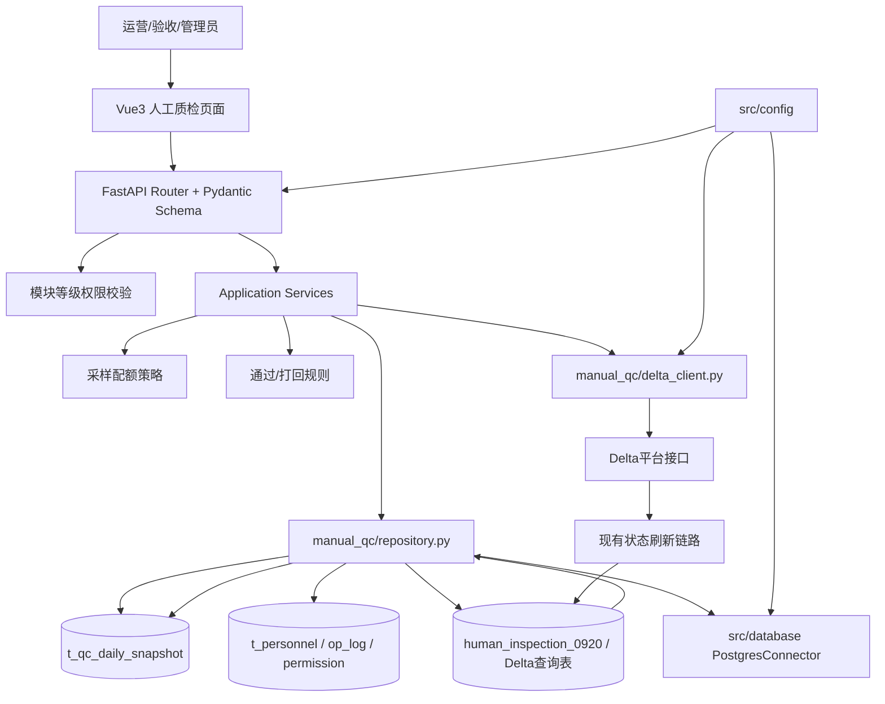
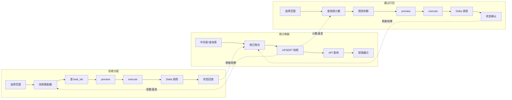

# 质检一站式平台人工质检模块整体架构

> 本卡是当前人工质检平台设计的唯一总入口与**导航枢纽**。Review 时先读本卡，再按"组件导航矩阵"和"业务链全景"进入分卡。本卡保持轻量，不展开细节设计（细节在组件卡中）。实施契约与动态进度统一收纳于 [[质检平台-人工质检模块实施计划]]。

上位架构：[[质检一站式平台顶层架构]]。原理想架构（已归档）：[[质检前后端一体化理想架构设计]]。现状来源：[[人工质检-Hub]]。评审演进：[[质检一站式平台Phase3前架构评审]]。当前进度：[[质检平台-人工质检模块实施计划]]。

## §1. 建设目标与约束

### 1.1 建设目标

本阶段不是重写人工质检十五步闭环，而是把最依赖手工脚本、最适合门户化的两块能力先纳入一站式平台：

1. **验收模块**：验收采样分配、统计快照、通过/打回判断与执行。
2. **人力模块**：人员、供应商、单项目归属、标注员分组、人员画像和模块权限。

当前不改变 Delta 平台作为任务执行系统的事实，也不替代已有 30 分钟状态刷新、6 小时中间表刷新、GT 回写、DMP 打回记录和周报链路。

### 1.2 客观约束

| 约束 | 对设计的影响 |
|---|---|
| 任务创建、验收分配、通过和打回均依赖外部 Delta 接口 | 本地平台负责计算、编排和展示；执行结果必须回查任务状态 |
| `human_inspection_0920` 已保存 task 级状态时间线 | 不新建通用操作台账；复用现有中间表确认实际成功量 |
| 人工流程允许局部失败和延迟刷新 | 页面区分预期量、实际量、处理中和失败；不假设一次接口调用即全量成功 |
| 人员同一时刻只属于一个项目 | `t_personnel.project_name` 使用单值，不建多项目关系 |
| 当前规则仅 2～5 种且需代码审查 | 规则用代码注册表，不做数据库规则解释器 |
| 团队规模和表数量有限 | 保留共享 `repository.py`，内部按表/数据源拆小类，不套完整 DDD 模板 |
| Phase 3 尚未实质实现 | 设计卡描述目标契约；不存在的类和接口明确标记为待实现 |

## §2. 总体架构图



依赖方向遵循：外层 HTTP 调用业务 Service；Service 组合规则、数据库查询和 Delta 调用；规则不直接访问 HTTP、数据库或配置。

> 注：本架构图需与各组件卡刷新后的"架构结构"段中的图保持一致。若组件卡刷新后出现架构演进，以组件卡为准并回填本图。

## §3. 组件导航矩阵

> 📌 通用设计原则（前后端边界、API 契约、四层架构红线）详见[[质检一站式平台顶层架构]] §4 / §5。本段仅展开人工质检part 的组件清单，通用原则不再重复。

本矩阵覆盖人工质检模块全部 13 个组件。完成状态定义：✅ 已实现 / 🟡 设计中 / ⬜ 未开始。

| # | 组件名 | 卡片链接 | 完成状态 | 一句话职责 | 所属层 |
|---|--------|---------|---------|-----------|--------|
| 1 | API 契约与前端交互 | [[质检平台-API契约与前端交互设计]] | 🟡 | 请求校验、响应、权限、preview/execute 交互 | API 层 |
| 2 | 前端页面与状态 | [[质检平台-人工质检前端页面与状态设计]] | 🟡 | 分配、统计、执行、人力页面及状态管理 | 前端层 |
| 3 | SSO 鉴权接入 | [[质检平台SSO鉴权接入方案]] | 🟡 | 模块权限等级、后端鉴权、mock→SSO 演进 | 鉴权层 |
| 4 | 验收采样配额与任务选择 | [[质检平台-验收采样配额与任务选择设计]] | 🟡 | 快照算配额、任务级表选 task_ids、三类策略 | Service 层 |
| 5 | 通过/打回规则与执行 | [[质检平台-通过打回规则与执行设计]] | 🟡 | 前置条件、阈值规则、确认和状态刷新 | Service 层 |
| 6 | Delta 调用与状态回查 | [[质检平台-Delta调用与状态回查设计]] | 🟡 | 外部调用、任务状态确认、实际量刷新 | Service 层 |
| 7 | 领域模型层 | [[质检平台-领域模型层设计]] | 🟡 | 就近定义、复用后上移、Pydantic 与内部模型隔离 | Service 层 |
| 8 | Repository 与数据库访问 | [[质检平台-Repository与数据库访问设计]] | 🟡 | 共享数据访问、SQL、连接与事务边界 | Repository 层 |
| 9 | 后端分层与组件边界 | [[质检平台-后端分层与组件边界设计]] | 🟡 | Router、Service、Repository、DeltaClient 边界 | 后端整体 |
| 10 | 综合快照表 | [[质检平台-综合快照表设计]] | ✅ | 最小统计粒度、计数、索引和约束（DDL 已落地） | 数据层 |
| 11 | 人力管理体系 | [[人工质检-人力管理体系设计]] | ✅ | 人员、供应商、项目、分组、画像、操作日志（DDL 已落地） | 数据层 |
| 12 | scene_name 概念 | [[质检平台-scene_name概念]] | ✅ | scene_name、clip/task、组、标注员的关系 | 概念层 |
| 13 | 实施计划 | [[质检平台-人工质检模块实施计划]] | 🟡 | Phase、依赖、完成证据和下一步 | 实施契约 |

> 历史 plan 卡 [[质检平台-实施路线与当前进度]]、[[验收前置条件-快照刷新四级实现契约]]、[[SYN-验收全流程细化后续拆解框架]] 内容已合并至 [[质检平台-人工质检模块实施计划]]，保留作为历史归档。
> [[质检平台-采样与规则引擎设计]] 保留为采样与规则子域导航，不再承担全部细节。

> ⚠️ 业务语义基准：标注→验收→执行三阶段流程的完整定义（验收=抽样、执行=全集、执行粒度可变）见 [[人工质检-标注验收执行三阶段流程]]，所有组件设计须遵循此语义。

## §4. 三条业务链全景

### 4.1 验收分配

```text
用户选择日期/scene/组/人员/采样策略
  → 后端从快照读取最小单元计数
  → Sampler 计算每个单元的 Good/Bad 配额
  → Repository 按配额查询 waiting_review task_ids
  → preview 返回 task_ids 与汇总，前端展示
  → 有 OPERATE 权限的用户确认
  → execute 原样提交 preview 的 task_ids
  → 后端重查任务状态并跳过已变化任务
  → DeltaClient 调用 batch_assign / batch_review_pass
  → 状态刷新链路回查真实结果
  → acceptance_allocated 更新为实际成功量
```

详见 [[质检平台-验收采样配额与任务选择设计]] 与 [[质检平台-Delta调用与状态回查设计]]。

### 4.2 统计刷新

```text
任务级中间表/Delta 查询表
  → StatService 按日×scene×当日组×标注员聚合
  → UPSERT t_qc_daily_snapshot
  → API 按日期/scene/组/人员查询
  → 前端汇总、趋势图和人员画像
```

快照只保存个人最小统计行，组级和项目级由查询聚合，避免存储个人行与汇总行造成重复计数。详见 [[质检平台-综合快照表设计]]。

### 4.3 通过/打回

```text
用户选择待判断范围
  → Repository 查询快照计数
  → Rule 检查验收完成度和 Good/Bad 通过率
  → preview 返回 PASS / REJECT / PENDING 及原因
  → 有 EXECUTE 权限的用户确认
  → Repository 根据范围取得当前 task_ids 并重查状态
  → DeltaClient 执行通过或回滚
  → 现有中间表/状态刷新确认最终任务状态
  → 快照刷新执行结果和实际计数
```

详见 [[质检平台-通过打回规则与执行设计]]。

### 4.4 业务链总览图



三条业务链通过 `t_qc_daily_snapshot` 形成数据闭环：统计刷新链路产出快照，验收分配与通过/打回链路消费快照，执行结果再回流至统计刷新。

## §5. 实施路线摘要

> 完整路线图、各 Phase 详细计划与完成情况矩阵见 [[质检平台-人工质检模块实施计划]]。

| Phase | 目标 | 当前状态 | 关键交付物 |
|-------|------|---------|-----------|
| Phase 1 | 人力管理与权限基础 | ✅ 完成 | t_personnel / t_personnel_op_log / t_portal_permission DDL 落地 |
| Phase 2 | 综合快照与统计刷新 | ✅ DDL 完成 / 🟡 刷新链路设计中 | t_qc_daily_snapshot DDL 落地；四级实现契约冻结 |
| Phase 3 | 验收模块与门户化 | ⬜ 未开始 | 采样/规则/Delta/前端组件实现 |

**摘要**：Phase 1 与 Phase 2 的数据层基础（4 张表 DDL + 迁移脚本）已全部落地，进入 Phase 3 代码实现前仍需从真实环境确认 Delta 接口契约与刷新延迟配置（详见 [[质检平台-人工质检模块实施计划]] §6 风险与待决事项）。

## §6. Plan 契约索引

- **统一 Plan 卡**：[[质检平台-人工质检模块实施计划]]
- **一句话摘要**：整合原 3 张 plan 卡内容，提供 Phase 1/2/3 全景路线图、当前完成情况矩阵、各 Phase 详细计划、关键实现契约（DDL→Repo→Service→DAG 四级契约）、后续 8 个子模块拆解清单与风险待决事项，是人工质检模块唯一的实施契约事实源。

> 原 plan 卡 [[质检平台-实施路线与当前进度]]、[[验收前置条件-快照刷新四级实现契约]]、[[SYN-验收全流程细化后续拆解框架]] 已标记为历史归档，重定向至统一 Plan 卡。

## §7. 数据事实源

| 信息 | 权威来源 | 本地用途 |
|---|---|---|
| 具体 task/clip 及平台状态 | Delta 查询表、`human_inspection_0920` | 任务选择、状态重查、实际结果确认 |
| 聚合统计与趋势 | `t_qc_daily_snapshot` | 配额计算、统计页、规则判断、人力画像 |
| 人员当前属性 | `t_personnel` | 项目、组、供应商、角色、单价 |
| 人员变更历史 | `t_personnel_op_log` | 审计谁在何时修改了什么 |
| 门户权限 | `t_portal_permission` | 后端接口授权和前端按钮显示 |
| 策略名称与实现 | Python 注册表 | 前端策略列表、Service 查找和单元测试 |

"快照能算多少"和"任务表能指出具体谁"是互补关系，不是二选一。

### 7.1 数据表物理落地路径

> ⚠️ 本仓库适配说明：本项目新建数据表的规范为——正式表建在 `app_gy1` 库的 `pnc_simulation` schema 下；同时在 `app_gy1` 库的 `data_common_4` schema 下建一张同名测试表。原卡片中的库/schema 命名仅作设计参考，实际落地以本规则为准。

| 表名 | 正式建表 SQL | 测试镜像 SQL | 迁移脚本 | 表设计卡 |
|------|-------------|-------------|---------|---------|
| t_personnel | [t_personnel.sql](../../../data_schemas/postgresql_relational/t_personnel.sql) | [t_personnel test.sql](../../../data_schemas/postgresql_relational/t_personnel%20test.sql) | [V20260630_01__create_personnel_and_permission_tables.sql](../../../data_schemas/migrations/V20260630_01__create_personnel_and_permission_tables.sql) | [[人工质检-人力管理体系设计]] |
| t_personnel_op_log | [t_personnel_op_log.sql](../../../data_schemas/postgresql_relational/t_personnel_op_log.sql) | [t_personnel_op_log test.sql](../../../data_schemas/postgresql_relational/t_personnel_op_log%20test.sql) | （同上，3 张表合并迁移） | [[人工质检-人力管理体系设计]] |
| t_portal_permission | [t_portal_permission.sql](../../../data_schemas/postgresql_relational/t_portal_permission.sql) | [t_portal_permission test.sql](../../../data_schemas/postgresql_relational/t_portal_permission%20test.sql) | （同上，3 张表合并迁移） | [[人工质检-人力管理体系设计]] |
| t_qc_daily_snapshot | [t_qc_daily_snapshot.sql](../../../data_schemas/postgresql_relational/t_qc_daily_snapshot.sql) | [t_qc_daily_snapshot test.sql](../../../data_schemas/postgresql_relational/t_qc_daily_snapshot%20test.sql) | [V20260630_02__create_qc_daily_snapshot_table.sql](../../../data_schemas/migrations/V20260630_02__create_qc_daily_snapshot_table.sql) | [[质检平台-综合快照表设计]] |

## §8. 规范约束清单

> 📌 全局规范（NORM-DDL-SYNC / NORM-KB-SYNC / NORM-KM-001 / NORM-GAUSSDB-DDL / NORM-TRIGGER-UPDATED-AT / NORM-SOFT-DELETE 6 张共享规范）详见[[质检一站式平台顶层架构]] §6。本段仅展开本模块的规范引用映射，规范本体不重复。

本模块设计、实现与知识库维护须遵守以下规范卡：

| 规范 ID | 规范卡 | 影响范围 | 一句话约束 |
|---------|--------|---------|-----------|
| NORM-DDL-SYNC | [[DDL变更同步规范]] | Task 3-6, Task 11 | 每张表必须同步交付迁移脚本 + 正式建表 SQL + 测试镜像 SQL，缺一不可 |
| NORM-KB-SYNC | [[知识库同步刷新规范]] | Task 12 | 完成后必须执行知识库同步刷新（图索引重编译、断链检查、双链焊死） |
| NORM-KM-001 | [[知识库双链层级规范]] | Task 1, 2, 7-9 | 所有 synthesis/concept 卡必须回链归属 Hub；枢纽卡出链的子卡入链必须包含枢纽卡 |
| NORM-GAUSSDB-DDL | [[GaussDB-DWS建表SQL规范]] | Task 3-6 | DDL 必须遵循 GaussDB 8.x / DWS 9.x 语法约束；不支持 `ADD COLUMN IF NOT EXISTS`，用 `DO $$ ... EXCEPTION` |
| NORM-TRIGGER-UPDATED-AT | [[GaussDB TRIGGER限制与updated_at处理规范]] | Task 3-6 | updated_at 字段不用 TRIGGER，用应用层写入或 DEFAULT |
| NORM-SOFT-DELETE | [[软删除 is_deleted 设计规范]] | Task 3-6 | 如设计稿含 is_deleted 字段，按规范定义软删除标记 |

## §9. Review 顺序

1. **本卡**：确认范围、组件关系和三条主链。
2. [[质检平台-scene_name概念]] 与 [[质检平台-综合快照表设计]]：确认粒度。
3. [[质检平台-验收采样配额与任务选择设计]]：确认分配口径。
4. [[质检平台-通过打回规则与执行设计]]：确认业务规则。
5. [[人工质检-人力管理体系设计]] 与 [[质检平台SSO鉴权接入方案]]：确认人员和权限。
6. [[质检平台-后端分层与组件边界设计]]、[[质检平台-Repository与数据库访问设计]]、[[质检平台-API契约与前端交互设计]]：确认工程落点。
7. [[质检平台-人工质检模块实施计划]]：确认下一步和验收门槛。

## 关联卡片

- [[质检前后端一体化理想架构设计]]
- [[人工质检-Hub]]
- [[质检一站式平台Phase3前架构评审]]
- [[质检平台-人工质检模块实施计划]]
- [[质检平台-综合快照表设计]]
- [[质检平台-采样与规则引擎设计]]
- [[质检平台-领域模型层设计]]
- [[人工质检-人力管理体系设计]]
- [[人工质检-⑧验收分配]]
- [[人工质检-⑨批量通过打回]]
- [[人工质检-⑩状态刷新与GT回写]]
- [[人工质检-⑪中间表更新]]

### 20260629 验收前置条件梳理批次（第一步：统计快照表定时刷新机制）
- [[验收前置条件-快照刷新四级实现契约]] — DDL→Repository→Service→DAG 四级实现契约（Phase 2.5 契约冻结基线，内容已合并至 [[质检平台-人工质检模块实施计划]]，本卡保留为历史归档）
- [[SYN-验收全流程细化后续拆解框架]] — 后续 8 个子模块拆解清单与未冻结决策（内容已合并至 [[质检平台-人工质检模块实施计划]]，本卡保留为历史归档）
- [[PF-旧版验收代码架构问题与改进策略]] — 旧版5大架构问题清单与新架构规避策略

### 归属
- [[质检一站式平台人工质检模块整体架构]] — 人工质检平台设计总入口（自指：本卡即 HUB）
