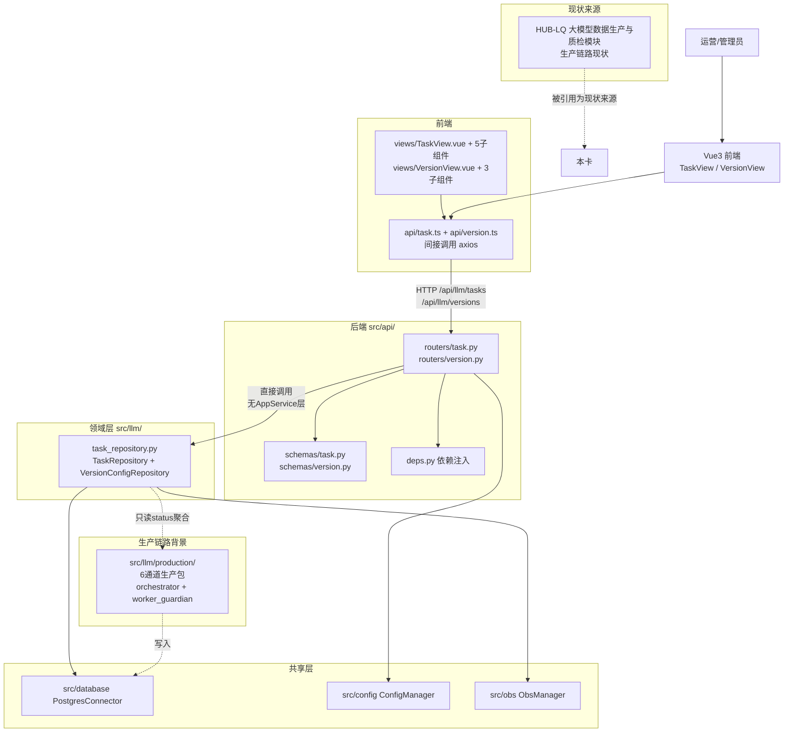
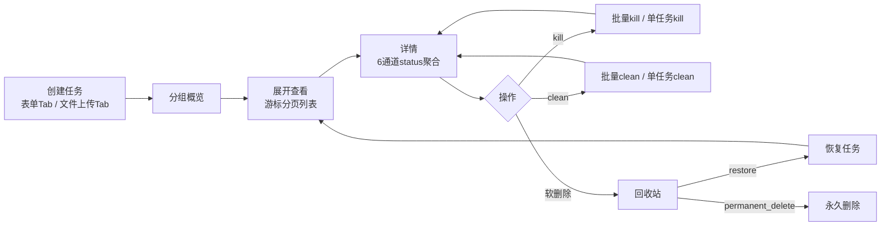
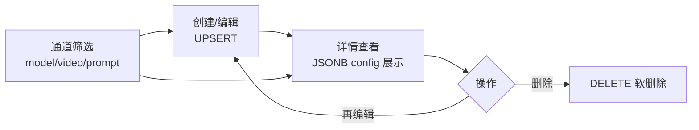

# 质检一站式平台大模型质检模块整体架构

> 本卡是大模型质检part 设计的**唯一总入口与导航枢纽**。Review 时先读本卡，再按"组件导航矩阵"和"业务链全景"进入分卡。本卡保持轻量，不展开细节设计（细节在组件卡中）。实施契约与动态进度统一收纳于 [[大模型质检模块实施计划]]。

- **上位架构**：[[质检一站式平台顶层架构]]（沿用 §3 目录划分 / §4 前后端边界 / §5 API 契约 / §6 全局规范 / §8 参考模式）
- **现状来源**：[[HUB-LQ 大模型数据生产与质检模块]]（生产链路现状，含 [[LLM任务调度Pipeline全景]] / [[任务级vs通道级status架构设计]] 等现状卡）
- **技术栈**：沿用顶层架构 §1（FastAPI + Python / Vue3 + TypeScript / PostgreSQL / GaussDB-DWS / OBS / ConfigManager / PostgresConnector）
- **架构选型**：三层架构（Router → Repository/Domain → DB），**省略 Application Service 层**（顶层架构 §4 已声明 AppService 可选）

---

## §1. 建设目标与约束

### 1.1 建设目标

大模型质检part 聚焦"生产任务管理"和"版本配置管理"两个样板域，不覆盖 6 通道生产链路本身（生产链路仅作为外部依赖背景链接）。正向设计以理想架构为目标，现有大模型前后端代码可重构/推翻。

1. **生产任务域**：14 端点的架构优化重构（创建表单/创建上传/概览/分组/游标分页列表/详情/通道进度/通道吞吐/批量kill/批量clean/单任务kill/单任务clean/restore/permanent-delete）。
2. **版本配置域**：4 端点的架构优化重构（POST 创建/UPSERT、GET 列表、GET 详情、DELETE 删除）。

### 1.2 客观约束

| 约束 | 对设计的影响 |
|---|---|
| 三层架构（省略 AppService） | Router 直接调 Repository；业务逻辑在 Router 层编排，但 Router 禁止拼 SQL |
| 路径 C 折中：后端目录保持 `src/llm/` | 路由前缀 `/api/llm/tasks`、`/api/llm/versions`，与人工质检结构一致 |
| 生产任务数据量大 | 游标分页（cursor-based），补全 prev_cursor 双向分页 |
| 版本配置数据量小 | OFFSET 分页（简单高效） |
| 前端推翻重来 | TaskView 拆 5 组件，VersionView 拆 3 组件，单组件 <300 行 |
| 6 通道生产链路不纳入设计 | 仅链接 production/ 能力，不设计通道本身 |
| 任务级 status 派生铁律 | 任务级 status 由 6 通道 status 派生，禁直接写，必须经 `_sync_task_status()` |

---

## §2. 总体架构图

**图注**：
1. 大模型质检采用三层架构（Router → Repository → DB），省略 Application Service 层（顶层架构 §4 已声明可选）。
2. 6 通道 production/ 生产包作为外部依赖背景，仅链接其能力，不在本 part 设计通道本身。
3. 前端通过 `api/llm/*.ts` 间接调用后端，禁止 axios 直用（顶层架构 §5）。

---

## §3. 组件导航矩阵

> 📌 通用设计原则详见[[质检一站式平台顶层架构]] §4 / §5。本段仅展开大模型质检part 的组件清单，通用原则不再重复。

本矩阵覆盖大模型质检模块全部 10 个组件。完成状态定义：✅ 已实现 / 🟡 设计中 / ⬜ 未开始。

| # | 组件名 | 卡片链接 | 完成状态 | 一句话职责 | 所属层 |
|---|--------|---------|---------|-----------|--------|
| 1 | 后端分层与组件边界 | [[大模型质检-后端分层与组件边界设计]] | ⬜ | 三层架构落地，Router 直接调 Repository | 后端 |
| 2 | API 契约与前端交互 | [[大模型质检-API契约与前端交互设计]] | ⬜ | 14+4 端点 API 契约规范 | 后端 |
| 3 | 领域模型层 | [[大模型质检-领域模型层设计]] | ⬜ | Pydantic Schema 定义 | 后端 |
| 4 | Repository 与数据库访问 | [[大模型质检-Repository与数据库访问设计]] | ⬜ | SQL 集中封装，禁 ORM | 后端 |
| 5 | 生产任务设计 | [[大模型质检-生产任务设计]] | ⬜ | 样板域①，14 端点架构优化 | 样板域 |
| 6 | 版本配置设计 | [[大模型质检-版本配置设计]] | ⬜ | 样板域②，4 端点架构优化 | 样板域 |
| 7 | t_llm_task 表设计 | [[大模型质检-t_llm_task表设计]] | ⬜ | 正向化，字段/索引/派生 status/边界 | 数据表 |
| 8 | t_llm_version_config 表设计 | [[大模型质检-t_llm_version_config表设计]] | ⬜ | 正向化，补全 DDL 和 CHECK 约束 | 数据表 |
| 9 | 前端页面与状态设计 | [[大模型质检-前端页面与状态设计]] | ⬜ | TaskView 拆 5 组件 + VersionView 拆 3 组件 | 前端 |
| 10 | 业务流程梳理 | [[大模型质检-生产任务与版本配置业务流程梳理]] | ⬜ | 业务语义基准，数据流向 | 业务 |

> 📌 避坑卡：[[PF-旧版大模型前后端平台架构问题与改进策略]]（梳理现有架构问题 + 改进策略，对标人工质检 PF 卡）。
> 📌 实施契约：[[大模型质检模块实施计划]]（7 段式 plan，对标人工质检实施计划卡）。

---

## §4. 业务链全景

### 4.1 生产任务链

### 4.2 版本配置链

### 4.3 业务链总览

两条业务链通过 `t_llm_task` 和 `t_llm_version_config` 两张表形成数据闭环：版本配置链路产出版本配置，生产任务创建时引用版本配置（版本在创建时冻结，后续版本配置变更不影响已创建任务）。

详见 [[大模型质检-生产任务设计]] 与 [[大模型质检-版本配置设计]]。

---

## §5. 实施路线摘要

> 完整路线图、各 Phase 详细计划与完成情况矩阵见 [[大模型质检模块实施计划]]。

| Phase | 目标 | 当前状态 | 关键交付物 |
|-------|------|---------|-----------|
| Phase 0 | 顶层架构固化 | ✅ 完成 | 顶层架构卡 + 大模型质检整体架构卡 |
| Phase 1 | t_llm_version_config 表设计 + DDL 落地 | ⬜ 未开始 | 正向化 DDL + CHECK 约束 + 索引 |
| Phase 2 | Repository 层重构 | ⬜ 未开始 | TaskRepository + VersionConfigRepository |
| Phase 3 | Router + API 契约重构 | ⬜ 未开始 | task.py + version.py 路由 |
| Phase 4 | 前端推翻重写 | ⬜ 未开始 | TaskView 5 组件 + VersionView 3 组件 |
| Phase 5 | 知识库同步刷新 | ⬜ 未开始 | 图索引重编译 + 断链检查 |

---

## §6. Plan 契约索引

- **统一 Plan 卡**：[[大模型质检模块实施计划]]
- **一句话摘要**：7 段式实施计划，提供 Phase 0-5 全景路线图、当前完成情况、各 Phase 详细计划、四级实现契约（DDL → Repository → Router → 前端）、子模块拆解清单与风险待决事项，是大模型质检模块唯一的实施契约事实源。

---

## §7. 数据事实源

| 信息 | 权威来源 | 本地用途 |
|---|---|---|
| t_llm_task 表结构（DDL / 索引 / 约束） | [[大模型质检-t_llm_task表设计]] | Repository SQL 封装、Schema 定义 |
| t_llm_version_config 表结构（DDL / CHECK 约束） | [[大模型质检-t_llm_version_config表设计]] | Repository UPSERT、Schema 定义 |
| API 端点契约（14+4 端点） | [[大模型质检-API契约与前端交互设计]] | 前后端调用契约、TypeScript 接口 |
| 6 通道 status 派生规则 | [[大模型质检-Repository与数据库访问设计]] + [[任务级vs通道级status架构设计]] | 任务级 status 派生、前端聚合展示 |
| 现状代码（14+4 端点现有实现） | [[FastAPI后端API层架构]] / [[Vue3前端层架构]] / [[TaskRepository 任务DB读写封装层]] | 架构优化重构前的现状参照 |
| 业务语义基准 | [[大模型质检-生产任务与版本配置业务流程梳理]] | 业务概念澄清、操作闭环定义 |

---

## §8. 规范约束清单

> 📌 全局规范（6 张共享规范）详见[[质检一站式平台顶层架构]] §6。本段仅展开大模型质检part 专属规范与避坑引用。

### 8.1 全局规范（引用顶层 §6）

| 规范 ID | 规范卡 | 一句话约束 |
|---------|--------|-----------|
| NORM-DDL-SYNC | [[DDL变更同步规范]] | 每张表同步交付迁移脚本 + 正式建表 SQL + 测试镜像 SQL |
| NORM-KB-SYNC | [[知识库同步刷新规范]] | 完成后重编译图索引、断链检查、双链焊死 |
| NORM-KM-001 | [[知识库双链层级规范]] | synthesis/concept 回链 Hub；枢纽出链子卡入链含 Hub |
| NORM-GAUSSDB-DDL | [[GaussDB-DWS建表SQL规范]] | DDL 遵循 GaussDB 8.x 语法；DISTRIBUTE BY HASH；不支持 ADD COLUMN IF NOT EXISTS |
| NORM-TRIGGER-UPDATED-AT | [[GaussDB TRIGGER限制与updated_at处理规范]] | updated_at 不用 TRIGGER，用应用层写入或 DEFAULT |
| NORM-SOFT-DELETE | [[软删除 is_deleted 设计规范]] | 业务查询默认 WHERE is_deleted=FALSE |

### 8.2 大模型专属规范与避坑

| 规范/避坑 | 卡片双链 | 一句话约束 |
|----------|---------|-----------|
| LLM Tools 开发规范 | [[LLM Tools 关键算法]] / [[LLM Tools 示例脚本索引]] | LLM 工具开发遵循 NORM-LLM-001 |
| 前端开发规范 | [[前端开发规范]] | SFC 顺序 template→script→style；style scoped；禁 any；禁 axios 直用；禁 v-for 无 key |
| ConfigManager_get 签名陷阱 | [[PF-ConfigManager_get签名陷阱]] | 注意 ConfigManager.get() 签名陷阱 |
| PGConnector 接口语义陷阱 | [[PGConnector接口语义陷阱：execute_query禁止写操作]] | execute_query 禁写操作，写用 execute/execute_values |
| 旧版大模型前后端架构问题与改进策略 | [[PF-旧版大模型前后端平台架构问题与改进策略]] | 梳理现有架构问题清单 + 新架构规避策略 |
| 任务级 status 派生铁律 | [[任务级vs通道级status架构设计]] | 任务级 status 由 6 通道 status 派生，禁直接写，走 `_sync_task_status()` |

---

## §9. Review 顺序

1. [[质检一站式平台顶层架构]]（上位架构基座，确认 §3-§6 宪法层）
2. **本卡**（大模型质检part 设计入口，确认范围、组件关系、两条业务链）
3. [[HUB-LQ 大模型数据生产与质检模块]]（现状来源，确认生产链路现状）
4. 后端层组件卡：[[大模型质检-后端分层与组件边界设计]] → [[大模型质检-API契约与前端交互设计]] → [[大模型质检-领域模型层设计]] → [[大模型质检-Repository与数据库访问设计]]
5. 样板域组件卡：[[大模型质检-生产任务设计]] → [[大模型质检-版本配置设计]]
6. 数据表组件卡：[[大模型质检-t_llm_task表设计]] → [[大模型质检-t_llm_version_config表设计]]
7. 前端组件卡：[[大模型质检-前端页面与状态设计]]
8. 业务流程卡：[[大模型质检-生产任务与版本配置业务流程梳理]]
9. 避坑卡：[[PF-旧版大模型前后端平台架构问题与改进策略]]
10. 实施计划：[[大模型质检模块实施计划]]

---

## 关联卡片

- [[质检一站式平台顶层架构]] — 上位架构基座
- [[HUB-LQ 大模型数据生产与质检模块]] — 现状来源（生产链路）
- [[质检一站式平台人工质检模块整体架构]] — 对标人工质检整体架构卡
- [[LLM任务调度Pipeline全景]] — 生产链路现状
- [[任务级vs通道级status架构设计]] — status 派生架构决策
- [[质检平台-人工质检模块实施计划]] — 对标人工质检实施计划

### 归属
- [[质检一站式平台大模型质检模块整体架构]] — 大模型质检part 设计总入口（自指：本卡即 HUB）
