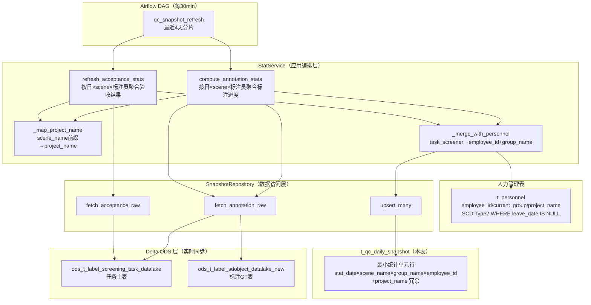
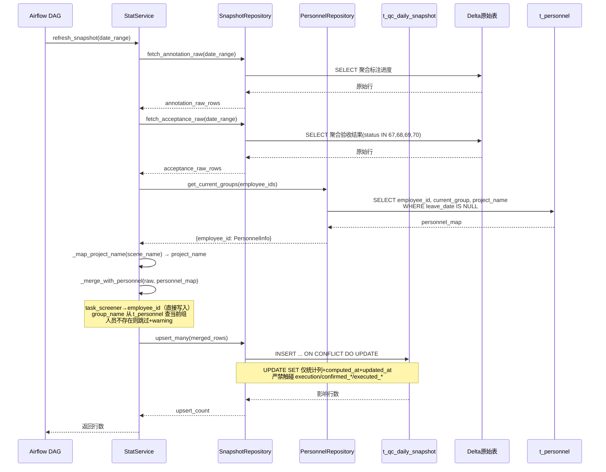

> ✅ 印证修订：domain 由原始 `["ai_dlc","agent_evaluation","tooling"]` 改为本仓库 TAXONOMY 合法值 `["manual_qa"]`。
> ✅ 印证修订（20260629 梳理融合）：本卡在原"表结构 + 字段定义"基础上，增量合并 [PLAN 20260629_150000] 的完整来龙去脉：数据来源拓扑、上下游血缘表、定时刷新机制、10边界情况、旧版DAG参照与5大问题清单。零信息损失合并。
> ⚠️ 架构决策（人类反馈1）：快照表刷新**直接从 Delta 原始表聚合**，不依赖中间表 `human_inspection_0920`。理由：中间表每6h才刷新且含复杂 `MergedTaskStatus` 合并逻辑，引入额外延迟与维护成本；原始表是 Delta 平台 ODS 层实时同步，更简单且更及时。详见下文 §9。
> 🔄 V20260630_03 重设计（20260702 拍板）：annotator_id INT(外键 t_personnel.id) → employee_id VARCHAR(64)(逻辑引用)；去 annotation_pending/is_executed/conclusion/conclusion_basis；新增 project_name/option_annotation/good_completed/good_conclusion/bad_completed/bad_conclusion/execution；acceptance_submitted→acceptance_completed；索引从 6 个调整为 7 个（新增 project_date + good/bad_conclusion 部分索引）。数据源选型确认：直连 Delta 原始表（实时同步），不依赖 t_text_label_task 中间层（复用已有架构决策人类反馈1）。

# 质检平台综合日常快照表设计 (t_qc_daily_snapshot)

> 核心表：每行记录一名标注员在某日、某 scene、当日组别下的最小统计单元；既服务统计看板，也为采样配额和通过/打回判断提供计数依据。

← [[质检一站式平台人工质检模块整体架构]] | [[人工质检-Hub]] | [[人工质检-验收与通过打回]] | [[人工质检-人力管理体系设计]] | [[人工质检-标注验收执行三阶段流程]]

→ [[质检平台-Repository与数据库访问设计]] | [[质检平台-验收采样配额与任务选择设计]] | [[质检平台-通过打回规则与执行设计]]

> 第二轮复核：快照负责"算多少"和"统计结果"，任务级中间表/Delta 表负责"具体哪些 clip/task"以及执行后的真实状态。见 [[质检一站式平台Phase3前架构评审]]。

---

## ① 组件概述

**一句话职责**：定义人工质检模块的核心数据底座 `t_qc_daily_snapshot`——每行记录一名标注员在某日、某 scene、当日组别下的最小统计单元（含 project_name 冗余维度），既服务统计看板，也为采样配额计算和通过/打回判断提供计数依据，并通过/打回结论（good_conclusion/bad_conclusion）与执行计数（execution JSONB）同行记录，无需跨表 JOIN。

**在整体架构中的位置**：数据层。位于 Repository 层之下、Delta 原始表之上的聚合产物；由 [[质检平台-Repository与数据库访问设计]] 的 `SnapshotRepository` 读写，由 [[验收前置条件-快照刷新四级实现契约]] 的 `StatService` + Airflow DAG 每 30 分钟从 Delta 原始表聚合刷新；向上为 [[质检平台-验收采样配额与任务选择设计]] 的 Sampler 和 [[质检平台-通过打回规则与执行设计]] 的 PassRule 提供计数依据。

---

## ② 架构结构

### 物理落地文件

| 文件       | 路径                                                                                                                                                                      | 说明                                                                   |
| -------- | ----------------------------------------------------------------------------------------------------------------------------------------------------------------------- | -------------------------------------------------------------------- |
| 正式建表 SQL | [`data_schemas/postgresql_relational/t_qc_daily_snapshot.sql`](../../../data_schemas/postgresql_relational/t_qc_daily_snapshot.sql)                                     | schema=`pnc_simulation`，26 字段 + 2 约束 + 7 索引 + DISTRIBUTE BY HASH(id) |
| 测试镜像 SQL | [`data_schemas/postgresql_relational/t_qc_daily_snapshot test.sql`](../../../data_schemas/postgresql_relational/t_qc_daily_snapshot%20test.sql)                         | schema=`data_common_4`，结构与正式表完全一致                                    |
| 初始迁移脚本   | [`data_schemas/migrations/V20260630_02__create_qc_daily_snapshot_table.sql`](../../../data_schemas/migrations/V20260630_02__create_qc_daily_snapshot_table.sql)         | 幂等迁移，双 schema 镜像创建，依赖 V20260630_01 先执行                               |
| 重设计迁移脚本  | [`data_schemas/migrations/V20260630_03__redesign_qc_snapshot_and_personnel.sql`](../../../data_schemas/migrations/V20260630_03__redesign_qc_snapshot_and_personnel.sql) | V20260630_03 重设计：字段重命名/新增/删除 + 索引重建，幂等                               |

### 快照刷新数据流图（Mermaid flowchart）



**数据流说明**：
- Airflow DAG 每 30 分钟触发 `StatService.refresh_snapshot(stat_date_range)`，覆盖最近 4 天分片（幂等可重复刷新）。
- `StatService` 通过 `SnapshotRepository.fetch_annotation_raw` / `fetch_acceptance_raw` 从 Delta 原始表聚合（**直连原始表，不依赖中间表，也不依赖 t_text_label_task 中间层**，架构决策人类反馈1）。
- `_map_project_name` 从 scene_name 前缀经 Python 字典映射 project_name（`{"vpd质检标注_v4":"vpd","驾驶行为质检":"城区and高速"}`）。
- `_merge_with_personnel` 将 `task_screener`（工号）**直接写入** `employee_id`（无需映射 t_personnel.id），并从 `t_personnel` 查当前组（`WHERE leave_date IS NULL`）写入 group_name 冗余字段。
- `upsert_many` 批量 UPSERT 写入快照表，UPDATE SET **仅含统计列**，严禁含 execution/confirmed_*/executed_* 字段（边界情况1）。

### 核心业务流程时序图（Mermaid sequenceDiagram）



---

## ③ 数据表交互

| 表名                                          | 一句话用途                                                                       | SQL/设计卡链接                                                                                                                                         | 读写类型 | 关键字段                                                                           |
| ------------------------------------------- | --------------------------------------------------------------------------- | ------------------------------------------------------------------------------------------------------------------------------------------------- | ---- | ------------------------------------------------------------------------------ |
| `t_qc_daily_snapshot`                       | 本表，综合日常快照表                                                                  | [`data_schemas/postgresql_relational/t_qc_daily_snapshot.sql`](../../../data_schemas/postgresql_relational/t_qc_daily_snapshot.sql)（本卡 ⑤ 段完整字段说明） | 读写   | 全部 26 字段（见 ⑤ 段）                                                                |
| `t_personnel`                               | 快照刷新时按 employee_id 查 current_group（WHERE leave_date IS NULL）冗余写入 group_name | [`data_schemas/postgresql_relational/t_personnel.sql`](../../../data_schemas/postgresql_relational/t_personnel.sql) · [[人工质检-人力管理体系设计]] §2.1      | 读    | employee_id/current_group/project_name（SCD Type2，查现状 WHERE leave_date IS NULL） |
| Delta `ods_t_label_screening_task_datalake` | 标注进度与验收结果的上游源表                                                              | [[质检平台-综合快照表设计]] §9                                                                                                                               | 读    | task_name/task_screener/task_status/del_flag/to_review_time                    |
| Delta `ods_t_label_sdobject_datalake_new`   | 标注 GT 与 Good/Bad 判定的上游源表                                                    | [[质检平台-综合快照表设计]] §9                                                                                                                               | 读    | task_id/behavior_status(JSONB)/task_finished_time                              |

> **迁移依赖**：V20260630_03 重设计后，`t_qc_daily_snapshot.employee_id` 为逻辑引用 `t_personnel.employee_id`（非物理 FK）。执行顺序：`V20260630_01` → `V20260630_02` → `V20260630_03`（重设计迁移，幂等）。

---

## ④ 子模块/文件级清单

| 子模块/文件 | 一句话说明 |
|------------|-----------|
| `t_qc_daily_snapshot` 表 | 本卡核心，26 字段综合快照表（含 project_name 冗余、execution JSONB） |
| `SnapshotRepository` | 读写本表的 Repository 类，详见 [[质检平台-Repository与数据库访问设计]] |
| `SnapshotRepository.upsert_many` | 批量 UPSERT，UPDATE SET 仅统计列（禁含 execution/confirmed_*/executed_*） |
| `SnapshotRepository.aggregate_by_project` | 新增：按 project_name 聚合查询 |
| `SnapshotRepository.fetch_annotation_raw/fetch_acceptance_raw` | 从 Delta 原始表聚合原始行 |
| `StatService.refresh_snapshot` | 聚合刷新编排，详见 [[验收前置条件-快照刷新四级实现契约]] Task 4 |
| `StatService._map_project_name` | scene_name 前缀 → project_name 映射（Python 字典） |
| `StatService._merge_with_personnel` | task_screener → employee_id（直接写入） + group_name（查当前组） |
| `qc_snapshot_refresh` DAG | 每 30 分钟调度入口，详见 [[验收前置条件-快照刷新四级实现契约]] Task 5 |
| `Sampler` | 从本表读 option_annotation 计算配额，详见 [[质检平台-验收采样配额与任务选择设计]] |
| `PassRule` | 从本表读 good_*/bad_* 计算通过率判定 PASS/REJECT，详见 [[质检平台-通过打回规则与执行设计]] |

---

## ⑤ 详细设计展开

### 1. 设计原则

| 原则 | 说明 |
|------|------|
| **一行 = 一个最小统计单元** | `(stat_date × scene_name × group_name × employee_id)` + project_name 冗余；employee_id 必须有值 |
| **标注+验收合一** | 同一行承载该维度下标注进度、标注结果分布、验收分配、验收结果 |
| **执行确认同行** | good_conclusion/bad_conclusion 记录分类结论，execution JSONB 记录各维度执行计数，confirmed_*/executed_* 记录人工确认与执行，无需跨表 JOIN |
| **采样计算依据** | sampler 从本表计算每个最小单元的配额；执行前再查 Delta 原始表取得 task_id/clip_id（**本表不记录 clip_id 列表**，反查走 Delta 原始表） |
| **JSONB 无 schema 扩展** | 选项分布和验收明细用 JSONB，新增选项/题型无需加列 |
| **good/bad 独立列 + 选项 JSONB 混合** | 固定高频维度（good/bad 的 allocated/completed/passed/conclusion）用独立列（可索引、SQL 简洁），可变维度用 JSONB（灵活扩展） |

### 2. 维度设计

```
stat_date       DATE         -- 标注提交日期（以标注工作日为主轴）
scene_name      VARCHAR(256) -- 任务组/场景名（见 scene_name 概念卡片）
group_name      VARCHAR(128) -- 冗余存储的标注员组名（不做 FK，便于 GROUP BY）
employee_id     VARCHAR(64)  -- 必填，最小统计单元对应的标注员工号（逻辑引用 t_personnel.employee_id）
project_name    VARCHAR(64)  -- 冗余项目名，由 scene_name 前缀经 Python 字典映射
```

本表只保存个人最小行，不额外保存组级汇总行。`group_name` 是历史维度快照：记录该标注员当天所属组，后续调组不回写历史。组级、scene 级、project 级和日期级结果通过 `GROUP BY` 直接聚合。

**project 维度映射**：`project_name` 由 `scene_name` 前缀经 StatService 中的 Python 字典硬编码映射（仅 2 个项目，无需建表避免过度设计）：

```python
PROJECT_MAP = {
    "vpd质检标注_v4": "vpd",
    "驾驶行为质检": "城区and高速",
}
```

**反查 clip_id 策略**：本表**不记录 clip_id 列表**。执行阶段需具体 clip/task 时，反查走 Delta 原始表（`ods_t_label_screening_task_datalake` + `ods_t_label_sdobject_datalake_new`），按 (stat_date, scene_name, employee_id) 维度回查 task_id/clip_id。

**唯一性保证**：`UNIQUE (stat_date, scene_name, group_name, employee_id)`，只使用 PostgreSQL 10+ 支持的普通列唯一约束。

### 3. 字段分组设计

#### 3.1 标注进度字段

```sql
annotation_total     INT   -- 该维度下分配的总标注任务数
annotation_submitted INT   -- 已提交/完成标注数
-- annotation_pending 去掉（运行时派生 = total - submitted）
option_annotation    JSONB -- {"A": 120, "B": 30, "C": 15}  各选项标注数量（新增）
```

#### 3.2 验收分配+进度字段

```sql
acceptance_allocated   INT  -- 状态回查后确认实际成功分配到验收员的数量（总验收条数）
acceptance_completed   INT  -- 已完成验收数（原 acceptance_submitted 改名）
-- 分配比例 = allocated / annotation_submitted，在应用层计算
```

#### 3.3 验收结果字段（good/bad 独立列 + 选项 JSONB 混合）

```sql
good_allocated   INT           -- 分配的 Good 类任务数
good_completed   INT           -- Good 类已完成验收数（新增，通过率分母用此列）
good_passed      INT           -- Good 类验收通过数
good_conclusion  VARCHAR(16)   -- Good 类结论：NULL / PENDING / PASS / REJECT（新增）
bad_allocated    INT           -- 分配的 Bad 类任务数
bad_completed    INT           -- Bad 类已完成验收数（新增，通过率分母用此列）
bad_passed       INT           -- Bad 类验收通过数
bad_conclusion   VARCHAR(16)   -- Bad 类结论：NULL / PENDING / PASS / REJECT（新增）

option_acceptance JSONB
-- {"A": {"allocated": 100, "completed": 96, "passed": 90, "conclusion": "PASS"},
--  "B": {"allocated": 25,  "completed": 23, "passed": 18, "conclusion": "PASS"},
--  "C": {"allocated": 12,  "completed": 11, "passed": 9,  "conclusion": "REJECT"}}
-- key = 选项字母，value = {allocated, completed, passed, conclusion}
```

#### 3.4 执行结论字段

```sql
execution        JSONB        -- 新增，执行计数：{"good":{"passed":100,"rejected":50,"total":150},"bad":{...},"A":{...}}
-- is_executed / conclusion / conclusion_basis 去掉（被 execution JSONB + good/bad_conclusion 替代）
confirmed_by     VARCHAR(64)  -- 确认人工号
confirmed_at     TIMESTAMPTZ
executed_by      VARCHAR(64)
executed_at      TIMESTAMPTZ
execution_note   TEXT
```

**execution JSONB 字段语义**：
- `passed`：执行通过数（Delta API batch_acceptance_pass 成功数）
- `rejected`：执行打回数（Delta API task_rollback 成功数）
- `total`：标注全集数（参与执行判定的总条数）
- 按维度组织：`good` / `bad` / 各选项字母（`A`/`B`/...）

### 4. t_qc_daily_snapshot 完整字段说明（物理 DDL 对照）

> 物理文件：[`data_schemas/postgresql_relational/t_qc_daily_snapshot.sql`](../../../data_schemas/postgresql_relational/t_qc_daily_snapshot.sql)（schema=`pnc_simulation`，测试镜像 schema=`data_common_4`，DISTRIBUTE BY HASH(id)）

| #   | 字段名                    | 类型           | 约束                                  | 默认值   | 说明                                                                                            |
| --- | ---------------------- | ------------ | ----------------------------------- | ----- | --------------------------------------------------------------------------------------------- |
| 1   | `id`                   | SERIAL       | PRIMARY KEY                         | —     | 主键自增ID（分布键）                                                                                   |
| 2   | `stat_date`            | DATE         | NOT NULL                            | —     | 标注提交日期（以标注工作日为主轴）                                                                             |
| 3   | `scene_name`           | VARCHAR(256) | NOT NULL                            | —     | 任务组/场景名（见 [[质检平台-scene_name概念]]）                                                              |
| 4   | `group_name`           | VARCHAR(128) | NOT NULL                            | `''`  | 冗余存储的标注员组名（非 FK，便于 GROUP BY；写入即冻结，调组不回写历史，架构护栏2）                                              |
| 5   | `employee_id`          | VARCHAR(64)  | NOT NULL                            | —     | 最小统计单元对应的标注员工号，逻辑引用 t_personnel.employee_id（非物理 FK），由应用层保证一致性                                |
| 6   | `project_name`         | VARCHAR(64)  | NOT NULL                            | `''`  | 冗余项目名，由 scene_name 前缀经 Python 字典映射                                                            |
| 7   | `annotation_total`     | INT          | NOT NULL                            | 0     | 该维度下分配的总标注任务数                                                                                 |
| 8   | `annotation_submitted` | INT          | NOT NULL                            | 0     | 已提交/完成标注数                                                                                     |
| 9   | `option_annotation`    | JSONB        | NULL                                | —     | 各选项标注数量 JSONB：`{"A": 120, "B": 30, "C": 15}`                                                  |
| 10  | `acceptance_allocated` | INT          | NOT NULL                            | 0     | 状态回查后确认实际成功分配到验收员的数量（总验收条数）                                                                   |
| 11  | `acceptance_completed` | INT          | NOT NULL                            | 0     | 已完成验收数（验收员已判定，原 acceptance_submitted 改名）                                                       |
| 12  | `good_allocated`       | INT          | NOT NULL                            | 0     | 分配的 Good 类任务数                                                                                 |
| 13  | `good_completed`       | INT          | NOT NULL                            | 0     | Good 类已完成验收数（通过率分母用此列，非 allocated）                                                             |
| 14  | `good_passed`          | INT          | NOT NULL                            | 0     | Good 类验收通过数                                                                                   |
| 15  | `good_conclusion`      | VARCHAR(16)  | NULL                                | —     | Good 类执行结论：NULL / PENDING / PASS / REJECT                                                      |
| 16  | `bad_allocated`        | INT          | NOT NULL                            | 0     | 分配的 Bad 类任务数                                                                                  |
| 17  | `bad_completed`        | INT          | NOT NULL                            | 0     | Bad 类已完成验收数（通过率分母用此列，非 allocated）                                                              |
| 18  | `bad_passed`           | INT          | NOT NULL                            | 0     | Bad 类验收通过数                                                                                    |
| 19  | `bad_conclusion`       | VARCHAR(16)  | NULL                                | —     | Bad 类执行结论：NULL / PENDING / PASS / REJECT                                                       |
| 20  | `option_acceptance`    | JSONB        | NULL                                | —     | 各选项验收明细 JSONB：`{"A": {"allocated": 10, "completed": 9, "passed": 8, "conclusion": "PASS"}}`   |
| 21  | `execution`            | JSONB        | NULL                                | —     | 执行计数 JSONB：`{"good":{"passed":100,"rejected":50,"total":150},"bad":{...},"A":{...}}`        |
| 22  | `confirmed_by`         | VARCHAR(64)  | NULL                                | —     | 确认人工号                                                                                         |
| 23  | `confirmed_at`         | TIMESTAMPTZ  | NULL                                | —     | 确认时间                                                                                          |
| 24  | `executed_by`          | VARCHAR(64)  | NULL                                | —     | 执行人工号                                                                                         |
| 25  | `executed_at`          | TIMESTAMPTZ  | NULL                                | —     | 执行时间                                                                                          |
| 26  | `execution_note`       | TEXT         | NULL                                | —     | 执行备注                                                                                          |
| 27  | `computed_at`          | TIMESTAMPTZ  | NOT NULL                            | now() | 统计计算时间（刷新批次时间戳）                                                                               |
| 28  | `updated_at`           | TIMESTAMPTZ  | NOT NULL                            | now() | 最后修改时间（禁 TRIGGER，由应用层写入或 DEFAULT now()）                                                       |

**约束**：
| 约束名 | 类型 | 定义 | 来源 |
|--------|------|------|------|
| `uk_qc_daily_snapshot_dim` | UNIQUE | `(stat_date, scene_name, group_name, employee_id)` | §2 唯一性保证 |
| `ck_annotation_counts_order` | CHECK | `annotation_submitted <= annotation_total` | 四级契约 Task2 |

### 5. 索引设计说明（物理 DDL 对照）

> 物理文件：[`data_schemas/postgresql_relational/t_qc_daily_snapshot.sql`](../../../data_schemas/postgresql_relational/t_qc_daily_snapshot.sql) 末段（7 个索引）

| 索引名 | 索引定义 | 用途 |
|--------|---------|------|
| `idx_qc_daily_snapshot_stat_date` | `(stat_date DESC)` | 按日期查最近数据 |
| `idx_qc_daily_snapshot_scene_date` | `(scene_name, stat_date DESC)` | 按场景+日期筛选（最常见查询） |
| `idx_qc_daily_snapshot_group_date` | `(group_name, stat_date DESC)` | 按组筛选 |
| `idx_qc_daily_snapshot_employee_date` | `(employee_id, stat_date DESC)` | 按标注员工号筛选 |
| `idx_qc_daily_snapshot_project_date` | `(project_name, stat_date DESC)` | 按项目筛选（新增） |
| `idx_qc_daily_snapshot_good_conclusion` | `(good_conclusion, stat_date) WHERE good_conclusion IS NOT NULL` | 查 Good 类有结论的待办项（新增部分索引） |
| `idx_qc_daily_snapshot_bad_conclusion` | `(bad_conclusion, stat_date) WHERE bad_conclusion IS NOT NULL` | 查 Bad 类有结论的待办项（新增部分索引） |

### 6. 核心业务流程与数据流

```
① 标注完成 → StatService.compute_annotation_stats()
   → 读 Delta 原始表，按维度聚合标注数据
   → UPSERT t_qc_daily_snapshot（刷新 annotation_* 和 option_annotation 列）

② 验收分配 → AssignmentService.execute_assignment()
   → 执行采样（sampler 从本表读 option_annotation 做比例判断）
   → 根据配额反查 Delta 原始表取得具体 task_ids（本表不记录 clip_id）
   → 调用 Delta API batch_assign()/batch_review_pass()
   → 回查任务状态后 UPSERT acceptance_allocated（实际成功量）

③ 验收进行中 → StatService.refresh_acceptance_stats()（定时或手动触发）
   → 读 Delta 原始表，获取最新验收状态
   → UPSERT t_qc_daily_snapshot（刷新 good_*/bad_*/option_acceptance/acceptance_completed 列）

④ 结论确认 → ExecutionService.confirm_conclusion()
   → 调用 PassRuleStrategy.evaluate(snapshot_row) 计算通过率（分母用 good_completed/bad_completed）
   → UPDATE good_conclusion / bad_conclusion / confirmed_by / confirmed_at

⑤ 结论执行 → ExecutionService.execute()
   → 调用 Delta API（batch_acceptance_pass 或 task_rollback×2）
   → UPDATE execution（JSONB 写入各维度 passed/rejected/total）/ executed_by / executed_at
```

### 7. 采样引擎如何使用本表

采样计算阶段需要各最小单元的 Good/Bad 数量和按组/scene 分布；真正执行阶段才需要具体 clip/task。

```python
# sampler.py 中 RatioSampler.sample() 的伪逻辑
def calculate_quota(self, query_params: SamplingConfig) -> List[SamplingQuota]:
    # 从快照表读取最小单元计数
    snapshot = stat_repo.get_snapshot(date=query_params.date,
                                       scene_name=query_params.scene_name,
                                       group_name=query_params.group_name)
    option_dist = snapshot.option_annotation  # {"A": 120, "B": 30, ...}

    # 计算 Good(A) 和 Bad(B/C/D...) 分别要抽多少
    good_count = max(int(target * GOOD_RATIO), GOOD_MIN)
    bad_count  = max(int(target * BAD_RATIO),  BAD_MIN)

    return SamplingQuota(good_count=good_count, bad_count=bad_count, dimensions=...)

# AssignmentService 再按 quota 的维度从任务级表查询具体 task_ids
task_ids = task_repo.fetch_waiting_review_tasks(quota)
```

### 8. 通过率计算（应用层，不在 DB 算）

```python
# 在 StatService 或 ExecutionService 中
good_pass_rate = snapshot.good_passed / snapshot.good_completed  if snapshot.good_completed > 0 else None
bad_pass_rate  = snapshot.bad_passed  / snapshot.bad_completed   if snapshot.bad_completed  > 0 else None
total_pass_rate = (snapshot.good_passed + snapshot.bad_passed) / snapshot.acceptance_completed

# 各选项通过率
for option, data in snapshot.option_acceptance.items():
    pass_rate = data['passed'] / data['completed'] if data['completed'] > 0 else None
```

> ⚠️ 通过率分母用 `good_completed` / `bad_completed` / `option_acceptance[x].completed`（已完成验收数），**非** `allocated`（分配数）。

### 9. 执行顺序（Migration 依赖）

```
1. V20260630_01__create_personnel_and_permission_tables.sql  ← t_personnel（employee_id 逻辑引用源）
2. V20260630_02__create_qc_daily_snapshot_table.sql          ← 初版快照表
3. V20260630_03__redesign_qc_snapshot_and_personnel.sql      ← 重设计（幂等迁移）
```

> ⚠️ 护栏：`confirmed_at IS NULL` 时，不得绕过 ExecutionService 直接更新 good_conclusion/bad_conclusion；调用 Delta API 后必须通过任务状态回查校准真实结果并写入 execution JSONB。

> ⚠️ 护栏：sampler 用快照计算配额；Repository 只在执行准备阶段反查 Delta 原始表取得具体 task_ids，不重复计算统计口径。

> ⚠️ 本仓库适配说明：本项目新建数据表的规范为——正式表建在 `app_gy1` 库的 `pnc_simulation` schema 下；同时在 `app_gy1` 库的 `data_common_4` schema 下建一张同名测试表。原卡片中的库/schema 命名仅作设计参考，实际落地以本规则为准。本卡的 `t_qc_daily_snapshot` 与 `t_personnel` 表落地时需按此规则调整 migration 中的 schema 限定。

> 🔄 关联存量知识：[[测试环境表镜像 data_common_4]] 已描述 `data_common_4` schema 的测试表镜像规范，与本卡的"测试表"规则一致，可视为同一规范的具象应用，无需合并。

### 10. 数据来源拓扑图（直连 Delta 原始表，不依赖中间表）

> ⚠️ 数据源选型确认：快照刷新数据源为 **Delta 原始表（实时同步）**，不依赖 `t_text_label_task` 中间层（30min 刷新，且新架构决策复用已有 Delta ODS 实时同步链路）。t_text_label_task 表结构详见 [[质检平台-t_text_label_task表结构]]。

```
① Delta 原始表（ODS层，实时同步）
   delta.ods_t_label_screening_task_datalake  ──任务主表──  id/task_name/task_screener/task_reviewer/task_acceptor/task_status/del_flag/to_review_time/marker_company
   delta.ods_t_label_sdobject_datalake_new   ──标注GT表──   task_id/behavior_status(JSONB)/task_finished_time
        │
        ├──→ StatService.compute_annotation_stats()  按日×scene×标注员聚合标注进度
        │      └→ UPSERT t_qc_daily_snapshot (annotation_* / option_annotation 列)
        │
        └──→ StatService.refresh_acceptance_stats()  按日×scene×标注员聚合验收结果
               └→ UPSERT t_qc_daily_snapshot (good_*/bad_*/option_acceptance/acceptance_completed 列)

② StatService._map_project_name()  ──Python 字典硬编码──  scene_name 前缀 → project_name
       {"vpd质检标注_v4": "vpd", "驾驶行为质检": "城区and高速"}

③ 人力管理表（SCD Type2 当前有效行）
   pnc_simulation.t_personnel  ── employee_id/name/role/project_name/current_group/status
        │   查询条件：WHERE leave_date IS NULL（仅当前有效行）
        └──→ 刷新时 task_screener(工号) 直接写入 employee_id（无需映射 t_personnel.id）；
              group_name 从 t_personnel 查当前组（WHERE leave_date IS NULL）冗余写入
              注：写入即冻结，后续调组不回写历史快照行

④ t_qc_daily_snapshot（本表，UPSERT 目标）
```

**聚合 SQL 来源原型**（来自存量代码 `AppGy1Model.get_pass_rate_info()`，新架构中由 Repository 层重新实现）：
- 按 `(DATE(submit_time), screener, company)` 聚合
- `COUNT(DISTINCT CASE WHEN status != 'UNLABELED' THEN task_id END)` → 提交数
- `COUNT(DISTINCT CASE WHEN status = 'HUMAN_PASS' THEN task_id END)` → 通过数
- good/bad 分类依据 `result->>'驾驶问题分类' = 'good'` 判定

### 11. 上下游血缘

**上游**（数据来源）：

| 源表 | 物理位置 | 承载字段 | 刷新频率 |
|------|---------|---------|---------|
| `delta.ods_t_label_screening_task_datalake` | app_gy1 库 | 任务状态/人员/时间 | Delta 平台实时同步 |
| `delta.ods_t_label_sdobject_datalake_new` | app_gy1 库 | behavior_status(GT/Good-Bad判定) | Delta 平台实时同步 |
| `pnc_simulation.t_personnel` | app_gy1 库 | current_group/project_name（WHERE leave_date IS NULL） | SCD Type2 人工维护 |

**下游**（消费方）：

| 消费方 | 用途 | 读取模式 |
|--------|------|---------|
| 采样引擎 `Sampler` | 根据 `option_annotation` 分布计算 Good/Bad 抽样配额 | 按 (date, scene, group) 查询单行 |
| 通过率计算 + 规则判定 `PassRuleStrategy` | `good_passed/good_completed` 计算通过率，判定 good_conclusion/bad_conclusion | 查询单行 |
| 看板/统计查询 API | 按组/场景/项目/日期汇总，通过率必须先 SUM 再相除 | `GROUP BY stat_date, scene_name, group_name, project_name` |
| 待执行看板 | `good_conclusion IS NOT NULL OR bad_conclusion IS NOT NULL` | 部分索引扫描 |

### 12. 定时刷新机制

| 维度 | 配置 |
|------|------|
| 刷新周期 | 每 30 分钟（与旧版状态刷新一致） |
| 调度方式 | Airflow DAG（PythonOperator + max_active_runs=1 + dagrun_timeout） |
| 覆盖范围 | 最近 4 天分片（`date.today() - timedelta(days=4)` 至 `date.today()`），幂等可重复刷新 |
| 并发控制 | DAG `max_active_runs=1`，`dagrun_timeout=28min`，`catchup=False`，`retries=1`，`retry_delay=2min` |
| 时区 | 所有时间按 `Asia/Shanghai` 处理 |
| 失败回调 | 复用 `dags.common_fun.wrapper_failure_callback` |

### 13. 边界情况与典型工况

| # | 边界情况 | 处理策略 |
|---|---------|---------|
| 1 | **UPSERT 不得误清空已确认执行字段** | 刷新只更新统计列（annotation_*/acceptance_*/good_*/bad_*/option_*），`execution/confirmed_*/executed_*/good_conclusion/bad_conclusion` 列在 UPSERT 的 UPDATE SET 中**不出现** |
| 2 | **人员调组后历史快照** | `group_name` 写入即冻结，调组不回写历史行（架构护栏2） |
| 3 | **人员尚未进组** | `current_group=''` 时快照行 group_name 记录空串，后续调组无法修正（已知取舍） |
| 4 | **跨天分片** | 聚合按 `DATE(submit_time)`（上海时区）分组，DAG 每次刷新覆盖最近 N 天（参照旧版过去4天分片） |
| 5 | **空数据** | 某日某标注员无提交时，不产生快照行（非 UPSERT 空值） |
| 6 | **Delta 平台同步延迟** | 刷新周期 30min，容忍 ODS 层分钟级延迟 |
| 7 | **标注员离职** | `t_personnel.status=INACTIVE` 的人员，其历史快照行保留不删（SCD Type2 旧行 leave_date 已设） |
| 8 | **Good/Bad 判定** | 依据 `ods_t_label_sdobject_datalake_new.behavior_status` JSONB 中的 `驾驶问题分类` 字段，`='good'` 为 good，其余为 bad |
| 9 | **并发刷新** | DAG `max_active_runs=1` 避免并发 |
| 10 | **临时表污染** | 新架构用 `execute_values` 批量 UPSERT，**禁止**再用临时表模式 |

### 14. 旧版定时刷新参照实现（存量代码，仅参照不照搬）

> ⚠️ 架构决策（人类反馈2）：旧版代码不优雅（SQL 散落 Model 层、exec_query 既查又写、临时表模式重复、双连接器混乱），仅作为业务逻辑参照，新架构必须高内聚低耦合。旧版5大问题与改进策略详见 [[PF-旧版验收代码架构问题与改进策略]]。

| DAG | 周期 | 物理位置 | 流水线 | 参照价值 |
|-----|------|---------|--------|---------|
| `human_inspection_refresh_status` | 每30min | `dags/human_label_refresh_status.py` → `dag_run.refresh_task_status()` → `TaskManager`(继承`TaskManagerBase`) 6步 | replenish_task_info → update_task_status → update_task_gt → 质量表写入 | 调度模式参照（Airflow DAG + PythonOperator + max_active_runs=1 + dagrun_timeout） |
| `human_inspection_update_middleware` | 每6h | `dags/human_label_update_middleware.py` → `process_middleware_table.update_middleware()` 3步 | fetch_label_record_from_di → update_status_and_fill_result → update_label_result | ⏳ **本方案不采用**（中间表链路过重） |

### 15. 实现契约导航

快照刷新的四级实现契约（DDL → Repository → Service → DAG）详见 [[验收前置条件-快照刷新四级实现契约]]（已合并至 [[质检平台-人工质检模块实施计划]]）。

---

## ⑥ 完成情况与 TODO

**当前状态**：DDL 已重设计落地（V20260630_03，正式表 + 测试镜像 + 迁移脚本三件套）；Repository/Service/DAG 层设计中。

**TODO 清单**：
- [x] 表结构设计冻结（26 字段 + 2 约束 + 7 索引 + DISTRIBUTE BY HASH(id)）
- [x] 正式建表 SQL 落地（[`t_qc_daily_snapshot.sql`](../../../data_schemas/postgresql_relational/t_qc_daily_snapshot.sql)）
- [x] 测试镜像 SQL 落地（[`t_qc_daily_snapshot test.sql`](../../../data_schemas/postgresql_relational/t_qc_daily_snapshot%20test.sql)）
- [x] 初始迁移脚本落地（[`V20260630_02`](../../../data_schemas/migrations/V20260630_02__create_qc_daily_snapshot_table.sql)）
- [x] 重设计迁移脚本落地（[`V20260630_03__redesign_qc_snapshot_and_personnel.sql`](../../../data_schemas/migrations/V20260630_03__redesign_qc_snapshot_and_personnel.sql)）
- [x] 数据来源拓扑明确（直连 Delta 原始表，不依赖中间表，不依赖 t_text_label_task）
- [x] project 维度映射明确（Python 字典硬编码 2 个项目）
- [x] 反查 clip_id 策略明确（不记录 clip_id，反查走 Delta 原始表）
- [x] 上下游血缘明确
- [x] 定时刷新机制明确（每 30min，最近 4 天分片）
- [x] 10 个边界情况明确
- [ ] `SnapshotRepository` 物理实现（详见 [[质检平台-Repository与数据库访问设计]]）
- [ ] `StatService` 聚合刷新逻辑实现（详见 [[验收前置条件-快照刷新四级实现契约]] Task 4）
- [ ] `qc_snapshot_refresh` DAG 实现详见 [[验收前置条件-快照刷新四级实现契约]] Task 5）
- [ ] Repository 集成测试（临时 PostgreSQL + UPSERT 幂等 + 不误清执行字段）

---

## ⑦ 归属

← [[质检一站式平台人工质检模块整体架构]]

> 🔗 上位枢纽：[[质检一站式平台人工质检模块整体架构]]
> 🔗 实现契约：[[验收前置条件-快照刷新四级实现契约]]（已合并至 [[质检平台-人工质检模块实施计划]]）
> 🔗 旧版避坑：[[PF-旧版验收代码架构问题与改进策略]]
> 🔗 后续拆解：[[SYN-验收全流程细化后续拆解框架]]
