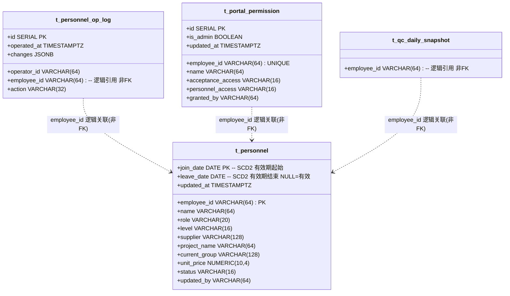
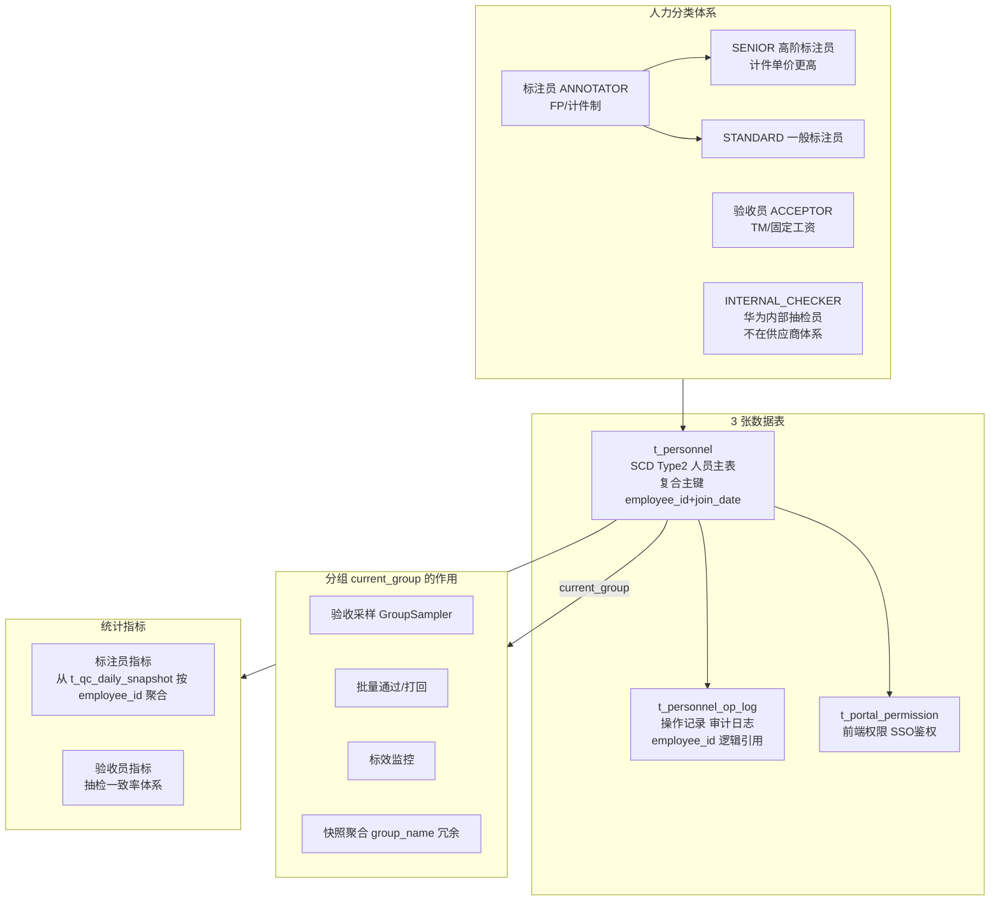

> 🔗 上位枢纽：[[人工质检-Hub]] | [[质检一站式平台人工质检模块整体架构]]

> ⚠️ 本仓库适配说明：本项目新建数据表的规范为——正式表建在 `app_gy1` 库的 `pnc_simulation` schema 下；同时在 `app_gy1` 库的 `data_common_4` schema 下建一张同名测试表。本卡中的 `t_personnel` / `t_personnel_op_log` / `t_portal_permission` 三张表实际落地以本规则为准（原卡片中的库/schema 命名仅作设计参考）。

> 🔄 V20260630_03 重设计（20260702 拍板）：架构护栏3 修订——**原：t_personnel 不做历史快照 → 新：t_personnel 采用 SCD Type2 缓慢变更维度**。复合主键 (employee_id, join_date)，去掉自增 id，join_date/leave_date 语义变更为"加入/结束当前项目/组/身份的时间"。t_personnel_op_log.personnel_id INT(外键 t_personnel.id) → employee_id VARCHAR(64) 逻辑引用（复合主键无法被单列物理引用）。

> ✅ 印证修订：补充 id / summary / manual_qa 域（黄页 line 378 已归入 manual_qa），追加数据库适配注释（任务D：含 3 张新建表）。

# 人工质检人力管理体系设计

← [[质检一站式平台人工质检模块整体架构]] | [[人工质检-Hub]] | [[质检平台-综合快照表设计]]

→ [[质检平台SSO鉴权接入方案]] | [[质检平台-人工质检前端页面与状态设计]] | [[质检平台-Repository与数据库访问设计]]

> 第二轮复核已确认：人员同一时刻不能属于多个项目，使用单值 `project_name`。见 [[质检一站式平台Phase3前架构评审]]。

---

## ① 组件概述

**一句话职责**：定义人工质检模块的人力分类体系（标注员 ANNOTATOR / 验收员 ACCEPTOR / 内部抽检员 INTERNAL_CHECKER 三轨）、3 张数据表（t_personnel SCD Type2 人员主表 + t_personnel_op_log 操作记录 + t_portal_permission 权限）、分组管理机制、统计指标体系、前端人力页签与 SSO 鉴权预留。

**在整体架构中的位置**：数据层 + 概念层。3 张表由 [[质检平台-Repository与数据库访问设计]] 的 `PersonnelRepository` 读写；`t_personnel.current_group` 为 [[质检平台-综合快照表设计]] 的 `group_name` 冗余字段来源（查当前组须 `WHERE leave_date IS NULL`）；`t_portal_permission` 为 [[质检平台SSO鉴权接入方案]] 的权限数据源；`t_personnel.employee_id` 被 `t_qc_daily_snapshot.employee_id` 逻辑引用（非物理 FK，SCD Type2 复合主键无法被单列引用）。

---

## ② 架构结构

### 物理落地文件

| 文件 | 路径 | 说明 |
|------|------|------|
| t_personnel 正式 SQL | [`data_schemas/postgresql_relational/t_personnel.sql`](../../../data_schemas/postgresql_relational/t_personnel.sql) | schema=`pnc_simulation`，13 字段 + 复合主键 (employee_id, join_date) + 4 部分索引 + DISTRIBUTE BY HASH(employee_id) |
| t_personnel 测试镜像 | [`data_schemas/postgresql_relational/t_personnel test.sql`](../../../data_schemas/postgresql_relational/t_personnel%20test.sql) | schema=`data_common_4` |
| t_personnel_op_log 正式 SQL | [`data_schemas/postgresql_relational/t_personnel_op_log.sql`](../../../data_schemas/postgresql_relational/t_personnel_op_log.sql) | schema=`pnc_simulation`，6 字段 + 4 索引 + DISTRIBUTE BY HASH(id)，employee_id 逻辑引用 |
| t_personnel_op_log 测试镜像 | [`data_schemas/postgresql_relational/t_personnel_op_log test.sql`](../../../data_schemas/postgresql_relational/t_personnel_op_log%20test.sql) | schema=`data_common_4` |
| t_portal_permission 正式 SQL | [`data_schemas/postgresql_relational/t_portal_permission.sql`](../../../data_schemas/postgresql_relational/t_portal_permission.sql) | schema=`pnc_simulation`，8 字段 + 3 索引 |
| t_portal_permission 测试镜像 | [`data_schemas/postgresql_relational/t_portal_permission test.sql`](../../../data_schemas/postgresql_relational/t_portal_permission%20test.sql) | schema=`data_common_4` |
| 初始迁移脚本 | [`data_schemas/migrations/V20260630_01__create_personnel_and_permission_tables.sql`](../../../data_schemas/migrations/V20260630_01__create_personnel_and_permission_tables.sql) | 幂等迁移，含 3 表双 schema 镜像创建 |
| 重设计迁移脚本 | [`data_schemas/migrations/V20260630_03__redesign_qc_snapshot_and_personnel.sql`](../../../data_schemas/migrations/V20260630_03__redesign_qc_snapshot_and_personnel.sql) | SCD Type2 改造：去 id、复合主键、部分索引、op_log 改 employee_id |

### 三表关系图（Mermaid classDiagram）



**关系图说明**：
- `t_personnel` 采用 **SCD Type2 缓慢变更维度**，复合主键 `(employee_id, join_date)`，同一工号可有多行（每次变更产生新行）。`join_date` 为加入当前身份的时间，`leave_date` 为结束当前身份的时间（NULL=当前有效）。
- `t_personnel_op_log.employee_id` 逻辑引用 `t_personnel.employee_id`，**非物理 FK**（复合主键无法被单列引用），由应用层保证一致性。记录人员变更动作（SCD Type2 变更的审计日志）。
- `t_portal_permission.employee_id` 与 `t_personnel.employee_id` 逻辑关联但**非外键**（权限表独立于人员表，SSO JWT sub 直接匹配 employee_id）。
- `t_qc_daily_snapshot.employee_id` 逻辑引用 `t_personnel.employee_id`（详见 [[质检平台-综合快照表设计]]）。

### 人力分类与统计流向图（Mermaid graph）



---

## ③ 数据表交互

| 表名 | 一句话用途 | SQL/设计卡链接 | 读写类型 | 关键字段 |
|------|-----------|---------------|---------|---------|
| `t_personnel` | SCD Type2 人员主表，复合主键 (employee_id, join_date)，同一工号多行 | [`data_schemas/postgresql_relational/t_personnel.sql`](../../../data_schemas/postgresql_relational/t_personnel.sql)（本卡 ⑤ 段 §2.1 完整字段说明） | 读写 | employee_id/name/role/level/supplier/project_name/current_group/unit_price/status/join_date/leave_date/updated_by/updated_at |
| `t_personnel_op_log` | 人员操作记录表（审计日志，记录 SCD Type2 变更动作） | [`data_schemas/postgresql_relational/t_personnel_op_log.sql`](../../../data_schemas/postgresql_relational/t_personnel_op_log.sql)（本卡 ⑤ 段 §2.2 完整字段说明） | 写 | id/operated_at/operator_id/employee_id/action/changes |
| `t_portal_permission` | 前端权限表（SSO 鉴权预留） | [`data_schemas/postgresql_relational/t_portal_permission.sql`](../../../data_schemas/postgresql_relational/t_portal_permission.sql)（本卡 ⑤ 段 §2.3 完整字段说明） | 读写 | id/employee_id/name/acceptance_access/personnel_access/is_admin/granted_by/updated_at |
| `t_qc_daily_snapshot` | 快照表，按 employee_id 聚合统计标效 | [`data_schemas/postgresql_relational/t_qc_daily_snapshot.sql`](../../../data_schemas/postgresql_relational/t_qc_daily_snapshot.sql) · [[质检平台-综合快照表设计]] | 读 | employee_id（逻辑引用→t_personnel.employee_id）/annotation_submitted/good_passed/good_completed/bad_passed/bad_completed/option_annotation/option_acceptance |

> **迁移脚本**：3 张表由 [`V20260630_01__create_personnel_and_permission_tables.sql`](../../../data_schemas/migrations/V20260630_01__create_personnel_and_permission_tables.sql) 初建，由 [`V20260630_03__redesign_qc_snapshot_and_personnel.sql`](../../../data_schemas/migrations/V20260630_03__redesign_qc_snapshot_and_personnel.sql) 重设计（SCD Type2 改造）。V20260630_01 须先于 V20260630_02 执行，V20260630_03 在 V20260630_02 之后执行。

---

## ④ 子模块/文件级清单

| 子模块/文件 | 一句话说明 |
|------------|-----------|
| `t_personnel` 表 | SCD Type2 人员主表，复合主键 (employee_id, join_date)，同一工号多行，承载角色/等级/供应商/项目/组别/单价/状态/有效期 |
| `t_personnel_op_log` 表 | 人员操作记录表，审计日志，记录 SCD Type2 变更动作 |
| `t_portal_permission` 表 | 前端权限表，SSO 鉴权预留，按模块等级授权 |
| `PersonnelRepository` | 读写上述 3 表的 Repository 类，详见 [[质检平台-Repository与数据库访问设计]] |
| `PersonnelRepository.create_or_transition` | 新增或变更人员（SCD Type2）：UPDATE 旧行 leave_date + INSERT 新行 + INSERT op_log（同事务） |
| `PersonnelRepository.get_current_groups` | 查当前有效人员（WHERE leave_date IS NULL），返回 {employee_id: PersonnelInfo(current_group, project_name)} |
| `PersonnelService` | 人力管理编排，人员 CRUD/调组/操作日志/未进组预警 |
| 人力管理页签 | 前端 `/manual-qc/personnel`，详见 ⑤ 段 §5 |
| SSO 鉴权中间件 | 详见 [[质检平台SSO鉴权接入方案]] |

---

## ⑤ 详细设计展开

### 1. 人力分类体系

```
人工质检人力
├── 标注员 (ANNOTATOR, FP/计件制)
│   ├── SENIOR 高阶标注员  — 计件单价更高
│   └── STANDARD 一般标注员
└── 验收员 (ACCEPTOR, TM/固定工资)
    └── (附) INTERNAL_CHECKER 华为内部员工 — 用于抽检验收员质量，不在供应商体系
```

#### 关键业务规则

| 规则 | 说明 | 执行位置 |
|------|------|---------|
| **供应商约束** | 同一任务的标注员和验收员不能来自同一供应商 | `AssignmentService.validate_supplier_conflict()` |
| **分组仅针对标注员** | 验收员不分组；INTERNAL_CHECKER 不分组 | DB 约束：`current_group` 只对 ANNOTATOR 有意义 |
| **未进组预警** | 活跃标注员 `current_group = ''` 的需要前端高亮 | `PersonnelService.get_ungrouped_annotators()` |
| **一人单项目** | `project_name VARCHAR(64)`；调项目时记录 PROJECT_CHANGE 日志 | DB 单值字段 + 普通索引 |

### 2. 数据库设计（3张表）

> ⚠️ **变更记录**：v1 设计为 7 张表（supplier/project 各独立表，group 独立表，history 表），v2 简化为 3 张表，所有属性平铺到 t_personnel，历史变更靠 t_personnel_op_log 追踪。v3（V20260630_03）t_personnel 采用 **SCD Type2 缓慢变更维度**，复合主键 (employee_id, join_date)，去掉自增 id，join_date/leave_date 语义变更为"加入/结束当前项目/组/身份的时间"，人员变更同事务 UPDATE 旧行 + INSERT 新行 + INSERT op_log。

#### 2.1 t_personnel — 人员主表（SCD Type2，复合主键 employee_id + join_date）

> 物理文件：[`data_schemas/postgresql_relational/t_personnel.sql`](../../../data_schemas/postgresql_relational/t_personnel.sql)（schema=`pnc_simulation`，测试镜像 schema=`data_common_4`，DISTRIBUTE BY HASH(employee_id)）

**SCD Type2 设计说明**：
- **复合主键**：`(employee_id, join_date)`，同一工号可有多行，每行代表该工号的一段身份有效期。
- **有效期字段**：`join_date`（加入当前项目/组/身份的时间，NOT NULL，主键一部分）、`leave_date`（结束当前项目/组/身份的时间，NULL=当前有效行）。
- **查询模式**：
  - 查现状（当前有效人员）：`WHERE leave_date IS NULL`
  - 查历史（某日人员快照）：`WHERE join_date <= 查询日 AND (leave_date IS NULL OR leave_date > 查询日)`
- **变更操作**：人员信息变更（切换组/项目/角色/工号）时，**同事务内**执行：
  1. `UPDATE` 旧行设置 `leave_date = 当前日期`（封版旧行）
  2. `INSERT` 新行（新 join_date = 当前日期，新身份字段）
  3. `INSERT` t_personnel_op_log 记录变更动作
- **工号变更特殊处理**：工号变更视为"旧人离场 + 新人入场"（旧工号行设 leave_date，新工号行 INSERT，op_log 记录工号映射关系）。

**完整字段说明**：

| #   | 字段名             | 类型            | 约束              | 默认值        | 说明                                                            |
| --- | --------------- | ------------- | --------------- | ---------- | ------------------------------------------------------------- |
| 1   | `employee_id`   | VARCHAR(64)   | NOT NULL, PK(复合) | —          | 工号（外包供应商工号 or 华为工号），与 join_date 共同构成复合主键（SCD Type2 后同一工号多行） |
| 2   | `name`          | VARCHAR(64)   | NOT NULL        | —          | 姓名                                                            |
| 3   | `role`          | VARCHAR(20)   | NOT NULL        | —          | 角色：ANNOTATOR(标注员) / ACCEPTOR(验收员) / INTERNAL_CHECKER(华为内部抽检员) |
| 4   | `level`         | VARCHAR(16)   | NOT NULL        | —          | 等级：STANDARD / SENIOR / N/A                                    |
| 5   | `supplier`      | VARCHAR(128)  | NULL            | —          | 供应商名称（INTERNAL_CHECKER 可 NULL）                                |
| 6   | `project_name`  | VARCHAR(64)   | NOT NULL        | —          | 当前所属的唯一项目（单值，架构护栏1：禁 TEXT[] 数组）                               |
| 7   | `current_group` | VARCHAR(128)  | NOT NULL        | `''`       | 当前所在组名（标注员有效，空串=未进组；验收员/INTERNAL_CHECKER 不分组）                 |
| 8   | `unit_price`    | NUMERIC(10,4) | NULL            | —          | 计件单价（仅 ANNOTATOR 有效）                                          |
| 9   | `status`        | VARCHAR(16)   | NOT NULL        | `'ACTIVE'` | 人员状态：ACTIVE / INACTIVE / LEAVE                                |
| 10  | `join_date`     | DATE          | NOT NULL, PK(复合) | —          | SCD Type2 有效期起始：加入当前项目/组/身份的时间（主键一部分，必须非空）                     |
| 11  | `leave_date`    | DATE          | NULL            | —          | SCD Type2 有效期结束：结束当前项目/组/身份的时间（NULL=当前有效行）                    |
| 12  | `updated_by`    | VARCHAR(64)   | NULL            | —          | 最后修改人工号                                                       |
| 13  | `updated_at`    | TIMESTAMPTZ   | NOT NULL        | now()      | 最后修改时间（禁 TRIGGER，由应用层写入或 DEFAULT now()）                       |

> 注：v2 的 `id SERIAL PRIMARY KEY` 已在 V20260630_03 中移除；`employee_id UNIQUE` 约束已移除（SCD Type2 后同一工号多行）。

**索引设计说明**（物理文件，4 个部分索引，均 `WHERE leave_date IS NULL`，仅索引当前有效行）：

| 索引名 | 索引定义 | 用途 |
|--------|---------|------|
| `idx_t_personnel_project_name` | `(project_name) WHERE leave_date IS NULL` | 按项目筛选当前有效人员（单值普通索引，架构护栏1） |
| `idx_t_personnel_current_group` | `(current_group) WHERE leave_date IS NULL` | 按组筛选当前有效成员、未进组预警查询 |
| `idx_t_personnel_status_role` | `(status, role) WHERE leave_date IS NULL` | 按状态+角色筛选当前有效活跃标注员/验收员 |
| `idx_t_personnel_active` | `(employee_id) WHERE leave_date IS NULL` | 按工号查当前有效行（新增，快照刷新用） |

**典型查询**：

```sql
-- 查某项目下所有活跃标注员（含组信息）—— 必须加 WHERE leave_date IS NULL
SELECT * FROM t_personnel
WHERE status = 'ACTIVE' AND role = 'ANNOTATOR'
AND project_name = 'E2E_URBAN' AND leave_date IS NULL;

-- 查某组的所有成员 —— 必须加 WHERE leave_date IS NULL
SELECT * FROM t_personnel
WHERE current_group = '城区A组' AND role = 'ANNOTATOR' AND status = 'ACTIVE'
AND leave_date IS NULL;

-- 查未进组的活跃标注员（预警）—— 必须加 WHERE leave_date IS NULL
SELECT * FROM t_personnel
WHERE role = 'ANNOTATOR' AND status = 'ACTIVE' AND current_group = ''
AND leave_date IS NULL;

-- 查某工号的当前有效行（快照刷新用）
SELECT employee_id, current_group, project_name FROM t_personnel
WHERE employee_id = %s AND leave_date IS NULL;

-- 查某日的人员历史快照
SELECT * FROM t_personnel
WHERE employee_id = %s AND join_date <= '2026-06-15'
AND (leave_date IS NULL OR leave_date > '2026-06-15');
```

#### 2.2 t_personnel_op_log — 操作记录表

> 物理文件：[`data_schemas/postgresql_relational/t_personnel_op_log.sql`](../../../data_schemas/postgresql_relational/t_personnel_op_log.sql)（schema=`pnc_simulation`，测试镜像 schema=`data_common_4`）

**完整字段说明**：

| # | 字段名 | 类型 | 约束 | 默认值 | 说明 |
|---|--------|------|------|--------|------|
| 1 | `id` | SERIAL | PRIMARY KEY | — | 主键自增ID（分布键） |
| 2 | `operated_at` | TIMESTAMPTZ | NOT NULL | now() | 操作时间（禁 TRIGGER，由应用层写入或 DEFAULT now()） |
| 3 | `operator_id` | VARCHAR(64) | NOT NULL | — | 操作人工号 |
| 4 | `employee_id` | VARCHAR(64) | NOT NULL | — | 被操作人员工号，逻辑引用 t_personnel.employee_id（非物理 FK） |
| 5 | `action` | VARCHAR(32) | NOT NULL | — | 操作类型：ADD / UPDATE / DEACTIVATE / GROUP_CHANGE / PROJECT_CHANGE / REACTIVATE |
| 6 | `changes` | JSONB | NULL | — | 变更明细 JSONB：`{"field_name": {"old": "城区A组", "new": "城区B组"}}` |

> 注：v2 的 `personnel_id INT REFERENCES t_personnel(id)` 已在 V20260630_03 中改为 `employee_id VARCHAR(64)` 逻辑引用（SCD Type2 复合主键无法被单列物理引用）。

**索引设计说明**（物理文件，4 个索引）：

| 索引名 | 索引定义 | 用途 |
|--------|---------|------|
| `idx_t_personnel_op_log_employee_id` | `(employee_id)` | 按被操作人员工号查变更历史（原 personnel_id 改名） |
| `idx_t_personnel_op_log_operator_id` | `(operator_id)` | 按操作人查操作记录（审计） |
| `idx_t_personnel_op_log_action` | `(action)` | 按操作类型筛选（如所有 GROUP_CHANGE） |
| `idx_t_personnel_op_log_operated_at` | `(operated_at DESC)` | 按时间倒序查最近操作 |

**用途**：
- 谁把哪个标注员从 A 组改到 B 组，什么时候操作的
- 离职操作、单价变更等敏感操作的审计
- **SCD Type2 变更审计**：记录每次 UPDATE 旧行 + INSERT 新行的变更动作；如需历史状态重建，结合 t_personnel 的 SCD Type2 有效期 + op_log 按时间顺序回放

#### 2.3 t_portal_permission — 前端权限表（SSO 鉴权预留）

> 物理文件：[`data_schemas/postgresql_relational/t_portal_permission.sql`](../../../data_schemas/postgresql_relational/t_portal_permission.sql)（schema=`pnc_simulation`，测试镜像 schema=`data_common_4`）

**完整字段说明**：

| # | 字段名 | 类型 | 约束 | 默认值 | 说明 |
|---|--------|------|------|--------|------|
| 1 | `id` | SERIAL | PRIMARY KEY | — | 主键自增ID |
| 2 | `employee_id` | VARCHAR(64) | NOT NULL UNIQUE | — | 工号，来自 SSO JWT sub 字段，唯一 |
| 3 | `name` | VARCHAR(64) | NOT NULL | — | 冗余姓名 |
| 4 | `acceptance_access` | VARCHAR(16) | NOT NULL | `'NONE'` | 验收模块权限等级：NONE / VIEW / OPERATE / EXECUTE（架构护栏6：按模块等级，禁每按钮 Boolean） |
| 5 | `personnel_access` | VARCHAR(16) | NOT NULL | `'NONE'` | 人力管理模块权限等级：NONE / VIEW / MANAGE（架构护栏6：按模块等级，禁每按钮 Boolean） |
| 6 | `is_admin` | BOOLEAN | NOT NULL | FALSE | 超级管理员：TRUE 时所有权限直接放行，后端短路判断 |
| 7 | `granted_by` | VARCHAR(64) | NULL | — | 授权人工号 |
| 8 | `updated_at` | TIMESTAMPTZ | NOT NULL | now() | 最后修改时间（禁 TRIGGER，由应用层写入或 DEFAULT now()） |

**索引设计说明**（物理文件 L45-47）：

| 索引名 | 索引定义 | 用途 |
|--------|---------|------|
| `idx_t_portal_permission_is_admin` | `(is_admin)` | 快速筛选超级管理员列表 |
| `idx_t_portal_permission_acceptance` | `(acceptance_access)` | 按验收模块权限等级筛选用户 |
| `idx_t_portal_permission_personnel` | `(personnel_access)` | 按人力模块权限等级筛选用户 |

**扩展方式**：模块内新增功能映射到既有等级，无需改表；只有出现新的独立业务模块时才新增一个模块权限列。后端必须校验权限，前端隐藏按钮只用于改善交互，不能作为安全边界。

### 3. 分组（current_group）的作用

分组是标注员维度的核心管理手段，`t_personnel.current_group` 是当前组名（直接字段，非 FK）：

| 使用场景 | 说明 |
|---------|------|
| 验收采样 | `GroupSampler` 按组采样，每组 min(人数×90, 300) 条 |
| 批量通过/打回 | 以组为最小执行单位，一次操作覆盖一组所有人 |
| 标效监控 | 按组 GROUP BY 统计效率，与按人统计互补 |
| 快照聚合 | `t_qc_daily_snapshot.group_name` 冗余自 `t_personnel.current_group` |

> ⚠️ 护栏：执行 GroupSampler 之前，必须先检查 `current_group = ''` 的标注员数量，有未进组成员时应给前端提示，而不是直接 skip。

### 4. 统计指标体系

> 标注员和验收员的统计不在 `t_personnel` 表中存储，而是通过 `t_qc_daily_snapshot` 按不同维度聚合查询实现（详见 [[质检平台-综合快照表设计]]）。

#### 4.1 标注员指标

从 `t_qc_daily_snapshot` 按 `employee_id` 聚合：

| 指标       | 计算方式                                                           | 说明           |
| -------- | -------------------------------------------------------------- | ------------ |
| 总提交量     | `SUM(annotation_submitted)`                                    | 基础标效         |
| 标效（件/天）  | 总提交量 / 工作天数                                                    | 效率指标         |
| 整体通过率    | `SUM(good_passed + bad_passed) / SUM(acceptance_completed)`    | 质量核心指标       |
| Good 通过率 | `SUM(good_passed) / SUM(good_completed)`                       | 分母用 completed |
| Bad 通过率  | `SUM(bad_passed) / SUM(bad_completed)`                         | 分母用 completed |
| 各选项分布    | `option_annotation` JSONB 聚合                                   | 标注风格（是否偏好 A） |
| 各选项通过率   | `option_acceptance[x].passed / option_acceptance[x].completed` | 哪些类别掌握不好     |
| 任务内排名    | 与其他标注员对比通过率排名                                                  | 激励/惩罚依据      |

**风格标签（StyleTag）计算规则示例**（在 `StatService` 中计算，不存 DB）：

```python
tags = []
option_dist = snapshot.option_annotation
total = sum(option_dist.values())
if option_dist.get("A", 0) / total > 0.85:
    tags.append("option_A_bias")         # 偏好标 Good
if option_acceptance.get("B", {}).get("pass_rate", 1) < 0.6:
    tags.append("bad_B_weak")            # B 类 Bad 掌握不好
```

#### 4.2 验收员指标（抽检一致率体系）

验收员的质量代理指标 = **抽检一致率**（华为内部员工定期抽检验收结果）：
- 一致率 = 抽检中"验收员判断与抽检员判断一致"的比例
- 其他维度指标同标注员（Good/Bad/各选项分层，计算方式相同）

### 5. 前端人力管理页签设计

```
人工质检
└── 人力管理  /manual-qc/personnel
    ├── 概览页     — 人力分布饼图、项目配比、⚠️ 未进组预警横幅
    ├── 标注员页   — 标注员列表（含过滤）+ 点击展开个人画像
    ├── 验收员页   — 验收员列表 + 抽检统计
    └── 分组管理页 — 组列表、查看组员、调整组别、批量移组
```

#### 概览页示例布局

```
[供应商A: 48人] [供应商B: 32人]        （人力来源饼图）
城区高速: 标注员56人 | 验收员8人
VPD:      标注员24人 | 验收员4人

⚠️ 3人未分配到组：[张三] [李四] [王五]  → [前往分组管理]
```

#### 标注员画像示例

```
张三 | 城区A组 | 城区高速 | STANDARD | 供应商A

统计: [2026-06-01] ~ [2026-06-28]   任务: [城区高速_batch03 ▾]

[提交: 1208] [通过: 1142(94.5%)] [打回: 66] [标效: 43件/天]

选项分布饼    选项通过率柱    题型通过率雷达
A: 76%        A: 97%          驾驶行为: 94%
B: 15%        B: 80%          时间段:   88%
C: 6%         C: 73%          目标场景: 96%

风格标签: 🏷 Good偏重  🏷 D类掌握不好   任务内排名: 12/56 (78th)
```

### 6. SSO 鉴权接入设计

> 详见 [[质检平台SSO鉴权接入方案]]。真实公司 SSO 参数仍待提供，模块权限和 mock 接入方案已冻结。

简要流程：
1. 用户访问平台 → 跳转公司 SSO 登录页
2. 用户输入工号+密码 → SSO 颁发 JWT Token（含工号 sub 字段）
3. 前端存储 Token → 后续请求 Header: `Authorization: Bearer <token>`
4. 后端中间件验证 JWT 签名 → 提取工号 → 查 `t_portal_permission`
5. `is_admin=TRUE` → 直接放行；其他 → 按 `acceptance_access` / `personnel_access` 的模块等级判断权限

**当前阶段**：鉴权中间件预留骨架（`src/api/auth.py`），不接入真实 SSO，开发阶段用固定工号 mock。

---

## ⑥ 完成情况与 TODO

**当前状态**：3 张表 DDL 已重设计落地（V20260630_03 SCD Type2 改造，正式表 + 测试镜像 + 迁移脚本三件套）；人力分类体系、分组机制、统计指标、前端页签、SSO 鉴权预留均已冻结。

**TODO 清单**：
- [x] 人力分类体系冻结（ANNOTATOR / ACCEPTOR / INTERNAL_CHECKER 三轨）
- [x] 3 张表结构设计冻结（t_personnel 13 字段 SCD Type2 / t_personnel_op_log 6 字段 / t_portal_permission 8 字段）
- [x] t_personnel SCD Type2 改造（去 id，复合主键 (employee_id, join_date)，部分索引 WHERE leave_date IS NULL）
- [x] t_personnel 正式建表 SQL 落地（[`t_personnel.sql`](../../../data_schemas/postgresql_relational/t_personnel.sql)）
- [x] t_personnel 测试镜像 SQL 落地（[`t_personnel test.sql`](../../../data_schemas/postgresql_relational/t_personnel%20test.sql)）
- [x] t_personnel_op_log 正式建表 SQL 落地（[`t_personnel_op_log.sql`](../../../data_schemas/postgresql_relational/t_personnel_op_log.sql)）
- [x] t_personnel_op_log 测试镜像 SQL 落地（[`t_personnel_op_log test.sql`](../../../data_schemas/postgresql_relational/t_personnel_op_log%20test.sql)）
- [x] t_portal_permission 正式建表 SQL 落地（[`t_portal_permission.sql`](../../../data_schemas/postgresql_relational/t_portal_permission.sql)）
- [x] t_portal_permission 测试镜像 SQL 落地（[`t_portal_permission test.sql`](../../../data_schemas/postgresql_relational/t_portal_permission%20test.sql)）
- [x] 初始迁移脚本落地（[`V20260630_01`](../../../data_schemas/migrations/V20260630_01__create_personnel_and_permission_tables.sql)）
- [x] 重设计迁移脚本落地（[`V20260630_03__redesign_qc_snapshot_and_personnel.sql`](../../../data_schemas/migrations/V20260630_03__redesign_qc_snapshot_and_personnel.sql)）
- [x] 索引设计落地（t_personnel 4 部分索引 / t_personnel_op_log 4 索引 / t_portal_permission 3 索引）
- [x] 分组机制与统计指标体系冻结
- [x] 前端人力页签设计冻结
- [x] SSO 鉴权预留设计冻结
- [x] 架构护栏3 修订（原：不做历史快照 → 新：SCD Type2）
- [ ] `PersonnelRepository.create_or_transition` 物理实现（SCD Type2 变更：UPDATE + INSERT + INSERT op_log 同事务）
- [ ] `PersonnelService` 物理实现（人员 CRUD/调组/操作日志/未进组预警）
- [ ] SCD Type2 变更 + op_log 同事务的事务 context 设计
- [ ] 真实公司 SSO 参数接入（[待人类补充]）
- [ ] INTERNAL_CHECKER 抽检一致率计算逻辑实现（[待人类补充]）

---

## ⑦ 归属

← [[质检一站式平台人工质检模块整体架构]]

> 🔗 上位枢纽：[[人工质检-Hub]] | [[质检一站式平台人工质检模块整体架构]]
