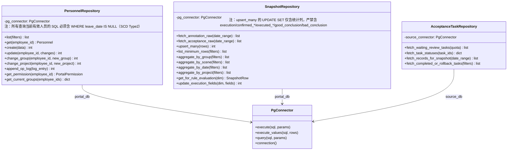
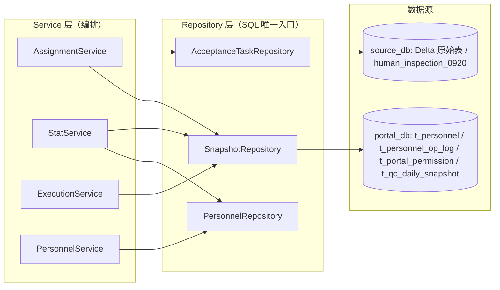

> ✅ 印证修订：domain 由原始 `["ai_dlc","tooling"]` 改为本仓库 TAXONOMY 合法值 `["manual_qa"]`。

# 质检平台 Repository 与数据库访问设计

← 总入口：[[质检一站式平台人工质检模块整体架构]]。上层边界：[[质检平台-后端分层与组件边界设计]]。数据模型：[[质检平台-综合快照表设计]]、[[人工质检-人力管理体系设计]]。

---

## ① 组件概述

**一句话职责**：作为人工质检模块的共享数据访问层，将所有 SQL 集中在按数据源/表族拆分的多个 Repository 类中，向上为 Service 层提供参数化查询与行映射，向下复用公共连接器管理连接池，杜绝 SQL 散落到 Model/Service 层。

**在整体架构中的位置**：Repository 层（数据层）。位于 `Router → Service → Sampler/Rule → Repository → src/database` 依赖链的最末端，是唯一允许编写 SQL 的组件，承接 `t_qc_daily_snapshot` / `t_personnel` / `t_personnel_op_log` / `t_portal_permission` 等本地表的读写，以及 Delta 原始表的只读聚合查询。

---

## ② 架构结构

### 目录与文件结构

```text
src/manual_qc/
├── repository.py            # 共享 Repository 文件（含 3 个内聚类，本卡核心）
├── delta_client.py          # Delta 外部写接口（非 Repository 职责）
├── acceptance/
│   ├── models.py            # 仅稳定复用结构（dataclass/NamedTuple）
│   ├── sampler.py           # 纯规则：输入计数输出配额
│   ├── pass_rules.py        # 纯规则：输入指标输出决定
│   └── services/
│       ├── assignment_service.py
│       ├── stat_service.py
│       └── execution_service.py
└── personnel/
    ├── models.py
    └── services/personnel_service.py
```

> 当前 `src/manual_qc/repository.py` 为计划新建文件；现有公共数据库连接器位于 `src/database/`，命名以 [[src_database_数据库连接器模块]]、[[PostgreSQL数据库公共模块]] 为准。

### Repository 类图（Mermaid classDiagram）



**类图说明**：
- 三个 Repository 类按物理数据源和表族拆分，**不共用同一个万能类**。
- `PersonnelRepository` 操作 `t_personnel` / `t_personnel_op_log` / `t_portal_permission`，承担人员 CRUD、调组、操作日志、权限查询。
- `SnapshotRepository` 操作 `t_qc_daily_snapshot`，承担 UPSERT 刷新、聚合查询、结论与执行字段更新。
- `AcceptanceTaskRepository` 操作 Delta 侧任务级表（`human_inspection_0920` 等中间表/Delta 查询表），承担 task_ids 查询与状态回查。
- 每个类通过构造函数接收命名 `PgConnector`，不自行创建连接池；`batch_assign` / `task_rollback` 等外部写接口属于 [[质检平台-Delta调用与状态回查设计]] 的 DeltaClient，不在 Repository 职责内。

### 数据流图（Mermaid flowchart）



**数据流说明**：Service 层不直接接触数据库，所有读写经 Repository 转发。`portal_db` 与 `source_db` 可能为不同 PostgreSQL 实例，由 `DatabaseManager.postgres(name)` 按命名连接区分；DSN 与库名只放配置，不写死在业务类。

---

## ③ 数据表交互

| 表名 | 一句话用途 | SQL/设计卡链接 | 读写类型 | 关键字段 |
|------|-----------|---------------|---------|---------|
| `t_qc_daily_snapshot` | 综合日常快照表，统计底座+采样依据+执行结论同行 | [`data_schemas/postgresql_relational/t_qc_daily_snapshot.sql`](../../../data_schemas/postgresql_relational/t_qc_daily_snapshot.sql) · [[质检平台-综合快照表设计]] | 读写 | 全部字段：维度键（stat_date/scene_name/group_name/employee_id）、project_name、统计列（annotation_*/option_annotation/acceptance_*/good_*/bad_*/option_acceptance）、执行字段（execution/confirmed_*/executed_*/good_conclusion/bad_conclusion）、维护字段（computed_at/updated_at） |
| `t_personnel` | 人员主表，SCD Type2 历史快照（复合主键 employee_id+join_date） | [`data_schemas/postgresql_relational/t_personnel.sql`](../../../data_schemas/postgresql_relational/t_personnel.sql) · [[人工质检-人力管理体系设计]] §2.1 | 读写 | employee_id/name/role/level/supplier/project_name/current_group/unit_price/status/join_date/leave_date/updated_by/updated_at（无自增 id） |
| `t_personnel_op_log` | 人员操作记录表（审计日志） | [`data_schemas/postgresql_relational/t_personnel_op_log.sql`](../../../data_schemas/postgresql_relational/t_personnel_op_log.sql) · [[人工质检-人力管理体系设计]] §2.2 | 写 | id/operated_at/operator_id/employee_id/action/changes（employee_id 逻辑引用 t_personnel.employee_id，非物理 FK） |
| `t_portal_permission` | 前端权限表（SSO 鉴权预留） | [`data_schemas/postgresql_relational/t_portal_permission.sql`](../../../data_schemas/postgresql_relational/t_portal_permission.sql) · [[人工质检-人力管理体系设计]] §2.3 | 读 | id/employee_id/name/acceptance_access/personnel_access/is_admin/granted_by/updated_at |
| `human_inspection_0920` | Delta 侧任务级中间表（外部表，无本仓库 SQL） | [[质检平台-Delta调用与状态回查设计]] | 读 | task_id/task_status/task_screener/task_acceptor 等 |
| Delta 原始表 `ods_t_label_screening_task_datalake` / `ods_t_label_sdobject_datalake_new` | Delta ODS 层原始任务表/标注 GT 表 | [[质检平台-综合快照表设计]] §9 | 读 | task_name/task_screener/task_reviewer/task_status/del_flag/behavior_status 等 |

> **迁移脚本**：`t_personnel` / `t_personnel_op_log` / `t_portal_permission` 三表由 [`data_schemas/migrations/V20260630_01__create_personnel_and_permission_tables.sql`](../../../data_schemas/migrations/V20260630_01__create_personnel_and_permission_tables.sql) 创建；`t_qc_daily_snapshot` 由 [`data_schemas/migrations/V20260630_02__create_qc_daily_snapshot_table.sql`](../../../data_schemas/migrations/V20260630_02__create_qc_daily_snapshot_table.sql) 创建（依赖前者先执行）；V20260630_03 为重设计迁移（SCD Type2 改造 + 快照表字段重构，幂等）。

---

## ④ 子模块/类级清单

| 子模块/类 | 一句话说明 |
|-----------|-----------|
| `PersonnelRepository` | 人员/操作日志/权限三表的 CRUD 与查询入口，操作 `portal_db` |
| `PersonnelRepository.list/get` | 按过滤条件列表/单条查询人员 |
| `PersonnelRepository.create/update` | 新增/更新人员属性（与 op_log 同事务） |
| `PersonnelRepository.change_group/change_project` | 调组/调项目专用方法，内部追加 GROUP_CHANGE/PROJECT_CHANGE 日志 |
| `PersonnelRepository.append_op_log` | 写操作记录，与人员变更同事务提交 |
| `PersonnelRepository.get_permission` | 按 employee_id 查权限等级（SSO 鉴权用） |
| `PersonnelRepository.get_current_groups` | 批量查 employee_id → (current_group, project_name) 映射（快照刷新用，SQL 必须含 `WHERE leave_date IS NULL`，SCD Type2 当前有效行） |
| `SnapshotRepository` | 快照表的 UPSERT 刷新、聚合查询、结论/执行字段更新入口，操作 `portal_db` |
| `SnapshotRepository.fetch_annotation_raw/fetch_acceptance_raw` | 从 Delta 原始表聚合标注进度/验收结果原始行 |
| `SnapshotRepository.upsert_many` | 批量 UPSERT 快照行（仅统计列含 project_name/option_annotation/good_completed/bad_completed/acceptance_completed，禁触碰 execution/confirmed_*/executed_*/good_conclusion/bad_conclusion） |
| `SnapshotRepository.list_minimum_rows` | 列出个人最小行 |
| `SnapshotRepository.aggregate_by_group/scene/date/project` | 按组/场景/日期/项目聚合查询 |
| `SnapshotRepository.get_for_rule_evaluation` | 取单行供 PassRule 评估 |
| `SnapshotRepository.update_execution_fields` | 更新 execution/confirmed_*/executed_*/good_conclusion/bad_conclusion 字段 |
| `AcceptanceTaskRepository` | Delta 侧任务级表的只读查询入口，操作 `source_db` |
| `AcceptanceTaskRepository.fetch_waiting_review_tasks` | 按配额查询待验收 task_ids |
| `AcceptanceTaskRepository.fetch_task_statuses` | 批量查任务状态（回查用） |
| `AcceptanceTaskRepository.fetch_records_for_snapshot` | 取任务级记录供快照聚合 |
| `AcceptanceTaskRepository.fetch_completed_or_rollback_tasks` | 查已完成/已打回任务 |

---

## ⑤ 详细设计展开

### 1. 为什么 Repository 上移到 manual_qc

人工质检的验收、人力、统计和后续预警会重复访问人员、快照和任务级中间表。若每个子组件各写一套 SQL，会出现查询口径和字段映射漂移。

因此保留一个 `src/manual_qc/repository.py` 作为共享入口，但"共享文件"不等于"一个万能类"：按物理数据源和表族拆成多个内聚类。

### 2. 类边界

```text
PersonnelRepository
  ├── list/get/create/update
  ├── change_group/change_project
  ├── append_op_log
  └── get_permission

SnapshotRepository
  ├── upsert_many
  ├── list_minimum_rows
  ├── aggregate_by_group/scene/date/project
  ├── get_for_rule_evaluation
  └── update_execution_fields

AcceptanceTaskRepository
  ├── fetch_waiting_review_tasks
  ├── fetch_task_statuses
  ├── fetch_records_for_snapshot
  └── fetch_completed_or_rollback_tasks
```

Repository 不包含 `batch_assign`、`task_rollback` 等外部写接口；它们属于 [[质检平台-Delta调用与状态回查设计]] 中的 DeltaClient。

### 3. 公共数据库能力复用

- 连接配置由 `src/config` 读取。
- 连接池由 `DatabaseManager` 和 `PostgresConnector` 创建。
- Repository 构造函数接收指定 connector，不调用 `psycopg2.connect()`。
- 参数化 SQL 防止字符串拼接注入。
- 查询结果在 Repository 边界映射成当前用例所需结构，不把游标对象泄漏给 Service。

> 📎 补充参考：[[PostgreSQL数据库公共模块]]、[[src_database_数据库连接器模块]] 包含本仓库现有公共数据库连接器实现，与本卡描述的 `DatabaseManager`/`PostgresConnector` 命名可能不一致，请人类判断实际 API 边界。

### 4. 数据库与连接选择

本地门户表和上游任务查询表可能不在同一 PostgreSQL 实例。Repository 每个类显式持有对应命名 connector：

```text
portal_db  → t_personnel / t_portal_permission / t_qc_daily_snapshot
source_db  → human_inspection_0920 / Delta 查询表
```

`DatabaseManager.postgres(name)` 已支持命名连接。数据库名称和 DSN 只放配置，不写死在业务类。

### 5. 事务边界

当前 `PostgresConnector.execute()` 对单条写语句提交/回滚。以下本地操作需要同一连接事务：

- 修改人员属性 + 写 `t_personnel_op_log`；
- 批量 UPSERT 同一轮快照；
- 更新结论、确认人和确认时间。

Phase 3 若需要多语句原子写，应给公共连接器增加显式 transaction context，或让 Repository 在一次 `connection()` 中统一 commit/rollback。不要在 Service 中散落 `conn.commit()`。

Delta 调用不能加入本地数据库事务，采用 [[质检平台-Delta调用与状态回查设计]] 的状态回查闭环。

### 6. 快照查询口径

物理表只存个人最小行。Repository 提供不同聚合查询，但所有口径都从同一最小行出发：

```sql
-- 示例：按组汇总
SELECT stat_date, scene_name, group_name,
       SUM(annotation_submitted) AS annotation_submitted,
       SUM(acceptance_allocated) AS acceptance_allocated
FROM t_qc_daily_snapshot
WHERE stat_date BETWEEN %s AND %s
GROUP BY stat_date, scene_name, group_name;
```

通过率必须"先求和再相除"，不能平均各行百分比。

### 7. UPSERT 与约束

联合键为 `(stat_date, scene_name, group_name, employee_id)`（V20260630_03 重设计：annotator_id INT 改为 employee_id VARCHAR(64) 逻辑引用 t_personnel.employee_id，非物理 FK）。同一轮刷新只更新统计列和 `computed_at/updated_at`，不得误清空已确认的执行字段（execution/confirmed_*/executed_*/good_conclusion/bad_conclusion）。

实现时应明确列清单，不使用无差别 `SET row = EXCLUDED.row`。计数约束由 DDL 兜底，Service/Repository 仍需在写入前报告负数或大小关系异常，便于定位上游数据问题。

UPSERT SQL 模板（来自 [[验收前置条件-快照刷新四级实现契约]] Task 3）：

```sql
INSERT INTO t_qc_daily_snapshot (stat_date, scene_name, group_name, employee_id, project_name,
    annotation_total, annotation_submitted, option_annotation,
    acceptance_allocated, acceptance_completed,
    good_allocated, good_completed, good_passed,
    bad_allocated, bad_completed, bad_passed, option_acceptance,
    computed_at, updated_at)
VALUES %s
ON CONFLICT (stat_date, scene_name, group_name, employee_id)
DO UPDATE SET
    annotation_total=EXCLUDED.annotation_total,
    annotation_submitted=EXCLUDED.annotation_submitted,
    project_name=EXCLUDED.project_name,
    option_annotation=EXCLUDED.option_annotation,
    acceptance_allocated=EXCLUDED.acceptance_allocated,
    acceptance_completed=EXCLUDED.acceptance_completed,
    good_allocated=EXCLUDED.good_allocated,
    good_completed=EXCLUDED.good_completed,
    good_passed=EXCLUDED.good_passed,
    bad_allocated=EXCLUDED.bad_allocated,
    bad_completed=EXCLUDED.bad_completed,
    bad_passed=EXCLUDED.bad_passed,
    option_acceptance=EXCLUDED.option_acceptance,
    computed_at=now(),
    updated_at=now();
-- ⚠️ UPDATE SET 严禁出现 execution/confirmed_*/executed_*/good_conclusion/bad_conclusion 等执行字段
```

### 8. 分页与批量

- 人员和快照列表使用 `LIMIT/OFFSET` 起步；数据量证明需要时再升级 cursor。
- task_ids 查询遵守 Delta 单批限制；限制值 `[待人类补充]`。
- 大批 UPSERT 使用 `execute_values` 或分批参数化写入，批大小通过配置控制。
- 不在 API 请求中无上限加载整个历史快照表。

### 9. 测试要求

- 使用临时 PostgreSQL 执行 migration 和 Repository 集成测试。
- 覆盖唯一键 UPSERT、不合法计数、人员修改与日志同事务、组级聚合不重复计数。
- fake Repository 只用于 Service 单测，不能替代真实 SQL 集成验证。

> ⚠️ 本仓库适配说明：本项目新建数据表的规范为——正式表建在 `app_gy1` 库的 `pnc_simulation` schema 下；同时在 `app_gy1` 库的 `data_common_4` schema 下建一张同名测试表。本卡描述的 `portal_db`/`source_db` 命名连接及 `t_qc_daily_snapshot` 等表归属仅作设计参考，实际落地库/schema 以本规则为准。

> 🔄 关联新梳理（20260629）：本卡描述的 Repository 边界原则已在 [[验收前置条件-快照刷新四级实现契约]] Task 3 中具化为 `SnapshotRepository` + `PersonnelRepository` 的类与函数级接口签名、UPSERT SQL 模板、实现约束。旧版5大架构问题（SQL散落Model层/exec_query既查又写/临时表重复/双连接器混乱/f-string注入）及规避策略详见 [[PF-旧版验收代码架构问题与改进策略]]。

---

## ⑥ 完成情况与 TODO

**当前状态**：设计中。Repository 类边界、连接选择、事务边界、UPSERT 约束均已冻结；`src/manual_qc/repository.py` 物理文件待 Phase 3 落地。关联的 4 张表 DDL 与迁移脚本已落地（V20260630_01/02/03，见 ③ 段链接）。

**TODO 清单**：
- [x] Repository 类边界冻结（PersonnelRepository / SnapshotRepository / AcceptanceTaskRepository 三类）
- [x] 数据表交互清单确定（4 张新表 + Delta 原始表 + 中间表）
- [x] UPSERT SQL 模板确定（仅统计列含 project_name/option_annotation/good_completed/bad_completed/acceptance_completed，禁触碰 execution/confirmed_*/executed_*/good_conclusion/bad_conclusion）
- [x] 4 张表 DDL 落地（t_personnel SCD Type2 / t_personnel_op_log employee_id 逻辑引用 / t_portal_permission / t_qc_daily_snapshot 26 字段 + 7 索引）
- [x] V20260630_03 重设计迁移落地（SCD Type2 改造 + 快照表字段重构，幂等）
- [x] SnapshotRepository 接口签名更新（employee_id 替代 annotator_id，新增 aggregate_by_project）
- [x] PersonnelRepository.get_current_groups SCD Type2 查询约束（WHERE leave_date IS NULL）
- [ ] `src/manual_qc/repository.py` 物理文件实现
- [ ] 公共连接器 `DatabaseManager` / `PostgresConnector` 实际 API 边界核对（[[src_database_数据库连接器模块]]）
- [ ] `execute_values` 写操作路径核对（禁用 `execute_query` 执行写操作）
- [ ] task_ids 查询的 Delta 单批限制值 `[待人类补充]`
- [ ] 多语句原子写的事务 context 设计（人员变更 + op_log 同事务）
- [ ] Repository 集成测试（临时 PostgreSQL + migration + 唯一键 UPSERT + 不合法计数 + 同事务 + 组级聚合 + SCD Type2 leave_date IS NULL 验证）

---

## ⑦ 归属

← [[质检一站式平台人工质检模块整体架构]]

> 🔗 上位枢纽：[[质检一站式平台人工质检模块整体架构]]
> 🔗 具化实现契约：[[验收前置条件-快照刷新四级实现契约]]
> 🔗 旧版避坑：[[PF-旧版验收代码架构问题与改进策略]]
