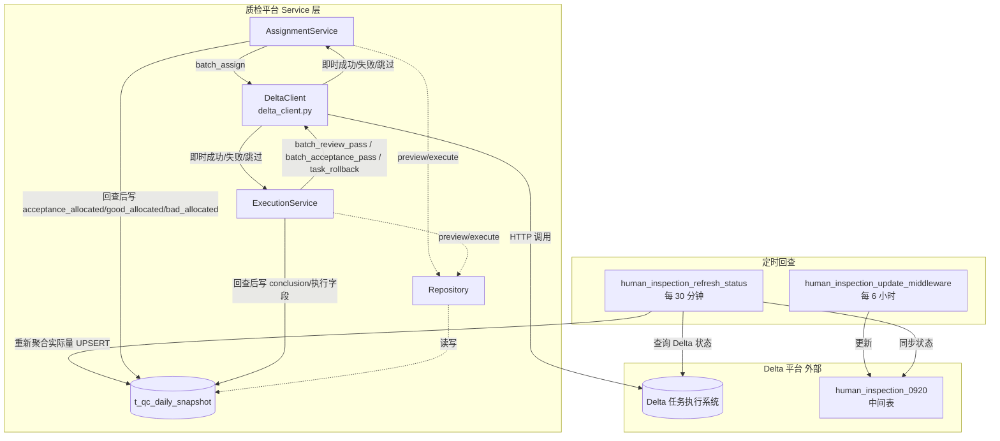
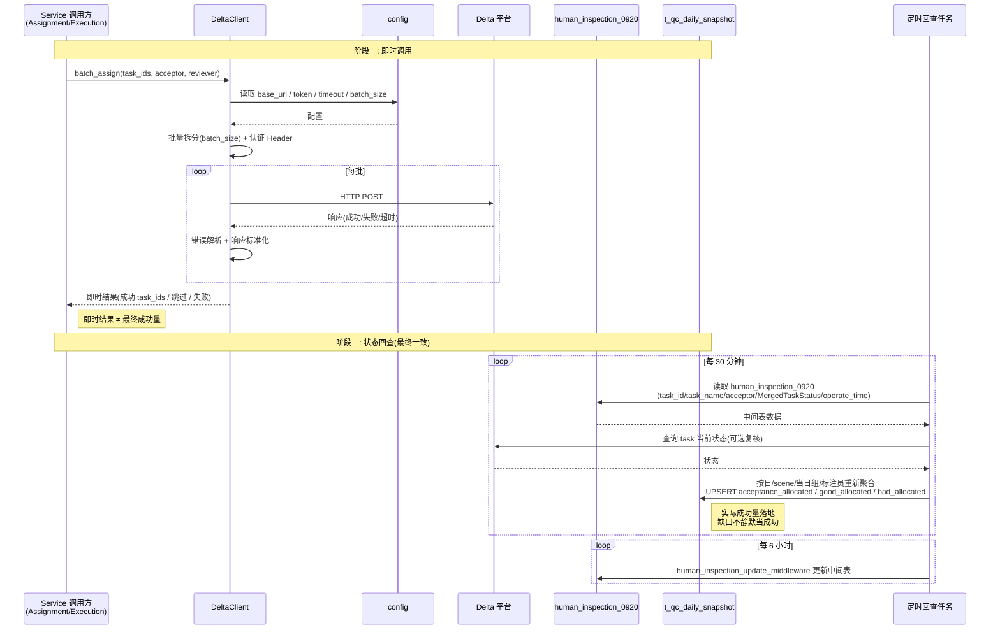

> ✅ 印证修订：domain 由原始 `["ai_dlc","tooling","agent_evaluation"]` 改为本仓库 TAXONOMY 合法值 `["manual_qa"]`。

# 质检平台 Delta 调用与状态回查设计

← 总入口：[[质检一站式平台人工质检模块整体架构]]。现状证据：[[人工质检-⑧验收分配]]、[[人工质检-⑨批量通过打回]]、[[人工质检-⑩状态刷新与GT回写]]、[[人工质检-⑪中间表更新]]。

## ① 组件概述

Delta 调用与状态回查组件负责封装 Delta 任务执行系统的接口调用与最终状态一致性的回查刷新，位于质检平台整体架构的 **Service 层（外部边界）**，由 [[质检平台-验收采样配额与任务选择设计]] 的 `AssignmentService` 与 [[质检平台-通过打回规则与执行设计]] 的 `ExecutionService` 调用，集中管理基址、认证、超时、批量拆分、HTTP 错误解析与响应标准化，并通过定时任务回查 Delta 状态刷新 [[质检平台-综合快照表设计]] 的实际成功量字段。该组件的目标不是把链路改造成强一致事务，而是让前端能发起、看懂即时结果，并在稍后看到真实状态。

## ② 架构结构

### Service 层目录结构（计划目标）

```text
src/manual_qc/
├── delta_client.py              # Delta 接口封装（基址/认证/超时/批量拆分/错误解析）
├── repository.py                # 快照读写与 task_ids 查询
├── acceptance/
│   ├── sampler.py               # 采样策略（见 [[质检平台-验收采样配额与任务选择设计]]）
│   ├── pass_rules.py            # 通过打回规则（见 [[质检平台-通过打回规则与执行设计]]）
│   └── services/
│       ├── assignment_service.py    # 验收分配（调用 DeltaClient.batch_assign）
│       └── execution_service.py     # 通过打回（调用 DeltaClient.batch_review_pass 等）
└── config.py                    # Delta 基址/超时/批大小/mock 开关
```

### Delta 调用与回查架构图（Mermaid graph）



架构图说明：DeltaClient 是唯一的 Delta 出口，集中封装基址/认证/超时/批量拆分/HTTP 错误解析/响应标准化，不负责采样、权限、统计或数据库写入；即时调用结果与最终业务状态分离，实际成功量由 `human_inspection_refresh_status`（30 分钟）与 `human_inspection_update_middleware`（6 小时）回查刷新到 `t_qc_daily_snapshot`。

### Delta 调用时序图（Mermaid sequenceDiagram）



时序图说明：阶段一为即时调用，DeltaClient 负责批量拆分与错误解析，返回的即时结果不等于最终成功量；阶段二为状态回查，由定时任务（30 分钟刷新状态 / 6 小时更新中间表）重新聚合实际已分配/已通过/已打回数量并 UPSERT 到 `t_qc_daily_snapshot`，若实际量低于 preview 预期量，页面显示差值，不把缺口静默当成成功。这就是本项目所需的"重复点击安全"：同一 task 不在合法前置状态时不重复调用，不引入额外幂等框架。

## ③ 数据表交互

| 表名 | 用途 | 读写类型 | 关键字段 | SQL 文件 |
|------|------|---------|---------|---------|
| t_qc_daily_snapshot | 回查后写入实际成功量与执行字段；读取聚合指标做前置状态过滤 | 读写 | `acceptance_allocated`、`good_allocated`、`bad_allocated`、`conclusion`、`is_executed`、`executed_by`、`executed_at`、`computed_at`、`updated_at` | [`../../../data_schemas/postgresql_relational/t_qc_daily_snapshot.sql`](../../../data_schemas/postgresql_relational/t_qc_daily_snapshot.sql) |

> 说明：DeltaClient 本身不直接读写 `t_qc_daily_snapshot`，只负责 HTTP 调用与响应标准化；实际量的 UPSERT 由 Service 层在回查确认后执行。`acceptance_allocated` 保存实际成功量而非纯请求量（架构关键约束）。中间表 `human_inspection_0920` 属于 Delta 侧外部表，不在本仓库 `data_schemas/` 范围内，故无 SQL 文件链接。

## ④ 子模块/文件/类级清单

| 子模块/文件/类 | 一句话说明 |
|---------------|-----------|
| `DeltaClient` | Delta 接口唯一封装，含 `batch_assign` / `batch_review_pass` / `batch_acceptance_pass` / `task_rollback` 四个方法，负责基址/认证/超时/批量拆分/HTTP 错误解析/响应标准化 |
| `config`（Delta 配置） | 基址、超时、批大小、mock 开关进入 `src/config`；Token/密钥只从环境变量读取 |
| `human_inspection_refresh_status` | 每 30 分钟同步 Delta 状态到中间表与快照的定时任务 |
| `human_inspection_update_middleware` | 每 6 小时更新 `human_inspection_0920` 中间表的定时任务（含 task_id/task_name/acceptor/MergedTaskStatus/operate_time） |
| `AssignmentService` | 验收分配编排，调用 `batch_assign`，见 [[质检平台-验收采样配额与任务选择设计]] |
| `ExecutionService` | 通过打回编排，调用 `batch_review_pass` / `batch_acceptance_pass` / `task_rollback`，见 [[质检平台-通过打回规则与执行设计]] |
| 中间表 `human_inspection_0920` | Delta 侧外部表，记录 task_id/task_name/acceptor/MergedTaskStatus/operate_time，作为回查数据源 |

## ⑤ 详细设计展开

### 5.1 初衷与现状

Delta 是任务执行系统，本平台不能直接通过本地 SQL 修改其任务状态。当前人工质检脚本已经通过平台接口完成分配、送验收、通过和打回，并由后续 DAG 同步状态。

本设计的目标不是把这条链路改造成强一致事务，而是让前端能发起、看懂即时结果，并在稍后看到真实状态。

### 5.2 DeltaClient 边界

`src/manual_qc/delta_client.py` 集中封装：

```text
batch_assign(task_ids, acceptor, reviewer)
batch_review_pass(task_ids)
batch_acceptance_pass(task_ids)
task_rollback(task_ids)
```

它负责基址、认证 Header、超时、批量拆分、HTTP 错误解析和响应标准化；不负责采样、权限、统计或数据库写入。

#### 5.2.1 Endpoint URL 表

| 接口 | URL | HTTP | 源码出处 |
|------|-----|------|---------|
| 批量分配 | `/delta/external/v1/task/batch_assign` | POST | `label_model.py:296` |
| 审核通过 | `/delta/external/v1/batchReviewPass` | POST | `label_model.py:312` |
| 验收通过 | `/delta/external/v1/batchAcceptancePass` | POST | `label_model.py:304` |
| 任务打回 | `/delta/external/v1/taskRollback` | POST | `label_model.py:320` |
| 获取 token | `/viam/viam/v1/auth/apptoken` | POST | `label_model.py:32` |

> API host：`service.di.adscloud.yinwang.com`（label_model.py:104）

#### 5.2.2 认证方式

- **动态 token 获取**：`POST /viam/viam/v1/auth/apptoken`（label_model.py:15-41 `get_token()`）
- **token 请求体**（label_model.py:21-26）：
  ```json
  {
    "clientId": 19,
    "grantType": "client_credentials",
    "clientSecret": "<秘钥>",
    "scopes": ["driveinsight___delta_external"]
  }
  ```
- **token 响应解析**：`json.loads(data)["accessToken"]`（label_model.py:37）
- **调用 Header**（label_model.py:44-58 `get_header("delta")`）：
  - `Authorization: Bearer <access_token>`
  - `deepdata-project: driveinsight`
  - `deepdata-region: RaD-prod`
  - `entrypoint-version: v2`
  - `deepdata-platform: delta-external`（Delta 接口专用，区分 di-iam/datatransform/delta-sync 等服务）

> ⚠️ **安全提示**：`clientSecret` 旧版硬编码在 `label_model.py:24`，**新版必须改为环境变量读取**，禁止写入 Wiki、日志和前端。

#### 5.2.3 请求体结构

| 接口 | 关键字段 | 源码出处 |
|------|---------|---------|
| `batch_assign` | `taskType` / `taskIdList` / `acceptor` / `reviewer` | `assign_acceptance_task.py:325-360` |
| `batch_review_pass` | `taskType: 2` / `taskIdList` / `userName`(=task_reviewer) | `revoke_and_pass.py:221-225` |
| `batch_acceptance_pass` | `taskType: 2` / `taskIdList` / `userName`(=task_acceptor) | `revoke_and_pass.py:266-270` |
| `task_rollback` | `taskType` / `taskIdList` / `status`(退回目标状态元组) / `screener_ids` / `start_time` / `end_time` / `is_good` | `revoke_and_pass.py:281-322` |

#### 5.2.4 批量上限常量表

| 常量 | 值 | 用途 | 源码出处 |
|------|---|------|---------|
| `BATCH_ASSIGN_API_MAX_CALL_NUM` | 300 | 批量分配接口单批上限 | `manual_label/batch_acceptance/__init__.py:18` |
| `BATCH_REVIEW_PASS_API_MAX_CALL_NUM` | 500 | 批量送验收接口单批上限 | `manual_label/batch_acceptance/__init__.py:19` |
| `MAX_PASS_API_CALL_NUM` | 500 | 批量通过接口单批上限 | `manual_label/batch_acceptance/__init__.py:16` |
| `MAX_REVOKE_API_CALL_NUM` | 500 | 批量打回接口单批上限 | `manual_label/batch_acceptance/__init__.py:17` |

> 批量拆分逻辑：`math.ceil(len(task_ids) / <常量>)` 计算批数，`for i in range(num)` 逐批切片调用（见 `assign_acceptance_task.py:336-341` / `revoke_and_pass.py:218-227`）。

#### 5.2.5 响应格式与成功判定

- **响应解析**：`json.loads(data)` → dict（label_model.py:179 `request_custom`）
- **成功判定**：`response["message"] == "成功" or response["message"] == "SUCCESS"`（label_model.py:126-130 `DiModel.check_response`）
- **无显式错误码**：错误通过 `message` 字段非"成功/SUCCESS"判定
- **请求超时**：300 秒（label_model.py:137/143/149）

#### 5.2.6 状态枚举映射表

##### ScreeningTableTaskStatus（`data_dict.py:13-24`，`ods_t_label_screening_task_datalake.task_status`）

| 值 | 枚举名 | 业务语义 |
|----|--------|---------|
| 0 | to_be_assigned | 待分配 |
| 64 | waiting_filter | 待筛选 |
| 65 | filtering | 筛选中 |
| 66 | waiting_review | 待审核 |
| 67 | reviewing | 审核中 |
| 68 | waiting_acceptance | 待验收 |
| 69 | accepting | 验收中 |
| 70 | finished | 已完成 |

##### LabelModel.status_enum 完整字典（label_model.py:198-221）

| 值 | 中文名 | 值 | 中文名 |
|----|--------|----|--------|
| 0 | 待分配 | 55 | 待验收 |
| 10 | 分配中 | 60 | 验收中 |
| 20 | 待标注 | 64 | 待筛选 |
| 30 | 标注中 | 65 | 筛选中 |
| 31 | 预审核中 | 66 | 待审核 |
| 35 | 预审核失败 | 67 | 审核中 |
| 40 | 待审核 | 68 | 待筛选验收 |
| 50 | 审核中 | 69 | 筛选验收中 |
| 51 | 预验收中 | 70 | 已完成 |
| | | 75 | 待切换验收中 |
| | | 80 | 切换验收中 |
| | | 91 | 预审核中 |
| | | 92 | 预验收中 |

> **打回**是动作（调用 `task_rollback` 接口），非状态枚举；打回后退回 64(待筛选) 或更早状态。打回 2 次调用详见 [[质检平台-通过打回规则与执行设计]] §5.3。

#### 5.2.7 隐式回查机制

旧版无显式回查任务，而是通过查 Delta 侧 `ods_t_label_screening_task_datalake.task_status` 判断接口是否成功：

- `validate_assign_api_result`（`assign_acceptance_task.py:262-294`）：按 `api_type` 查 `task_status`/`task_acceptor`/`task_reviewer`，返回未成功 `un_success_task_ids`
- `while un_success_task_ids:` 循环重试未成功任务（assign_acceptance_task.py:359）
- `time.sleep(5~10)` 间隔（assign 段）/ `time.sleep(1~2)` 间隔（review/acceptance 段，revoke_and_pass.py:226/275/312）/ `do_time_sleep(seconds=60)` 间隔（revoke 段两次调用之间，revoke_and_pass.py:322/351）

> 本项目新版将此隐式回查改造为显式定时任务（`human_inspection_refresh_status` 每 30 分钟 + `human_inspection_update_middleware` 每 6 小时），见 §5.5/§5.6。

#### 5.2.8 源码出处汇总

本节事实来源：

- `data_check_debug/data_check/manual_label/utils/label_model.py`（325 行，DiModel/LabelModel/get_token/get_header）
- `data_check_debug/data_check/manual_label/models/data_dict.py`（62 行，ScreeningTableTaskStatus/AuditRecordTableTaskStatus）
- `data_check_debug/data_check/manual_label/batch_acceptance/assign_acceptance_task.py`（validate_assign_api_result / batch_assign 调用）
- `data_check_debug/data_check/manual_label/batch_acceptance/revoke_and_pass.py`（batch_review_pass/batch_acceptance_pass/task_rollback 调用）
- `data_check_debug/data_check/manual_label/batch_acceptance/__init__.py`（批量上限常量定义）

> 本节事实来源见 [[质检平台-人工质检模块实施计划#Delta接口契约摘要表]]

### 5.3 已知现状链路

- 验收分配：待审核状态 66 `waiting_review` → `batch_assign` → `batch_review_pass`。
- 通过：`batch_review_pass` → `batch_acceptance_pass`，最终进入已完成。
- 打回：`task_rollback` 调两次，退回筛选；同时写现有 DMP 打回记录。
- 状态刷新：`human_inspection_refresh_status` 每 30 分钟同步 Delta 状态。
- 中间表：`human_inspection_update_middleware` 每 6 小时更新 `human_inspection_0920`，包含 task_id、task_name、acceptor、MergedTaskStatus、operate_time 等。

这些来自本项目历史脚本快照，当前仓库尚未有真实 Delta client 代码；实现时必须复核。

> 📎 补充参考：[[人工质检-Delta平台API索引]] 包含现有 Delta 平台 API 列表，可作为 DeltaClient 接口确认的起点。

### 5.4 为什么接口返回不等于最终成功

一次批量请求可能出现部分 task 已被处理、超时、接口返回成功但异步状态尚未落地等情况。因此区分：

- **请求量**：本次提交给接口的 task 数。
- **即时成功/失败**：接口响应能确认的结果。
- **实际成功量**：后续任务状态回查确认已进入目标状态的数量。

`t_qc_daily_snapshot.acceptance_allocated` 保存实际成功量，不保存纯请求量。

### 5.5 分配后的回查

1. execute 前查询 task_ids 当前状态，只保留 waiting_review。
2. 调用 `batch_assign` 和必要的送验收接口。
3. 立即返回成功/跳过/失败摘要。
4. 用户手动刷新或定时任务查询 `human_inspection_0920`/Delta 状态。
5. 按日、scene、当日组、标注员重新聚合实际已分配数量。
6. UPSERT 快照 `acceptance_allocated`、Good/Bad allocated。

如果实际量低于 preview 预期量，页面显示差值，不把缺口静默当成成功。

### 5.6 通过/打回后的回查

执行前根据目标动作过滤当前状态；已经处于目标状态的 task 记为 skipped。调用后由状态刷新确认：

- 通过目标：最终已完成；
- 打回目标：回到筛选/待重标状态；
- 未达到目标：保留为失败或处理中，允许稍后再查。

这就是本项目所需的"重复点击安全"：同一 task 不在合法前置状态时不重复调用，不引入额外幂等框架。

### 5.7 配置与安全

- Delta 基址、超时、批大小、mock 开关进入 `src/config`。
- Token/密钥只从环境变量读取，禁止写入 Wiki、日志和前端。
- 日志记录接口名、task 数、耗时和错误摘要，不记录认证信息。
- 开发环境默认 mock 或只读；真实写接口必须显式配置启用。

### 5.8 失败分类

| 类型 | 处理 |
|---|---|
| 参数/权限错误 | 调用前拒绝，不请求 Delta |
| task 状态已变化 | skipped 或冲突，返回当前状态 |
| 网络/超时 | 标为未知，先回查再决定是否重试 |
| Delta 明确失败 | 记录 task 级错误，只重试失败子集 |
| 本地快照刷新失败 | 不回滚 Delta；稍后从任务状态重新聚合 |

### 5.9 验证门槛

- 使用 fake client 覆盖全部成功、部分失败、超时、重复 task。
- 集成环境验证状态值和两次 rollback 顺序。
- 证明实际量来自回查，而不是简单写入请求 task 数。

## ⑥ 完成情况与 TODO

**当前状态**：设计中

- [x] DeltaClient 边界已确认（4 方法 + 6 职责 + 不负责采样/权限/统计/DB 写入）
- [x] 即时结果 vs 实际成功量分离原则已确认（`acceptance_allocated` 存实际量非请求量）
- [x] 回查链路已记录（30 分钟 refresh_status + 6 小时 update_middleware）
- [x] 重复点击安全策略已确认（前置状态过滤，不引入额外幂等框架）
- [x] 失败分类五类已定稿
- [x] 数据表交互已绑定到 t_qc_daily_snapshot（SQL 已落地）
- [ ] `src/manual_qc/delta_client.py` 代码实现未开始
- [x] 真实 URL / 认证字段 / 请求体 / 响应结构已从旧版源码提取并填入 §5.2（事实已填入，待人类决策，见 [[质检平台-人工质检模块实施计划#待决疑问区]] 疑问2/5）
- [x] 旧版 Delta client 代码事实已确认（`data_check_debug/data_check/manual_label`），实现时以本仓库新版契约为准复核
- [ ] 配置项（基址/超时/批大小/mock 开关）落入 `src/config` 未开始
- [ ] 5.9 验证门槛用例（fake client / 集成环境 / 回查证明）实现未开始

## ⑦ 归属

← [[质检一站式平台人工质检模块整体架构]]

> 🔗 上位枢纽：[[质检一站式平台人工质检模块整体架构]]
