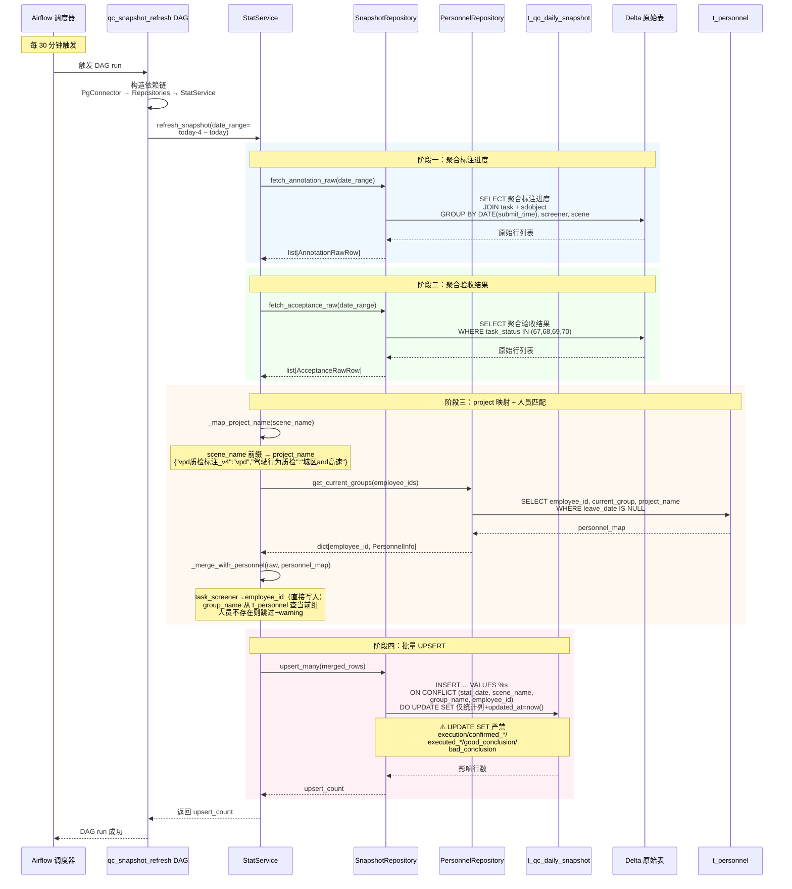

> ⚠️ 本卡内容已合并至 [[质检平台-人工质检模块实施计划]]，本卡保留作为历史归档，后续不再更新。

> 🔄 V20260630_03 重设计同步（20260702）：刷新字段集调整——annotator_id INT(外键) → employee_id VARCHAR(64)(逻辑引用)；acceptance_submitted → acceptance_completed；去 annotation_pending/is_executed/conclusion/conclusion_basis；新增 project_name/option_annotation/good_completed/good_conclusion/bad_completed/bad_conclusion/execution。新增 _map_project_name 步骤（Python 字典映射 project_name）。_merge_with_personnel 简化：task_screener 直接写入 employee_id，group_name 从 t_personnel 查当前组（WHERE leave_date IS NULL，SCD Type2）。

# 验收前置条件-快照刷新四级实现契约

> 本卡是 [PLAN 20260629_150000] Part B 的实现契约固化。表结构设计依据 [[质检平台-综合快照表设计]]；后端分层原则依据 [[质检平台-后端分层与组件边界设计]]；Repository 设计原则依据 [[质检平台-Repository与数据库访问设计]]；旧版5大避坑依据 [[PF-旧版验收代码架构问题与改进策略]]。

← [[质检一站式平台人工质检模块整体架构]] | [[质检平台-综合快照表设计]]

→ [[质检平台-Repository与数据库访问设计]] | [[质检平台-后端分层与组件边界设计]] | [[PF-旧版验收代码架构问题与改进策略]] | [[SYN-验收全流程细化后续拆解框架]]

---

## ① 组件概述

**一句话职责**：固化快照表 `t_qc_daily_snapshot` 定时刷新机制的四级实现契约（DDL → Repository → Service → DAG），定义每一级的文件级变更清单、类与函数级接口签名、实现约束与规范消化清单，作为 Phase 2.5 实现前的契约冻结基线。

**在整体架构中的位置**：实现契约层。本卡是 [[质检平台-综合快照表设计]]（表结构）、[[质检平台-Repository与数据库访问设计]]（Repository 原则）、[[质检平台-后端分层与组件边界设计]]（分层原则）三张设计卡的具化实现契约，将设计原则落地为可执行的 Task 级签名与约束。

> ⚠️ **废弃重定向标记**：本卡内容已合并至 [[质检平台-人工质检模块实施计划]]，后续更新请到合并 Plan 卡。本卡保留作为历史归档与四级契约素材源。

---

## ② 架构结构

### 四级实现契约文件清单

| 级别 | 文件 | 路径 | 状态 |
|------|------|------|------|
| Task 1 DDL | 人力权限三表迁移脚本 | [`data_schemas/migrations/V20260630_01__create_personnel_and_permission_tables.sql`](../../../data_schemas/migrations/V20260630_01__create_personnel_and_permission_tables.sql) | 已落地 |
| Task 1 DDL | t_personnel 正式 SQL | [`data_schemas/postgresql_relational/t_personnel.sql`](../../../data_schemas/postgresql_relational/t_personnel.sql) | 已落地 |
| Task 1 DDL | t_personnel 测试镜像 | [`data_schemas/postgresql_relational/t_personnel test.sql`](../../../data_schemas/postgresql_relational/t_personnel%20test.sql) | 已落地 |
| Task 1 DDL | t_personnel_op_log 正式 SQL | [`data_schemas/postgresql_relational/t_personnel_op_log.sql`](../../../data_schemas/postgresql_relational/t_personnel_op_log.sql) | 已落地 |
| Task 1 DDL | t_personnel_op_log 测试镜像 | [`data_schemas/postgresql_relational/t_personnel_op_log test.sql`](../../../data_schemas/postgresql_relational/t_personnel_op_log%20test.sql) | 已落地 |
| Task 1 DDL | t_portal_permission 正式 SQL | [`data_schemas/postgresql_relational/t_portal_permission.sql`](../../../data_schemas/postgresql_relational/t_portal_permission.sql) | 已落地 |
| Task 1 DDL | t_portal_permission 测试镜像 | [`data_schemas/postgresql_relational/t_portal_permission test.sql`](../../../data_schemas/postgresql_relational/t_portal_permission%20test.sql) | 已落地 |
| Task 2 DDL | 快照表迁移脚本 | [`data_schemas/migrations/V20260630_02__create_qc_daily_snapshot_table.sql`](../../../data_schemas/migrations/V20260630_02__create_qc_daily_snapshot_table.sql) | 已落地 |
| Task 2 DDL | t_qc_daily_snapshot 正式 SQL | [`data_schemas/postgresql_relational/t_qc_daily_snapshot.sql`](../../../data_schemas/postgresql_relational/t_qc_daily_snapshot.sql) | 已落地 |
| Task 2 DDL | t_qc_daily_snapshot 测试镜像 | [`data_schemas/postgresql_relational/t_qc_daily_snapshot test.sql`](../../../data_schemas/postgresql_relational/t_qc_daily_snapshot%20test.sql) | 已落地 |
| Task 3 Repository | `src/manual_qc/repository.py` | — | 待实现 |
| Task 4 Service | `src/manual_qc/stat_service.py` + `models.py` | — | 待实现 |
| Task 5 DAG | `src/data_check/dags/qc_snapshot_refresh.py` | — | 待实现 |

### 四级契约 DAG 时序图（Mermaid sequenceDiagram）



**时序图说明**：
- DAG 每 30 分钟触发，构造依赖链（PgConnector → SnapshotRepository/PersonnelRepository → StatService）后调用 `refresh_snapshot`。
- 阶段一/二：StatService 通过 SnapshotRepository 从 Delta 原始表聚合标注进度与验收结果（**直连原始表，不依赖中间表，也不依赖 t_text_label_task 中间层**）。
- 阶段三：`_map_project_name` 从 scene_name 前缀经 Python 字典映射 project_name；`_merge_with_personnel` 将 task_screener（工号）**直接写入** employee_id（无需映射 t_personnel.id），并从 t_personnel 查当前组（`WHERE leave_date IS NULL`，SCD Type2）。
- 阶段四：`upsert_many` 批量 UPSERT，UPDATE SET **仅含统计列**，严禁含 execution/confirmed_*/executed_*/good_conclusion/bad_conclusion 字段（边界情况1）。

---

## ③ 数据表交互

| 表名 | 一句话用途 | SQL/设计卡链接 | 读写类型 | 关键字段 |
|------|-----------|---------------|---------|---------|
| `t_qc_daily_snapshot` | 快照刷新的 UPSERT 目标表 | [`data_schemas/postgresql_relational/t_qc_daily_snapshot.sql`](../../../data_schemas/postgresql_relational/t_qc_daily_snapshot.sql) · [[质检平台-综合快照表设计]] | 读写 | 全部 26 字段（UPSERT 仅更新统计列+computed_at+updated_at） |
| `t_personnel` | 快照刷新时查 current_group（WHERE leave_date IS NULL）冗余写入 group_name | [`data_schemas/postgresql_relational/t_personnel.sql`](../../../data_schemas/postgresql_relational/t_personnel.sql) · [[人工质检-人力管理体系设计]] §2.1 | 读 | employee_id/current_group/project_name（SCD Type2，查现状 WHERE leave_date IS NULL） |
| `t_personnel_op_log` | 人员变更操作记录（本契约暂不涉及人员修改） | [`data_schemas/postgresql_relational/t_personnel_op_log.sql`](../../../data_schemas/postgresql_relational/t_personnel_op_log.sql) · [[人工质检-人力管理体系设计]] §2.2 | — | — |
| `t_portal_permission` | 前端权限表（本契约不涉及） | [`data_schemas/postgresql_relational/t_portal_permission.sql`](../../../data_schemas/postgresql_relational/t_portal_permission.sql) · [[人工质检-人力管理体系设计]] §2.3 | — | — |
| Delta `ods_t_label_screening_task_datalake` | 标注进度与验收结果上游源表 | [[质检平台-综合快照表设计]] §9 | 读 | task_name/task_screener/task_status/del_flag/to_review_time |
| Delta `ods_t_label_sdobject_datalake_new` | 标注 GT 与 Good/Bad 判定上游源表 | [[质检平台-综合快照表设计]] §9 | 读 | task_id/behavior_status(JSONB)/task_finished_time |

> **迁移依赖**：[`V20260630_01`](../../../data_schemas/migrations/V20260630_01__create_personnel_and_permission_tables.sql) → [`V20260630_02`](../../../data_schemas/migrations/V20260630_02__create_qc_daily_snapshot_table.sql) → [`V20260630_03`](../../../data_schemas/migrations/V20260630_03__redesign_qc_snapshot_and_personnel.sql)（重设计迁移，幂等）。V20260630_03 后 employee_id 为逻辑引用（非物理 FK）。

---

## ④ 子模块/类级清单

| 子模块/文件 | 一句话说明 |
|------------|-----------|
| Task 1: 人力权限三表 DDL | t_personnel（SCD Type2 复合主键） + t_personnel_op_log（employee_id 逻辑引用） + t_portal_permission 三表双 schema 镜像建表 |
| Task 2: 快照表 DDL | t_qc_daily_snapshot 双 schema 镜像建表 + 7 索引 + 2 约束 + DISTRIBUTE BY HASH(id) |
| Task 3: `SnapshotRepository` | 快照表读写 Repository 类（fetch_annotation_raw/fetch_acceptance_raw/upsert_many/aggregate_by_project） |
| Task 3: `PersonnelRepository` | 人员表读 Repository 类（get_current_groups，WHERE leave_date IS NULL） |
| Task 4: `StatService` | 聚合刷新编排（refresh_snapshot/_map_project_name/_merge_with_personnel） |
| Task 4: `SnapshotRow` | 快照行数据结构（dataclass，含 project_name/execution/good_completed/bad_completed） |
| Task 5: `qc_snapshot_refresh` DAG | Airflow 调度入口（每 30min，最近 4 天分片） |

---

## ⑤ 详细设计展开

### 1. 核心目标与复用策略

**核心目标**：实现统计快照表 `t_qc_daily_snapshot` 的定时刷新机制——每 30 分钟从 Delta 原始表聚合标注进度与验收结果，UPSERT 写入快照表，同时匹配 `t_personnel` 当前组别信息冗余写入 `group_name`。

**复用与熵减策略**：
- 复用 Airflow DAG 调度模式（`src/data_check/dags/` 既有模式：PythonOperator + max_active_runs=1 + dagrun_timeout + wrapper_failure_callback）
- 复用 `PgServer` 数据库连接（统一 psycopg2 路径，弃用 HiveConnector 双轨）
- 复用 `AppGy1Model.get_pass_rate_info()` 的聚合 SQL 业务逻辑（迁移到 Repository 层重新实现，参数化）
- 复用 `t_personnel` 人力管理表（migration 依赖已设计）
- **避免过度设计**：不引入 ORM（遵守 Repository 设计规范），不引入中间表，不引入异步任务队列

**全局约束**：
- 性能：单次刷新覆盖最近 4 天数据（参照旧版分片策略），UPSERT 批量执行
- 并发安全：DAG `max_active_runs=1`，`dagrun_timeout=28min`
- 时区：所有时间按 `Asia/Shanghai` 处理
- DDL 兼容基线：PostgreSQL 10+（禁 identity/generated column/NULLS NOT DISTINCT）
- migration 顺序：`V20260630_01__create_personnel_and_permission_tables.sql` 必须先于 `V20260630_02__create_qc_daily_snapshot_table.sql` 执行

### 2. 数据流详图

```
Airflow DAG (每30min)
  └→ StatService.refresh_snapshot(stat_date_range)
       ├→ SnapshotRepository.fetch_annotation_raw(stat_date_range)
       │    └→ SELECT FROM delta.ods_t_label_screening_task_datalake JOIN delta.ods_t_label_sdobject_datalake_new
       │         按 (DATE(submit_time), task_screener, scene_name) 聚合
       ├→ SnapshotRepository.fetch_acceptance_raw(stat_date_range)
       │    └→ SELECT FROM delta.ods_t_label_screening_task_datalake
       │         WHERE task_status IN (67,68,69,70) 按 (DATE, screener, scene) 聚合验收结果
       ├→ StatService._map_project_name(scene_name)
       │    └→ Python 字典映射 scene_name 前缀 → project_name
       │         {"vpd质检标注_v4":"vpd","驾驶行为质检":"城区and高速"}
       ├→ PersonnelRepository.get_current_groups(employee_ids)
       │    └→ SELECT employee_id, current_group, project_name FROM t_personnel
       │         WHERE employee_id IN (...) AND leave_date IS NULL  -- SCD Type2 当前有效行
       ├→ StatService._merge_with_personnel(raw_stats, personnel_map)
       │    └→ task_screener(工号) 直接写入 employee_id（无需映射 t_personnel.id）
       │       group_name 从 t_personnel 查当前组冗余写入
       └→ SnapshotRepository.upsert_many(merged_rows)
            └→ INSERT INTO t_qc_daily_snapshot ... ON CONFLICT (stat_date, scene_name, group_name, employee_id)
               DO UPDATE SET 仅统计列（含 project_name/option_annotation/good_completed/bad_completed），
               严禁含 execution/confirmed_*/executed_*/good_conclusion/bad_conclusion
```

**副作用**：
- UPSERT 写入 `t_qc_daily_snapshot`（仅统计列，严禁含 execution/confirmed_*/executed_*/good_conclusion/bad_conclusion）
- 每次刷新自动维护最近 4 天数据（幂等，重复刷新不产生重复行）

### 3. 文件级变更清单

- [x] `data_schemas/migrations/V20260630_01__create_personnel_and_permission_tables.sql` (已落地：t_personnel + t_personnel_op_log + t_portal_permission 三表 DDL，双 schema 镜像)
- [x] `data_schemas/migrations/V20260630_02__create_qc_daily_snapshot_table.sql` (已落地：t_qc_daily_snapshot 初版 DDL + 6 索引 + 约束，双 schema 镜像)
- [x] `data_schemas/migrations/V20260630_03__redesign_qc_snapshot_and_personnel.sql` (已落地：重设计迁移，幂等，SCD Type2 改造 + 快照表字段重构)
- [x] `data_schemas/postgresql_relational/t_personnel.sql` (已重设计：SCD Type2 复合主键，部分索引，DISTRIBUTE BY HASH(employee_id))
- [x] `data_schemas/postgresql_relational/t_personnel test.sql` (已重设计：测试镜像同步)
- [x] `data_schemas/postgresql_relational/t_personnel_op_log.sql` (已重设计：employee_id VARCHAR(64) 逻辑引用，DISTRIBUTE BY HASH(id))
- [x] `data_schemas/postgresql_relational/t_personnel_op_log test.sql` (已重设计：测试镜像同步)
- [x] `data_schemas/postgresql_relational/t_qc_daily_snapshot.sql` (已重设计：26 字段 + 7 索引 + 2 约束 + DISTRIBUTE BY HASH(id))
- [x] `data_schemas/postgresql_relational/t_qc_daily_snapshot test.sql` (已重设计：测试镜像同步)
- [ ] `src/manual_qc/__init__.py` (待实现：模块初始化)
- [ ] `src/manual_qc/repository.py` (待实现：Repository 层，含 SnapshotRepository + PersonnelRepository)
- [ ] `src/manual_qc/stat_service.py` (待实现：StatService 聚合刷新逻辑，含 _map_project_name)
- [ ] `src/manual_qc/models.py` (待实现：数据结构定义，dataclass/NamedTuple)
- [ ] `src/data_check/dags/qc_snapshot_refresh.py` (待实现：Airflow DAG 调度入口)

### 4. 类与函数级接口契约

#### Task 1: 人力管理与权限三表 DDL Migration 落地

* **目标文件**：`data_schemas/migrations/V20260630_01__create_personnel_and_permission_tables.sql`、`data_schemas/postgresql_relational/t_personnel.sql`、`data_schemas/postgresql_relational/t_personnel test.sql`
* **接口签名**：N/A（SQL 文件）
* **契约定义**：
  * **输入前置条件**：无（首个 migration）
  * **输出后置条件**：`pnc_simulation` 与 `data_common_4` 两个 schema 下均存在 `t_personnel`、`t_personnel_op_log`、`t_portal_permission` 三表，结构与 Wiki 设计契约一致
  * **副作用**：创建 3 张表
  * **验证规格**：
    - **验证目标**：migration 脚本在空库上执行成功，表结构与设计契约一致
    - **验证入口**：在测试库（`data_common_4` schema）执行 migration，随后 `\d data_common_4.t_personnel` 检查结构
    - **预期结果**：3 表均创建成功，字段类型/约束/索引与设计契约完全一致
* **实现约束**：
  - migration 必须幂等：`CREATE TABLE IF NOT EXISTS`，`DO $$ ... EXCEPTION WHEN duplicate_object`（GaussDB/DWS 不支持 `ADD COLUMN IF NOT EXISTS`）
  - `t_personnel` 字段（V20260630_03 SCD Type2 重设计）：`employee_id VARCHAR(64)`（PK 复合）、`name VARCHAR(64)`、`role VARCHAR(20)`、`level VARCHAR(16)`、`supplier VARCHAR(128)`、`project_name VARCHAR(64)`（单值，普通索引）、`current_group VARCHAR(128)`、`unit_price NUMERIC(10,4)`、`status VARCHAR(16)`、`join_date DATE NOT NULL`（PK 复合）、`leave_date DATE`（NULL=有效）、`updated_by VARCHAR(64)`、`updated_at TIMESTAMPTZ NOT NULL DEFAULT now()`；**复合主键 (employee_id, join_date)**，去自增 id，去 employee_id UNIQUE
  - `t_personnel_op_log` 字段（V20260630_03）：`id SERIAL PK`、`operated_at TIMESTAMPTZ`、`operator_id VARCHAR(64)`、`employee_id VARCHAR(64) NOT NULL`（逻辑引用 t_personnel.employee_id，非物理 FK）、`action VARCHAR(32)`、`changes JSONB`
  - `t_portal_permission` 字段：`id SERIAL PK`、`employee_id VARCHAR(64) UNIQUE`、`name VARCHAR(64)`、`acceptance_access VARCHAR(16) DEFAULT 'NONE'`、`personnel_access VARCHAR(16) DEFAULT 'NONE'`、`is_admin BOOLEAN DEFAULT FALSE`、`granted_by VARCHAR(64)`、`updated_at TIMESTAMPTZ`
  - **禁止** DDL 含 `CREATE TRIGGER ... BEFORE UPDATE`（updated_at 由应用层保证）
  - `t_personnel.project_name` **禁止**改为 `TEXT[]` 数组（架构护栏1）
  - DDL 兼容 PostgreSQL 10+，禁 identity/generated column/NULLS NOT DISTINCT
  - **GaussDB/DWS**：DISTRIBUTE BY 必须显式声明（t_personnel HASH(employee_id)，t_personnel_op_log/t_portal_permission HASH(id)）；COMMENT 必须独立语句
  - t_personnel 索引必须加 `WHERE leave_date IS NULL` 部分索引条件（仅索引当前有效行）
  - 正式建表 SQL（`data_schemas/postgresql_relational/`）与测试镜像 SQL（` test.sql`）必须同步，结构完全相同仅 schema 名不同

#### Task 2: 统计快照表 DDL Migration 落地（V20260630_03 重设计）

* **ParallelGroup**: `ddl-group`
* **目标文件**：`data_schemas/migrations/V20260630_02__create_qc_daily_snapshot_table.sql`（初版）、`data_schemas/migrations/V20260630_03__redesign_qc_snapshot_and_personnel.sql`（重设计）、`data_schemas/postgresql_relational/t_qc_daily_snapshot.sql`、`data_schemas/postgresql_relational/t_qc_daily_snapshot test.sql`
* **接口签名**：N/A（SQL 文件）
* **契约定义**：
  * **输入前置条件**：Task 1 的 migration 已执行（`t_personnel` 已存在）；V20260630_03 依赖 V20260630_02 先执行
  * **输出后置条件**：`pnc_simulation` 与 `data_common_4` 两 schema 下均存在重设计后的 `t_qc_daily_snapshot` 表，含 [[质检平台-综合快照表设计]] §2-§7 全部字段（26 字段）、7 索引、唯一约束、CHECK 约束、DISTRIBUTE BY HASH(id)
  * **副作用**：创建 1 张表 + 7 索引（V20260630_03 重设计迁移 ALTER 已有表）
  * **验证规格**：
    - **验证目标**：V20260630_03 迁移脚本在已建初版表的库上执行成功，且幂等可重复执行
    - **验证入口**：在测试库执行 V20260630_03，`\d data_common_4.t_qc_daily_snapshot` 检查结构
    - **预期结果**：employee_id VARCHAR(64)、无 annotator_id/annotation_pending/is_executed/conclusion/conclusion_basis、有 project_name/option_annotation/good_completed/good_conclusion/bad_completed/bad_conclusion/execution/acceptance_completed，7 索引存在，唯一约束含 employee_id
* **实现约束**：
  - migration 幂等（V20260630_03 所有 ALTER/DROP 用 `DO $$ ... EXCEPTION WHEN duplicate_column / undefined_column` 模式）
  - `employee_id VARCHAR(64) NOT NULL`（逻辑引用 t_personnel.employee_id，非物理 FK）
  - `project_name VARCHAR(64) NOT NULL DEFAULT ''`（由 scene_name 前缀 Python 字典映射）
  - 唯一约束：`UNIQUE (stat_date, scene_name, group_name, employee_id)`
  - CHECK：`CONSTRAINT ck_annotation_counts_order CHECK (annotation_submitted <= annotation_total)`
  - 7 索引（见 [[质检平台-综合快照表设计]] §5），含 project_date + good_conclusion/bad_conclusion 部分索引
  - 禁 TRIGGER（updated_at 由应用层保证）
  - 双 schema 镜像同步
  - DISTRIBUTE BY HASH(id) 显式声明

#### Task 3: Repository 层 — SnapshotRepository + PersonnelRepository

* **目标文件**：`src/manual_qc/repository.py`
* **接口签名**：

```python
class SnapshotRepository:
    def __init__(self, pg_connector: PgConnector): ...
    def fetch_annotation_raw(self, stat_date_range: tuple[date, date]) -> list[AnnotationRawRow]: ...
    def fetch_acceptance_raw(self, stat_date_range: tuple[date, date]) -> list[AcceptanceRawRow]: ...
    def upsert_many(self, rows: list[SnapshotRow]) -> int: ...
    def aggregate_by_project(self, filters: SnapshotFilter) -> list[ProjectAggregateRow]: ...  # 新增

class PersonnelRepository:
    def __init__(self, pg_connector: PgConnector): ...
    def get_current_groups(self, employee_ids: list[str]) -> dict[str, PersonnelInfo]: ...
    # 注：PersonnelInfo 不再含 id，仅 current_group + project_name
    # 查询 SQL 必须含 WHERE leave_date IS NULL（SCD Type2 当前有效行）
```

* **契约定义**：
  * **输入前置条件**：`PgConnector` 已初始化并连接到 `app_gy1` 库；`t_personnel`（SCD Type2）与 `t_qc_daily_snapshot`（重设计后）表已存在
  * **输出后置条件**：
    - `fetch_annotation_raw` 返回按 `(stat_date, task_screener, scene_name)` 聚合的标注进度原始行
    - `fetch_acceptance_raw` 返回按 `(stat_date, task_screener, scene_name)` 聚合的验收结果原始行（仅 `task_status IN (67,68,69,70)` 的任务）
    - `upsert_many` 批量 UPSERT，返回影响行数；UPDATE SET **仅含统计列**（含 project_name/option_annotation/good_completed/bad_completed/acceptance_completed），不含 `execution/confirmed_*/executed_*/good_conclusion/bad_conclusion`
    - `aggregate_by_project` 按 project_name 聚合查询（新增）
    - `get_current_groups` 返回 `{employee_id: PersonnelInfo(current_group, project_name)}` 映射，查询 SQL 含 `WHERE leave_date IS NULL`
  * **副作用**：`upsert_many` 写入 `t_qc_daily_snapshot`
  * **验证规格**：
    - **验证目标**：Repository 各方法 SQL 正确性、UPSERT 幂等性、不误清执行字段、SCD Type2 查询含 leave_date IS NULL
    - **验证入口**：`tests/test_snapshot_repository.py`（UT 级，mock PgConnector）
    - **预期结果**：fetch 方法返回正确聚合结果；upsert_many 重复调用结果一致；UPSERT 的 UPDATE SET 子句不含 execution/confirmed_*/executed_*/good_conclusion/bad_conclusion；get_current_groups 查询含 WHERE leave_date IS NULL
* **实现约束**：
  - 全部 SQL 集中 Repository，**禁止** Service 层拼接 SQL
  - **禁止**引入 ORM
  - 参数化 SQL 防注入（`%s` 占位符），**禁止** f-string 拼 SQL
  - `fetch_annotation_raw` 聚合 SQL 参照 `AppGy1Model.get_pass_rate_info()` 业务逻辑重新实现：
    - JOIN `delta.ods_t_label_screening_task_datalake` 与 `delta.ods_t_label_sdobject_datalake_new`
    - 按 `DATE(submit_time)` (上海时区) 分组
    - Good/Bad 判定：`behavior_status->>'驾驶问题分类' = 'good'`
  - `upsert_many` 必须使用 `execute_values` 或 `execute_values_returning`，**禁止** `execute_query` 执行写操作，**禁止**临时表模式
  - UPSERT SQL 模板：`INSERT INTO ... VALUES %s ON CONFLICT (stat_date, scene_name, group_name, employee_id) DO UPDATE SET annotation_total=EXCLUDED.annotation_total, ..., project_name=EXCLUDED.project_name, option_annotation=EXCLUDED.option_annotation, good_completed=EXCLUDED.good_completed, bad_completed=EXCLUDED.bad_completed, acceptance_completed=EXCLUDED.acceptance_completed, computed_at=now(), updated_at=now()`（UPDATE SET **必须显式列出 updated_at=now()**，**禁止**列出 execution/confirmed_*/executed_*/good_conclusion/bad_conclusion）
  - DatabaseConfig 访问必须 `.get('database')`，**禁止** `.database` 属性访问
  - PersonnelRepository 所有查询当前有效人员的 SQL 必须含 `WHERE leave_date IS NULL`

#### Task 4: Service 层 — StatService 聚合刷新逻辑

* **目标文件**：`src/manual_qc/stat_service.py`、`src/manual_qc/models.py`
* **接口签名**：

```python
@dataclass
class SnapshotRow:
    stat_date: date
    scene_name: str
    group_name: str
    employee_id: str          # VARCHAR(64)，原 annotator_id: int 改为工号字符串
    project_name: str         # 新增，由 scene_name 前缀映射
    annotation_total: int
    annotation_submitted: int
    option_annotation: dict   # 新增，各选项标注数量
    acceptance_allocated: int
    acceptance_completed: int # 原 acceptance_submitted 改名
    good_allocated: int
    good_completed: int       # 新增
    good_passed: int
    bad_allocated: int
    bad_completed: int        # 新增
    bad_passed: int
    option_acceptance: dict   # 结构增强，含 allocated/completed/passed/conclusion

class StatService:
    PROJECT_MAP = {
        "vpd质检标注_v4": "vpd",
        "驾驶行为质检": "城区and高速",
    }

    def __init__(self, snapshot_repo: SnapshotRepository, personnel_repo: PersonnelRepository): ...
    def _map_project_name(self, scene_name: str) -> str:
        """从 scene_name 前缀匹配 project_name"""
    def refresh_snapshot(self, stat_date_range: tuple[date, date]) -> int:
        """刷新指定日期范围的快照，返回 UPSERT 行数"""
```

* **契约定义**：
  * **输入前置条件**：`stat_date_range` 的 start_date <= end_date，日期范围不超过 7 天
  * **输出后置条件**：返回实际 UPSERT 的行数；`t_qc_daily_snapshot` 中该日期范围的统计列已刷新，执行字段（execution/confirmed_*/executed_*/good_conclusion/bad_conclusion）未被动
  * **副作用**：通过 Repository 写入 `t_qc_daily_snapshot`
  * **验证规格**：
    - **验证目标**：聚合逻辑正确性、project 映射正确性、人员匹配正确性、空数据处理
    - **验证入口**：`tests/test_stat_service.py`（UT 级，mock Repository）
    - **预期结果**：raw 数据正确聚合为 SnapshotRow；scene_name 正确映射 project_name；task_screener 直接写入 employee_id；无提交的标注员不产生快照行
* **实现约束**：
  - **禁止**在 Service 层拼接 SQL（全部通过 Repository）
  - `_map_project_name` 逻辑：从 scene_name 前缀匹配 PROJECT_MAP 字典，返回 project_name
  - `_merge_with_personnel` 逻辑：`task_screener`（工号）**直接写入** `employee_id`（无需映射 t_personnel.id），从 `t_personnel` 查当前组（`WHERE leave_date IS NULL`）写入 `group_name`
  - 人员未进组（`current_group=''`）时 `group_name` 记录空串
  - 人员在 `t_personnel` 中不存在时（无当前有效行）：跳过该行并记录 warning 日志（不产生快照行，因 `employee_id NOT NULL`）
  - `option_annotation` / `option_acceptance` JSONB 构造逻辑：按选项字母聚合计数
  - `option_acceptance` 结构含 `allocated/completed/passed/conclusion` 四字段
  - scene_name 提取：e2e 项目 `SPLIT_PART(task_name, '_', 2)`，vpd 项目 `SPLIT_PART(task_name, '_', 3)`（参照存量 `AppGy1Model.query_all_tasks` 逻辑）

#### Task 5: Airflow DAG 调度入口

* **目标文件**：`src/data_check/dags/qc_snapshot_refresh.py`
* **接口签名**：

```python
def refresh_qc_snapshot():
    """DAG PythonOperator 入口，刷新最近4天快照"""
```

* **契约定义**：
  * **输入前置条件**：Airflow Variable `dag_root_dir` 已配置
  * **输出后置条件**：每次执行刷新最近 4 天的 `t_qc_daily_snapshot` 数据
  * **副作用**：通过 StatService 写入快照表
  * **验证规格**：
    - **验证目标**：DAG 定义语法正确、调度参数合理
    - **验证入口**：`python -c "import dags.qc_snapshot_refresh"`（导入无报错）
    - **预期结果**：DAG 可被 Airflow 解析，dag_id='qc_snapshot_refresh'，schedule_interval=30min
* **实现约束**：
  - DAG 参数参照旧版 `human_label_refresh_status`：`max_active_runs=1`、`dagrun_timeout=timedelta(minutes=28)`、`catchup=False`、`retries=1`、`retry_delay=timedelta(minutes=2)`
  - `schedule_interval=timedelta(minutes=30)`
  - `on_failure_callback=wrapper_failure_callback(receiver=...)`（复用 `dags.common_fun`）
  - 刷新日期范围：最近 4 天（`date.today() - timedelta(days=4)` 至 `date.today()`），参照旧版中间表分片策略
  - DAG 内**禁止**业务逻辑，仅组装依赖并调用 `StatService.refresh_snapshot()`
  - 依赖注入：DAG 内构造 `PgConnector` → `SnapshotRepository` / `PersonnelRepository` → `StatService`

### 5. 规范消化清单

| 规范ID | 标题 | 在本契约中的消化方式 |
|--------|------|----------------------|
| NORM-DDL-SYNC | DDL变更同步规范 | Task 1/2 各列出 migration + 正式建表SQL + 测试镜像SQL 三件事；文件级变更清单逐一列出 6 个 DDL 文件 |
| NORM-GAUSSDB-002 | TRIGGER限制与updated_at | Task 1/2 DDL 禁 TRIGGER；Task 3 UPSERT 的 UPDATE SET 显式带 `updated_at=now()` |
| PIT-PGC-001 | execute_query禁止写 | Task 3 `upsert_many` 必须用 `execute_values`/`execute_values_returning`，禁 `execute_query` |
| PF-DB-015 | DatabaseConfig访问陷阱 | Task 3 DatabaseConfig 必须 `.get('database')`，禁属性访问 |
| SCH-TEST-001 | 测试环境表镜像 | Task 1/2 双 schema 镜像（`pnc_simulation` + `data_common_4`），文件级清单列出 ` test.sql` |
| 架构护栏1 | project_name 单值 | Task 1 `t_personnel.project_name VARCHAR(64)` 单值，禁 TEXT[] |
| 架构护栏2 | group_name 冗余不回写 | Task 4 `_merge_with_personnel` 写入即冻结，调组不回写历史行 |
| 架构护栏3 | t_personnel SCD Type2 | Task 1 t_personnel 复合主键 (employee_id, join_date)，join_date/leave_date 有效期，无自增 id（V20260630_03 修订：原"不做历史快照"→"SCD Type2"） |
| 架构护栏4 | migration 顺序 | Task 1 先于 Task 2，文件名时间戳保证 |
| 架构护栏5 | 人员变更同事务 | Task 3 PersonnelRepository 修改人员+op_log 同事务（本 PLAN 暂不涉及人员修改，后续模块实现） |
| 架构护栏6 | 权限模块等级 | Task 1 `t_portal_permission` 模块等级列，禁每按钮 Boolean |
| 架构护栏7 | PG10+ 兼容 | Task 1/2 禁 identity/generated column/NULLS NOT DISTINCT |

> ⚠️ 本仓库适配说明：本项目新建数据表的规范为——正式表建在 `app_gy1` 库的 `pnc_simulation` schema 下；同时在 `app_gy1` 库的 `data_common_4` schema 下建一张同名测试表。原卡片中的库/schema 命名仅作设计参考，实际落地以本规则为准。涉及表：`t_personnel`、`t_personnel_op_log`、`t_portal_permission`、`t_qc_daily_snapshot`。

> ⚠️ 架构护栏拦截：
> - Repository 层 SQL 集中，Service 层禁止拼接 SQL（[[质检平台-后端分层与组件边界设计]] §3）
> - UPSERT 的 UPDATE SET 严禁包含执行字段（execution/confirmed_*/executed_*/good_conclusion/bad_conclusion）（[[质检平台-综合快照表设计]] §13 边界1）
> - `upsert_many` 禁用 `execute_query` 写操作（[[PGConnector接口语义陷阱：execute_query禁止写操作]]）
> - `t_personnel.project_name` 禁止改 TEXT[] 数组（架构护栏1）
> - PersonnelRepository 所有查询当前有效人员的 SQL 必须含 `WHERE leave_date IS NULL`（SCD Type2，架构护栏3 修订）

---

## ⑥ 完成情况与 TODO

**当前状态**：Task 1/2 DDL 已重设计落地（V20260630_03，9 个 SQL 文件 + 3 个迁移脚本）；Task 3/4/5 待实现。本卡内容已合并至 [[质检平台-人工质检模块实施计划]]，保留作为历史归档与四级契约素材源。

**TODO 清单**：
- [x] Task 1: 人力权限三表 DDL 落地（t_personnel SCD Type2 / t_personnel_op_log employee_id 逻辑引用 / t_portal_permission + 双 schema 镜像）
- [x] Task 2: 快照表 DDL 落地（t_qc_daily_snapshot 26 字段 + 7 索引 + 2 约束 + DISTRIBUTE BY HASH(id) + 双 schema 镜像）
- [x] 初始迁移脚本落地（V20260630_01 + V20260630_02，幂等保护）
- [x] 重设计迁移脚本落地（V20260630_03，幂等，SCD Type2 改造 + 快照表字段重构）
- [x] 四级契约接口签名冻结（SnapshotRepository / PersonnelRepository / StatService / DAG，含 _map_project_name / aggregate_by_project）
- [x] DAG 时序图补齐（含 project 映射步骤）
- [ ] Task 3: `src/manual_qc/repository.py` 物理实现
- [ ] Task 4: `src/manual_qc/stat_service.py` + `models.py` 物理实现
- [ ] Task 5: `src/data_check/dags/qc_snapshot_refresh.py` 物理实现
- [ ] Repository 集成测试（`tests/test_snapshot_repository.py`）
- [ ] StatService 单元测试（`tests/test_stat_service.py`）
- [ ] DAG 导入冒烟测试（`python -c "import dags.qc_snapshot_refresh"`）

---

## ⑦ 归属

← [[质检一站式平台人工质检模块整体架构]]

> 🔗 上位枢纽：[[质检一站式平台人工质检模块整体架构]]
> 🔗 表结构设计：[[质检平台-综合快照表设计]]
> 🔗 旧版避坑：[[PF-旧版验收代码架构问题与改进策略]]
> 🔗 后续拆解：[[SYN-验收全流程细化后续拆解框架]]
> 🔗 合并 Plan 卡：[[质检平台-人工质检模块实施计划]]
