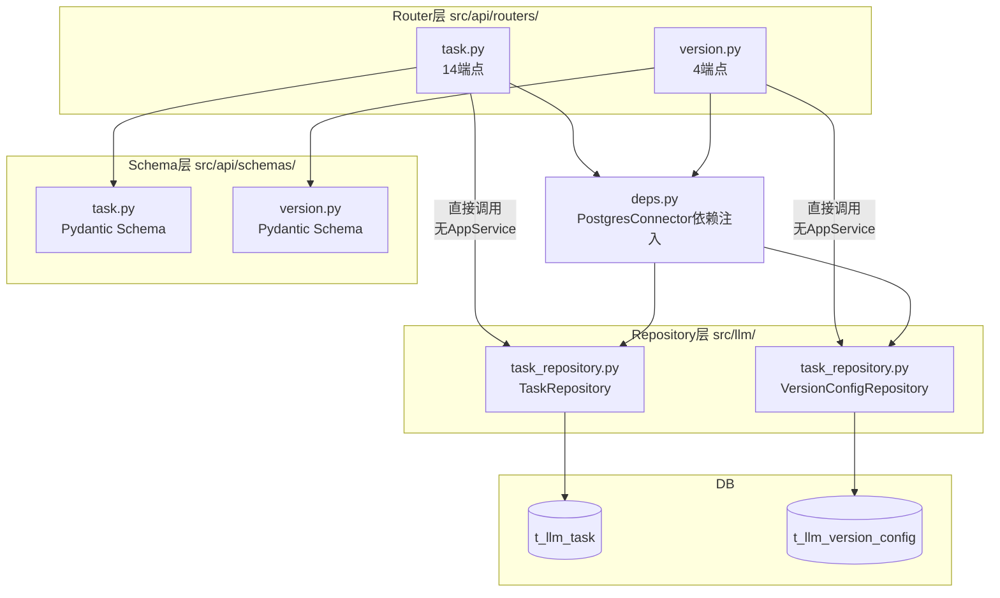
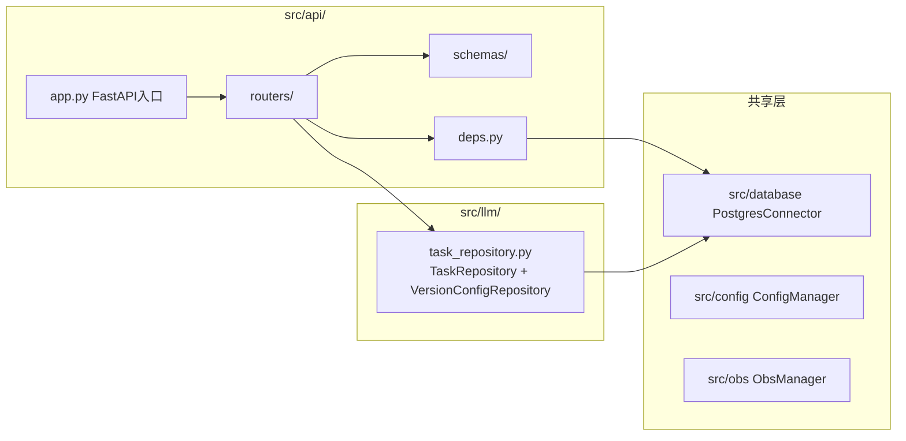
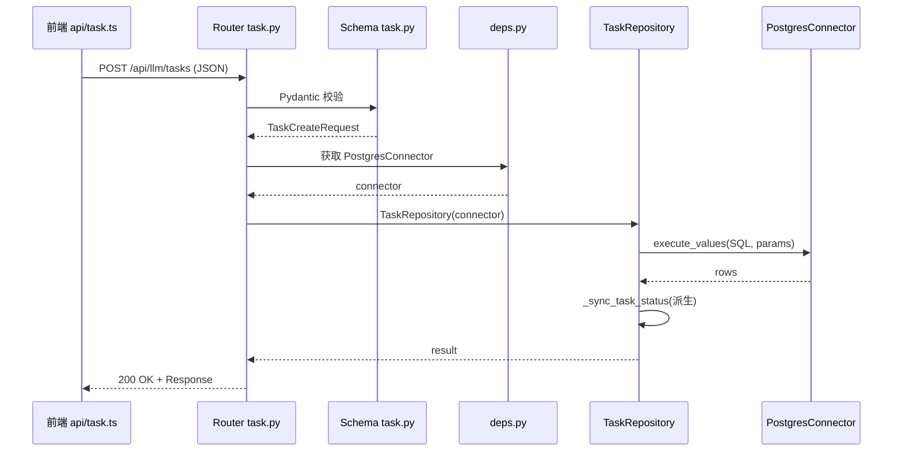

# 大模型质检-后端分层与组件边界设计

> 本卡是大模型质检part 后端层的**架构宪法**。
> - 上位枢纽：[[质检一站式平台大模型质检模块整体架构]]
> - 顶层架构：[[质检一站式平台顶层架构]]（沿用 §4 前后端边界与组件边界）
> - 现状来源：[[FastAPI后端API层架构]] / [[FastAPI应用入口与依赖注入层]]

⚠️ **本part 沿用顶层架构 §4 四层架构定义，但采用三层架构（Router → Repository/Domain → DB），省略 Application Service 层**。理由：生产任务和版本配置的业务逻辑可直接在 Router 层编排 Repository 调用，无需额外 Service 层。各子part 在本卡中显式声明是否采用 AppService 层（本 part 声明：不采用）。

---

## ① 组件概述

### 1.1 组件定位

本组件定义大模型质检part 后端的分层架构与组件边界。大模型质检part 采用**三层架构**：

| 层 | 物理位置 | 职责 |
|----|---------|------|
| Router | `src/api/routers/task.py`、`src/api/routers/version.py` | HTTP 端点定义、Pydantic 校验、编排 Repository 调用、返回响应 |
| Repository/Domain | `src/llm/task_repository.py` | SQL 集中封装、数据映射、派生 status 机制 |
| DB | PostgreSQL/GaussDB | 数据存储 |

> **省略 Application Service 层的依据**：顶层架构 §4 已声明 "Application Service 为可选层"。本 part 的两个样板域（生产任务、版本配置）业务逻辑较简单，可直接在 Router 层编排 Repository 调用，无需额外 Service 层。如未来业务复杂度上升（如引入 preview→execute 双步范式、跨 Repository 编排），可再引入 AppService 层。

### 1.2 关键边界约束

- Router 禁止拼 SQL、禁止碰数据库连接（沿用顶层 §4）。
- Repository 禁止碰 HTTP、禁止含业务编排逻辑（沿用顶层 §4）。
- 跨子part 调用必须经 Application Service 层（本 part 无 AppService，故禁止跨 part 调用）。
- 任务级 status 派生铁律：禁止业务代码直接写 `t_llm_task.status`，必须经 `_sync_task_status()`（详见 [[大模型质检-Repository与数据库访问设计]]）。

---

## ② 架构结构

### 2.1 三层架构总览图

### 2.2 目录结构

### 2.3 调用时序

---

## ③ 数据表交互

| 数据表 | 写入端点 | 读取端点 | 关键字段 |
|--------|---------|---------|---------|
| t_llm_task | POST 创建表单/上传、批量kill、批量clean、单任务kill、单任务clean、restore、permanent-delete | GET 概览/分组/列表/详情/通道进度/通道吞吐 | 6通道status、6 obs_upload_status、6版本字段、任务级status、is_deleted |
| t_llm_version_config | POST 创建/UPSERT、DELETE 删除 | GET 列表、GET 详情 | version、channel、config(JSONB)、processor、processor_params、is_deleted |

详见 [[大模型质检-t_llm_task表设计]] 与 [[大模型质检-t_llm_version_config表设计]]。

---

## ④ 子模块/文件/类级清单（affects_path 精确到文件级）

| 文件路径 | 类/模块 | 职责 | 状态 |
|---------|--------|------|------|
| `src/api/routers/task.py` | TaskRouter | 生产任务 14 端点 HTTP 定义 + Pydantic 校验 + 编排 Repository | [待新建/重构] |
| `src/api/routers/version.py` | VersionRouter | 版本配置 4 端点 HTTP 定义 + Pydantic 校验 + 编排 Repository | [待新建/重构] |
| `src/api/schemas/task.py` | TaskCreateRequest / TaskListResponse 等 | 生产任务域 Pydantic Schema | [待新建/重构] |
| `src/api/schemas/version.py` | VersionConfigRequest / VersionListResponse 等 | 版本配置域 Pydantic Schema | [待新建/重构] |
| `src/llm/task_repository.py` | TaskRepository / VersionConfigRepository | SQL 集中封装 + 派生 status 机制 | [待重构] |
| `src/api/deps.py` | get_postgres_connector / get_config_manager | 依赖注入（PostgresConnector / ConfigManager） | [待重构] |

> 现状参照：[[FastAPI后端API层架构]]（现有 14+4 端点现状）、[[FastAPI应用入口与依赖注入层]]（现有 DI 层）、[[TaskRepository 任务DB读写封装层]]（现有 Repository）。

---

## ⑤ 详细设计（含测试矩阵）

### 5.1 Router 层职责边界

| 允许操作 | 禁止操作 |
|---------|---------|
| Pydantic 模型校验 | 拼 SQL（f-string / 字符串拼接） |
| 调用 Repository 方法 | 碰数据库连接（直接获取 cursor） |
| 编排多个 Repository 调用（如创建任务后调用 VersionConfigRepository 校验版本） | 含业务编排逻辑（如派生 status 计算） |
| 返回统一响应格式 | 直接操作 HTTP 请求/响应对象的内部属性（除标准 Response） |
| 调用 ConfigManager（通过 deps 注入） | 碰 OBS 连接（必须经 Repository 或专门客户端） |

### 5.2 Repository 层职责边界

| 允许操作 | 禁止操作 |
|---------|---------|
| SQL 执行（execute_query / execute / execute_values） | 碰 HTTP 请求/响应对象 |
| 数据映射（row → dict / dataclass） | 含业务编排逻辑（如调用其他 Repository） |
| 派生 status 机制（`_sync_task_status()`） | 引入 ORM 框架 |
| 参数化 SQL（`%s` 占位符） | f-string 拼 SQL |
| 调用 PostgresConnector | 引入其他数据库连接器 |

### 5.3 无 AppService 层的边界澄清

本 part 省略 AppService 层，但**职责边界依然清晰**：
- Router 层承担原 AppService 的"编排"职责（编排 = 调用 Repository + 组装响应）。
- Router 层**不承担**原 AppService 的"事务边界"职责 → 事务边界下沉到 Repository 层（每个 Repository 方法自含事务）。
- Router 层**不承担**原 AppService 的"业务规则"职责 → 业务规则（如派生 status）下沉到 Repository 层的 `_sync_task_status()`。

> ⚠️ 若未来引入 preview→execute 双步范式（参照顶层架构 §8），需重新评估是否引入 AppService 层承载 preview 状态管理。

### 5.4 测试矩阵

| 用例编号 | 场景 | 输入 | 预期结果 | 验证层 |
|---------|------|------|---------|--------|
| TC-BL-001 | 正常创建任务 | 合法 TaskCreateRequest | 200 + 任务创建成功 | Router + Repository |
| TC-BL-002 | 空 task_name | task_name="" | 422 Pydantic 校验失败 | Router |
| TC-BL-003 | 非法 task_id（UUID 格式错误） | task_id="not-a-uuid" | 422 校验失败 | Router |
| TC-BL-004 | 并发 kill 同一任务 | 两个请求同时 kill 同一 task_id | 其中一个 200，另一个 409 冲突或幂等返回 | Repository |
| TC-BL-005 | Router 直接拼 SQL（反例） | Router 内含 SQL 字符串 | Code Review 拦截 + 单测失败 | Router |
| TC-BL-006 | Repository 碰 HTTP（反例） | Repository 内 import fastapi | Code Review 拦截 + 单测失败 | Repository |
| TC-BL-007 | 跨 part 调 Repository（反例） | task.py 直接调 manual_qc Repository | Code Review 拦截 | Router |
| TC-BL-008 | 派生 status 被 Router 直接写（反例） | Router 内写 t_llm_task.status | Code Review 拦截 + 单测失败 | Router + Repository |

---

## ⑥ 完成情况与 TODO

| 项 | 状态 | 说明 |
|----|------|------|
| 三层架构定义 | ✅ 本卡已定义 | 省略 AppService，声明理由 |
| 文件级 affects_path | ✅ 本卡已列出 | 6 个文件级路径 |
| 现状代码梳理 | ⬜ | 依赖 [[FastAPI后端API层架构]] 现状梳理 |
| Router/Repository 重构落地 | ⬜ | 见 [[大模型质检模块实施计划]] Phase 2-3 |
| 测试矩阵执行 | ⬜ | 待代码实现后执行 |

### TODO
- [待人类补充] 现有 `src/api/routers/task.py` 和 `version.py` 的端点清单与现有代码位置的精确映射（依赖 KM 调卷报告②）。
- [待人类补充] 事务边界下沉到 Repository 层的具体实现模式（每个方法自含事务 vs 批量事务）。

---

## ⑦ 归属

- **上位枢纽**：[[质检一站式平台大模型质检模块整体架构]]
- **顶层架构**：[[质检一站式平台顶层架构]]（沿用 §4 前后端边界与组件边界）
- **现状来源**：[[FastAPI后端API层架构]] / [[FastAPI应用入口与依赖注入层]]
- **关联组件卡**：[[大模型质检-API契约与前端交互设计]] / [[大模型质检-领域模型层设计]] / [[大模型质检-Repository与数据库访问设计]]
- **对标人工质检卡**：[[质检平台-后端分层与组件边界设计]]
