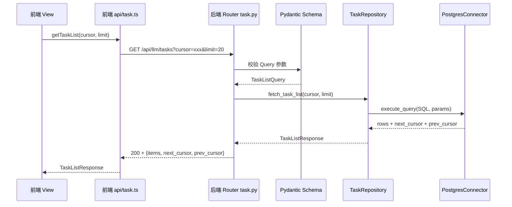
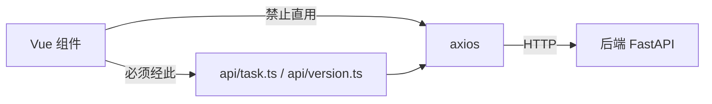
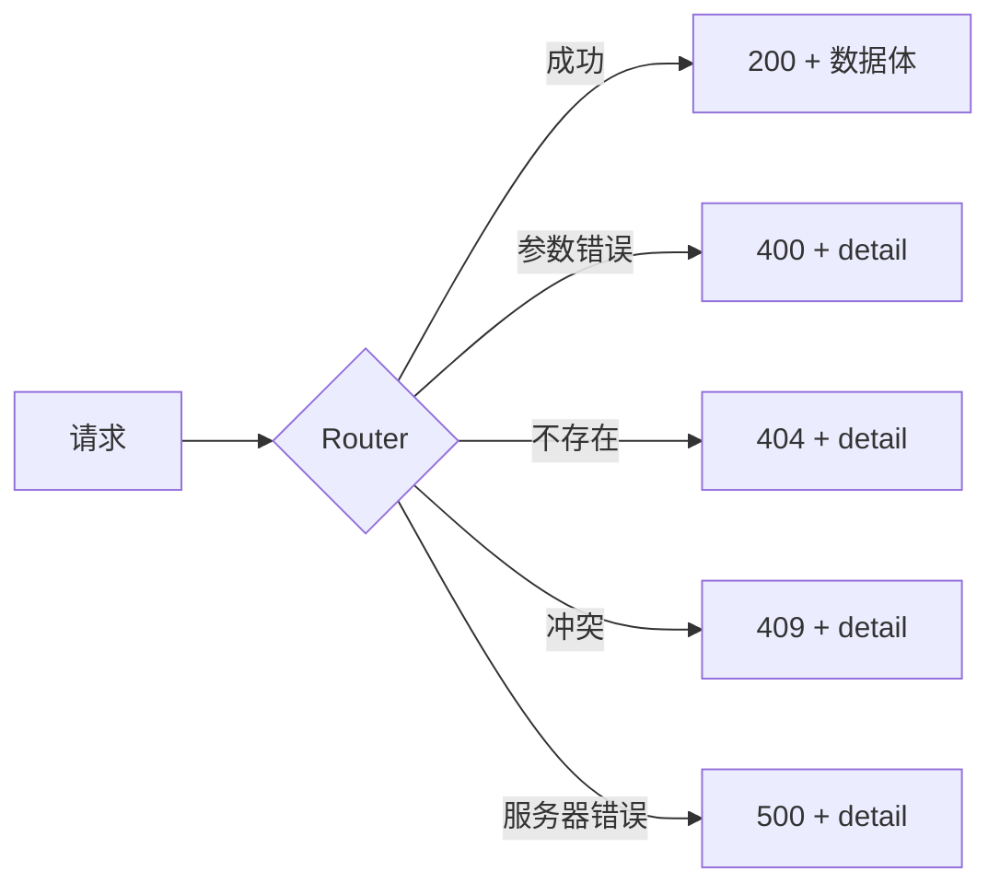

# 大模型质检-API契约与前端交互设计

> 本卡是大模型质检part 的**API 契约宪法**。
> - 上位枢纽：[[质检一站式平台大模型质检模块整体架构]]
> - 顶层架构：[[质检一站式平台顶层架构]]（沿用 §5 前后端衔接方式）
> - 现状来源：[[FastAPI后端API层架构]]（现有 14+4 端点现状）
> - 关联组件卡：[[大模型质检-后端分层与组件边界设计]] / [[大模型质检-领域模型层设计]] / [[大模型质检-前端页面与状态设计]]

---

## ① 组件概述

本组件定义大模型质检part 的完整 API 契约，包括：
- 生产任务域 14 端点（游标分页，补全 prev_cursor 双向）
- 版本配置域 4 端点（OFFSET 分页）
- 统一响应格式与错误码体系
- 前端调用规范（`src/frontend/src/api/*.ts` 间接调用）

### 1.1 路由前缀（路径 C 折中）

- 生产任务：`/api/llm/tasks`
- 版本配置：`/api/llm/versions`

> 路径 C 折中：后端目录保持 `src/llm/`，路由前缀统一 `/api/llm/`，与人工质检结构一致（顶层架构 §5.1）。

### 1.2 分页范式选用决策

| 域 | 分页范式 | 理由 |
|----|---------|------|
| 生产任务 | 游标分页（cursor-based），补全 prev_cursor 双向 | 数据量大，游标分页性能稳定；补全 prev_cursor 实现双向翻页 |
| 版本配置 | OFFSET 分页 | 数据量小，OFFSET 简单高效 |

> 符合顶层架构 §5.1："由子part 根据数据量选择并显式声明"。本卡显式声明选用决策。

---

## ② 架构结构

### 2.1 调用链时序图



### 2.2 前端调用规范



- 禁止 axios 直用（顶层架构 §5.2）。
- API 函数命名动词开头：`getTaskList` / `createTask` / `killTask` / `getVersionList` / `upsertVersion` / `deleteVersion` 等。
- 所有请求/响应必须定义 TypeScript 接口，禁止 `any`。

### 2.3 统一响应格式



---

## ③ 数据表交互

| 数据表 | 写入端点 | 读取端点 | 关键字段 |
|--------|---------|---------|---------|
| t_llm_task | POST /api/llm/tasks（表单/上传）、POST /api/llm/tasks/{id}/kill、POST /api/llm/tasks/batch_kill、POST /api/llm/tasks/{id}/clean、POST /api/llm/tasks/batch_clean、POST /api/llm/tasks/{id}/restore、DELETE /api/llm/tasks/{id} | GET /api/llm/tasks/overview、GET /api/llm/tasks/groups、GET /api/llm/tasks（列表）、GET /api/llm/tasks/{id}、GET /api/llm/tasks/{id}/channels/progress、GET /api/llm/tasks/{id}/channels/throughput | 详见 [[大模型质检-t_llm_task表设计]] |
| t_llm_version_config | POST /api/llm/versions（UPSERT）、DELETE /api/llm/versions/{id} | GET /api/llm/versions（列表）、GET /api/llm/versions/{id} | 详见 [[大模型质检-t_llm_version_config表设计]] |

---

## ④ 子模块/文件/类级清单（affects_path 精确到文件级）

| 文件路径 | 类/模块 | 职责 | 状态 |
|---------|--------|------|------|
| `src/api/routers/task.py` | TaskRouter | 生产任务 14 端点 | [待新建/重构] |
| `src/api/routers/version.py` | VersionRouter | 版本配置 4 端点 | [待新建/重构] |
| `src/frontend/src/api/task.ts` | getTaskList / createTask / killTask 等 | 生产任务前端 API 封装 | [待新建/重写] |
| `src/frontend/src/api/version.ts` | getVersionList / upsertVersion / deleteVersion 等 | 版本配置前端 API 封装 | [待新建/重写] |

---

## ⑤ 详细设计（含测试矩阵）

### 5.1 生产任务 14 端点契约

| # | HTTP 方法 | 路径 | 请求参数 | 响应格式 | 分页方式 |
|---|----------|------|---------|---------|---------|
| 1 | POST | /api/llm/tasks（form） | TaskCreateRequest（表单字段） | TaskDetailResponse | — |
| 2 | POST | /api/llm/tasks（upload） | multipart/form-data（JSON/JSONL 文件） | TaskDetailResponse | — |
| 3 | GET | /api/llm/tasks/overview | query: date_range / status | TaskOverviewResponse | — |
| 4 | GET | /api/llm/tasks/groups | query: group_by / status | TaskGroupResponse[] | — |
| 5 | GET | /api/llm/tasks | query: cursor / limit / status_filter | TaskListResponse（游标分页） | 游标分页（cursor + prev_cursor 双向） |
| 6 | GET | /api/llm/tasks/{id} | path: id (UUID) | TaskDetailResponse | — |
| 7 | GET | /api/llm/tasks/{id}/channels/progress | path: id | ChannelProgressResponse[] | — |
| 8 | GET | /api/llm/tasks/{id}/channels/throughput | path: id | ChannelThroughputResponse[] | — |
| 9 | POST | /api/llm/tasks/batch_kill | BatchKillRequest（task_ids[]） | BatchOperationResponse | — |
| 10 | POST | /api/llm/tasks/batch_clean | BatchCleanRequest（task_ids[]） | BatchOperationResponse | — |
| 11 | POST | /api/llm/tasks/{id}/kill | path: id | TaskDetailResponse | — |
| 12 | POST | /api/llm/tasks/{id}/clean | path: id | TaskDetailResponse | — |
| 13 | POST | /api/llm/tasks/{id}/restore | path: id | TaskDetailResponse | — |
| 14 | DELETE | /api/llm/tasks/{id} | path: id | 204 No Content（永久删除） | — |

### 5.2 版本配置 4 端点契约

| # | HTTP 方法 | 路径 | 请求参数 | 响应格式 | 分页方式 |
|---|----------|------|---------|---------|---------|
| 1 | POST | /api/llm/versions | VersionConfigRequest（version / channel / config / processor / processor_params） | VersionConfigResponse（UPSERT 语义：存在则更新，不存在则插入） | — |
| 2 | GET | /api/llm/versions | query: page / pageSize / channel_filter | VersionListResponse（OFFSET 分页） | OFFSET 分页（pageSize 默认 20） |
| 3 | GET | /api/llm/versions/{id} | path: id (UUID) | VersionConfigResponse | — |
| 4 | DELETE | /api/llm/versions/{id} | path: id | 204 No Content（软删除） | — |

### 5.3 游标分页响应格式（生产任务）

```json
{
  "items": [TaskDetailResponse, ...],
  "next_cursor": "base64编码的下一页游标" | null,
  "prev_cursor": "base64编码的上一页游标" | null,
  "has_more": true | false
}
```

- `next_cursor` 为 null 表示无下一页。
- `prev_cursor` 为 null 表示无上一页（已在首页）。
- 游标编码：base64(最后一条/第一条记录的排序键 + 方向)。
- 补全 prev_cursor 方案：prev_cursor 通过反向查询（ORDER BY ... DESC）实现，避免 OFFSET 性能问题。

### 5.4 OFFSET 分页响应格式（版本配置）

```json
{
  "items": [VersionConfigResponse, ...],
  "total": 100,
  "page": 1,
  "page_size": 20
}
```

### 5.5 统一响应格式 + 错误码体系

| HTTP 状态码 | 语义 | 响应体 |
|------------|------|--------|
| 200 | 成功 | 数据体 |
| 204 | 成功无内容（DELETE） | — |
| 400 | 参数错误 | `{"detail": "错误描述"}` |
| 404 | 不存在 | `{"detail": "资源不存在"}` |
| 409 | 冲突（如 UPSERT 联合键冲突、并发 kill） | `{"detail": "冲突描述"}` |
| 422 | Pydantic 校验失败 | FastAPI 默认校验错误响应 |
| 500 | 服务器错误 | `{"detail": "服务器内部错误"}` |

### 5.6 测试矩阵

| 用例编号 | 场景 | 输入 | 预期结果 |
|---------|------|------|---------|
| TC-API-001 | 正常获取任务列表（首页） | cursor=null, limit=20 | 200 + items + next_cursor + prev_cursor=null |
| TC-API-002 | 翻到下一页 | cursor=next_cursor | 200 + items + next_cursor + prev_cursor（可回首页） |
| TC-API-003 | 翻回上一页 | cursor=prev_cursor | 200 + items（与首页一致） |
| TC-API-004 | 游标越界（伪造游标） | cursor=非法base64 | 400 参数错误 |
| TC-API-005 | 空任务列表 | 无数据时请求 | 200 + items=[] + next_cursor=null |
| TC-API-006 | OFFSET 超页 | page=999 | 200 + items=[] + total=实际数 |
| TC-API-007 | 非法参数（limit=0） | limit=0 | 422 校验失败 |
| TC-API-008 | UPSERT 冲突（version+channel 联合键） | 已存在的 version+channel | 200（更新而非冲突，UPSERT 语义） |
| TC-API-009 | 删除不存在的版本 | id=不存在的UUID | 404 |
| TC-API-010 | kill 不存在的任务 | id=不存在的UUID | 404 |
| TC-API-011 | 并发 kill 同一任务 | 两个请求同时 kill | 一个 200，一个 409 或幂等 200 |
| TC-API-012 | 永久删除已 permanent_delete 的任务 | 二次删除 | 404 |
| TC-API-013 | 非法 channel（不在枚举内） | channel="invalid" | 422 校验失败 |
| TC-API-014 | 非法 JSONB config | config="not-json" | 422 校验失败 |

---

## ⑥ 完成情况与 TODO

| 项 | 状态 | 说明 |
|----|------|------|
| 14+4 端点契约定义 | ✅ 本卡已定义 | 逐一列出 |
| 分页范式选用决策 | ✅ 本卡已声明 | 任务游标 + 版本 OFFSET |
| 前端 api/*.ts 封装 | ⬜ | 见 [[大模型质检模块实施计划]] Phase 4 |
| 测试矩阵执行 | ⬜ | 待代码实现后执行 |

### TODO
- [待人类补充] 各端点的精确 Query 参数清单（如 overview 的 date_range 格式、groups 的 group_by 枚举值）需结合现有实现确认。
- [待人类补充] 游标编码格式（base64 内容结构）的具体实现方案。

---

## ⑦ 归属

- **上位枢纽**：[[质检一站式平台大模型质检模块整体架构]]
- **顶层架构**：[[质检一站式平台顶层架构]]（沿用 §5 API 契约规范）
- **现状来源**：[[FastAPI后端API层架构]]
- **关联组件卡**：[[大模型质检-后端分层与组件边界设计]] / [[大模型质检-领域模型层设计]] / [[大模型质检-前端页面与状态设计]]
- **对标人工质检卡**：[[质检平台-API契约与前端交互设计]]
