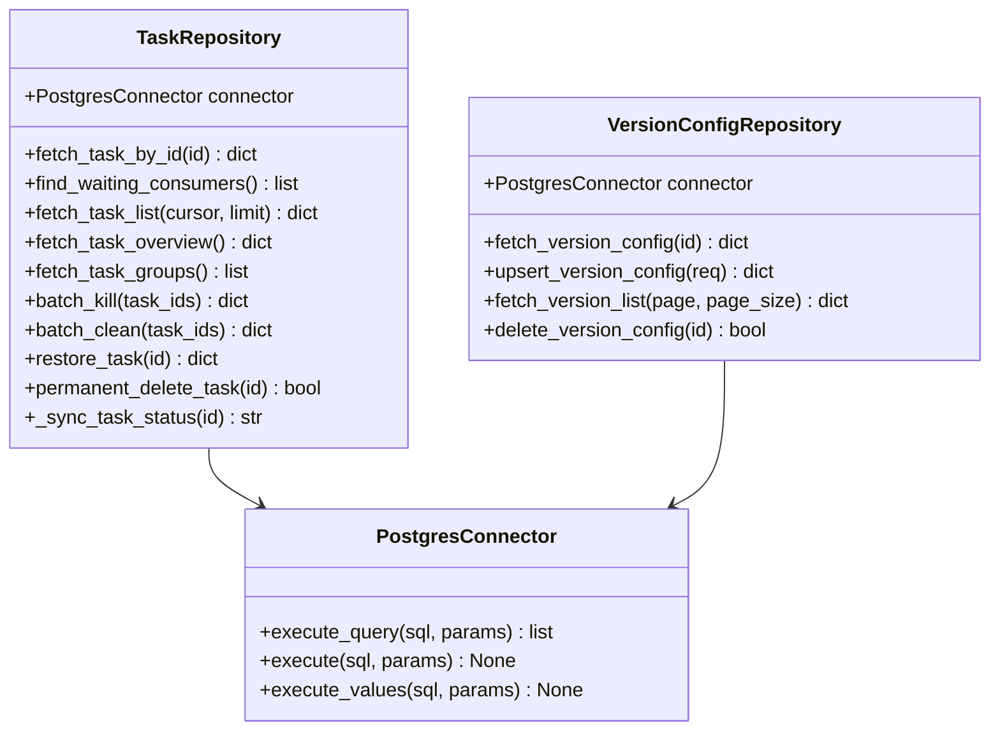
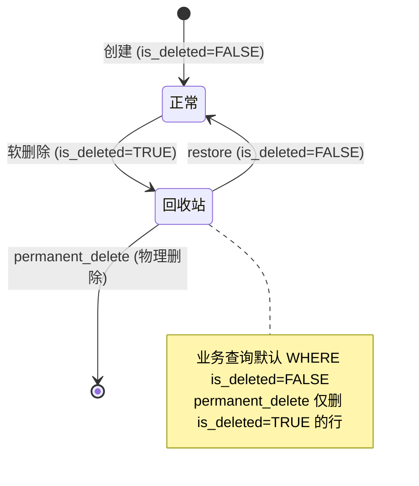

# 大模型质检-Repository与数据库访问设计

> 本卡是大模型质检part 的**Repository 宪法**。
> - 上位枢纽：[[质检一站式平台大模型质检模块整体架构]]
> - 顶层架构：[[质检一站式平台顶层架构]]（沿用 §4.4 Repository 原则）
> - 现状来源：[[TaskRepository 任务DB读写封装层]] / [[PostgreSQL数据库公共模块]]
> - 关联组件卡：[[大模型质检-后端分层与组件边界设计]] / [[大模型质检-领域模型层设计]] / [[大模型质检-t_llm_task表设计]] / [[大模型质检-t_llm_version_config表设计]]

---

## ① 组件概述

本组件定义大模型质检part 的 Repository 层设计，包括：
- TaskRepository 方法清单（生产任务域）
- VersionConfigRepository 方法清单（版本配置域）
- 派生 status 机制（`_sync_task_status()`）
- 软删除规范
- SQL 集中封装规范（沿用顶层架构 §4.4）

### 1.1 核心原则（沿用顶层架构 §4.4）

- **SQL 集中封装**：所有 SQL 必须集中在 Repository 层，Service/Router 禁止拼 SQL。
- **参数化 SQL**：禁止 f-string 拼 SQL，必须用 `%s` 占位符。
- **execute_query 禁止写操作**：`execute_query` 仅查询，写操作用 `execute` / `execute_values`。
- **禁止临时表**：禁止 `CREATE TEMP TABLE`，用批量 UPSERT（`INSERT...ON CONFLICT...DO UPDATE`）。
- **连接层统一**：统一用 PostgresConnector（psycopg2），禁止引入其他连接器。
- **禁 ORM**：Repository 使用 PostgresConnector，禁止引入 ORM 框架。

### 1.2 派生 status 铁律

> ⚠️ **任务级 status 派生铁律**：任务级 status 由 6 通道 status 派生，**禁止业务代码直接写 `t_llm_task.status`**，必须经 `_sync_task_status()`。详见 [[任务级vs通道级status架构设计]]。

---

## ② 架构结构

### 2.1 Repository 类图



### 2.2 派生 status 状态图

```mermaid
stateDiagram-v2
    [*] --> pending: 创建任务
    pending --> running: 任一通道开始执行
    running --> completed: 全部通道 completed
    running --> failed: 任一通道 failed
    running --> killed: 任一通道 killed（kill 优先级）
    completed --> [*]
    failed --> [*]
    killed --> [*]

    note right of TaskRepository._sync_task_status
        派生规则（简化版）：
        - 任一 killed → killed
        - 任一 failed → failed
        - 任一 running → running
        - 全部 completed → completed
        - 全部 pending → pending
        [待人类补充: 完整派生规则]
    end note
```

### 2.3 软删除状态流转



---

## ③ 数据表交互

### 3.1 t_llm_task 字段读写关系

| 字段 | 写入方 | 读取方 | 说明 |
|------|--------|--------|------|
| id | TaskRepository（INSERT 时生成 UUID） | 所有读取 | PK |
| task_name | TaskRepository（创建时写入） | 所有读取 | 业务键 |
| status_raw_img / status_label / status_pkl / status_video / status_prompt / status_inference | 生产链路 production/（背景链接，非本 part 写） | TaskRepository（聚合派生） | 6 通道 status |
| obs_upload_status_* | TaskRepository（创建时初始化） | TaskRepository | 6 通道 OBS 上传状态 |
| data_version / label_version / pkl_version / video_config_version / prompt_version / model_version | TaskRepository（创建时冻结） | 所有读取 | 6 版本字段，创建后不可变 |
| status（派生） | TaskRepository.`_sync_task_status()`（**唯一写入方**） | 所有读取 | 任务级派生 status |
| error_step | 生产链路 production/（背景链接） | TaskRepository | 错误步骤 |
| slice_start / slice_end | TaskRepository（创建时写入） | 所有读取 | 切片范围 |
| is_deleted | TaskRepository（软删除/restore） | 所有业务查询 | 软删除标记 |
| updated_at | TaskRepository（应用层写 now()） | 所有读取 | 不用 TRIGGER |
| created_at | TaskRepository（DEFAULT now()） | 所有读取 | 创建时间 |

### 3.2 t_llm_version_config 字段读写关系

| 字段 | 写入方 | 读取方 | 说明 |
|------|--------|--------|------|
| id | VersionConfigRepository（INSERT 时生成 UUID） | 所有读取 | PK |
| version | VersionConfigRepository（UPSERT） | 所有读取 | 版本号 |
| channel | VersionConfigRepository（UPSERT） | 所有读取 | 通道名（CHECK 枚举约束） |
| config | VersionConfigRepository（UPSERT） | 所有读取 | JSONB 通道配置 |
| processor | VersionConfigRepository（UPSERT） | 所有读取 | `module.path:func_name`（仅 prompt 通道） |
| processor_params | VersionConfigRepository（UPSERT） | 所有读取 | JSONB 处理器参数 |
| is_deleted | VersionConfigRepository（DELETE 软删除） | 所有业务查询 | 软删除标记 |
| updated_at | VersionConfigRepository（应用层写 now()） | 所有读取 | 不用 TRIGGER |
| created_at | VersionConfigRepository（DEFAULT now()） | 所有读取 | 创建时间 |

详见 [[大模型质检-t_llm_task表设计]] 与 [[大模型质检-t_llm_version_config表设计]]。

---

## ④ 子模块/文件/类级清单（affects_path 精确到文件级）

| 文件路径 | 类/模块 | 职责 | 状态 |
|---------|--------|------|------|
| `src/llm/task_repository.py` | TaskRepository / VersionConfigRepository | SQL 集中封装 + 派生 status 机制 | [待重构] |
| `src/database/postgresql.py` | PostgresConnector | 公共连接池（execute_query / execute / execute_values） | [现有，沿用] |
| `src/api/deps.py` | get_postgres_connector / get_config_manager | 依赖注入 | [待重构] |

---

## ⑤ 详细设计（含测试矩阵）

### 5.1 TaskRepository 方法清单

| 方法名 | 签名 | SQL 操作 | 返回类型 | 说明 |
|--------|------|---------|---------|------|
| fetch_task_by_id | `(id: UUID) -> dict` | SELECT WHERE id=%s AND is_deleted=FALSE | dict\|None | 查询单个任务 |
| find_waiting_consumers | `() -> list` | SELECT WHERE status='pending' AND is_deleted=FALSE | list[dict] | 查询待消费任务 |
| fetch_task_list | `(cursor: str\|None, limit: int) -> dict` | SELECT WHERE is_deleted=FALSE ORDER BY created_at DESC LIMIT %s | dict（含 items + next_cursor + prev_cursor） | 游标分页（双向） |
| fetch_task_overview | `() -> dict` | SELECT COUNT(*) GROUP BY status WHERE is_deleted=FALSE | dict | 概览统计 |
| fetch_task_groups | `(group_by: str) -> list` | SELECT group_by, COUNT(*) GROUP BY group_by WHERE is_deleted=FALSE | list[dict] | 分组统计 |
| batch_kill | `(task_ids: list[UUID]) -> dict` | UPDATE SET status_*='killed' WHERE id IN %s；调 _sync_task_status | dict（success_count/failed_count） | 批量 kill |
| batch_clean | `(task_ids: list[UUID]) -> dict` | UPDATE SET status_*='pending' WHERE id IN %s；调 _sync_task_status | dict | 批量 clean |
| restore_task | `(id: UUID) -> dict` | UPDATE SET is_deleted=FALSE WHERE id=%s AND is_deleted=TRUE | dict\|None | 恢复任务 |
| permanent_delete_task | `(id: UUID) -> bool` | DELETE FROM t_llm_task WHERE id=%s AND is_deleted=TRUE | bool | 永久删除（仅删 is_deleted=TRUE） |
| _sync_task_status | `(id: UUID) -> str` | SELECT 6 通道 status → 派生 → UPDATE t_llm_task.status | str（派生 status） | **唯一写 status 的方法** |

### 5.2 VersionConfigRepository 方法清单

| 方法名 | 签名 | SQL 操作 | 返回类型 | 说明 |
|--------|------|---------|---------|------|
| fetch_version_config | `(id: UUID) -> dict` | SELECT WHERE id=%s AND is_deleted=FALSE | dict\|None | 查询单个版本配置 |
| upsert_version_config | `(req: dict) -> dict` | INSERT...ON CONFLICT(version, channel) WHERE is_deleted=FALSE DO UPDATE SET | dict | UPSERT（联合键 version+channel） |
| fetch_version_list | `(page: int, page_size: int, channel_filter: str\|None) -> dict` | SELECT WHERE is_deleted=FALSE LIMIT %s OFFSET %s | dict（含 items + total + page + page_size） | OFFSET 分页 |
| delete_version_config | `(id: UUID) -> bool` | UPDATE SET is_deleted=TRUE WHERE id=%s AND is_deleted=FALSE | bool | 软删除 |

### 5.3 派生 status 机制声明

> ⚠️ **任务级 status 派生铁律**：`t_llm_task.status` 字段由 `_sync_task_status()` 唯一写入，**禁止业务代码直接写 status 字段**。

派生规则（简化版，[待人类补充: 完整派生规则]）：
- 任一通道 killed → 任务级 killed（kill 优先级最高）
- 任一通道 failed → 任务级 failed
- 任一通道 running → 任务级 running
- 全部通道 completed → 任务级 completed
- 全部通道 pending → 任务级 pending

触发时机：每次通道 status 变更后（由生产链路 production/ 触发，背景链接），调用 `_sync_task_status(task_id)` 重新派生。

### 5.4 软删除规范（沿用 NORM-SOFT-DELETE）

- 业务查询默认 `WHERE is_deleted=FALSE`。
- 软删除：`UPDATE SET is_deleted=TRUE`。
- restore：`UPDATE SET is_deleted=FALSE WHERE is_deleted=TRUE`。
- permanent_delete：`DELETE FROM ... WHERE is_deleted=TRUE`（仅删回收站中的行，不可恢复）。

### 5.5 连接层规范

- 统一使用 PostgresConnector（psycopg2），禁止引入其他连接器。
- 查询用 `execute_query`（禁止写操作，详见 [[PGConnector接口语义陷阱：execute_query禁止写操作]]）。
- 写操作用 `execute` / `execute_values`。
- 批量操作用 `execute_values`（如 batch_kill、batch_clean）。
- ConfigManager 使用注意签名陷阱（详见 [[PF-ConfigManager_get签名陷阱]]）。

### 5.6 测试矩阵

| 用例编号 | 场景 | 输入 | 预期结果 |
|---------|------|------|---------|
| TC-RP-001 | 正常查询任务列表 | cursor=null, limit=20 | items + next_cursor + prev_cursor=null |
| TC-RP-002 | 空结果查询 | 无数据 | items=[] + next_cursor=null |
| TC-RP-003 | 并发写入（batch_kill 同一任务） | 两个并发请求 | 一个成功，一个幂等或冲突 |
| TC-RP-004 | 派生 status：全部 completed | 6 通道均 completed | status='completed' |
| TC-RP-005 | 派生 status：任一 failed | 1 通道 failed，5 通道 completed | status='failed' |
| TC-RP-006 | 派生 status：任一 running | 1 通道 running，5 通道 pending | status='running' |
| TC-RP-007 | 派生 status：任一 killed | 1 通道 killed，5 通道 completed | status='killed' |
| TC-RP-008 | 软删除边界：restore 非 is_deleted=TRUE 的行 | restore is_deleted=FALSE 的任务 | 返回 None（无操作） |
| TC-RP-009 | permanent_delete 非 is_deleted=TRUE 的行 | permanent_delete is_deleted=FALSE 的任务 | 返回 False（拒绝） |
| TC-RP-010 | UPSERT 冲突：version+channel 联合键已存在 | 已存在的 version+channel | 更新而非插入 |
| TC-RP-011 | execute_query 执行写操作（反例） | execute_query 执行 UPDATE | 抛异常或被拦截 |
| TC-RP-012 | f-string 拼 SQL（反例） | SQL 含 f-string | Code Review 拦截 |
| TC-RP-013 | 直接写 status 字段（反例） | 业务代码直接 UPDATE status | Code Review 拦截 + 单测失败 |
| TC-RP-014 | 引入 ORM（反例） | import sqlalchemy | Code Review 拦截 |

---

## ⑥ 完成情况与 TODO

| 项 | 状态 | 说明 |
|----|------|------|
| TaskRepository 方法清单 | ✅ 本卡已定义 | 10 个方法 |
| VersionConfigRepository 方法清单 | ✅ 本卡已定义 | 4 个方法 |
| 派生 status 机制声明 | ✅ 本卡已声明 | _sync_task_status 唯一写入方 |
| 软删除规范 | ✅ 本卡已声明 | 沿用 NORM-SOFT-DELETE |
| 派生规则完整定义 | ⬜ | [待人类补充] |
| Repository 代码重构 | ⬜ | 见 [[大模型质检模块实施计划]] Phase 2 |
| 测试矩阵执行 | ⬜ | 待代码实现后执行 |

### TODO
- [待人类补充] 派生 status 完整规则（如 mixed 状态、部分通道 pending 部分 completed 时的归属、kill 后通道 status 是否变更）。
- [待人类补充] fetch_task_list 游标编码格式与排序键选择。
- [待人类补充] batch_kill / batch_clean 的事务边界（全成功或全失败 vs 部分成功）。

---

## ⑦ 归属

- **上位枢纽**：[[质检一站式平台大模型质检模块整体架构]]
- **顶层架构**：[[质检一站式平台顶层架构]]（沿用 §4.4 Repository 原则）
- **现状来源**：[[TaskRepository 任务DB读写封装层]] / [[PostgreSQL数据库公共模块]]
- **关联组件卡**：[[大模型质检-后端分层与组件边界设计]] / [[大模型质检-领域模型层设计]] / [[大模型质检-t_llm_task表设计]] / [[大模型质检-t_llm_version_config表设计]]
- **规范引用**：[[PGConnector接口语义陷阱：execute_query禁止写操作]] / [[PF-ConfigManager_get签名陷阱]] / [[任务级vs通道级status架构设计]]
- **对标人工质检卡**：[[质检平台-Repository与数据库访问设计]]
