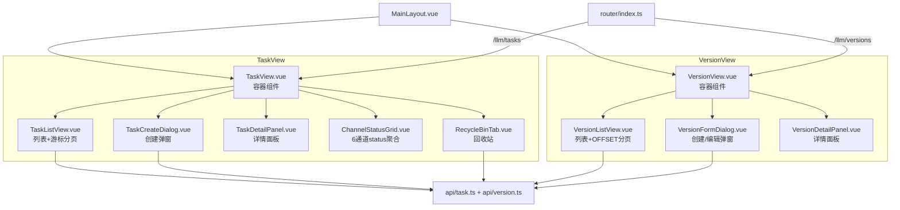
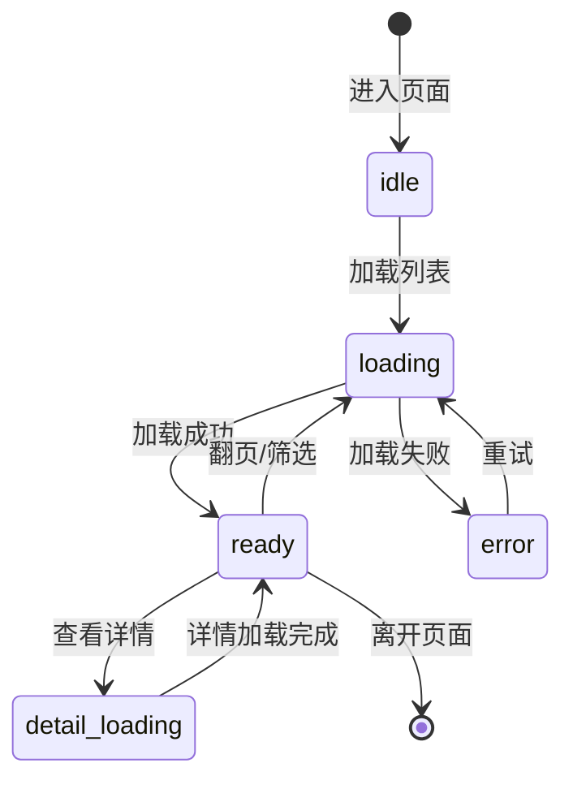
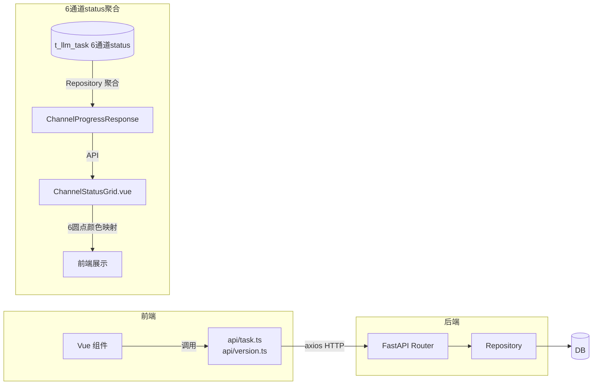

# 大模型质检-前端页面与状态设计

> 本卡是大模型质检part 的**前端架构宪法**。
> - 上位枢纽：[[质检一站式平台大模型质检模块整体架构]]
> - 顶层架构：[[质检一站式平台顶层架构]]（沿用 §5 前后端衔接方式）
> - 现状来源：[[Vue3前端层架构]] / [[TaskView交互流程详解]] / [[VersionView版本配置页面交互详解]]
> - 关联组件卡：[[大模型质检-API契约与前端交互设计]] / [[大模型质检-生产任务设计]] / [[大模型质检-版本配置设计]]

⚠️ **前端推翻重来依据**：本 part 前端推翻重来，理由：
1. opencode skill 能力支持前端重构；
2. 对标人工质检前端架构（[[质检平台-人工质检前端页面与状态设计]]）；
3. 沿用 [[质检前后端一体化理想架构设计]] 的前端规范（已归档，通用部分上移至顶层架构 §3.4 / §5.2）。

---

## ① 组件概述

本组件定义大模型质检part 的前端页面与状态设计，包括：
- TaskView 拆分为 5 个子组件
- VersionView 拆分为 3 个子组件
- 单组件 <300 行约束
- 6 通道 status 聚合展示方案（ChannelStatusGrid）
- 游标分页交互（加载更多 + prev_cursor 双向）
- 创建弹窗（表单 Tab + 文件上传 Tab）
- 回收站交互（恢复 + 永久删除）

### 1.1 前端调用规范（沿用顶层架构 §5.2）

- 禁止 axios 直用：组件必须通过 `src/frontend/src/api/task.ts` / `version.ts` 间接调用。
- API 函数命名动词开头：`getTaskList` / `createTask` / `killTask` / `getVersionList` / `upsertVersion` / `deleteVersion`。
- 所有请求/响应必须定义 TypeScript 接口，禁止 `any`。

### 1.2 前端开发规范（沿用 [[前端开发规范]]）

- SFC 顺序：`template → script → style`。
- `style` 必须加 `scoped`。
- 禁止 `any`。
- 禁止 axios 直用。
- 禁止 `v-for` 无 `key`。

---

## ② 架构结构

### 2.1 组件树图

### 2.2 生产任务状态机

> 状态机参照人工质检前端状态机模式（[[质检平台-人工质检前端页面与状态设计]]，顶层架构 §8 参考模式），但不强制套用六态，按业务需要简化。

### 2.3 数据流图

---

## ③ 数据表交互

前端通过 API 间接交互，不直接碰数据表。数据表交互详见 [[大模型质检-API契约与前端交互设计]] ③。

| 前端组件 | 调用 API | 间接交互数据表 |
|---------|---------|--------------|
| TaskListView | getTaskList（游标分页） | t_llm_task |
| TaskCreateDialog | createTask（表单/上传） | t_llm_task |
| TaskDetailPanel | getTaskDetail | t_llm_task |
| ChannelStatusGrid | getChannelProgress | t_llm_task（6 通道 status） |
| RecycleBinTab | getTaskList（is_deleted=TRUE）、restoreTask、permanentDeleteTask | t_llm_task |
| VersionListView | getVersionList（OFFSET 分页） | t_llm_version_config |
| VersionFormDialog | upsertVersion | t_llm_version_config |
| VersionDetailPanel | getVersionDetail | t_llm_version_config |

---

## ④ 子模块/文件/类级清单（affects_path 精确到文件级）

| 文件路径 | 组件 | 职责 | 状态 |
|---------|------|------|------|
| `src/frontend/src/views/TaskView.vue` | TaskView | 生产任务容器组件 | [待新建/重写] |
| `src/frontend/src/views/VersionView.vue` | VersionView | 版本配置容器组件 | [待新建/重写] |
| `src/frontend/src/components/TaskListView.vue` | TaskListView | 列表 + 游标分页 | [待新建] |
| `src/frontend/src/components/TaskCreateDialog.vue` | TaskCreateDialog | 创建弹窗（表单 Tab + 上传 Tab） | [待新建] |
| `src/frontend/src/components/TaskDetailPanel.vue` | TaskDetailPanel | 详情面板 | [待新建] |
| `src/frontend/src/components/ChannelStatusGrid.vue` | ChannelStatusGrid | 6 通道 status 聚合展示 | [待新建] |
| `src/frontend/src/components/RecycleBinTab.vue` | RecycleBinTab | 回收站（恢复 + 永久删除） | [待新建] |
| `src/frontend/src/components/VersionListView.vue` | VersionListView | 版本列表 + OFFSET 分页 | [待新建] |
| `src/frontend/src/components/VersionFormDialog.vue` | VersionFormDialog | 创建/编辑弹窗（UPSERT） | [待新建] |
| `src/frontend/src/components/VersionDetailPanel.vue` | VersionDetailPanel | 版本详情面板 | [待新建] |
| `src/frontend/src/api/task.ts` | getTaskList / createTask / killTask 等 | 生产任务 API 封装 | [待新建/重写] |
| `src/frontend/src/api/version.ts` | getVersionList / upsertVersion / deleteVersion | 版本配置 API 封装 | [待新建/重写] |
| `src/frontend/src/router/index.ts` | router | 路由配置（/llm/tasks、/llm/versions） | [待重构] |
| `src/frontend/src/layouts/MainLayout.vue` | MainLayout | 主布局 | [待重构] |

---

## ⑤ 详细设计（含测试矩阵）

### 5.1 TaskView 5 组件职责与接口

| 组件 | 职责 | props | emits | 行数约束 |
|------|------|-------|-------|---------|
| TaskView | 容器组件，管理状态机 + 协调子组件 | — | — | <300 行 |
| TaskListView | 任务列表 + 游标分页交互 | tasks, next_cursor, prev_cursor, has_more | page-change(cursor), select-task(id), open-create, open-recycle | <300 行 |
| TaskCreateDialog | 创建弹窗（表单 Tab + 文件上传 Tab） | visible | create-form(data), create-upload(file), close | <300 行 |
| TaskDetailPanel | 详情面板（含 ChannelStatusGrid） | task_id | refresh, kill(id), clean(id), soft-delete(id) | <300 行 |
| ChannelStatusGrid | 6 通道 status 聚合展示（6 圆点颜色映射） | channel_progress | — | <300 行 |
| RecycleBinTab | 回收站（恢复 + 永久删除） | — | restore(id), permanent-delete(id) | <300 行 |

### 5.2 VersionView 3 组件职责与接口

| 组件 | 职责 | props | emits | 行数约束 |
|------|------|-------|-------|---------|
| VersionView | 容器组件 | — | — | <300 行 |
| VersionListView | 版本列表 + OFFSET 分页 + 通道筛选 | versions, total, page, page_size | page-change(page), channel-filter(channel), open-create, select-version(id) | <300 行 |
| VersionFormDialog | 创建/编辑弹窗（UPSERT）+ JSON 输入 + JSON.parse 校验 | visible, initial_data? | upsert(data), close | <300 行 |
| VersionDetailPanel | 详情面板 + formatJsonBToText 展示 | version_id | edit(id), delete(id) | <300 行 |

### 5.3 6 通道 status 聚合展示方案

- **ChannelStatusGrid 组件**：展示 6 个圆点，每个圆点对应一个通道（raw_img / label / pkl / video / prompt / inference）。
- **颜色映射**：pending（灰）、running（蓝）、completed（绿）、failed（红）、killed（橙）。
- **数据来源**：通过 `getChannelProgress(task_id)` 获取 `ChannelProgressResponse[]`，每个元素含 channel / status / progress。
- **背景链接**：6 通道生产逻辑不设计，背景链接 [[src_llm_production_通道生产包]] / [[BaseProducer 通道生产基类]]（仅链接能力，不设计通道本身）。

### 5.4 游标分页交互

- **加载更多**：TaskListView 展示"加载更多"按钮，点击后用 `next_cursor` 请求下一页，新数据追加到列表尾部。
- **prev_cursor 双向**：提供"上一页"按钮，用 `prev_cursor` 请求上一页（反向查询实现）。
- **边界**：`next_cursor=null` 时禁用"加载更多"；`prev_cursor=null` 时禁用"上一页"（已在首页）。

### 5.5 创建弹窗设计

- **表单 Tab**：用户填写 task_name、各通道版本、slice 范围，提交 `createTask(data)`。
- **文件上传 Tab**：用户上传 JSON/JSONL 文件，提交 `createTask(file)`（multipart/form-data）。
- Tab 切换时清空另一 Tab 的输入。

### 5.6 回收站交互

- **RecycleBinTab**：展示 `is_deleted=TRUE` 的任务列表。
- **恢复**：点击"恢复"调用 `restoreTask(id)`，任务从回收站移回正常列表。
- **永久删除**：点击"永久删除"调用 `permanentDeleteTask(id)`，二次确认后物理删除（不可恢复）。

### 5.7 测试矩阵

| 用例编号 | 场景 | 输入 | 预期结果 |
|---------|------|------|---------|
| TC-FE-001 | 空任务列表状态 | 无数据 | TaskListView 展示空状态占位 |
| TC-FE-002 | 加载失败 | API 返回 500 | 展示错误状态 + 重试按钮 |
| TC-FE-003 | 游标分页：加载更多 | 点击"加载更多" | 追加新数据，next_cursor 更新 |
| TC-FE-004 | 游标分页：上一页 | 点击"上一页" | 返回上一页数据，prev_cursor 更新 |
| TC-FE-005 | 游标分页边界：首页 | prev_cursor=null | "上一页"按钮禁用 |
| TC-FE-006 | 游标分页边界：末页 | next_cursor=null | "加载更多"按钮禁用 |
| TC-FE-007 | 6 通道部分完成 | 3 通道 completed，3 通道 pending | 6 圆点：3 绿 3 灰 |
| TC-FE-008 | 6 通道全 completed | 6 通道均 completed | 6 圆点全绿 |
| TC-FE-009 | 6 通道全 failed | 6 通道均 failed | 6 圆点全红 |
| TC-FE-010 | 创建弹窗：表单 Tab | 填写表单提交 | 调用 createTask(data)，成功后关闭弹窗刷新列表 |
| TC-FE-011 | 创建弹窗：上传 Tab | 上传 JSON 文件 | 调用 createTask(file)，成功后关闭弹窗刷新列表 |
| TC-FE-012 | 回收站：恢复任务 | 点击"恢复" | 调用 restoreTask，任务移回正常列表 |
| TC-FE-013 | 回收站：永久删除 | 点击"永久删除" + 二次确认 | 调用 permanentDeleteTask，任务从回收站移除 |
| TC-FE-014 | 版本 UPSERT：编辑已存在 | VersionFormDialog 编辑 | 调用 upsertVersion，更新成功 |
| TC-FE-015 | 版本 JSON 非法输入 | config 输入非 JSON | JSON.parse 抛错，弹窗提示 |
| TC-FE-016 | 单组件超 300 行（反例） | 组件行数 >300 | lint 拦截 |
| TC-FE-017 | axios 直用（反例） | 组件内直接 import axios | lint 拦截 |
| TC-FE-018 | v-for 无 key（反例） | v-for 缺少 :key | lint 拦截 |

---

## ⑥ 完成情况与 TODO

| 项 | 状态 | 说明 |
|----|------|------|
| TaskView 5 组件设计 | ✅ 本卡已定义 | 职责 + props/emits + 行数约束 |
| VersionView 3 组件设计 | ✅ 本卡已定义 | 职责 + props/emits + 行数约束 |
| 6 通道 status 聚合方案 | ✅ 本卡已定义 | ChannelStatusGrid + 颜色映射 |
| 游标分页交互 | ✅ 本卡已定义 | 加载更多 + prev_cursor 双向 |
| 前端代码落地 | ⬜ | 见 [[大模型质检模块实施计划]] Phase 4 |
| 测试矩阵执行 | ⬜ | 待代码实现后执行 |

### TODO
- [待人类补充] 状态机是否需要更细粒度（如 previewing 态用于 kill/clean 操作确认）。
- [待人类补充] VersionFormDialog 的 JSON 输入是否提供 JSON Schema 校验还是仅 JSON.parse 语法校验。

---

## ⑦ 归属

- **上位枢纽**：[[质检一站式平台大模型质检模块整体架构]]
- **顶层架构**：[[质检一站式平台顶层架构]]（沿用 §5 前后端衔接方式）
- **现状来源**：[[Vue3前端层架构]] / [[TaskView交互流程详解]] / [[VersionView版本配置页面交互详解]]
- **关联组件卡**：[[大模型质检-API契约与前端交互设计]] / [[大模型质检-生产任务设计]] / [[大模型质检-版本配置设计]]
- **规范引用**：[[前端开发规范]]
- **对标人工质检卡**：[[质检平台-人工质检前端页面与状态设计]]
