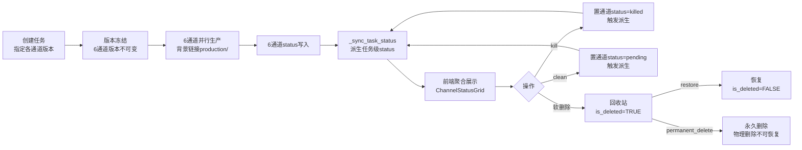

# 大模型质检-生产任务与版本配置业务流程梳理

> 本卡是大模型质检part 的**业务语义基准卡**。
> - 上位枢纽：[[质检一站式平台大模型质检模块整体架构]]
> - 现状来源：[[LLM任务调度Pipeline全景]] / [[任务级vs通道级status架构设计]]
> - 对标人工质检卡：[[人工质检-标注验收执行三阶段流程]]（粒度对标：三阶段定义 + 数据流图 + 执行粒度 + 12 条业务概念澄清）

---

## 1. 生产任务业务语义

### 1.1 定义

**任务 = 一次大模型数据生产请求**。一个任务包含 6 个通道（raw_img / label / pkl / video / prompt / inference）的并行生产，任务级 status 由 6 通道 status 派生。

### 1.2 关键属性

- 任务创建时指定各通道版本（版本在创建时冻结，后续不可变）。
- 任务级 status 由 `_sync_task_status()` 派生，禁止直接写。
- 6 通道并行执行（生产链路 [[src_llm_production_通道生产包]] 背景，不在本 part 设计）。
- 任务支持软删除（回收站）→ restore / permanent_delete 闭环。

---

## 2. 版本配置业务语义

### 2.1 定义

**版本 = 一组通道配置的快照**。version + channel 联合标识一条版本配置，UPSERT 语义（存在则更新不存在则插入）。

### 2.2 关键属性

- version + channel 为联合键（UNIQUE WHERE is_deleted=FALSE）。
- config（JSONB）存储通道配置，processor（`module.path:func_name`）仅 prompt 通道使用。
- 版本配置被任务创建时引用，但版本配置删除不影响已创建任务（版本在创建时冻结）。
- 编辑和创建共用同一端点（POST /api/llm/versions，UPSERT）。

---

## 3. 数据流 Mermaid

### 3.1 生产任务数据流



### 3.2 版本配置数据流


---

## 4. 操作闭环定义

### 4.1 生产任务操作闭环

```
pending → running → completed/failed/killed
                ↓
           软删除（is_deleted=TRUE）
                ↓
           回收站
           ├→ restore（is_deleted=FALSE，回到正常状态）
           └→ permanent_delete（物理删除，不可恢复）
```

### 4.2 版本配置操作闭环

```
CRUD + UPSERT：
- POST /api/llm/versions（UPSERT：创建或编辑）
- GET /api/llm/versions（列表，OFFSET 分页）
- GET /api/llm/versions/{id}（详情）
- DELETE /api/llm/versions/{id}（软删除，is_deleted=TRUE）
```

---

## 5. 业务概念澄清（≥8 条）

| # | 业务概念 | 澄清 |
|---|---------|------|
| 1 | 任务级 status 不可直接写必须派生 | `t_llm_task.status` 由 `_sync_task_status()` 唯一写入，禁止业务代码直接 UPDATE status 字段。派生规则：任一 killed → killed；任一 failed → failed；任一 running → running；全部 completed → completed；全部 pending → pending。 |
| 2 | 6 通道 version 在创建时冻结不可变 | 任务创建时指定各通道版本（data_version / label_version / pkl_version / video_config_version / prompt_version / model_version），创建后不可修改。后续版本配置变更不影响已创建任务。 |
| 3 | 版本配置删除不影响已创建任务 | 版本配置软删除仅标记 `t_llm_version_config.is_deleted=TRUE`，已创建任务的 6 通道版本字段已冻结，不受版本配置删除影响。 |
| 4 | UPSERT 以 version+channel 为联合键 | 版本配置的 UPSERT 以 `version + channel` 为联合键（UNIQUE WHERE is_deleted=FALSE），存在则更新不存在则插入。编辑和创建共用同一端点。 |
| 5 | kill 置通道 status=killed 触发派生 | kill 操作将指定通道（或全部通道，[待人类补充]）status 置为 killed，触发 `_sync_task_status()` 重新派生任务级 status。kill 优先级最高（任一通道 killed → 任务级 killed）。 |
| 6 | restore 仅恢复 is_deleted=TRUE 的行 | restore 操作仅将 `is_deleted=TRUE` 的任务恢复为 `is_deleted=FALSE`，对 `is_deleted=FALSE` 的任务无操作（返回 None）。 |
| 7 | permanent_delete 不可恢复 | permanent_delete 物理删除任务（DELETE FROM），仅删 `is_deleted=TRUE` 的行（回收站中的任务），不可恢复。对 `is_deleted=FALSE` 的任务拒绝（返回 False）。 |
| 8 | 游标分页双向（cursor + prev_cursor） | 生产任务列表采用游标分页，补全 prev_cursor 实现双向翻页。next_cursor 指向下一页，prev_cursor 指向上一页（通过反向查询实现）。首页 prev_cursor=null，末页 next_cursor=null。 |
| 9 | 6 通道 status 聚合展示不设计通道本身 | ChannelStatusGrid 组件聚合展示 6 通道 status（6 圆点颜色映射），但 6 通道生产逻辑不纳入本 part 设计，仅背景链接 [[src_llm_production_通道生产包]] / [[BaseProducer 通道生产基类]] 的能力。 |
| 10 | OFFSET 分页用于版本配置（数据量小） | 版本配置数据量小，采用 OFFSET 分页（pageSize 默认 20）简单高效；生产任务数据量大采用游标分页。分页范式选用决策在 [[大模型质检-API契约与前端交互设计]] 显式声明。 |

---

## 关联卡片

- [[质检一站式平台大模型质检模块整体架构]] — 上位枢纽
- [[LLM任务调度Pipeline全景]] — 现状来源
- [[任务级vs通道级status架构设计]] — status 派生架构决策
- [[大模型质检-生产任务设计]] — 生产任务设计卡
- [[大模型质检-版本配置设计]] — 版本配置设计卡
- [[大模型质检-API契约与前端交互设计]] — API 契约卡
- [[人工质检-标注验收执行三阶段流程]] — 对标人工质检业务流程卡

### 归属
- [[质检一站式平台大模型质检模块整体架构]] — 上位枢纽
