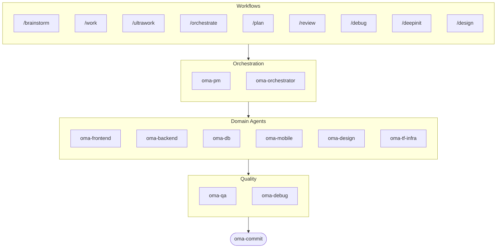

Source: https://raw.githubusercontent.com/first-fluke/oh-my-ag/main/README.md

---

[](https://www.npmjs.com/package/oh-my-agent) [](https://www.npmjs.com/package/oh-my-agent) [](https://github.com/first-fluke/oh-my-agent) [](https://github.com/first-fluke/oh-my-agent/blob/main/LICENSE) [](https://github.com/first-fluke/oh-my-agent/commits/main)

[한국어](./docs/README.ko.md) | [中文](./docs/README.zh.md) | [Português](./docs/README.pt.md) | [日本語](./docs/README.ja.md) | [Français](./docs/README.fr.md) | [Español](./docs/README.es.md) | [Nederlands](./docs/README.nl.md) | [Polski](./docs/README.pl.md) | [Русский](./docs/README.ru.md) | [Deutsch](./docs/README.de.md) | [Tiếng Việt](./docs/README.vi.md)

Ever wished your AI assistant had coworkers? That's what oh-my-agent does.

Instead of one AI doing everything (and getting confused halfway through), oh-my-agent splits work across **specialized agents** — frontend, backend, QA, PM, DB, mobile, infra, debug, design, and more. Each one knows its domain deeply, has its own tools and checklists, and stays in its lane.

Works with all major AI IDEs: Antigravity, Claude Code, Cursor, Gemini CLI, Codex CLI, OpenCode, and more.

## Quick Start
```bash
# One-liner (auto-installs bun & uv if missing)
curl -fsSL https://raw.githubusercontent.com/first-fluke/oh-my-agent/main/cli/install.sh | bash

# Or manual
bunx oh-my-agent@latest
```

`install.sh` supports macOS/Linux only. On Windows, install `bun` and `uv` manually, then run `bunx oh-my-agent@latest`.

Pick a preset and you're ready:

| Preset | What You Get |
|--------|-------------|
| ✨ All | Every agent and skill |
| 🌐 Fullstack | frontend + backend + db + pm + qa + debug + brainstorm + commit |
| 🎨 Frontend | frontend + pm + qa + debug + brainstorm + commit |
| ⚙️ Backend | backend + db + pm + qa + debug + brainstorm + commit |
| 📱 Mobile | mobile + pm + qa + debug + brainstorm + commit |
| 🚀 DevOps | tf-infra + dev-workflow + pm + qa + debug + brainstorm + commit |

## Your Agent Team
| Agent | What They Do |
|-------|-------------|
| **oma-backend** | APIs in Python, Node.js, or Rust |
| **oma-brainstorm** | Explores ideas before you commit to building |
| **oma-commit** | Clean conventional commits |
| **oma-db** | Schema design, migrations, indexing, vector DB |
| **oma-debug** | Root cause analysis, fixes, regression tests |
| **oma-design** | Design systems, tokens, accessibility, responsive |
| **oma-dev-workflow** | CI/CD, releases, monorepo automation |
| **oma-frontend** | React/Next.js, TypeScript, Tailwind CSS v4, shadcn/ui |
| **oma-mobile** | Flutter cross-platform apps |
| **oma-orchestrator** | Parallel agent execution via CLI |
| **oma-pdf** | PDF to Markdown conversion |
| **oma-pm** | Plans tasks, breaks down requirements, defines API contracts |
| **oma-qa** | OWASP security, performance, accessibility review |
| **oma-tf-infra** | Multi-cloud Terraform IaC |
| **oma-translator** | Natural multilingual translation |

## How It Works
Just chat. Describe what you want and oh-my-agent figures out which agents to use.

```
You: "Build a TODO app with user authentication"
→ PM plans the work
→ Backend builds auth API
→ Frontend builds React UI
→ DB designs schema
→ QA reviews everything
→ Done: coordinated, reviewed code
```

Or use slash commands for structured workflows:

| Command | What It Does |
|---------|-------------|
| `/plan` | PM breaks down your feature into tasks |
| `/work` | Step-by-step multi-agent execution |
| `/orchestrate` | Automated parallel agent spawning |
| `/ultrawork` | 5-phase quality workflow with 11 review gates |
| `/review` | Security + performance + accessibility audit |
| `/debug` | Structured root-cause debugging |
| `/design` | 7-phase design system workflow |
| `/brainstorm` | Free-form ideation |
| `/commit` | Conventional commit with type/scope analysis |

**Auto-detection**: You don't even need slash commands — keywords like "plan", "review", "debug" in your message (in 11 languages!) auto-activate the right workflow.

## CLI
```bash
# Install globally
bun install --global oh-my-agent   # or: brew install oh-my-agent

# Use anywhere
oma doctor                  # Health check
oma dashboard               # Real-time agent monitoring
oma agent:spawn backend "Build auth API" session-01
oma agent:parallel -i backend:"Auth API" frontend:"Login form"
```

## Why oh-my-agent?
> [Read why →](https://github.com/first-fluke/oh-my-agent/issues/155#issuecomment-4142133589)

- **Portable** — `.agents/` travels with your project, not trapped in one IDE
- **Role-based** — Agents modeled like a real engineering team, not a pile of prompts
- **Token-efficient** — Two-layer skill design saves ~75% of tokens
- **Quality-first** — Charter preflight, quality gates, and review workflows built in
- **Multi-vendor** — Mix Gemini, Claude, Codex, and Qwen per agent type
- **Observable** — Terminal and web dashboards for real-time monitoring

## Architecture


## Learn More
- **[Detailed Documentation](./docs/AGENTS_SPEC.md)** — Full technical spec and architecture
- **[Supported Agents](./docs/SUPPORTED_AGENTS.md)** — Agent support matrix across IDEs
- **[Web Docs](https://first-fluke.github.io/oh-my-agent/)** — Guides, tutorials, and CLI reference

## Sponsors
This project is maintained thanks to our generous sponsors.

> **Like this project?** Give it a star!
>
> ```bash
> gh api --method PUT /user/starred/first-fluke/oh-my-agent
> ```
>
> Try our optimized starter template: [fullstack-starter](https://github.com/first-fluke/fullstack-starter)

<a href="https://github.com/sponsors/first-fluke">
  
</a>
<a href="https://buymeacoffee.com/firstfluke">
  
</a>

### 🚀 Champion
<!-- Champion tier ($100/mo) logos here -->

### 🛸 Booster
<!-- Booster tier ($30/mo) logos here -->

### ☕ Contributor
<!-- Contributor tier ($10/mo) names here -->

[Become a sponsor →](https://github.com/sponsors/first-fluke)

See [SPONSORS.md](./SPONSORS.md) for a full list of supporters.

## Star History
[](https://www.star-history.com/#first-fluke/oh-my-agent&type=date&legend=bottom-right)

## License
MIT

