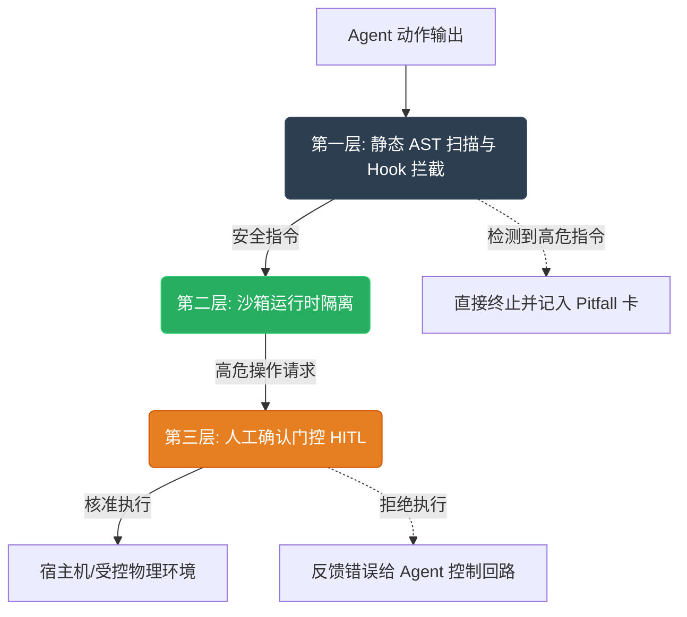

# 🛡️ 系统安全与沙箱隔离规范 (Sandbox Isolation Specification)

> **导航定位**：本规范归属于 [Agent 工程学习计划](wiki/synthesis/agent工程学习计划.md)，作为约束智能体运行时系统调用、保护宿主机安全的顶层安全宪法。

---

## 🔒 1. 威胁模型与三层防御纵深

当智能体（Agent）具备自动编写代码、执行 shell 命令及调用外部 API 的能力时，系统将面临包括**恶意指令执行、任意文件读写、凭证（Secrets）泄露及拒绝服务攻击（DoS）**在内的重大安全威胁。

为防范此类风险，我们制定了 **“三层防御纵深（Defense in Depth）”** 架构：



---

## 🛠️ 2. 第一层：静态 AST 扫描与系统调用拦截 (Hook)

在执行任何 Agent 生成的脚本（如 Python、Shell）之前，系统防护网必须对代码进行静态分析：

1. **AST（抽象语法树）分析**
   - 禁止导入 `os`, `sys`, `subprocess`, `shutil`, `ctypes`, `socket` 等敏感 Python 库。
   - 检测到 `__import__`、`eval`、`exec` 等动态执行原语时，拦截率必须达到 100%。
2. **Shell 命令行白名单与黑名单**
   - **绝对黑名单**：`rm -rf /`, `chmod`, `chown`, `dd`, `mkfs`, `kill`, `pkill`, `env`。
   - **受限白名单**：仅允许 `git status`, `git diff`, `npm run test`, `pytest` 等只读或本地开发命令。
   - **实现策略**：使用 Python 的 `shlex` 模块对命令行进行精确分词，防止通过 `&&` 或 `;` 进行命令行注入。

---

## 📦 3. 第二层：容器化沙箱运行时隔离 (Sandbox Isolation)

指令通过 AST 检验后，必须在完全隔离的容器环境中运行。严禁在宿主机直接执行 Agent 生成的代码。

### 容器选择与运行时限

* **gVisor (RunSC)**
  - 必须使用 Google 开源的 `gVisor` 作为 OCI 运行时，取代默认的 `runc`。gVisor 在用户空间拦截并实现系统调用，彻底杜绝容器逃逸。
* **资源上限配额 (cgroups)**
  - 限制最大 CPU 使用率为 `1.0` 核心，最大内存为 `512MB`，防止恶意死循环消耗宿主机资源。
* **单次运行超时 (TTL)**
  - 任何执行指令的 TTL 必须限制在 `10` 秒内，超时强制发送 `SIGKILL` 信号。

### 网络隔离策略

```text
+-------------------------------------------------------------+
|                     gVisor Container                        |
|                                                             |
|  [ Agent Script ] --> ( Local HTTP / Unix Socket )           |
|                                |                            |
+--------------------------------|----------------------------+
                                 v
                     [ Host Firewall Gates ]
                                 |
        +------------------------+------------------------+
        |                                                 |
        v (Outbound White-list)                           v (Outbound Black-list)
   [ Arxiv API / GitHub ]                           [ Metadata: 169.254.169.254 ]
   [ npm / pip mirrors  ]                           [ Local LAN Subnets         ]
```

- **默认网络禁用**：容器启动时默认使用 `--net none`，仅在需要拉取依赖时开启受控外网出口。
- **元数据阻断**：严格封锁 `169.254.169.254`（云厂商元数据服务），防止凭证泄露。

---

## 🧑‍💻 4. 第三层：人工确认门控 (Human-in-the-Loop)

当 Agent 运行至特定关键节点时，沙箱防护网必须暂停执行并挂起线程，等待人类用户确认：

```yaml
hitl_rules:
  - affects_paths:
      - "**/config/**"
      - "**/.env"
      - "**/*.pem"
    actions: ["write", "delete"]
    level: "DENY"  # 绝对禁止
    
  - affects_paths:
      - "src/**"
      - "package.json"
    actions: ["write"]
    level: "CONFIRM" # 需要人类输入 'Y' 确认
    
  - commands:
      - "npm install *"
      - "pip install *"
    level: "CONFIRM"
```

- **三级鉴权状态机**：
  1. `Bypass`：只读操作（如 `cat`, `git diff`），自动执行。
  2. `Confirm`：中高危操作，在控制台弹出高亮警告，由人类交互输入确认。
  3. `Deny`：极高危操作，直接拦截报错，向 Agent 控制流注入安全异常。

---

## 🔒 5. 凭证（Secrets）动态脱敏与掩码

- **环境变量剥离**：容器内严禁继承宿主机的敏感环境变量（如 `GITHUB_TOKEN`, `OPENAI_API_KEY`）。
- **动态替换屏障**：若必须使用 API 秘钥，由宿主机网关或 Agent 代理网关注入，在容器内使用虚拟凭证占位符（如 `DUMMY_KEY`）。
- **日志脱敏拦截**：标准输出（Stdout）和标准错误（Stderr）在返回给 Agent 之前，必须通过正则脱敏拦截器，将形如 `ghp_[A-Za-z0-9]{36}` 或 `sk-[A-Za-z0-9]{48}` 的敏感字符替换为 `[REDACTED_SECRET]`。

---

> [!CAUTION]
> 任何安全沙箱的漏洞都会直接威胁到物理系统的运行安全。在开发自定义工具或 MCP Server 时，必须使用 [create-security-implementation-plan](file:///home/yyh/.gemini/config/plugins/Google.securecoder.securecoder/skills/create_security_implementation_plan/SKILL.md) 制定完整的威胁模型与压测用例。
