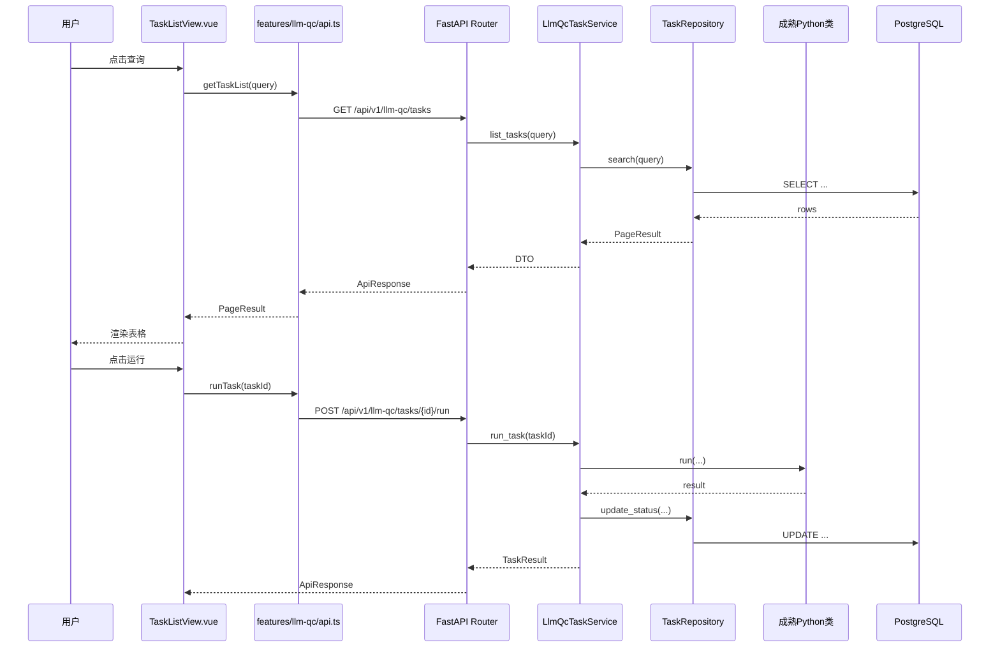

# NotebookLM原文12-Router API View与Python业务编排指南

## 来源追踪

- 来源总卡：[[notebooklm_quality_check_pipeline]]
- 原始文件：[原始 Markdown](../../../raw/notebooklm_exports/6b4b949e-d423-4033-b16f-bd037ac03fa8/12_81a78ff9-6cfc-49af-b5c8-98f321a1d9c2.md)
- source_id：`81a78ff9-6cfc-49af-b5c8-98f321a1d9c2`
- SHA-256：`94a1dbcd58cd3534d2504b2099d93d6885cb37d218fdc951d7d602fc7f9d50d3`
- 原始字节数：8944

## 原文（逐字符保留）

<!-- ORIGINAL_START -->
---
id: "SYN-QC-ROUTER-001"
title: "Router API View与Python业务编排指南"
domain: ["manual_qa", "auto_qa", "llm_qa"]
type: "synthesis"

related_code: ["src/api/", "src/frontend/", "src/database/", "src/config/"]
affects_path: ["src/api/", "src/frontend/"]
trigger_keywords: ["router", "api", "view", "前后端", "Python类", "业务编排", "FastAPI路由", "Vue页面"]
tags: ["前端", "后端", "Router", "API", "View", "FastAPI", "Vue3", "Python业务编排"]
summary: "解答Router/API/View三者含义、成熟Python类如何被前端复用、Application Service编排层的设计原理，以及完整的调用链代码位置。"
---

# Router API View与Python业务编排指南

> ⚠️ 本卡通用部分已上移至[[质检一站式平台顶层架构]]，本卡归档保留为历史决策记录，不再活跃引用。新设计请以顶层架构卡 §4 / §5 为准。

本卡回答：Router、API、View 是什么；成熟 Python 类如何被前端复用；"编排"到底写在哪里。

## 1. 三个词先讲清楚

| 名词 | 在哪里 | 一句话 | Python 类比 |
|---|---|---|---|
| View | 前端 `views/*.vue` | 用户看到和操作的页面 | 命令行脚本的交互入口 |
| API | 前端 `api.ts` + 后端 HTTP 接口 | 前后端之间的函数调用契约 | Python 函数签名 |
| Router | 前端 Vue Router / 后端 FastAPI Router | URL 到页面或函数的映射 | Flask/FastAPI 路由装饰器 |

同一个词在前后端可能各有一层：

```text
浏览器 URL /llm-qc/tasks
  -> 前端 Router 匹配 TaskListView.vue
  -> View 调用 features/llm-qc/api.ts
  -> api.ts 发 HTTP GET /api/v1/llm-qc/tasks
  -> 后端 Router 匹配 list_tasks()
  -> list_tasks() 调用 Python Application Service
  -> Service 调用你已有的 Python 类
```

## 2. 前端能不能直接复用 Python 类

不能直接复用。

原因：前端代码运行在用户浏览器里，Python 类运行在后端服务器里。浏览器不能直接 `import SomePythonClass`。

正确复用方式：

```text
Python 类能力 -> 后端 Application Service 封装 -> FastAPI Router 暴露 HTTP API -> 前端 api.ts 调用 -> View 展示结果
```

如果你已经有成熟 Python 类，例如：

```python
class LlmQualityChecker:
    def run(self, clip_id: str, version: str) -> dict:
        ...
```

不要在 router 里直接散写实例化逻辑。应放到 application service：

```python
class LlmQcTaskService:
    def __init__(self, checker: LlmQualityChecker):
        self.checker = checker

    def run_task(self, command: RunTaskCommand) -> TaskResult:
        result = self.checker.run(
            clip_id=command.clip_id,
            version=command.version,
        )
        return TaskResult.from_checker_result(result)
```

Router 只做 HTTP：

```python
@router.post("/tasks/{task_id}/run")
def run_task(task_id: int, service: LlmQcTaskService = Depends(get_llm_qc_service)):
    result = service.run_task(RunTaskCommand(task_id=task_id))
    return {"code": 0, "message": "success", "data": result}
```

## 3. 为什么要有 Application Service

Application Service 是"用例编排层"。它负责把一个用户动作拆成多个后端步骤。

例如"创建并运行大模型质检任务"：

```text
1. 校验请求参数
2. 查询版本配置
3. 创建任务记录
4. 调用成熟 Python 类或调度器
5. 写入任务状态
6. 返回前端需要的 DTO
```

这些步骤不该放在 router，因为 router 会膨胀；也不该放在 Python 底层类里，因为底层类应该保持单一职责。

推荐结构：

```text
src/llm_qc/
├── application/
│   └── task_service.py      # 编排用户用例
├── domain/
│   └── task.py              # 任务状态、状态迁转规则
├── repositories/
│   └── task_repository.py   # SQL
├── adapters/
│   └── quality_checker.py   # 包装已有 Python 类
└── ports.py                 # 接口/协议
```

## 4. View、api.ts、后端 router 的输入输出

### 4.1 View

输入：用户操作、路由参数、组件状态。

输出：调用 `api.ts`，更新页面状态。

```vue
<script setup lang="ts">
import { onMounted, ref } from 'vue'
import { getTaskList } from '../api'
import type { Task } from '../types'

const tasks = ref<Task[]>([])
const loading = ref(false)

async function loadTasks() {
  loading.value = true
  try {
    const page = await getTaskList({ page: 1, size: 20 })
    tasks.value = page.items
  } finally {
    loading.value = false
  }
}

onMounted(loadTasks)
</script>
```

### 4.2 前端 api.ts

输入：TypeScript 参数。

输出：类型化数据。

```ts
import { request } from '@/shared/api/http'
import type { PageResult, Task, TaskQuery } from './types'

export function getTaskList(params: TaskQuery) {
  return request.get<PageResult<Task>>('/api/v1/llm-qc/tasks', { params })
}
```

### 4.3 后端 Router

输入：HTTP query/body/path。

输出：统一 API 响应。

```python
@router.get("/tasks")
def list_tasks(
    page: int = Query(1, ge=1),
    size: int = Query(20, ge=1, le=100),
    service: LlmQcTaskService = Depends(get_llm_qc_service),
):
    result = service.list_tasks(page=page, size=size)
    return {"code": 0, "message": "success", "data": result}
```

### 4.4 Application Service

输入：业务命令或查询对象。

输出：业务 DTO。

```python
class LlmQcTaskService:
    def __init__(self, repository: TaskRepository):
        self.repository = repository

    def list_tasks(self, page: int, size: int) -> dict:
        return self.repository.search(page=page, size=size)
```

## 5. Router 的两种含义

### 前端 Router

负责 URL 到页面。

```ts
{
  path: '/llm-qc/tasks',
  name: 'llm-qc-tasks',
  component: () => import('./views/TaskListView.vue'),
  meta: { title: '大模型质检任务' },
}
```

用户打开 `/llm-qc/tasks`，Vue Router 加载 `TaskListView.vue`。

### 后端 Router

负责 HTTP URL 到 Python 函数。

```python
router = APIRouter(prefix="/api/v1/llm-qc", tags=["大模型质检"])

@router.get("/tasks")
def list_tasks(...):
    ...
```

前端请求 `/api/v1/llm-qc/tasks`，FastAPI Router 调用 `list_tasks()`。

## 6. 一个功能完整调用链



## 7. 开发时文件放哪里

| 你要写的东西 | 放哪里 |
|---|---|
| 页面 | `src/frontend/src/features/<module>/views/` |
| 页面内部组件 | `src/frontend/src/features/<module>/components/` |
| 前端接口函数 | `src/frontend/src/features/<module>/api.ts` |
| 前端类型 | `src/frontend/src/features/<module>/types.ts` |
| 前端路由 | `src/frontend/src/features/<module>/routes.ts` |
| HTTP 通用封装 | `src/frontend/src/shared/api/http.ts` |
| 后端 HTTP 路由 | `src/api/routers/<module>.py` |
| 后端请求响应模型 | `src/api/schemas/<module>.py` |
| Python 业务编排 | `src/<module>/application/` |
| Python 业务规则 | `src/<module>/domain/` |
| 数据库访问 | `src/<module>/repositories/` |
| 复用已有 Python 类 | `src/<module>/adapters/` 或 application service 注入 |

## 8. 设计约束

- 前端不能直接复用 Python 类，只能通过 HTTP API 使用后端能力。
- Router 不实例化复杂业务类，实例化由 `deps.py` 或 service factory 负责。
- 成熟 Python 类不要直接暴露给前端；要用 Application Service 转成稳定业务接口。
- 前端 `View` 不直接使用 axios，必须通过 `api.ts`。
- 后端 `Repository` 不写业务规则，只写持久化。
- 领域规则不依赖 FastAPI 和数据库。

## 关联卡片

- [[HUB-质检前后端一体化]]
- [[质检前后端一体化理想架构设计]]
- [[FastAPI应用入口与依赖注入层]]
- [[前端开发规范]]
- [[质检页签端到端开发流程指南]]

### 归属
- [[HUB-质检前后端一体化]] — 本卡片所属质检前后端一体化域总入口<!-- ORIGINAL_END -->
