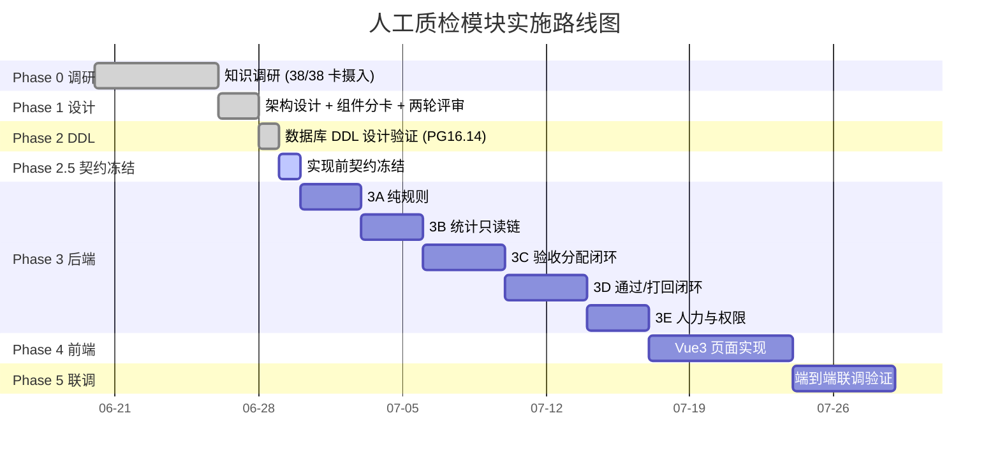

# NotebookLM原文17-质检平台-人工质检模块实施计划

## 来源追踪

- 来源总卡：[[notebooklm_quality_check_pipeline]]
- 原始文件：[原始 Markdown](../../../raw/notebooklm_exports/6b4b949e-d423-4033-b16f-bd037ac03fa8/17_a9fa6121-84c0-4f56-9e95-43a1a5438318.md)
- source_id：`a9fa6121-84c0-4f56-9e95-43a1a5438318`
- SHA-256：`611a2d6142a8ca6c1066677aff6c4d239fc0cad524d5f656ed0fcc1d46082d52`
- 原始字节数：21459

## 原文（逐字符保留）

<!-- ORIGINAL_START -->
---
title: "质检平台-人工质检模块实施计划"
domain: ["manual_qa"]
type: "synthesis"
tags: ["质检平台", "实施计划", "Phase", "路线图", "完成情况", "实现契约", "拆解清单", "风险", "进度交互中枢", "Delta契约摘要", "待决疑问"]
created: 2026-06-30
updated: 2026-07-03
status: active
sources: 6
source: "合并自 实施路线与当前进度 / 快照刷新四级实现契约 / 验收全流程拆解框架 + 旧版源码(data_check_debug)Delta接口事实提取"
related_code:
  - "src/manual_qc/repository.py"
  - "src/manual_qc/service.py"
  - "src/manual_qc/__init__.py"
  - "data_schemas/migrations/V20260630_01__create_personnel_and_permission_tables.sql"
  - "data_schemas/migrations/V20260630_02__create_qc_daily_snapshot_table.sql"
  - "data_schemas/migrations/V20260630_03__redesign_qc_snapshot_and_personnel.sql"
  - "data_schemas/postgresql_relational/t_personnel.sql"
  - "data_schemas/postgresql_relational/t_personnel_op_log.sql"
  - "data_schemas/postgresql_relational/t_portal_permission.sql"
  - "data_schemas/postgresql_relational/t_qc_daily_snapshot.sql"
affects_path: ["src/manual_qc/", "data_schemas/postgresql_relational/", "data_schemas/migrations/"]
trigger_keywords: ["实施计划", "路线图", "Phase 2.5", "Phase 3", "完成情况", "四级契约", "拆解清单", "下一步", "风险", "进度交互中枢", "Delta契约摘要", "待决疑问", "已闭合结论"]
summary: "质检平台人工质检模块实施计划总卡（进度交互中枢）：Phase 0~5 全景路线图、精确完成情况矩阵（文件/字段/方法级）、事实源偏差修正、Delta接口契约摘要、待决疑问区（详背景模式）、已闭合结论、风险更新。合并自原 3 张 plan 卡，作为唯一实施计划事实源与人类交互决策入口。"
---

# 质检平台-人工质检模块实施计划

> 本卡是人工质检模块唯一的实施计划事实源与**进度交互中枢**，合并自原 3 张 plan 卡（[[质检平台-实施路线与当前进度]] / [[验收前置条件-快照刷新四级实现契约]] / [[SYN-验收全流程细化后续拆解框架]]）。原 3 卡已标记废弃重定向，保留为历史归档。
>
> 本卡定位为"进度交互中枢 + 摘要"：人类在此卡可看懂所有进展细节（文件/字段/方法级）、所有待决疑问的完整背景（含旧版源码事实），并直接在卡内交互决策。Delta 接口契约全文不在本卡展开，见 §5 摘要表 + 链接到组件卡全文。

← 架构总入口：[[质检一站式平台人工质检模块整体架构]]

## 双向链接索引（相关组件卡）

| #   | 组件卡                         | 本卡引用位置             | 用途                           |
| --- | --------------------------- | ------------------ | ---------------------------- |
| 1   | [[质检平台-综合快照表设计]]            | 完成情况矩阵 / 疑问2       | t_qc_daily_snapshot DDL 与字段集 |
| 2   | [[人工质检-人力管理体系设计]]           | 完成情况矩阵             | t_personnel SCD Type2 设计     |
| 3   | [[质检平台-Repository与数据库访问设计]] | 完成情况矩阵 / 代码骨架      | Repository 分层与陷阱卡            |
| 4   | [[质检平台-Delta调用与状态回查设计]]     | Delta契约摘要表 / 疑问2/5 | Delta 接口全文（回链目标）             |
| 5   | [[质检平台-通过打回规则与执行设计]]        | 疑问4 / 决策3/5        | 通过打回规则与执行                    |
| 6   | [[质检平台-验收采样配额与任务选择设计]]      | 疑问4 / 决策1/2        | 采样配额与任务选择                    |
| 7   | [[人工质检-标注验收执行三阶段流程]]        | 已闭合结论(疑问3)         | 执行范围架构护栏                     |
| 8   | [[验收前置条件-快照刷新四级实现契约]]       | 完成情况矩阵 / 代码骨架      | 快照刷新四级契约                     |

> 动态权威：仓库根目录 `task.md`、`implementation_plan.md`（如存在）。本卡方便沿知识图谱阅读，不取代 `task.md`。状态变化先更新 `task.md`，再同步本卡摘要，避免两套进度事实源。

---

## §1 元信息与整体路线图

人工质检模块按 Phase 0~5 推进，从知识调研到联调验证，整体脉络如下：



**路线图核心脉络**：

1. **Phase 0 知识调研**：完成本项目人工质检流程卡 38/38 摄入，建立完整知识图谱。
2. **Phase 1 架构设计**：完成总卡、组件分卡、两轮评审决策，确立"一枢纽 + 一 Plan + N 组件卡"知识体系。
3. **Phase 2 数据库 DDL**：完成 4 张表的设计验证，migration 在 PostgreSQL 16.14 空实例执行通过。
4. **Phase 2.5 实现前契约冻结**：冻结粒度、权限、目录边界；Delta 真实字段已从旧版源码（`data_check_debug/data_check`）提取并写入组件卡（见 §5）。本卡即 Phase 2.5 的核心交付物之一。
5. **Phase 3 后端 Python**：按 3A→3B→3C→3D→3E 五级纵切顺序推进（详见 §2.3）。
6. **Phase 4 前端 Vue3**：已有页面与状态设计，无业务页面实现，按 [[质检平台-人工质检前端页面与状态设计]] 落地。
7. **Phase 5 联调验证**：以用户链路为准进行端到端联调，不以"Swagger 能打开"代替端到端成功。

---

## §2 精确完成情况矩阵

### 2.1 各 Phase 完成状态

| Phase | 内容 | 当前状态 | 证据 |
|---|---|---|---|
| 0 | 知识调研 | ✅ 完成 | 本项目人工质检流程卡 38/38 摄入 |
| 1 | 架构设计 | ✅ 完成当前版 | 总卡、组件分卡、两轮评审决策 |
| 2 | 数据库 DDL | ✅ 完成设计验证 | 3 份 migration 在 PostgreSQL 16.14 空实例执行通过；4 张表 SQL 已落地 `data_schemas/postgresql_relational/` |
| 2.5 | 实现前契约冻结 | 🟡 进行中 | 粒度、权限、目录边界已定；repository.py/service.py 契约骨架已落地（冻结）；Delta 调用层、通过打回执行层、采样配额层事实已填入组件卡但待人类决策（见 §6） |
| 3 | 后端 Python | 🟡 骨架已落地 | `src/manual_qc/` 含 `__init__.py`(638B) / `repository.py`(14347B, 359行) / `service.py`(4424B, 107行)，方法体均为 `raise NotImplementedError` |
| 4 | 前端 Vue3 | ❌ 未开始 | 已有页面与状态设计，无业务页面实现 |
| 5 | 联调验证 | ❌ 未开始 | 等待后端、前端和测试环境 |

### 2.2 各组件完成状态矩阵

| 层级 | 组件 | 设计卡 | 完成状态 | 备注 |
|---|---|---|---|---|
| 数据层 | 综合快照表 | [[质检平台-综合快照表设计]] | ✅ 设计完成 / DDL 已落地（V20260630_03 重设计） | t_qc_daily_snapshot 26字段7索引 |
| 数据层 | 人力管理三表 | [[人工质检-人力管理体系设计]] | ✅ 设计完成 / DDL 已落地（SCD Type2） | t_personnel 13字段4索引 / t_personnel_op_log 6字段4索引 / t_portal_permission 8字段3索引 |
| Repository | 数据库访问 | [[质检平台-Repository与数据库访问设计]] | 🟡 契约骨架已冻结 / 方法体未实现 | repository.py(359行)：10 dataclass + 16 方法签名，`raise NotImplementedError` |
| Service | 统计聚合 | [[验收前置条件-快照刷新四级实现契约]] | 🟡 契约骨架已冻结 / 方法体未实现 | service.py(107行)：StatService + PROJECT_MAP + 4 方法签名 |
| Service | 采样配额 | [[质检平台-验收采样配额与任务选择设计]] | 🟡 设计完成 / 旧版事实已填入 / 待人类决策 | 见 §6 决策1/2 |
| Service | 通过打回规则 | [[质检平台-通过打回规则与执行设计]] | 🟡 设计完成 / 旧版事实已填入 / 待人类决策 | 见 §6 决策3/5 |
| Service | Delta 调用 | [[质检平台-Delta调用与状态回查设计]] | 🟡 设计完成 / Delta 契约全文已填入 / 待人类决策 | 见 §5 / §6 疑问2 |
| DAG | Airflow 调度 | [[验收前置条件-快照刷新四级实现契约]] | ❌ 未实现 | qc_snapshot_refresh.py |
| API | FastAPI 路由 | [[质检平台-API契约与前端交互设计]] | 🟡 设计完成 / 未实现 | 权限校验接入待定 |
| 前端 | Vue3 页面 | [[质检平台-人工质检前端页面与状态设计]] | 🟡 设计完成 / 未实现 | — |
| 鉴权 | SSO 接入 | [[质检平台SSO鉴权接入方案]] | 🟡 设计完成 / 未实现 | mock 阶段 |
| 概念 | scene_name | [[质检平台-scene_name概念]] | ✅ 概念冻结 | — |
| 后端分层 | 组件边界 | [[质检平台-后端分层与组件边界设计]] | ✅ 分层原则冻结 | — |

### 2.3 代码骨架精确描述

#### repository.py（359 行，14347 字节）

**文件路径**：`src/manual_qc/repository.py`
**关联陷阱卡**：PIT-PGC-001（写操作禁 `execute_query`，用 `execute_values`）/ PF-DB-015（`.get('database')` 访问）/ PF-LEGACY-ACCEPTANCE-CODE-ARCH（禁 f-string 拼 SQL，禁临时表）

**10 个 dataclass**：

| # | dataclass | 用途 | 关键字段 |
|---|-----------|------|---------|
| 1 | `SnapshotRow` | t_qc_daily_snapshot 个人最小行 | stat_date/scene_name/group_name/employee_id/project_name/annotation_*/option_annotation/acceptance_*/good_*/bad_*/option_acceptance |
| 2 | `SnapshotFilter` | 快照查询过滤 | stat_date_start/end/scene_name/group_name/employee_id/project_name（全可选） |
| 3 | `SnapshotDim` | 分布键 | stat_date/scene_name/group_name/employee_id |
| 4 | `ExecutionFields` | 执行确认字段集（UPSERT 禁触碰） | execution(JSONB)/confirmed_by/confirmed_at/executed_by/executed_at/good_conclusion/bad_conclusion |
| 5 | `GroupAggregateRow` | 按组聚合 | stat_date/scene_name/group_name + 计数 |
| 6 | `SceneAggregateRow` | 按场景聚合 | stat_date/scene_name + 计数 |
| 7 | `ProjectAggregateRow` | 按项目聚合（V20260630_03 新增） | stat_date/project_name + 计数 |
| 8 | `PersonnelRow` | t_personnel 行（SCD Type2） | employee_id/name/role/level/supplier/project_name/current_group/unit_price/status/join_date(PK)/leave_date |
| 9 | `PersonnelInfo` | 精简信息（get_current_groups 返回） | current_group/project_name |
| 10 | `OpLogEntry` | 操作日志条目 | operated_at/operator_id/employee_id/action/changes(JSONB) |

**16 个方法签名**（方法体均为 `raise NotImplementedError("Phase 3 待实现")`）：

| 类 | # | 方法 | 关键约束 |
|----|---|------|---------|
| SnapshotRepository | 1 | `__init__(pg_connector)` | DatabaseConfig 必须 `.get('database')` |
| | 2 | `fetch_annotation_raw(stat_date_range) -> List[Dict]` | JOIN sdobject 表，scene_name 经 SPLIT_PART 提取 |
| | 3 | `fetch_acceptance_raw(stat_date_range) -> List[Dict]` | task_status IN (67,68,69,70) |
| | 4 | `upsert_many(rows: List[SnapshotRow]) -> int` | execute_values，UPDATE SET 仅统计列，显式 updated_at=now() |
| | 5 | `list_minimum_rows(filters) -> List[SnapshotRow]` | 参数化 SQL |
| | 6 | `aggregate_by_group(filters) -> List[GroupAggregateRow]` | 通过率先求和再相除 |
| | 7 | `aggregate_by_scene(filters) -> List[SceneAggregateRow]` | 通过率先求和再相除 |
| | 8 | `aggregate_by_project(filters) -> List[ProjectAggregateRow]` | V20260630_03 新增维度 |
| | 9 | `get_for_rule_evaluation(dim) -> Optional[SnapshotRow]` | WHERE 含分布键 |
| | 10 | `update_execution_fields(dim, fields) -> int` | 仅更新非 None 字段，与 upsert_many 互斥 |
| PersonnelRepository | 11 | `__init__(pg_connector)` | 同上 |
| | 12 | `get_current_groups(employee_ids) -> Dict[str, PersonnelInfo]` | WHERE leave_date IS NULL |
| | 13 | `get_active_by_group(group_name) -> List[PersonnelRow]` | WHERE leave_date IS NULL AND current_group=%s |
| | 14 | `create_or_transition(personnel, operator_id) -> None` | SCD Type2 同事务封版+新增+op_log |
| | 15 | `append_op_log(log_entry) -> int` | 与人员变更同事务 |
| | 16 | `get_permission(employee_id) -> Optional[Dict]` | SSO 鉴权用 |

#### service.py（107 行，4424 字节）

**文件路径**：`src/manual_qc/service.py`

**类**：`StatService`（快照刷新聚合服务，不直接接触数据库，所有读写经 Repository）

**常量**：

```python
PROJECT_MAP = {
    "vpd质检标注_v4": "vpd",
    "驾驶行为质检": "城区and高速",
}
```

**4 个方法签名**（方法体均为 `raise NotImplementedError("Phase 3 待实现")`）：

| # | 方法 | 职责 |
|---|------|------|
| 1 | `__init__(snapshot_repo, personnel_repo)` | 注入两个 Repository |
| 2 | `_map_project_name(scene_name) -> str` | 遍历 PROJECT_MAP 键前缀匹配，无匹配返回 '' |
| 3 | `_merge_with_personnel(raw_rows, personnel_map) -> list` | task_screener→employee_id，查 current_group，未进组记空串，人员不存在跳过+warning |
| 4 | `refresh_snapshot(stat_date_range) -> int` | 8 步流程：校验→fetch_annotation→fetch_acceptance→合并→map_project→get_current_groups→merge→upsert_many |

### 2.4 数据表 DDL 精确状态

| 表名 | SQL 文件 | 字段数 | 索引数 | 测试镜像 | 备注 |
|------|---------|--------|--------|---------|------|
| t_personnel | `data_schemas/postgresql_relational/t_personnel.sql` | 13 | 4 | `t_personnel test.sql` | SCD Type2，复合 PK (employee_id, join_date) |
| t_personnel_op_log | `data_schemas/postgresql_relational/t_personnel_op_log.sql` | 6 | 4 | `t_personnel_op_log test.sql` | employee_id 逻辑引用 |
| t_portal_permission | `data_schemas/postgresql_relational/t_portal_permission.sql` | 8 | 3 | `t_portal_permission test.sql` | 模块等级权限 |
| t_qc_daily_snapshot | `data_schemas/postgresql_relational/t_qc_daily_snapshot.sql` | 26 | 7 | `t_qc_daily_snapshot test.sql` | V20260630_03 重设计后字段集 |

**迁移脚本**（`data_schemas/migrations/`）：

| 脚本 | 行数 | 内容 |
|------|------|------|
| `V20260630_01__create_personnel_and_permission_tables.sql` | 255 行（19246 字节） | t_personnel + t_personnel_op_log + t_portal_permission |
| `V20260630_02__create_qc_daily_snapshot_table.sql` | 209 行（16462 字节） | t_qc_daily_snapshot 初版 |
| `V20260630_03__redesign_qc_snapshot_and_personnel.sql` | 303 行（24194 字节） | 快照表重设计 + 人员表改 SCD Type2 + project_name 维度 |

> migration 顺序：V20260630_01（人员表先于快照表，因 t_qc_daily_snapshot.annotator_id 引用）< V20260630_02 < V20260630_03（重设计）。

### 2.5 Phase 2.5 契约冻结状态

| 契约维度 | 冻结状态 | 证据 |
|---------|---------|------|
| 粒度（快照最小行） | ✅ 已冻结 | 日 × scene × 当日组 × 标注员；不存 NULL 标注员汇总行 |
| 权限（模块等级） | ✅ 已冻结 | acceptance_access/personnel_access，禁每按钮 Boolean |
| 目录边界 | ✅ 已冻结 | `src/manual_qc/` 下 delta_client.py/repository.py/service.py/acceptance/ |
| Repository 契约骨架 | ✅ 已冻结 | repository.py(359行) 含 10 dataclass + 16 方法签名 + 约束注释 |
| Service 契约骨架 | ✅ 已冻结 | service.py(107行) 含 StatService + PROJECT_MAP + 4 方法签名 |
| Delta 调用层 | 🟡 事实已填入组件卡，待人类决策 | 见 §5 / §6 疑问2 |
| 通过打回执行层 | 🟡 旧版事实已填入组件卡，待人类决策 | 见 §6 决策3/5 |
| 采样配额层 | 🟡 旧版事实已填入组件卡，待人类决策 | 见 §6 决策1/2 |

> 冻结证据定义：契约骨架文件存在且含完整签名 + 实现约束注释，方法体为 `raise NotImplementedError`。

### 2.6 已冻结决策清单

- ✅ 快照最小行：日 × scene × 当日组 × 标注员；不存 NULL 标注员汇总行。
- ✅ 快照算采样配额，任务级表选择具体 task_ids。
- ✅ execute 使用 preview 原 task_ids，并在执行前重查状态。
- ✅ 外部操作后回查任务状态，实际量不等于请求量。
- ✅ 人员单项目，权限按模块等级。
- ✅ 数据结构就近定义、复用后上移。
- ✅ 共享 Repository 按数据源分小类；Delta 调用使用 `delta_client.py`。
- ✅ 不引入通用操作台账、ports/adapters 和数据库规则引擎。
- ✅ 快照刷新直接从 Delta 原始表聚合，不依赖中间表 `human_inspection_0920`。
- ✅ `t_personnel.project_name` 单值 VARCHAR(64)，禁 TEXT[] 数组。
- ✅ `group_name` 写入即冻结，调组不回写历史行。
- ✅ `t_personnel` SCD Type2（复合 PK (employee_id, join_date)，leave_date IS NULL = 当前有效行），V20260630_03 重设计去自增 id。
- ✅ 权限模块等级（acceptance_access/personnel_access），禁每按钮 Boolean。
- ✅ 文件命名：`service.py`(107行, 含 StatService) + `repository.py`(359行, 含 10 个 dataclass)，物理现状已既成事实（见 §7 已闭合结论）。

### 2.7 后续 8 子模块拆解清单

> 本段从 [[SYN-验收全流程细化后续拆解框架]] 提取。第一步「验收前置条件——统计快照表定时刷新机制」已完成设计（见 §3 四级契约），本段列出后续待逐一梳理的 8 个子模块清单。

| # | 子模块 | 职责 | 优先级 | 关键未冻结决策 | 映射 Phase |
|---|--------|------|--------|--------------|-----------|
| 1 | **采样引擎** | 根据 `t_qc_daily_snapshot` 的 `option_annotation` 分布计算 Good/Bad 抽样配额，从 Delta 查询表选取具体 task_ids | 高 | 见 §6 决策1/2/4 | Phase 3A |
| 2 | **规则判定引擎** | `PassRuleStrategy.evaluate(snapshot_row)` 计算 Good/Bad 通过率，判定 `conclusion = PASS/REJECT` | 高 | 见 §6 决策3/4 | Phase 3A |
| 3 | **Delta 调用封装** | 封装 5 接口（见 §5） | 高 | 见 §6 疑问2/5 | Phase 3C |
| 4 | **验收执行服务** | `ExecutionService.execute()` 调 Delta API 完成通过/打回 | 高 | 见 §6 决策5 | Phase 3C/3D |
| 5 | **后端 API 契约** | FastAPI 路由 | 中 | API 路径与请求/响应结构 | Phase 3B/3C/3D |
| 6 | **前端页面与状态** | Vue3 页面 | 中 | 见 [[质检平台-人工质检前端页面与状态设计]] | Phase 4 |
| 7 | **SSO 鉴权接入** | SSO JWT 解析 → `t_portal_permission` | 中 | SSO 回调 URL / JWT sub 映射 | Phase 3E |
| 8 | **人员与权限管理** | 人员 CRUD + op_log + 权限分配 | 中 | 见 §6 决策6 | Phase 3E |

### 2.8 Phase 3 纵切顺序

#### 3A：纯规则（sampler + pass_rules）

- **目标**：实现 sampler、pass_rules 和边界测试。
- **交付物**：`src/manual_qc/acceptance/sampler.py`、`src/manual_qc/acceptance/pass_rules.py` + 单元测试。
- **依赖**：无（此阶段不需要数据库和 Delta）。
- **验证标准**：纯规则测试覆盖阈值、数据不足和取整。

#### 3B：统计只读链（SnapshotRepository + StatService + 统计 API）

- **目标**：实现 SnapshotRepository、StatService、统计查询 API。
- **交付物**：repository.py 方法体实现、service.py 方法体实现、统计 API 路由 + 集成测试。
- **依赖**：3A（StatService 依赖数据结构定义）。
- **验证标准**：Repository 集成测试在真实 PostgreSQL 临时实例通过；FastAPI 启动，OpenAPI 展示当前端点。

#### 3C：验收分配闭环（preview → execute → fake Delta → 状态回查）

- **目标**：实现首条真正端到端验收路径。
- **交付物**：`src/manual_qc/acceptance/services/assignment_service.py`、`src/manual_qc/delta_client.py`（fake）、状态回查逻辑 + 集成测试。
- **依赖**：3B。
- **验证标准**：分配闭环覆盖成功、部分失败、重复执行。

#### 3D：通过/打回闭环（规则 preview + 人工确认 + 通过/打回调用）

- **目标**：实现通过/打回规则 preview、人工确认、通过/打回调用、状态回查。
- **交付物**：`src/manual_qc/acceptance/services/execution_service.py` + API + 集成测试。
- **依赖**：3C。
- **验证标准**：通过/打回拒绝 PENDING 和无权限用户。

#### 3E：人力与权限（人员 CRUD + op_log + 模块等级权限 + mock 身份）

- **目标**：实现人员 CRUD、调组日志、模块等级权限和 mock 身份。
- **交付物**：PersonnelRepository 方法体实现、权限校验中间件 + 集成测试。
- **依赖**：3B（PersonnelRepository 复用 Repository 基础设施）。
- **验证标准**：人员修改与 op_log 同一事务。

---<!-- ORIGINAL_END -->
