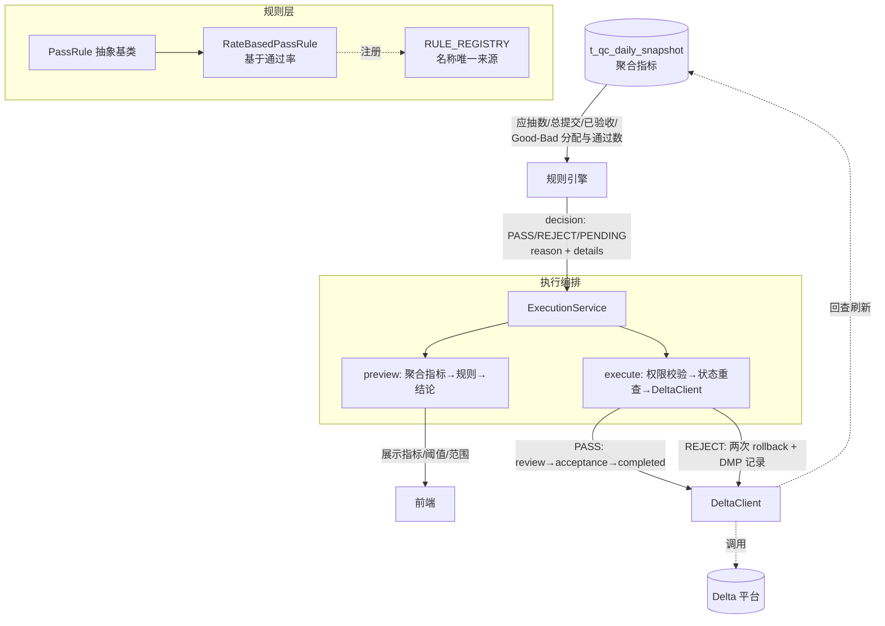
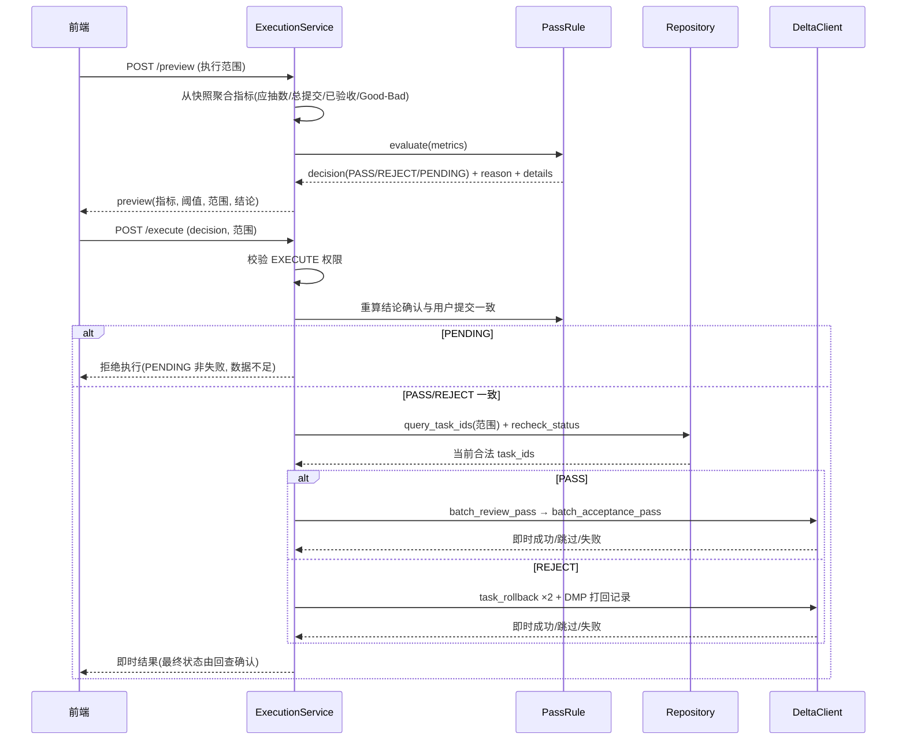

# NotebookLM原文21-质检平台-通过打回规则与执行设计

## 来源追踪

- 来源总卡：[[notebooklm_quality_check_pipeline]]
- 原始文件：[原始 Markdown](../../../raw/notebooklm_exports/6b4b949e-d423-4033-b16f-bd037ac03fa8/21_c34bb6e9-0917-44ae-95ec-bd4dd9fc1a5b.md)
- source_id：`c34bb6e9-0917-44ae-95ec-bd4dd9fc1a5b`
- SHA-256：`b0aed512e789713e7325d50cdc33d6fada12464ba1ebfe5a0e82dda19c3f3a75`
- 原始字节数：15130

## 原文（逐字符保留）

<!-- ORIGINAL_START -->
---
title: "质检平台-通过打回规则与执行设计"
domain: ["manual_qa"]
type: "synthesis"
tags: ["人工质检", "通过打回", "规则引擎", "Good Bad", "状态回查"]
created: 2026-06-28
updated: 2026-06-30
sources: 7
status: active
related_code: ["task.md", "data_schemas/migrations/V20260630_02__create_qc_daily_snapshot_table.sql"]
affects_path: ["src/manual_qc/acceptance/pass_rules.py", "src/manual_qc/acceptance/services/execution_service.py"]
trigger_keywords: ["RateBasedPassRule", "通过打回", "good通过率", "bad通过率", "PENDING", "task_rollback"]
---

> ✅ 印证修订：domain 由原始 `["ai_dlc","agent_evaluation","tooling"]` 改为本仓库 TAXONOMY 合法值 `["manual_qa"]`。

# 质检平台通过打回规则与执行设计

← 总入口：[[质检一站式平台人工质检模块整体架构]]。统计：[[质检平台-综合快照表设计]]。外部执行：[[质检平台-Delta调用与状态回查设计]]。现状来源：[[人工质检-⑨批量通过打回]]。业务语义基准：[[人工质检-标注验收执行三阶段流程]]。

> ⚠️ 业务语义护栏：执行阶段打回的对象是该类别下的**所有标注（全集）**，不只是验收抽样集；执行粒度可变（good/bad、选项、任务、组、人）。完整三阶段定义见 [[人工质检-标注验收执行三阶段流程]]。

## ① 组件概述

通过打回规则与执行组件负责回答"这个执行范围（日/scene/组/标注员）的验收结论是 PASS、REJECT 还是 PENDING，以及如何执行该结论"，位于质检平台整体架构的 **Service 层**，以 [[质检平台-综合快照表设计]] 聚合后的指标为输入，通过 `RULE_REGISTRY` 中的规则算结论，由 `ExecutionService` 编排 preview/execute 并经 [[质检平台-Delta调用与状态回查设计]] 调用 DeltaClient 完成实际通过/打回。该组件遵循"算结论"与"执行结论"分离原则，使规则可用纯数据测试，同时保留人工确认环节。

## ② 架构结构

### Service 层目录结构（计划目标）

```text
src/manual_qc/acceptance/
├── pass_rules.py           # 通过打回规则实现 + RULE_REGISTRY 注册表
├── sampler.py              # 采样策略（见 [[质检平台-验收采样配额与任务选择设计]]）
├── models.py               # 仅放已形成复用的结构（可初期为空）
└── services/
    ├── execution_service.py    # 通过打回 preview/execute 编排
    └── assignment_service.py   # 验收分配 preview/execute
```

### 规则判定与执行架构图（Mermaid graph）



架构图说明：规则层只接收聚合指标，不接收数据库连接或任意字典；`RULE_REGISTRY` 是规则名称唯一来源，不维护重复 `RuleName` Enum；ExecutionService 区分 preview（展示结论与依据）与 execute（实际调用 Delta），二者分离使规则可纯数据测试。

### execute 执行时序图（Mermaid sequenceDiagram）



时序图说明：execute 前必须重新聚合/校验关键指标，不基于过期页面数据直接执行；PENDING 被拒绝执行（非失败，表示数据不足）；PASS/REJECT 必须与用户提交一致才放行；执行后即时返回成功/跳过/失败，最终业务状态由 [[质检平台-Delta调用与状态回查设计]] 的状态回查确认。

## ③ 数据表交互

| 表名 | 用途 | 读写类型 | 关键字段 | SQL 文件 |
|------|------|---------|---------|---------|
| t_qc_daily_snapshot | 规则输入：读取聚合指标（应抽数/总提交/已验收/Good-Bad 分配与通过数）；结论回写：写入 `conclusion`、`conclusion_basis`、`confirmed_by`、`confirmed_at`、`is_executed`、`executed_by`、`executed_at`、`execution_note` | 读写 | `annotation_total`、`annotation_submitted`、`acceptance_submitted`、`good_allocated`、`good_passed`、`bad_allocated`、`bad_passed`、`conclusion`、`conclusion_basis`、`confirmed_by`、`confirmed_at`、`is_executed`、`executed_by`、`executed_at`、`execution_note` | [`../../../data_schemas/postgresql_relational/t_qc_daily_snapshot.sql`](../../../data_schemas/postgresql_relational/t_qc_daily_snapshot.sql) |

> 说明：规则类只读聚合指标，不调用 Delta、不写数据库；结论与执行字段由 `ExecutionService` 在用户确认后写入。`is_executed` 表示"平台调用已发起并得到即时结果"，最终业务状态仍以任务回查为准；页面需同时展示 `computed_at` 和回查状态。

## ④ 子模块/文件/类级清单

| 子模块/文件/类 | 一句话说明 |
|---------------|-----------|
| `PassRule`（基类） | 通过打回规则抽象，输入为聚合指标，输出为 `decision + reason + details`，不持有 DB 连接 |
| `RateBasedPassRule` | 基于通过率的现行规则：完成度前置 + Good 95% / Bad 80% 阈值 + 总通过率 95% 兜底 |
| `RULE_REGISTRY` | 规则名称唯一来源，不维护重复 `RuleName` Enum；阈值可进配置快照，算法分支留在代码受 Review |
| `Decision` | 规则输出枚举：PASS / REJECT / PENDING（PENDING 非失败，表示数据不足） |
| `RuleDetails` | 规则输出细节：completion_rate、good_pass_rate、bad_pass_rate、total_pass_rate、thresholds、rule_name |
| `ExecutionService` | 编排 preview（聚合→规则→结论）与 execute（权限→重查→DeltaClient），见本卡 ⑤ 段 |
| `Repository.query_task_ids` | 按执行范围查询 task_ids 并重查当前状态，PASS 调 review→acceptance→completed，REJECT 调两次 rollback |

## ⑤ 详细设计展开

### 5.1 初衷

旧脚本把通过率判断、平台调用、DMP 记录、通知写在同一流程中。新设计将"算结论"和"执行结论"分开，让规则可以用纯数据测试，同时保留人工确认。

> 📎 补充参考：[[人工质检-⑨批量通过打回]] 描述旧脚本中批量通过打回的现状实现，本卡是新平台设计，两者互补而非重复。

### 5.2 输入指标

规则接收聚合后的：应抽数量、总提交数、已验收数、Good/Bad 分配数与通过数。它不接收数据库连接或无约束的任意字典。

通过率按"总通过数之和 / 总分配数之和"计算，不平均个人百分比。

### 5.3 现有规则

#### 前置完成度

只有满足以下之一才进入 PASS/REJECT 判断，否则返回 PENDING：

- 总验收数 ≥ 应抽数量 × 95%；
- 总验收数 ≥ 总提交数 × 95%。

#### Good/Bad 判断

来源卡记录的现行口径：Good 通过率阈值 95%，Bad/脏数据通过率阈值 80%；当 Good/Bad 样本占比不足 90% 时使用总通过率 95% 兜底。

##### 边界事实（旧版源码）

**旧版使用严格 `>`（大于），非 `>=`。** 来源：`data_check_debug/data_check/manual_label/batch_acceptance/revoke_and_pass.py:62-65` 硬编码规则字符串。

##### 通过率规则原文（直接引用源码）

`revoke_and_pass.py:62-65`（e2e/vpd 项目共用同一规则结构）：

```python
'good_pass_rule': '(good_bad验收总数 >= 总验收数 * 0.9 and 总good通过率 > 0.9499) '
                  'or (good_bad验收总数 < 总验收数 * 0.9 and 总通过率 > 0.9499)',
'bad_pass_rule': '(good_bad验收总数 >= 总验收数 * 0.9 and 总脏数据通过率 > 0.7999) '
                 'or (good_bad验收总数 < 总验收数 * 0.9 and 总通过率 > 0.9499)',
```

规则语义解读：

- **占比 ≥ 90% 分支**：当 `good_bad验收总数 >= 总验收数 * 0.9`（Good/Bad 样本占比充足）时，good 通过率 `> 0.9499` 且 bad 通过率 `> 0.7999` 才通过。
- **占比 < 90% 分支（兜底）**：当 `good_bad验收总数 < 总验收数 * 0.9`（Good/Bad 样本占比不足 90%）时，用 `总通过率 > 0.9499` 兜底判定。
- **边界**：全部使用严格 `>`（大于），非 `>=`。实现时必须做阈值等值测试（如 0.9499 等值应为 REJECT）。

##### 完成度前置条件（旧版源码）

`revoke_and_pass.py:416-418`：

```python
pass_rate_summary_df['应抽数量'] = pass_rate_summary_df.apply(
    lambda row: 300 if row['组员数量'] * 90 >= 300 else row['组员数量'] * 90, axis=1)
pass_rate_summary_df['是否操作'] = pass_rate_summary_df.apply(
    lambda row: '是' if row['总验收数'] >= row['应抽数量'] * 0.95
                or row['总验收数'] >= row['总提交数'] * 0.95 else '否', axis=1)
```

前置条件：`总验收数 >= 应抽数量 * 0.95 or 总验收数 >= 总提交数 * 0.95`，不满足则不进入 PASS/REJECT 判断（对应新版 PENDING）。

> 应抽数量 = `min(组员数量 × 90, 300)`，与采样配额常量一致（见 [[质检平台-验收采样配额与任务选择设计]] §5.3）。

##### 打回 2 次调用事实（旧版源码）

`revoke_and_pass.py:336-361` 的 `do_revoke` 调用 `task_rollback` 接口两次：

1. **第一次**（revoke_and_pass.py:343-352）：`status=(ScreeningTableTaskStatus.waiting_acceptance,)` = `(68,)`，退待验收状态任务。
2. **中间等待**（revoke_and_pass.py:351）：`do_time_sleep(seconds=60, is_skip=not call_num)`，给 Delta 系统状态变迁留 60 秒缓冲。
3. **第二次**（revoke_and_pass.py:353-361）：`status=(ScreeningTableTaskStatus.waiting_review, ScreeningTableTaskStatus.reviewing)` = `(66, 67)`，退待审核+审核中状态任务。
4. **打回记录**：写入 `public.t_dmp_e2e_screener_rollback_records` 表（`manual_label/models/dmp_models.py:38,58`，库=dmp，字段含 screener_id/rollback_date）。

> 本节事实来源见 [[质检平台-人工质检模块实施计划#待决疑问区]] 决策3/5。事实已填入，待人类决策（见计划卡决策3/5）。

### 5.4 规则输出

```text
decision: PASS / REJECT / PENDING
reason: 面向用户的中文说明
details:
  completion_rate
  good_pass_rate
  bad_pass_rate
  total_pass_rate
  thresholds
  rule_name
```

PENDING 不是失败，表示数据尚不足，不允许执行通过/打回。

### 5.5 preview

ExecutionService 从快照按用户选择范围聚合指标，调用 `RULE_REGISTRY` 中的规则，返回每个执行范围的结论与依据。前端必须展示指标、阈值和范围，避免"黑盒自动判定"。

### 5.6 execute

1. 后端校验 EXECUTE 权限。
2. 拒绝 PENDING，确认 PASS/REJECT 与用户提交一致。
3. Repository 根据范围查询具体 task_ids，并重查当前状态。
4. PASS 调用现有 review→acceptance→completed 链路。
5. REJECT 按现状两次 rollback，并保留现有 DMP 打回记录。
6. 返回即时成功/跳过/失败。
7. 由状态回查确认最终完成或回退状态，再刷新快照。

### 5.7 结论字段

快照保存 conclusion、依据、确认人/时间和执行字段，符合当前轻量人工流程。执行字段表示"平台调用已经发起并得到即时结果"，最终业务状态仍以任务回查为准；页面需要同时展示 `computed_at` 和回查状态。

### 5.8 注册表

`RULE_REGISTRY` 是规则名称唯一来源，不维护重复 `RuleName` Enum。阈值可进入配置快照，但算法分支留在代码中接受 Review。

### 5.9 风险与护栏

- 不允许前端自行计算最终结论。
- 不基于过期页面数据直接执行；execute 前重新聚合/校验关键指标。
- 不把接口请求量写成最终成功量。
- 不在规则类中调用 Delta 或更新数据库。

### 5.10 测试矩阵

- 完成度刚低于、等于、刚高于 95%。
- Good/Bad 通过率位于阈值两侧及等值。
- Good 或 Bad 样本为 0、占比不足 90%、兜底总通过率。
- PASS/REJECT/PENDING 三类解释文本。
- 部分任务状态已变化、接口部分失败、回查仍处理中。

## ⑥ 完成情况与 TODO

**当前状态**：设计中

- [x] 规则与执行分离契约已确认（规则纯数据测试，执行保留人工确认）
- [x] `RULE_REGISTRY` 替代 `RuleName` Enum 的决策已确认
- [x] 现行规则口径已记录（完成度 95% 前置 + Good 95% / Bad 80% + 总通过率 95% 兜底）
- [x] 结论字段（conclusion/依据/确认人/执行字段）已绑定到 t_qc_daily_snapshot（SQL 已落地）
- [x] 风险护栏四条已定稿（前端不算结论/不基于过期数据/不写请求量为成功量/规则类不调 Delta）
- [ ] `src/manual_qc/acceptance/pass_rules.py` 代码实现未开始
- [x] 边界 `>` vs `>=` 旧版事实已填入 §5.3（严格 `>`，revoke_and_pass.py:62-65），待人类决策（见 [[质检平台-人工质检模块实施计划#待决疑问区]] 决策3）
- [x] 打回 2 次调用事实已填入 §5.3（revoke_and_pass.py:336-361），待人类决策（见 [[质检平台-人工质检模块实施计划#待决疑问区]] 决策5）
- [ ] `src/manual_qc/acceptance/services/execution_service.py` 代码实现未开始
- [ ] 5.10 测试矩阵用例实现未开始

## ⑦ 归属

← [[质检一站式平台人工质检模块整体架构]] | [[质检平台-采样与规则引擎设计]]

> 🔗 上位枢纽：[[质检一站式平台人工质检模块整体架构]]
<!-- ORIGINAL_END -->
