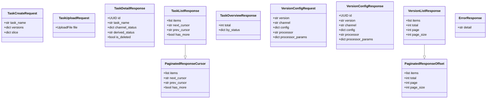
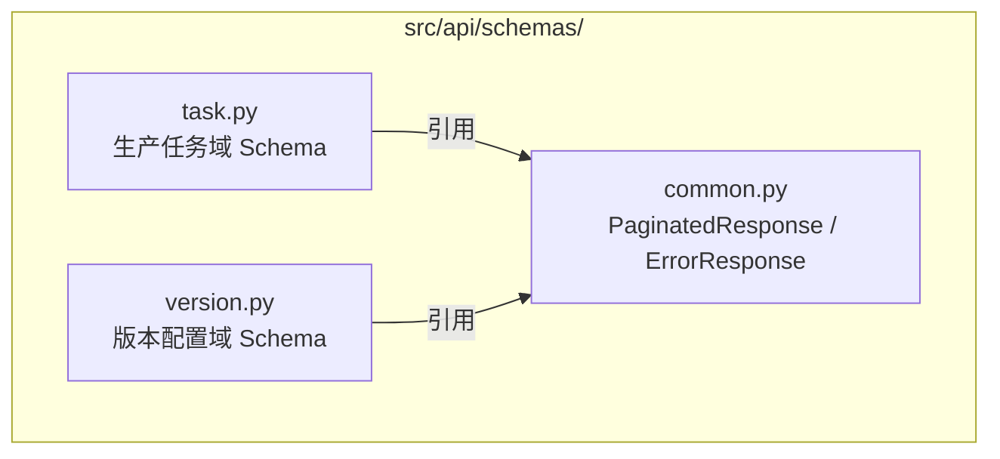

# NotebookLM原文29-大模型质检-领域模型层设计

## 来源追踪

- 来源总卡：[[notebooklm_quality_check_pipeline]]
- 原始文件：[原始 Markdown](../../../raw/notebooklm_exports/6b4b949e-d423-4033-b16f-bd037ac03fa8/29_caef72a6-b75b-47eb-91ca-d839ba61f03f.md)
- source_id：`caef72a6-b75b-47eb-91ca-d839ba61f03f`
- SHA-256：`487fe48846d0bbc51028805da32a4c0fb0ebc11c759a4303c74220182fa3d4f7`
- 原始字节数：11953
- 内容重复于：[[28_大模型质检-领域模型层设计]]；本卡仍独立保留 source_id 追踪。

## 原文（逐字符保留）

<!-- ORIGINAL_START -->
---
id: "SYN-LLM-QC-DOMAIN-MODEL"
title: "大模型质检-领域模型层设计"
domain: ["llm_qa"]
type: "synthesis"

related_code: ["src/api/schemas/task.py", "src/api/schemas/version.py", "src/api/schemas/common.py"]
affects_path: ["src/api/schemas/task.py", "src/api/schemas/version.py", "src/api/schemas/common.py"]
trigger_keywords: ["大模型质检领域模型", "Pydantic Schema", "内部模型隔离", "TaskCreateRequest", "VersionConfigRequest", "PaginatedResponse", "llm_qa Schema"]
tags: ["大模型质检", "领域模型", "Pydantic", "Schema", "内部模型隔离"]
summary: "大模型质检part 领域模型层设计：定义生产任务域+版本配置域的Pydantic Schema，声明内部模型隔离原则（API层Pydantic + Repository层dict/tuple/dataclass，两层禁止混用）。沿用顶层架构§4领域模型层原则。"
---

# 大模型质检-领域模型层设计

> 本卡是大模型质检part 的**领域模型宪法**。
> - 上位枢纽：[[质检一站式平台大模型质检模块整体架构]]
> - 顶层架构：[[质检一站式平台顶层架构]]（沿用 §4.3 领域模型层原则）
> - 现状来源：[[t_llm_task 表]] / [[t_llm_version_config 表]]（现有 Schema 现状）
> - 关联组件卡：[[大模型质检-后端分层与组件边界设计]] / [[大模型质检-Repository与数据库访问设计]] / [[大模型质检-API契约与前端交互设计]]

---

## ① 组件概述

本组件定义大模型质检part 的领域模型层，包括：
- 生产任务域 Pydantic Schema（请求/响应模型）
- 版本配置域 Pydantic Schema（请求/响应模型）
- 通用 Schema（分页响应、错误响应）
- **内部模型隔离原则**声明

### 1.1 核心原则（沿用顶层架构 §4.3）

- **就近定义原则**：模型优先定义在使用处，复用后上移。
- **Pydantic 与内部模型隔离**：API 层用 Pydantic 模型，Repository 层用内部数据结构（dict/tuple/dataclass），两层模型禁止混用。
- **禁止 ORM 模型**：数据库模型不使用 ORM，Repository 用 PostgresConnector 直接执行 SQL。

### 1.2 内部模型隔离原则声明

| 层 | 模型类型 | 物理位置 | 用途 |
|----|---------|---------|------|
| API 层（Router） | Pydantic 模型 | `src/api/schemas/*.py` | 请求校验、响应序列化、OpenAPI 文档生成 |
| Repository 层 | dict / tuple / dataclass | `src/llm/task_repository.py` | SQL 结果映射、内部传递 |

> ⚠️ 两层模型**禁止混用**：Repository 不得返回 Pydantic 模型（应返回 dict/tuple/dataclass），Router 不得直接接收 dict（应接收 Pydantic 模型）。Router 在调用 Repository 后，负责将 Repository 返回的内部模型转换为 Pydantic 响应模型。

---

## ② 架构结构

### 2.1 Schema 映射类图

### 2.2 两层模型隔离关系

### 2.3 通用 Schema 定义位置

---

## ③ 数据表交互

| Schema | 对应数据表 | 映射字段 |
|--------|----------|---------|
| TaskCreateRequest | t_llm_task（INSERT） | task_name、6 版本字段、slice_start、slice_end |
| TaskDetailResponse | t_llm_task（SELECT） | id、task_name、6 通道 status、6 obs_upload_status、6 版本字段、status（派生）、error_step、slice、is_deleted、updated_at、created_at |
| TaskListResponse | t_llm_task（SELECT 分页） | items（TaskDetailResponse[]）+ 游标 |
| VersionConfigRequest | t_llm_version_config（UPSERT） | version、channel、config、processor、processor_params |
| VersionConfigResponse | t_llm_version_config（SELECT） | id、version、channel、config、processor、processor_params、is_deleted、updated_at、created_at |

详见 [[大模型质检-t_llm_task表设计]] 与 [[大模型质检-t_llm_version_config表设计]]。

---

## ④ 子模块/文件/类级清单（affects_path 精确到文件级）

| 文件路径 | 类/模块 | 职责 | 状态 |
|---------|--------|------|------|
| `src/api/schemas/task.py` | TaskCreateRequest / TaskUploadRequest / TaskDetailResponse / TaskListResponse / TaskOverviewResponse / TaskGroupResponse / ChannelProgressResponse / ChannelThroughputResponse / BatchKillRequest / BatchCleanRequest / BatchOperationResponse 等 | 生产任务域 Pydantic Schema | [待新建/重构] |
| `src/api/schemas/version.py` | VersionConfigRequest / VersionConfigResponse / VersionListResponse | 版本配置域 Pydantic Schema | [待新建/重构] |
| `src/api/schemas/common.py` | PaginatedResponseCursor / PaginatedResponseOffset / ErrorResponse | 通用 Schema | [待新建] |

---

## ⑤ 详细设计（含测试矩阵）

### 5.1 生产任务域 Schema

| Schema 名 | 用途 | 关键字段 | 校验约束 |
|----------|------|---------|---------|
| TaskCreateRequest | 表单创建任务 | task_name: str、versions: dict（6 通道版本）、slice: dict | task_name 非空；versions 各通道版本非空 |
| TaskUploadRequest | 文件上传创建任务 | file: UploadFile | file 格式为 JSON/JSONL |
| TaskDetailResponse | 任务详情响应 | id: UUID、task_name: str、channel_status: dict（6 通道）、derived_status: str、is_deleted: bool、updated_at、created_at | — |
| TaskListResponse | 游标分页列表响应 | items: List[TaskDetailResponse]、next_cursor: str\|None、prev_cursor: str\|None、has_more: bool | — |
| TaskOverviewResponse | 概览响应 | total: int、by_status: dict | — |
| TaskGroupResponse | 分组响应 | group_key: str、count: int、status: str | — |
| ChannelProgressResponse | 通道进度响应 | channel: str、status: str、progress: float | channel 枚举约束 |
| ChannelThroughputResponse | 通道吞吐响应 | channel: str、throughput: float、unit: str | channel 枚举约束 |
| BatchKillRequest | 批量 kill 请求 | task_ids: List[UUID] | task_ids 非空 |
| BatchCleanRequest | 批量 clean 请求 | task_ids: List[UUID] | task_ids 非空 |
| BatchOperationResponse | 批量操作响应 | success_count: int、failed_count: int、failed_ids: List[UUID] | — |

### 5.2 版本配置域 Schema

| Schema 名 | 用途 | 关键字段 | 校验约束 |
|----------|------|---------|---------|
| VersionConfigRequest | 创建/编辑（UPSERT） | version: str、channel: str、config: dict、processor: str\|None、processor_params: dict\|None | version 非空；channel 枚举约束（model/video/prompt/raw_img/label/pkl/inference/redo）；processor 格式 `module.path:func_name`（仅 prompt 通道） |
| VersionConfigResponse | 详情响应 | id: UUID、version: str、channel: str、config: dict、processor: str\|None、processor_params: dict\|None、is_deleted: bool、updated_at、created_at | — |
| VersionListResponse | OFFSET 分页列表响应 | items: List[VersionConfigResponse]、total: int、page: int、page_size: int | — |

### 5.3 通用 Schema

| Schema 名 | 用途 | 关键字段 |
|----------|------|---------|
| PaginatedResponseCursor | 游标分页响应基类 | items: List[Any]、next_cursor: str\|None、prev_cursor: str\|None、has_more: bool |
| PaginatedResponseOffset | OFFSET 分页响应基类 | items: List[Any]、total: int、page: int、page_size: int |
| ErrorResponse | 错误响应 | detail: str |

### 5.4 内部模型隔离实现要点

- Repository 方法返回类型：`dict` 或 `dataclass`（如 `@dataclass class TaskRow: id: UUID; task_name: str; ...`）。
- Router 在调用 Repository 后，使用 Pydantic 模型的 `model_validate()` 或构造函数将内部模型转换为响应 Schema。
- 禁止 Repository 方法签名中出现 Pydantic 模型类型注解。

### 5.5 测试矩阵

| 用例编号 | 场景 | 输入 | 预期结果 |
|---------|------|------|---------|
| TC-DM-001 | 正常创建任务请求 | 合法 TaskCreateRequest JSON | 校验通过 |
| TC-DM-002 | 空 task_name | task_name="" | 422 校验失败 |
| TC-DM-003 | 超长 task_name | task_name 长度 > 255 | 422 校验失败 |
| TC-DM-004 | 非法 JSONB config | config="not-a-dict" | 422 校验失败 |
| TC-DM-005 | 非法 UUID（detail 响应） | id="not-a-uuid" | 422 校验失败 |
| TC-DM-006 | 非法 channel 枚举 | channel="invalid" | 422 校验失败 |
| TC-DM-007 | processor 格式错误 | processor="no-colon" | 422 校验失败（仅 prompt 通道校验） |
| TC-DM-008 | 游标分页响应序列化 | TaskListResponse 实例 | JSON 含 next_cursor/prev_cursor |
| TC-DM-009 | OFFSET 分页响应序列化 | VersionListResponse 实例 | JSON 含 total/page/page_size |
| TC-DM-010 | 内部模型隔离（反例） | Repository 返回 Pydantic 模型 | Code Review 拦截 + 单测失败 |

---

## ⑥ 完成情况与 TODO

| 项 | 状态 | 说明 |
|----|------|------|
| 两域 Schema 定义 | ✅ 本卡已定义 | 逐一类列出 |
| 内部模型隔离原则声明 | ✅ 本卡已声明 | Pydantic vs dict/tuple/dataclass |
| 通用 Schema 定义 | ✅ 本卡已定义 | PaginatedResponse + ErrorResponse |
| Schema 代码落地 | ⬜ | 见 [[大模型质检模块实施计划]] Phase 3 |
| 测试矩阵执行 | ⬜ | 待代码实现后执行 |

### TODO
- [待人类补充] TaskCreateRequest 的 versions 字段是否必填所有 6 通道版本，还是允许部分通道使用默认版本。
- [待人类补充] channel 枚举是否包含未来扩展通道（如 redo 之外的通道）。

---

## ⑦ 归属

- **上位枢纽**：[[质检一站式平台大模型质检模块整体架构]]
- **顶层架构**：[[质检一站式平台顶层架构]]（沿用 §4.3 领域模型层原则）
- **现状来源**：[[t_llm_task 表]] / [[t_llm_version_config 表]]
- **关联组件卡**：[[大模型质检-后端分层与组件边界设计]] / [[大模型质检-Repository与数据库访问设计]] / [[大模型质检-API契约与前端交互设计]]
- **对标人工质检卡**：[[质检平台-领域模型层设计]]
<!-- ORIGINAL_END -->
