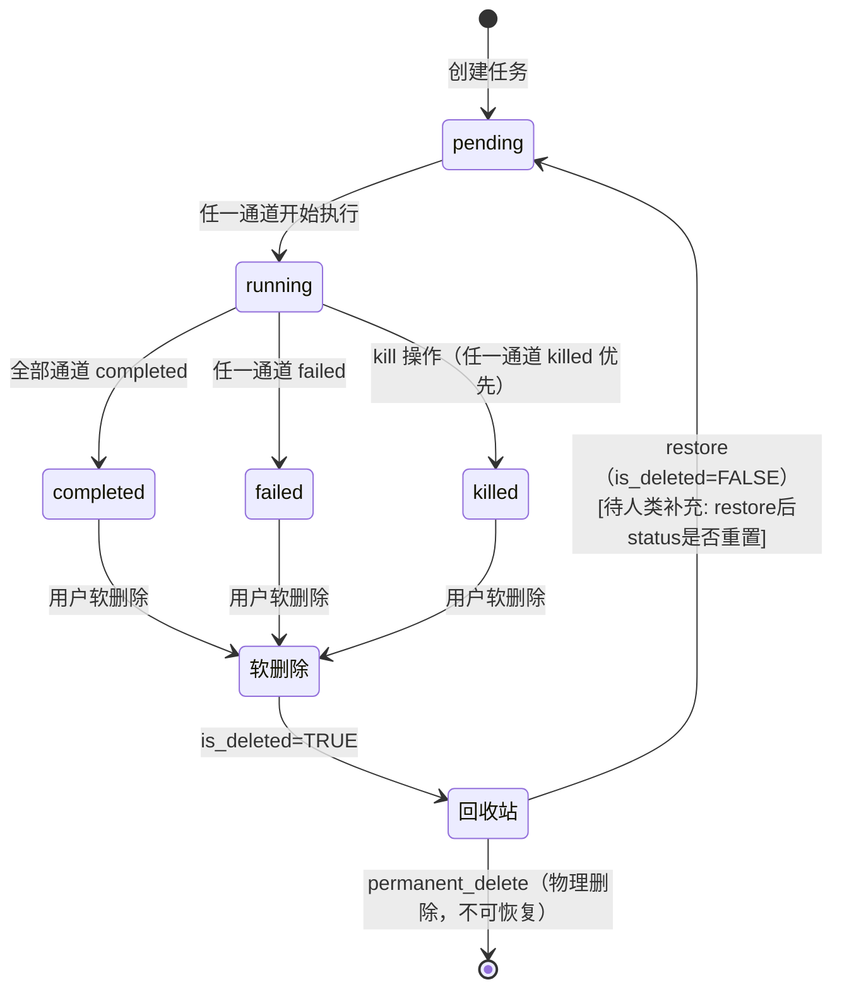
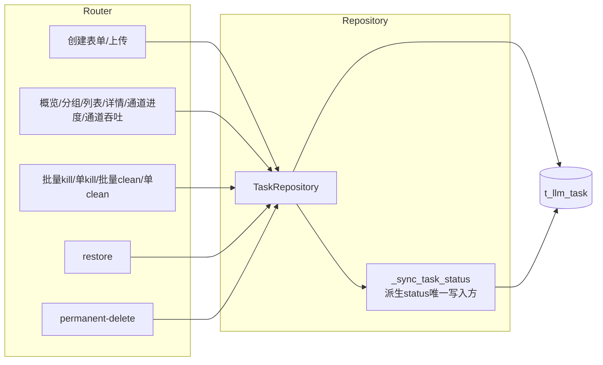

# NotebookLM原文31-大模型质检-生产任务设计

## 来源追踪

- 来源总卡：[[notebooklm_quality_check_pipeline]]
- 原始文件：[原始 Markdown](../../../raw/notebooklm_exports/6b4b949e-d423-4033-b16f-bd037ac03fa8/31_7337e8e8-5d1b-41dd-b6c0-ea4bea3d64df.md)
- source_id：`7337e8e8-5d1b-41dd-b6c0-ea4bea3d64df`
- SHA-256：`2fe9148f65c7ff62fa99a959cbfc9ecfd5dd6ef78dc462804eb8ffa7665932d8`
- 原始字节数：13140

## 原文（逐字符保留）

<!-- ORIGINAL_START -->
---
id: "SYN-LLM-QC-TASK-DESIGN"
title: "大模型质检-生产任务设计"
domain: ["llm_qa"]
type: "synthesis"

related_code: ["src/api/routers/task.py", "src/llm/task_repository.py", "src/api/schemas/task.py", "src/frontend/src/views/TaskView.vue", "src/frontend/src/components/"]
affects_path: ["src/api/routers/task.py", "src/llm/task_repository.py", "src/api/schemas/task.py", "src/frontend/src/views/TaskView.vue", "src/frontend/src/components/TaskListView.vue", "src/frontend/src/components/TaskCreateDialog.vue", "src/frontend/src/components/TaskDetailPanel.vue", "src/frontend/src/components/ChannelStatusGrid.vue", "src/frontend/src/components/RecycleBinTab.vue"]
trigger_keywords: ["大模型质检生产任务", "14端点优化", "6通道status聚合", "游标分页prev_cursor", "回收站", "创建弹窗", "kill", "clean", "restore", "permanent_delete", "llm_qa生产任务"]
tags: ["大模型质检", "生产任务", "样板域", "14端点", "游标分页", "6通道status", "回收站", "状态流转"]
summary: "大模型质检part 样板域①生产任务设计：14端点架构优化重构方案，内嵌状态流转流程图(不单独建原子流程卡)，6通道status聚合展示优化(背景链接production/不设计通道本身)，游标分页补全prev_cursor，回收站交互，创建弹窗(表单Tab+文件上传Tab)。"
---

# 大模型质检-生产任务设计

> 本卡是大模型质检part 样板域①**生产任务**的设计卡。
> - 上位枢纽：[[质检一站式平台大模型质检模块整体架构]]
> - 顶层架构：[[质检一站式平台顶层架构]]（沿用 §3/§4/§5/§6）
> - 现状来源：[[TaskCreator 任务创建器]] / [[TaskQueryService 任务聚合查询]] / [[任务级vs通道级status架构设计]] / [[TaskView交互流程详解]]
> - 关联组件卡：[[大模型质检-后端分层与组件边界设计]] / [[大模型质检-API契约与前端交互设计]] / [[大模型质检-Repository与数据库访问设计]] / [[大模型质检-前端页面与状态设计]] / [[大模型质检-t_llm_task表设计]]

⚠️ 本卡聚焦 14 端点已有实现的**架构优化重构**，不扩展全链路（6 通道生产链路本身不纳入设计，仅链接其能力）。

---

## ① 组件概述

本组件定义生产任务域的架构优化重构方案，覆盖 14 端点：
1. 创建表单 / 2. 创建上传 / 3. 概览 / 4. 分组 / 5. 游标分页列表 / 6. 详情 / 7. 通道进度 / 8. 通道吞吐 / 9. 批量kill / 10. 批量clean / 11. 单任务kill / 12. 单任务clean / 13. restore / 14. permanent-delete

### 1.1 设计原则

- 沿用顶层架构 §4 三层架构（Router → Repository → DB，省略 AppService）。
- 任务级 status 派生铁律：禁直接写 `t_llm_task.status`，必须经 `_sync_task_status()`。
- 6 通道生产链路作背景：不设计通道本身，仅链接 [[src_llm_production_通道生产包]] / [[BaseProducer 通道生产基类]] / [[TaskOrchestrator 任务级状态轮询器]] 的能力。
- 状态流转图内嵌本卡（按歧义 3 决策：不单独建原子流程卡）。

---

## ② 架构结构

### 2.1 生产任务状态流转图（内嵌）



> 状态流转图内嵌本卡（按 [[大模型质检模块实施计划]] 歧义 3 决策），不单独建原子流程卡。

### 2.2 14 端点架构调用链



### 2.3 6 通道 status 聚合展示数据流

```mermaid
flowchart LR
    T[(t_llm_task<br/>6通道status)] -->|Repository.fetch_channel_progress| RESP[ChannelProgressResponse[]]
    RESP -->|API getChannelProgress| CSG[ChannelStatusGrid.vue<br/>6圆点颜色映射]
    CSG --> UI[前端展示]

    PROD[src/llm/production/<br/>6通道生产包<br/>背景链接不设计]
    PROD -.写入6通道status.-> T
```

> 6 通道 status 由生产链路 production/ 写入（背景链接 [[src_llm_production_通道生产包]] / [[BaseProducer 通道生产基类]]），本 part 不设计通道本身，仅聚合展示。

---

## ③ 数据表交互

14 端点与 t_llm_task 的读写关系：

| 端点 | 操作类型 | 关键字段 | 说明 |
|------|---------|---------|------|
| 创建表单/上传 | INSERT | task_name、6版本字段、slice、6通道status='pending'、6 obs_upload_status | 创建后 6 通道 status 初始为 pending |
| 概览 | SELECT | status（派生）、COUNT(*) | GROUP BY status 聚合 |
| 分组 | SELECT | group_by 字段、COUNT(*) | GROUP BY 聚合 |
| 游标分页列表 | SELECT | id、task_name、status、created_at | WHERE is_deleted=FALSE ORDER BY created_at DESC |
| 详情 | SELECT | 全字段 | WHERE id=%s AND is_deleted=FALSE |
| 通道进度 | SELECT | 6通道status | 聚合返回 |
| 通道吞吐 | SELECT | 6通道吞吐统计 | 聚合返回 |
| 批量kill / 单kill | UPDATE | 6通道status='killed' + 调 _sync_task_status | kill 后触发派生 |
| 批量clean / 单clean | UPDATE | 6通道status='pending' + 调 _sync_task_status | clean 后触发派生 |
| restore | UPDATE | is_deleted=FALSE | WHERE is_deleted=TRUE |
| permanent-delete | DELETE | 物理删除 | WHERE is_deleted=TRUE |

详见 [[大模型质检-t_llm_task表设计]]。

---

## ④ 子模块/文件/类级清单（affects_path 精确到文件级）

| 文件路径 | 类/模块 | 职责 | 状态 |
|---------|--------|------|------|
| `src/api/routers/task.py` | TaskRouter | 14 端点 HTTP 定义 | [待重构] |
| `src/llm/task_repository.py` | TaskRepository | SQL 集中封装 + _sync_task_status | [待重构] |
| `src/api/schemas/task.py` | TaskCreateRequest / TaskListResponse 等 | Pydantic Schema | [待重构] |
| `src/frontend/src/views/TaskView.vue` | TaskView | 容器组件 | [待重写] |
| `src/frontend/src/components/TaskListView.vue` | TaskListView | 列表 + 游标分页 | [待新建] |
| `src/frontend/src/components/TaskCreateDialog.vue` | TaskCreateDialog | 创建弹窗 | [待新建] |
| `src/frontend/src/components/TaskDetailPanel.vue` | TaskDetailPanel | 详情面板 | [待新建] |
| `src/frontend/src/components/ChannelStatusGrid.vue` | ChannelStatusGrid | 6 通道 status 聚合 | [待新建] |
| `src/frontend/src/components/RecycleBinTab.vue` | RecycleBinTab | 回收站 | [待新建] |

---

## ⑤ 详细设计（含测试矩阵）

### 5.1 14 端点优化方案

| # | 端点 | 优化前现状 | 优化后方案 | 优化理由 |
|---|------|----------|-----------|---------|
| 1 | POST 创建表单 | 现有实现 | TaskCreateRequest Pydantic 校验 + Router 调 TaskRepository.create_task | 沿用顶层 §4 三层架构 |
| 2 | POST 创建上传 | 现有实现 | multipart/form-data + TaskRepository.create_task_from_file | 同上 |
| 3 | GET 概览 | 现有实现 | TaskRepository.fetch_task_overview GROUP BY status | 聚合统计 |
| 4 | GET 分组 | 现有实现 | TaskRepository.fetch_task_groups GROUP BY group_by | 分组统计 |
| 5 | GET 游标分页列表 | 仅前进游标，无 prev_cursor | 补全 prev_cursor 双向游标分页 | 修复现有缺陷，支持双向翻页 |
| 6 | GET 详情 | 现有实现 | TaskRepository.fetch_task_by_id | 沿用 |
| 7 | GET 通道进度 | 现有实现 | TaskRepository 聚合 6 通道 status | 6 通道聚合展示 |
| 8 | GET 通道吞吐 | 现有实现 | TaskRepository 聚合吞吐统计 | 同上 |
| 9 | POST 批量kill | 现有实现 | TaskRepository.batch_kill + 调 _sync_task_status | 派生 status 铁律 |
| 10 | POST 批量clean | 现有实现 | TaskRepository.batch_clean + 调 _sync_task_status | 同上 |
| 11 | POST 单任务kill | 现有实现 | TaskRepository.batch_kill([id]) 复用批量逻辑 | 代码复用 |
| 12 | POST 单任务clean | 现有实现 | TaskRepository.batch_clean([id]) 复用批量逻辑 | 同上 |
| 13 | POST restore | 现有实现 | TaskRepository.restore_task WHERE is_deleted=TRUE | 软删除规范 |
| 14 | DELETE permanent-delete | 现有实现 | TaskRepository.permanent_delete_task WHERE is_deleted=TRUE | 永久删除仅删回收站 |

### 5.2 游标分页补全 prev_cursor 方案

- 现状：仅 next_cursor 前进分页，前端无法后退。
- 优化：补全 prev_cursor，通过反向查询（ORDER BY created_at DESC 翻转为 ASC）实现上一页。
- 游标编码：base64(排序键 + 方向)。
- 响应格式：`{items, next_cursor, prev_cursor, has_more}`。

### 5.3 6 通道 status 聚合展示优化

- ChannelStatusGrid 组件展示 6 圆点（raw_img / label / pkl / video / prompt / inference）。
- 颜色映射：pending（灰）/ running（蓝）/ completed（绿）/ failed（红）/ killed（橙）。
- 背景链接 [[src_llm_production_通道生产包]] / [[BaseProducer 通道生产基类]]（不设计通道本身）。

### 5.4 回收站交互设计

- RecycleBinTab 展示 `is_deleted=TRUE` 的任务。
- 恢复：`restoreTask(id)` → `is_deleted=FALSE`。
- 永久删除：`permanentDeleteTask(id)` + 二次确认 → 物理删除。

### 5.5 创建弹窗设计

- 表单 Tab：task_name + 各通道版本 + slice 范围。
- 文件上传 Tab：JSON/JSONL 文件上传。
- Tab 切换清空另一 Tab 输入。

### 5.6 测试矩阵

| 用例编号 | 场景 | 输入 | 预期结果 |
|---------|------|------|---------|
| TC-TASK-001 | 空任务列表 | 无数据 | 列表空状态 |
| TC-TASK-002 | 游标越界（伪造游标） | cursor=非法base64 | 400 参数错误 |
| TC-TASK-003 | 游标翻页：下一页 | next_cursor | 返回下一页 + 新 next_cursor + prev_cursor |
| TC-TASK-004 | 游标翻页：上一页 | prev_cursor | 返回上一页 + 新 prev_cursor |
| TC-TASK-005 | kill 不存在的 task | id=不存在UUID | 404 |
| TC-TASK-006 | restore 已 permanent_delete 的 task | 已物理删除的 id | 404 |
| TC-TASK-007 | permanent_delete 正常任务（is_deleted=FALSE） | 未软删除的 id | 拒绝（仅删回收站） |
| TC-TASK-008 | 6 通道部分完成 | 3 completed + 3 pending | 6 圆点：3 绿 3 灰 |
| TC-TASK-009 | 6 通道全 completed | 6 completed | 6 圆点全绿 + 任务级 status=completed |
| TC-TASK-010 | 6 通道全 failed | 6 failed | 6 圆点全红 + 任务级 status=failed |
| TC-TASK-011 | 派生 status：kill 后触发 | kill 1 通道 | _sync_task_status 派生 status=killed |
| TC-TASK-012 | 并发 kill 同一任务 | 两个并发请求 | 一个成功，一个幂等或 409 |

---

## ⑥ 完成情况与 TODO

| 项 | 状态 | 说明 |
|----|------|------|
| 14 端点优化方案 | ✅ 本卡已定义 | 逐一列出优化前/后/理由 |
| 状态流转图 | ✅ 本卡已内嵌 | pending→running→completed/failed/killed + 回收站 |
| 6 通道聚合展示 | ✅ 本卡已定义 | ChannelStatusGrid + 背景链接 |
| 游标分页 prev_cursor | ✅ 本卡已定义 | 双向游标方案 |
| 代码重构落地 | ⬜ | 见 [[大模型质检模块实施计划]] Phase 2-4 |
| 测试矩阵执行 | ⬜ | 待代码实现后执行 |

### TODO
- [待人类补充] restore 后 status 是否重置为 pending 还是保留原 status。
- [待人类补充] kill 后 6 通道 status 是否全部置为 killed 还是仅置指定通道。

---

## ⑦ 归属

- **上位枢纽**：[[质检一站式平台大模型质检模块整体架构]]
- **顶层架构**：[[质检一站式平台顶层架构]]
- **现状来源**：[[TaskCreator 任务创建器]] / [[TaskQueryService 任务聚合查询]] / [[任务级vs通道级status架构设计]] / [[TaskView交互流程详解]]
- **生产链路背景链接**：[[src_llm_production_通道生产包]] / [[BaseProducer 通道生产基类]] / [[TaskOrchestrator 任务级状态轮询器]]
- **关联组件卡**：[[大模型质检-后端分层与组件边界设计]] / [[大模型质检-API契约与前端交互设计]] / [[大模型质检-Repository与数据库访问设计]] / [[大模型质检-前端页面与状态设计]] / [[大模型质检-t_llm_task表设计]]
- **规范引用**：[[任务级vs通道级status架构设计]]（派生铁律）
- **对标人工质检卡**：[[质检平台-验收采样配额与任务选择设计]]
<!-- ORIGINAL_END -->
