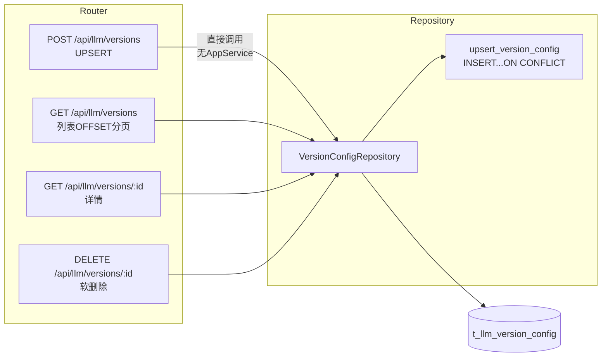
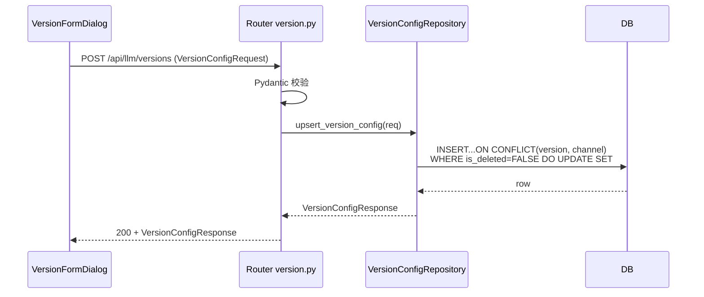
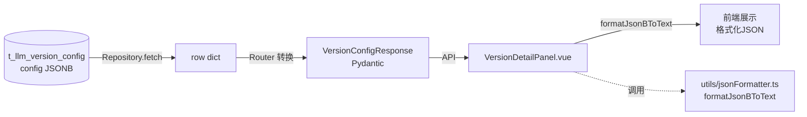

# NotebookLM原文32-大模型质检-版本配置设计

## 来源追踪

- 来源总卡：[[notebooklm_quality_check_pipeline]]
- 原始文件：[原始 Markdown](../../../raw/notebooklm_exports/6b4b949e-d423-4033-b16f-bd037ac03fa8/32_a6a15c00-1c22-44d7-af43-a8d33aed786e.md)
- source_id：`a6a15c00-1c22-44d7-af43-a8d33aed786e`
- SHA-256：`dc6dacfca1c58b2d8401f0e876e7186ae868d3df9fc72f2780c338355e4abb65`
- 原始字节数：11066

## 原文（逐字符保留）

<!-- ORIGINAL_START -->
---
id: "SYN-LLM-QC-VERSION-DESIGN"
title: "大模型质检-版本配置设计"
domain: ["llm_qa"]
type: "synthesis"

related_code: ["src/api/routers/version.py", "src/llm/task_repository.py", "src/api/schemas/version.py", "src/frontend/src/views/VersionView.vue", "src/frontend/src/components/", "src/frontend/src/utils/jsonFormatter.ts"]
affects_path: ["src/api/routers/version.py", "src/llm/task_repository.py", "src/api/schemas/version.py", "src/frontend/src/views/VersionView.vue", "src/frontend/src/components/VersionListView.vue", "src/frontend/src/components/VersionFormDialog.vue", "src/frontend/src/components/VersionDetailPanel.vue", "src/frontend/src/utils/jsonFormatter.ts"]
trigger_keywords: ["大模型质检版本配置", "4端点优化", "UPSERT语义", "联合键version+channel", "通道筛选", "JSONB配置", "OFFSET分页", "无AppService", "llm_qa版本配置"]
tags: ["大模型质检", "版本配置", "样板域", "4端点", "UPSERT", "JSONB", "OFFSET分页"]
summary: "大模型质检part 样板域②版本配置设计：4端点架构优化重构方案，UPSERT语义规范化(version+channel联合键)，声明无AppService层(Router直接调Repository)，通道筛选(model/video/prompt)，JSONB配置管理，OFFSET分页(pageSize默认20)。"
---

# 大模型质检-版本配置设计

> 本卡是大模型质检part 样板域②**版本配置**的设计卡。
> - 上位枢纽：[[质检一站式平台大模型质检模块整体架构]]
> - 顶层架构：[[质检一站式平台顶层架构]]（沿用 §3/§4/§5/§6）
> - 现状来源：[[VersionView版本配置页面交互详解]] / [[t_llm_version_config 表]]
> - 关联组件卡：[[大模型质检-后端分层与组件边界设计]] / [[大模型质检-API契约与前端交互设计]] / [[大模型质检-Repository与数据库访问设计]] / [[大模型质检-前端页面与状态设计]] / [[大模型质检-t_llm_version_config表设计]]

⚠️ 本卡聚焦 4 端点已有实现的**架构优化重构**，不扩展激活/回滚等未实现功能。

---

## ① 组件概述

本组件定义版本配置域的架构优化重构方案，覆盖 4 端点：
1. POST 创建/UPSERT / 2. GET 列表（OFFSET 分页）/ 3. GET 详情 / 4. DELETE 删除

### 1.1 设计原则

- 沿用顶层架构 §4 三层架构（Router → Repository → DB，**省略 AppService**，Router 直接调 Repository）。
- UPSERT 语义规范化：version+channel 为联合键，存在则更新不存在则插入，编辑和创建共用同一端点。
- 不扩展激活/回滚等未实现功能。

### 1.2 UPSERT 语义声明

> ⚠️ **UPSERT 语义规范化**：`version + channel` 为联合键，存在则更新不存在则插入。编辑和创建共用同一端点（POST /api/llm/versions）。联合唯一约束：`UNIQUE(version, channel) WHERE is_deleted=FALSE`。

---

## ② 架构结构

### 2.1 版本配置 CRUD 架构图（无 AppService 层）

### 2.2 UPSERT 时序图

### 2.3 数据流图（JSONB config 展示）

---

## ③ 数据表交互

4 端点与 t_llm_version_config 的读写关系：

| 端点 | 操作类型 | 关键字段 | 说明 |
|------|---------|---------|------|
| POST 创建/UPSERT | UPSERT | version、channel、config、processor、processor_params | ON CONFLICT(version, channel) WHERE is_deleted=FALSE DO UPDATE |
| GET 列表 | SELECT | 全字段 | WHERE is_deleted=FALSE LIMIT %s OFFSET %s；channel 筛选 |
| GET 详情 | SELECT | 全字段 | WHERE id=%s AND is_deleted=FALSE |
| DELETE 删除 | UPDATE | is_deleted=TRUE | 软删除 |

详见 [[大模型质检-t_llm_version_config表设计]]。

---

## ④ 子模块/文件/类级清单（affects_path 精确到文件级）

| 文件路径 | 类/模块 | 职责 | 状态 |
|---------|--------|------|------|
| `src/api/routers/version.py` | VersionRouter | 4 端点 HTTP 定义 | [待重构] |
| `src/llm/task_repository.py` | VersionConfigRepository | SQL 集中封装（UPSERT） | [待重构] |
| `src/api/schemas/version.py` | VersionConfigRequest / VersionConfigResponse / VersionListResponse | Pydantic Schema | [待重构] |
| `src/frontend/src/views/VersionView.vue` | VersionView | 容器组件 | [待重写] |
| `src/frontend/src/components/VersionListView.vue` | VersionListView | 列表 + OFFSET 分页 + 通道筛选 | [待新建] |
| `src/frontend/src/components/VersionFormDialog.vue` | VersionFormDialog | 创建/编辑弹窗（UPSERT）+ JSON 校验 | [待新建] |
| `src/frontend/src/components/VersionDetailPanel.vue` | VersionDetailPanel | 详情面板 + formatJsonBToText | [待新建] |
| `src/frontend/src/utils/jsonFormatter.ts` | formatJsonBToText | JSONB 格式化展示工具 | [待新建/重构] |

---

## ⑤ 详细设计（含测试矩阵）

### 5.1 4 端点优化方案

| # | 端点 | 优化前现状 | 优化后方案 | 优化理由 |
|---|------|----------|-----------|---------|
| 1 | POST 创建/UPSERT | 现有实现 | VersionConfigRequest Pydantic 校验 + Router 直接调 VersionConfigRepository.upsert_version_config（无 AppService） | UPSERT 语义统一创建/编辑 |
| 2 | GET 列表 | 现有实现 | OFFSET 分页（pageSize 默认 20）+ channel 筛选 | 数据量小用 OFFSET 简单高效 |
| 3 | GET 详情 | 现有实现 | VersionConfigRepository.fetch_version_config | 沿用 |
| 4 | DELETE 删除 | 现有实现 | VersionConfigRepository.delete_version_config 软删除（is_deleted=TRUE） | 沿用 NORM-SOFT-DELETE |

### 5.2 UPSERT 语义规范化

- **联合键**：`version + channel`。
- **联合唯一约束**：`UNIQUE(version, channel) WHERE is_deleted=FALSE`。
- **SQL**：`INSERT...ON CONFLICT(version, channel) WHERE is_deleted=FALSE DO UPDATE SET config=EXCLUDED.config, processor=EXCLUDED.processor, processor_params=EXCLUDED.processor_params, updated_at=now()`
- **编辑和创建共用同一端点**：POST /api/llm/versions，无需区分创建/编辑。

### 5.3 通道筛选方案

- 筛选维度：`channel`（model / video / prompt / raw_img / label / pkl / inference / redo）。
- API：`GET /api/llm/versions?channel=model&page=1&page_size=20`。
- 前端：VersionListView 提供通道下拉筛选。

### 5.4 JSONB 配置管理

- `config`（JSONB）：通道配置。
- `processor`（TEXT，格式 `module.path:func_name`）：仅 prompt 通道使用。
- `processor_params`（JSONB）：处理器参数。
- 前端 VersionFormDialog：JSON 输入框 + `JSON.parse` 校验语法。
- 前端 VersionDetailPanel：`formatJsonBToText`（utils/jsonFormatter.ts）格式化展示。

### 5.5 前端 VersionFormDialog + VersionDetailPanel

- VersionFormDialog：表单字段（version、channel 下拉、config JSON 输入、processor、processor_params JSON 输入）+ JSON.parse 校验。
- VersionDetailPanel：展示 version/channel/config（formatJsonBToText 格式化）/processor/processor_params + 编辑/删除按钮。

### 5.6 OFFSET 分页

- pageSize 默认 20。
- 响应格式：`{items, total, page, page_size}`。
- 前端 VersionListView 提供分页器。

### 5.7 测试矩阵

| 用例编号 | 场景 | 输入 | 预期结果 |
|---------|------|------|---------|
| TC-VER-001 | 空版本列表 | 无数据 | 列表空状态 |
| TC-VER-002 | UPSERT 新建 | version+channel 不存在 | INSERT 成功 |
| TC-VER-003 | UPSERT 更新 | version+channel 已存在 | UPDATE 成功（更新 config/processor/processor_params） |
| TC-VER-004 | UPSERT 联合键冲突（已删除的记录） | version+channel 存在但 is_deleted=TRUE | INSERT 新记录（不恢复旧记录） |
| TC-VER-005 | 非法 JSONB config | config="not-json" | 422 校验失败 |
| TC-VER-006 | 非法 channel | channel="invalid" | 422 校验失败 |
| TC-VER-007 | processor 格式错误 | processor="no-colon" | 422 校验失败（仅 prompt 通道校验） |
| TC-VER-008 | 删除不存在的版本 | id=不存在UUID | 404 |
| TC-VER-009 | 通道筛选无结果 | channel=无数据通道 | items=[] + total=0 |
| TC-VER-010 | OFFSET 超页 | page=999 | items=[] + total=实际数 |
| TC-VER-011 | 无 AppService 层（反例验证） | Router 内有 Service 类 | Code Review 拦截 |

---

## ⑥ 完成情况与 TODO

| 项 | 状态 | 说明 |
|----|------|------|
| 4 端点优化方案 | ✅ 本卡已定义 | 逐一列出 |
| UPSERT 语义规范化 | ✅ 本卡已声明 | version+channel 联合键 |
| 无 AppService 声明 | ✅ 本卡已声明 | Router 直接调 Repository |
| 通道筛选方案 | ✅ 本卡已定义 | channel 下拉筛选 |
| JSONB 配置管理 | ✅ 本卡已定义 | config + processor + processor_params |
| 代码重构落地 | ⬜ | 见 [[大模型质检模块实施计划]] Phase 2-4 |
| 测试矩阵执行 | ⬜ | 待代码实现后执行 |

### TODO
- [待人类补充] UPSERT 联合键冲突时（已删除的记录，is_deleted=TRUE），是 INSERT 新记录还是恢复旧记录（本卡默认 INSERT 新记录）。
- [待人类补充] processor 是否仅 prompt 通道必填，其他通道允许为空。

---

## ⑦ 归属

- **上位枢纽**：[[质检一站式平台大模型质检模块整体架构]]
- **顶层架构**：[[质检一站式平台顶层架构]]
- **现状来源**：[[VersionView版本配置页面交互详解]] / [[t_llm_version_config 表]]
- **关联组件卡**：[[大模型质检-后端分层与组件边界设计]] / [[大模型质检-API契约与前端交互设计]] / [[大模型质检-Repository与数据库访问设计]] / [[大模型质检-前端页面与状态设计]] / [[大模型质检-t_llm_version_config表设计]]
- **对标人工质检卡**：[[质检平台-验收采样配额与任务选择设计]]
<!-- ORIGINAL_END -->
