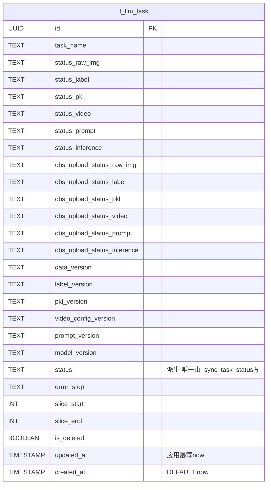

# NotebookLM原文33-大模型质检-t_llm_task表设计

## 来源追踪

- 来源总卡：[[notebooklm_quality_check_pipeline]]
- 原始文件：[原始 Markdown](../../../raw/notebooklm_exports/6b4b949e-d423-4033-b16f-bd037ac03fa8/33_376a5c8e-561c-434c-b9da-c628563974e5.md)
- source_id：`376a5c8e-561c-434c-b9da-c628563974e5`
- SHA-256：`f21c3b988f111c0f5ee690393e4ec3a780a54d1dde607e74c056bb3056e04c4e`
- 原始字节数：13227

## 原文（逐字符保留）

<!-- ORIGINAL_START -->
---
id: "SYN-LLM-QC-TASK-TABLE"
title: "大模型质检-t_llm_task表设计"
domain: ["llm_qa"]
type: "synthesis"

related_code: ["scripts/sql/", "src/llm/task_repository.py"]
affects_path: ["scripts/sql/", "src/llm/task_repository.py"]
trigger_keywords: ["大模型质检t_llm_task", "t_llm_task表设计", "6通道status", "派生status", "软删除", "Partial Index", "正向化", "边界情况", "llm_qa表设计"]
tags: ["大模型质检", "t_llm_task", "表设计", "正向化", "6通道status", "派生status", "索引", "边界"]
summary: "大模型质检part t_llm_task表正向化设计：字段/索引/派生status/软删除/边界情况，对标人工质检综合快照表设计卡粒度(26字段+7索引+10边界)。含UUID PK/6通道status/6 obs_upload_status/6版本字段/任务级派生status/error_step/slice/is_deleted/updated_at。"
---

# 大模型质检-t_llm_task 表设计

> 本卡是大模型质检part t_llm_task 表的**正向化设计卡**。
> - 上位枢纽：[[质检一站式平台大模型质检模块整体架构]]
> - 顶层架构：[[质检一站式平台顶层架构]]（沿用 §6 全局规范）
> - 现状来源：[[t_llm_task 表]]（现有 schema，正向化补全）
> - 关联组件卡：[[大模型质检-Repository与数据库访问设计]] / [[大模型质检-生产任务设计]]
> - 对标人工质检卡：[[质检平台-综合快照表设计]]（粒度对标：26 字段 + 7 索引 + 10 边界）

---

## ① 组件概述

本组件对 t_llm_task 表进行正向化设计，包括：
- 完整字段清单（UUID PK / 业务键 / 6 通道 status / 6 obs_upload_status / 6 版本字段 / 任务级派生 status / error_step / slice / is_deleted / updated_at / created_at）
- 索引设计（12 Partial Index WHERE is_deleted=FALSE + 1 回收站索引 WHERE is_deleted=TRUE）
- 派生 status 机制（6 通道 status → 任务级 status 派生规则）
- 软删除规范
- 边界情况清单（≥10 条）
- DDL 交付清单（迁移脚本 + 正式建表 SQL + 测试镜像 SQL）

### 1.1 设计原则（沿用顶层架构 §6 全局规范）

- NORM-DDL-SYNC：每张表同步交付迁移脚本 + 正式建表 SQL + 测试镜像 SQL。
- NORM-GAUSSDB-DDL：DDL 遵循 GaussDB 8.x 语法；DISTRIBUTE BY HASH；不支持 ADD COLUMN IF NOT EXISTS。
- NORM-TRIGGER-UPDATED-AT：updated_at 不用 TRIGGER，用应用层写入或 DEFAULT。
- NORM-SOFT-DELETE：业务查询默认 WHERE is_deleted=FALSE。

---

## ② 架构结构

### 2.1 ER 图（t_llm_task 字段关系）



### 2.2 派生 status 状态图

```mermaid
stateDiagram-v2
    [*] --> pending: 创建任务
    pending --> running: 任一通道开始执行
    running --> completed: 全部通道 completed
    running --> failed: 任一通道 failed
    running --> killed: 任一通道 killed（kill 优先级最高）
    completed --> [*]
    failed --> [*]
    killed --> [*]

    note right of 派生规则
        _sync_task_status() 唯一写入方
        [待人类补充: 完整派生规则]
    end note
```

---

## ③ 数据表交互

### 3.1 t_llm_task 字段清单

| 列名 | 类型 | 约束 | 默认值 | 用途 |
|------|------|------|--------|------|
| id | UUID | PK | gen_random_uuid() | 主键 |
| task_name | TEXT | NOT NULL | — | 业务键 |
| status_raw_img | TEXT | NOT NULL | 'pending' | 通道 status：raw_img |
| status_label | TEXT | NOT NULL | 'pending' | 通道 status：label |
| status_pkl | TEXT | NOT NULL | 'pending' | 通道 status：pkl |
| status_video | TEXT | NOT NULL | 'pending' | 通道 status：video |
| status_prompt | TEXT | NOT NULL | 'pending' | 通道 status：prompt |
| status_inference | TEXT | NOT NULL | 'pending' | 通道 status：inference |
| obs_upload_status_raw_img | TEXT | NOT NULL | 'pending' | OBS 上传 status：raw_img |
| obs_upload_status_label | TEXT | NOT NULL | 'pending' | OBS 上传 status：label |
| obs_upload_status_pkl | TEXT | NOT NULL | 'pending' | OBS 上传 status：pkl |
| obs_upload_status_video | TEXT | NOT NULL | 'pending' | OBS 上传 status：video |
| obs_upload_status_prompt | TEXT | NOT NULL | 'pending' | OBS 上传 status：prompt |
| obs_upload_status_inference | TEXT | NOT NULL | 'pending' | OBS 上传 status：inference |
| data_version | TEXT | NOT NULL | — | 数据版本（创建时冻结） |
| label_version | TEXT | NOT NULL | — | 标注版本（创建时冻结） |
| pkl_version | TEXT | NOT NULL | — | pkl 版本（创建时冻结） |
| video_config_version | TEXT | NOT NULL | — | 视频配置版本（创建时冻结） |
| prompt_version | TEXT | NOT NULL | — | prompt 版本（创建时冻结） |
| model_version | TEXT | NOT NULL | — | 模型版本（创建时冻结） |
| status | TEXT | NOT NULL | 'pending' | 任务级派生 status（**唯一由 _sync_task_status 写**） |
| error_step | TEXT | | NULL | 错误步骤 |
| slice_start | INT | | NULL | 切片起始 |
| slice_end | INT | | NULL | 切片结束 |
| is_deleted | BOOLEAN | NOT NULL | FALSE | 软删除标记 |
| updated_at | TIMESTAMP | NOT NULL | now() | 应用层写 now()（不用 TRIGGER） |
| created_at | TIMESTAMP | NOT NULL | now() | 创建时间 |

### 3.2 与 t_channel_dedup_lock 的关联

> [待人类补充] t_llm_task 与 t_channel_dedup_lock 的关联关系（如有），详见 [[Dedup去重锁完整设计]]。

---

## ④ 子模块/文件/类级清单（affects_path 精确到文件级）

| 文件路径 | 类/模块 | 职责 | 状态 |
|---------|--------|------|------|
| `scripts/sql/migrations/V20260702_01__create_t_llm_task.sql` | 迁移脚本 | DDL 迁移 | [待新建] |
| `scripts/sql/t_llm_task.sql` | 正式建表 SQL | 正式环境建表 | [待新建] |
| `scripts/sql/t_llm_task_test.sql` | 测试镜像 SQL | 测试环境建表 | [待新建] |
| `src/llm/task_repository.py` | TaskRepository | SQL 封装 + _sync_task_status | [待重构] |

---

## ⑤ 详细设计（含测试矩阵）

### 5.1 索引设计（12 Partial Index WHERE is_deleted=FALSE + 1 回收站索引）

| # | 索引名 | 字段 | WHERE 条件 | 用途 |
|---|--------|------|-----------|------|
| 1 | idx_llm_task_name_active | task_name | is_deleted=FALSE | 按名称查询 |
| 2 | idx_llm_task_status_active | status | is_deleted=FALSE | 按派生 status 查询 |
| 3 | idx_llm_task_created_at_active | created_at DESC | is_deleted=FALSE | 游标分页排序 |
| 4-9 | idx_llm_task_status_{channel}_active | status_{channel} | is_deleted=FALSE | 按通道 status 查询（6 个） |
| 10 | idx_llm_task_data_version_active | data_version | is_deleted=FALSE | 按版本查询 |
| 11 | idx_llm_task_error_step_active | error_step | is_deleted=FALSE AND error_step IS NOT NULL | 错误查询 |
| 12 | idx_llm_task_slice_active | slice_start, slice_end | is_deleted=FALSE | 切片查询 |
| 13 | idx_llm_task_recycle_bin | created_at DESC | is_deleted=TRUE | 回收站查询 |

> 对标现有现状，正向化确认索引设计。Partial Index 避免回收站数据污染正常查询。

### 5.2 派生 status 机制

> ⚠️ **任务级 status 派生铁律**：`t_llm_task.status` 字段由 `_sync_task_status()` 唯一写入，禁止业务代码直接写。

派生规则（简化版，[待人类补充: 完整派生规则]）：
- 任一通道 killed → 任务级 killed（kill 优先级最高）
- 任一通道 failed → 任务级 failed
- 任一通道 running → 任务级 running
- 全部通道 completed → 任务级 completed
- 全部通道 pending → 任务级 pending

### 5.3 软删除规范

- `is_deleted=FALSE`：正常状态。
- `is_deleted=TRUE`：回收站。
- 业务查询默认 `WHERE is_deleted=FALSE`。
- `permanent_delete` 仅删 `is_deleted=TRUE` 的行（物理删除，不可恢复）。

### 5.4 边界情况清单（≥10 条）

| # | 边界情况 | 处置 | 状态 |
|---|---------|------|------|
| 1 | 6 通道部分 completed 部分 pending 时任务级 status 归属 | [待人类补充] | ⬜ |
| 2 | kill 后 6 通道 status 是否全部变更还是仅指定通道 | [待人类补充] | ⬜ |
| 3 | restore 后 is_deleted 恢复 FALSE，status 是否重置 | [待人类补充] | ⬜ |
| 4 | 永久删除前置条件：必须 is_deleted=TRUE | permanent_delete 拒绝非回收站行 | ✅ |
| 5 | 并发创建同名 task_name | 允许（task_name 非唯一约束）或加唯一约束 [待人类补充] | ⬜ |
| 6 | 6 通道版本字段创建后是否可变 | 不可变（创建时冻结） | ✅ |
| 7 | 派生 status 与通道 status 不一致时以谁为准 | 以派生 status 为准（_sync_task_status 重新派生） | ✅ |
| 8 | OBS 上传 status 与通道 status 的关系 | 独立字段，不影响派生 | ✅ |
| 9 | slice_start/slice_end 为 NULL 时含义 | 全量处理（无切片） | ✅ |
| 10 | updated_at 并发写入冲突 | 应用层写 now()，最后写入胜出 | ✅ |
| 11 | error_step 为 NULL 时含义 | 无错误 | ✅ |
| 12 | 软删除后 6 通道 status 是否保留 | 保留（软删除仅改 is_deleted） | ✅ |

### 5.5 DDL 交付清单（NORM-DDL-SYNC）

- 迁移脚本：`scripts/sql/migrations/V20260702_01__create_t_llm_task.sql`
- 正式建表 SQL：`scripts/sql/t_llm_task.sql`
- 测试镜像 SQL：`scripts/sql/t_llm_task_test.sql`

> DDL 需遵循 NORM-GAUSSDB-DDL：DISTRIBUTE BY HASH("id")；不支持 ADD COLUMN IF NOT EXISTS。

### 5.6 测试矩阵

| 用例编号 | 场景 | 输入 | 预期结果 |
|---------|------|------|---------|
| TC-TBL-001 | 派生 status：全部 completed | 6 通道 completed | status=completed |
| TC-TBL-002 | 派生 status：任一 failed | 1 failed + 5 completed | status=failed |
| TC-TBL-003 | 派生 status：任一 running | 1 running + 5 pending | status=running |
| TC-TBL-004 | 派生 status：任一 killed | 1 killed + 5 completed | status=killed |
| TC-TBL-005 | 派生 status：全部 pending | 6 pending | status=pending |
| TC-TBL-006 | 软删除边界：restore 非 is_deleted=TRUE | restore is_deleted=FALSE | 返回 None |
| TC-TBL-007 | permanent_delete 非 is_deleted=TRUE | permanent_delete is_deleted=FALSE | 返回 False |
| TC-TBL-008 | 索引命中验证：按 status 查询 | WHERE status='running' AND is_deleted=FALSE | 命中 idx_llm_task_status_active |
| TC-TBL-009 | 索引命中验证：回收站查询 | WHERE is_deleted=TRUE | 命中 idx_llm_task_recycle_bin |
| TC-TBL-010 | 游标分页排序键 | ORDER BY created_at DESC | 命中 idx_llm_task_created_at_active |
| TC-TBL-011 | 并发创建同名 task_name | 两个并发 INSERT | 均成功（task_name 非唯一）或一个失败（如加唯一约束） |
| TC-TBL-012 | 6 通道版本字段不可变 | UPDATE data_version | 拒绝（应用层约束） |

---

## ⑥ 完成情况与 TODO

| 项 | 状态 | 说明 |
|----|------|------|
| 字段清单 | ✅ 本卡已定义 | 27 字段 |
| 索引设计 | ✅ 本卡已定义 | 13 索引（12 Partial + 1 回收站） |
| 派生 status 机制 | ✅ 本卡已声明 | _sync_task_status 唯一写入方 |
| 软删除规范 | ✅ 本卡已声明 | 沿用 NORM-SOFT-DELETE |
| 边界情况清单 | ✅ 本卡已列出 | 12 条 |
| DDL 落地 | ⬜ | 见 [[大模型质检模块实施计划]] Phase 1 |
| 派生规则完整定义 | ⬜ | [待人类补充] |
| 测试矩阵执行 | ⬜ | 待 DDL 落地后执行 |

### TODO
- [待人类补充] 派生 status 完整规则（mixed 状态、部分通道 pending 部分 completed 时的归属）。
- [待人类补充] task_name 是否加唯一约束（允许同名 vs 禁止同名）。
- [待人类补充] t_llm_task 与 t_channel_dedup_lock 的关联关系。
- [待人类补充] 索引设计是否完全对标现有现状，需结合现有索引清单确认。

---

## ⑦ 归属

- **上位枢纽**：[[质检一站式平台大模型质检模块整体架构]]
- **顶层架构**：[[质检一站式平台顶层架构]]（沿用 §6 全局规范）
- **现状来源**：[[t_llm_task 表]]
- **关联组件卡**：[[大模型质检-Repository与数据库访问设计]] / [[大模型质检-生产任务设计]]
- **规范引用**：[[DDL变更同步规范]] / [[GaussDB-DWS建表SQL规范]] / [[GaussDB TRIGGER限制与updated_at处理规范]] / [[软删除 is_deleted 设计规范]] / [[任务级vs通道级status架构设计]]
- **对标人工质检卡**：[[质检平台-综合快照表设计]]
<!-- ORIGINAL_END -->
