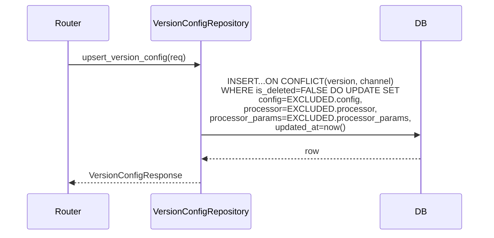

# NotebookLM原文34-大模型质检-t_llm_version_config表设计

## 来源追踪

- 来源总卡：[[notebooklm_quality_check_pipeline]]
- 原始文件：[原始 Markdown](../../../raw/notebooklm_exports/6b4b949e-d423-4033-b16f-bd037ac03fa8/34_171c50af-79de-437e-994a-fe82831229c5.md)
- source_id：`171c50af-79de-437e-994a-fe82831229c5`
- SHA-256：`87ff013b0937173ff95c6c55d629b356c4028399529ff047cd2e3d58c5623cc6`
- 原始字节数：12188

## 原文（逐字符保留）

<!-- ORIGINAL_START -->
---
id: "SYN-LLM-QC-VERSION-TABLE"
title: "大模型质检-t_llm_version_config表设计"
domain: ["llm_qa"]
type: "synthesis"

related_code: ["scripts/sql/", "src/llm/task_repository.py"]
affects_path: ["scripts/sql/", "src/llm/task_repository.py"]
trigger_keywords: ["大模型质检t_llm_version_config", "t_llm_version_config表设计", "完整DDL", "CHECK约束", "UPSERT", "联合唯一约束", "channel枚举", "JSONB config", "llm_qa表设计"]
tags: ["大模型质检", "t_llm_version_config", "表设计", "正向化", "DDL", "CHECK约束", "UPSERT"]
summary: "大模型质检part t_llm_version_config表正向化设计：补全[待人类补充]的完整DDL和CHECK约束(version非空/channel枚举约束/config非空约束)，联合唯一约束UNIQUE(version, channel) WHERE is_deleted=FALSE，UPSERT语义，DISTRIBUTE BY HASH(id)。"
---

# 大模型质检-t_llm_version_config 表设计

> 本卡是大模型质检part t_llm_version_config 表的**正向化设计卡**。
> - 上位枢纽：[[质检一站式平台大模型质检模块整体架构]]
> - 顶层架构：[[质检一站式平台顶层架构]]（沿用 §6 全局规范）
> - 现状来源：[[t_llm_version_config 表]]（现有 schema，**补全 [待人类补充] 的完整 DDL 和 CHECK 约束**）
> - 关联组件卡：[[大模型质检-Repository与数据库访问设计]] / [[大模型质检-版本配置设计]]
> - 对标人工质检卡：[[质检平台-综合快照表设计]]

---

## ① 组件概述

本组件对 t_llm_version_config 表进行正向化设计，**补全现状 [待人类补充] 的完整 DDL 和 CHECK 约束**：
- 完整 CREATE TABLE DDL（含所有字段、约束、索引）
- CHECK 约束（channel 枚举约束 + version 非空约束 + config 非空约束）
- 联合唯一约束（UNIQUE(version, channel) WHERE is_deleted=FALSE）
- UPSERT 语义（INSERT...ON CONFLICT）
- 索引设计
- 边界情况清单
- DDL 交付清单

### 1.1 设计原则（沿用顶层架构 §6 全局规范）

- NORM-DDL-SYNC：每张表同步交付迁移脚本 + 正式建表 SQL + 测试镜像 SQL。
- NORM-GAUSSDB-DDL：DDL 遵循 GaussDB 8.x 语法；DISTRIBUTE BY HASH；不支持 ADD COLUMN IF NOT EXISTS。
- NORM-TRIGGER-UPDATED-AT：updated_at 不用 TRIGGER，用应用层写入或 DEFAULT。
- NORM-SOFT-DELETE：业务查询默认 WHERE is_deleted=FALSE。

---

## ② 架构结构

### 2.1 ER 图（t_llm_version_config 字段关系）

```mermaid
erDiagram
    t_llm_version_config {
        UUID id PK
        TEXT version "NOT NULL 版本号"
        TEXT channel "NOT NULL CHECK枚举约束"
        JSONB config "通道配置"
        TEXT processor "module.path:func_name 仅prompt通道"
        JSONB processor_params "处理器参数"
        BOOLEAN is_deleted "DEFAULT FALSE"
        TIMESTAMP updated_at "应用层写now"
        TIMESTAMP created_at "DEFAULT now"
    }
    t_llm_version_config ||..|| UNIQUE "version+channel WHERE is_deleted=FALSE"
```

### 2.2 UPSERT 时序图



---

## ③ 数据表交互

### 3.1 t_llm_version_config 字段清单

| 列名 | 类型 | 约束 | 默认值 | 用途 |
|------|------|------|--------|------|
| id | UUID | PK | gen_random_uuid() | 主键 |
| version | TEXT | NOT NULL（CHECK 约束：version 非空） | — | 版本号 |
| channel | TEXT | NOT NULL（CHECK 约束：channel IN ('model','video','prompt','raw_img','label','pkl','inference','redo')） | — | 通道名 |
| config | JSONB | NOT NULL（CHECK 约束：config 非空） | — | 通道配置 |
| processor | TEXT | | NULL | 格式 `module.path:func_name`，仅 prompt 通道 |
| processor_params | JSONB | | NULL | 处理器参数 |
| is_deleted | BOOLEAN | NOT NULL | FALSE | 软删除标记 |
| updated_at | TIMESTAMP | NOT NULL | now() | 应用层写 now()（不用 TRIGGER） |
| created_at | TIMESTAMP | NOT NULL | now() | 创建时间 |

---

## ④ 子模块/文件/类级清单（affects_path 精确到文件级）

| 文件路径 | 类/模块 | 职责 | 状态 |
|---------|--------|------|------|
| `scripts/sql/migrations/V20260702_02__create_t_llm_version_config.sql` | 迁移脚本 | DDL 迁移 | [待新建] |
| `scripts/sql/t_llm_version_config.sql` | 正式建表 SQL | 正式环境建表 | [待新建] |
| `scripts/sql/t_llm_version_config_test.sql` | 测试镜像 SQL | 测试环境建表 | [待新建] |
| `src/llm/task_repository.py` | VersionConfigRepository | SQL 封装（UPSERT） | [待重构] |

---

## ⑤ 详细设计（含测试矩阵）

### 5.1 完整 DDL（补全现状 [待人类补充]）

```sql
-- 正式建表 SQL：scripts/sql/t_llm_version_config.sql
-- 遵循 NORM-GAUSSDB-DDL：DISTRIBUTE BY HASH；不支持 ADD COLUMN IF NOT EXISTS

CREATE TABLE t_llm_version_config (
    id              UUID            NOT NULL DEFAULT gen_random_uuid(),
    version         TEXT            NOT NULL,
    channel         TEXT            NOT NULL,
    config          JSONB           NOT NULL,
    processor       TEXT,
    processor_params JSONB,
    is_deleted      BOOLEAN         NOT NULL DEFAULT FALSE,
    updated_at      TIMESTAMP       NOT NULL DEFAULT now(),
    created_at      TIMESTAMP       NOT NULL DEFAULT now(),

    -- 主键约束
    CONSTRAINT pk_t_llm_version_config PRIMARY KEY (id),

    -- CHECK 约束
    CONSTRAINT chk_version_not_empty CHECK (version IS NOT NULL AND version <> ''),
    CONSTRAINT chk_channel_enum CHECK (channel IN ('model','video','prompt','raw_img','label','pkl','inference','redo')),
    CONSTRAINT chk_config_not_null CHECK (config IS NOT NULL),

    -- 联合唯一约束（仅 is_deleted=FALSE 的行）
    CONSTRAINT uq_version_channel_active UNIQUE (version, channel) WHERE is_deleted = FALSE
)
DISTRIBUTE BY HASH("id");

-- 索引设计
CREATE INDEX idx_version_config_version_channel_active ON t_llm_version_config (version, channel) WHERE is_deleted = FALSE;
CREATE INDEX idx_version_config_channel_active ON t_llm_version_config (channel) WHERE is_deleted = FALSE;
CREATE INDEX idx_version_config_is_deleted_active ON t_llm_version_config (is_deleted) WHERE is_deleted = FALSE;
CREATE INDEX idx_version_config_recycle_bin ON t_llm_version_config (created_at DESC) WHERE is_deleted = TRUE;
```

> 测试镜像 SQL（`scripts/sql/t_llm_version_config_test.sql`）结构相同，建在测试 schema 下（如 `data_common_4`）。

### 5.2 索引设计

| # | 索引名 | 字段 | WHERE 条件 | 用途 |
|---|--------|------|-----------|------|
| 1 | idx_version_config_version_channel_active | version, channel | is_deleted=FALSE | 联合查询 + UPSERT 冲突检测 |
| 2 | idx_version_config_channel_active | channel | is_deleted=FALSE | 通道筛选 |
| 3 | idx_version_config_is_deleted_active | is_deleted | is_deleted=FALSE | 软删除筛选 |
| 4 | idx_version_config_recycle_bin | created_at DESC | is_deleted=TRUE | 回收站查询（如适用） |

### 5.3 CHECK 约束

| 约束名 | 约束内容 | 用途 |
|--------|---------|------|
| chk_version_not_empty | version IS NOT NULL AND version <> '' | version 非空 |
| chk_channel_enum | channel IN ('model','video','prompt','raw_img','label','pkl','inference','redo') | channel 枚举约束 |
| chk_config_not_null | config IS NOT NULL | config 非空 |

### 5.4 UPSERT 语义

```sql
-- UPSERT：version+channel 为联合键，存在则更新不存在则插入
INSERT INTO t_llm_version_config (version, channel, config, processor, processor_params)
VALUES (%s, %s, %s, %s, %s)
ON CONFLICT (version, channel) WHERE is_deleted = FALSE
DO UPDATE SET
    config = EXCLUDED.config,
    processor = EXCLUDED.processor,
    processor_params = EXCLUDED.processor_params,
    updated_at = now();
```

### 5.5 边界情况清单

| # | 边界情况 | 处置 | 状态 |
|---|---------|------|------|
| 1 | 同 version 不同 channel | 允许（联合键 version+channel，不同 channel 是不同记录） | ✅ |
| 2 | 删除后 UPSERT 是否恢复 | 不恢复（is_deleted=TRUE 的记录不参与 UPSERT 冲突检测，INSERT 新记录） | ✅ |
| 3 | config 为空 JSONB（`{}`） | 允许（config IS NOT NULL 约束通过，空对象合法） | ✅ |
| 4 | processor 格式校验 | 应用层校验 `module.path:func_name` 格式（仅 prompt 通道必填，其他通道允许 NULL） | ✅ |
| 5 | processor_params 为 NULL | 允许（非 prompt 通道无需处理器参数） | ✅ |
| 6 | channel 不在枚举内 | CHECK 约束拒绝 | ✅ |
| 7 | version 为空字符串 | CHECK 约束拒绝 | ✅ |
| 8 | 并发 UPSERT 同一 version+channel | 一个 INSERT 成功，另一个 ON CONFLICT DO UPDATE | ✅ |
| 9 | 软删除后再次创建同 version+channel | INSERT 新记录（新 id），旧记录保留在回收站 | ✅ |
| 10 | 永久删除（如有） | 仅删 is_deleted=TRUE 的行 | ✅ |

### 5.6 DDL 交付清单（NORM-DDL-SYNC）

- 迁移脚本：`scripts/sql/migrations/V20260702_02__create_t_llm_version_config.sql`
- 正式建表 SQL：`scripts/sql/t_llm_version_config.sql`
- 测试镜像 SQL：`scripts/sql/t_llm_version_config_test.sql`

### 5.7 测试矩阵

| 用例编号 | 场景 | 输入 | 预期结果 |
|---------|------|------|---------|
| TC-VTBL-001 | UPSERT 新建 | version+channel 不存在 | INSERT 成功 |
| TC-VTBL-002 | UPSERT 更新 | version+channel 已存在（is_deleted=FALSE） | UPDATE 成功 |
| TC-VTBL-003 | UPSERT 冲突（已删除记录） | version+channel 存在但 is_deleted=TRUE | INSERT 新记录（新 id） |
| TC-VTBL-004 | 非法 channel | channel="invalid" | CHECK 约束拒绝 |
| TC-VTBL-005 | 空 version | version="" | CHECK 约束拒绝 |
| TC-VTBL-006 | NULL config | config=NULL | CHECK 约束拒绝 |
| TC-VTBL-007 | 空 JSONB config | config={} | 允许（合法） |
| TC-VTBL-008 | processor 格式错误 | processor="no-colon" | 应用层校验拒绝（仅 prompt 通道） |
| TC-VTBL-009 | 并发 UPSERT | 两个并发请求 | 一个 INSERT，一个 UPDATE |
| TC-VTBL-010 | 软删除后重建 | 删除后 UPSERT 同 version+channel | INSERT 新记录 |
| TC-VTBL-011 | 索引命中：通道筛选 | WHERE channel='model' AND is_deleted=FALSE | 命中 idx_version_config_channel_active |
| TC-VTBL-012 | DISTRIBUTE BY HASH 验证 | 查询执行计划 | 分布键为 id |

---

## ⑥ 完成情况与 TODO

| 项 | 状态 | 说明 |
|----|------|------|
| 完整 DDL | ✅ 本卡已补全 | CREATE TABLE + 约束 + 索引 |
| CHECK 约束 | ✅ 本卡已补全 | 3 个 CHECK 约束 |
| 联合唯一约束 | ✅ 本卡已定义 | UNIQUE(version, channel) WHERE is_deleted=FALSE |
| UPSERT 语义 | ✅ 本卡已声明 | ON CONFLICT DO UPDATE |
| 索引设计 | ✅ 本卡已定义 | 4 索引 |
| 边界情况清单 | ✅ 本卡已列出 | 10 条 |
| DDL 落地 | ⬜ | 见 [[大模型质检模块实施计划]] Phase 1 |
| 测试矩阵执行 | ⬜ | 待 DDL 落地后执行 |

### TODO
- [待人类补充] channel 枚举是否包含未来扩展通道（如 redo 之外的通道）。
- [待人类补充] processor 是否仅 prompt 通道必填，其他通道是否允许填写。
- [待人类补充] 测试镜像 SQL 的目标 schema（如 data_common_4）需确认。

---

## ⑦ 归属

- **上位枢纽**：[[质检一站式平台大模型质检模块整体架构]]
- **顶层架构**：[[质检一站式平台顶层架构]]（沿用 §6 全局规范）
- **现状来源**：[[t_llm_version_config 表]]
- **关联组件卡**：[[大模型质检-Repository与数据库访问设计]] / [[大模型质检-版本配置设计]]
- **规范引用**：[[DDL变更同步规范]] / [[GaussDB-DWS建表SQL规范]] / [[GaussDB TRIGGER限制与updated_at处理规范]] / [[软删除 is_deleted 设计规范]]
- **对标人工质检卡**：[[质检平台-综合快照表设计]]
<!-- ORIGINAL_END -->
