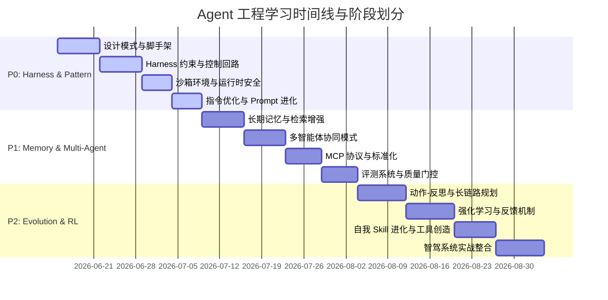

# 🤖 Agent 工程专项学习计划 (Agent Engineering Study Plan)

> **导航定位**：本计划归属于 [学习路线总纲](wiki/synthesis/学习路线总纲.md)，聚焦于 AI 智能体开发框架、安全约束沙箱、自进化与强化学习（RL）反馈回路。

---

## 📌 学习阶段与模块划分



### 🟩 阶段一：P0 核心概念与 Harness 约束 (第 1 - 4 星期)
本阶段目标是建立智能体基本控制流，理解测试与评估基座（Harness）的不可替代性，拒绝“裸奔 Agent”。

1. **第 1 模块：Agent 核心设计模式与开发脚手架**
   - **核心概念**：单 Agent 反馈回路、ReAct 框架、Symphony 等任务流脚手架。
   - **精读资料**：[Building Effective Agents](https://www.anthropic.com/research/building-effective-agents), [Deep Agents](https://github.com/langchain-ai/deepagents)。
2. **第 2 模块：Harness 约束工程与控制回路**
   - **核心概念**：Repo-as-Agent 模式、基础设施环境隔离、控制反馈回路。
   - **精读资料**：[Harness engineering: leveraging Codex](https://openai.com/index/harness-engineering), [The Anatomy of an Agent Harness](https://blog.langchain.com/the-anatomy-of-an-agent-harness/)。
3. **第 3 模块：沙箱环境与运行时安全保护**
   - **核心概念**：Docker 运行时隔离、文件系统权限拦截、敏感操作人工确认（HITL）。
   - **精读资料**：[OpenClaw 架构设计](https://github.com/openclaw/openclaw), [AgentScope 权限机制](wiki/concepts/Agent权限系统.md)。
4. **第 4 模块：系统提示词设计优化与动态演进**
   - **核心概念**：推理拓扑演变（CoT/ToT/GoT）、自动文本梯度下降与反向传播（APO/TextGrad）、OS级技能自进化（SkillOS）、Trainable md受限微调（SkillOpt）及动态生命周期裁剪淘汰（SLIM）。
   - **精读指南**：[系统提示词设计优化与动态演进：深水区精读](wiki/synthesis/系统提示词设计优化与动态演进_深水区精读.md)（深度解构 8 篇核心学术文献）。

---

### 🟨 阶段二：P1 记忆、多智能体协同与标准化 (第 5 - 8 星期)
本阶段目标是解决 Agent 在长上下文、多主体交互中的状态丢失与碎片化通讯问题。

5. **第 5 模块：长期记忆与上下文状态维护**
   - **核心概念**：Zettelkasten 式状态存储、向量与图混合记忆、滑动窗口记忆。
   - **精读资料**：[Memory in the Age of AI Agents](https://arxiv.org/pdf/2512.13564), [Honcho](https://github.com/plastic-labs/honcho)。
6. **第 6 模块：多智能体协同模式与网络拓扑**
   - **核心概念**：层级管理结构、广播与点对点通讯、共识与冲突消解。
   - **精读资料**：[Multi-agent coordination patterns](https://claude.com/blog/multi-agent-coordination-patterns), [Desplega Agent Swarm](https://github.com/desplega-ai/agent-swarm)。
7. **第 7 模块：MCP（Model Context Protocol）与通讯接口标准化**
   - **核心概念**：Tool/Resource/Prompt 三大协议基石、MCP-Bridge 动态调度。
   - **精读资料**：[Model Context Protocol 规范](https://modelcontextprotocol.io/)。
8. **第 8 模块：Agent 评测系统与检索质量门控**
   - **核心概念**：Test Battery 面试机制、自动化 Evals 统计（Hit@K/MRR）、噪声消除。
   - **精读资料**：[Demystifying evals for AI agents](https://www.anthropic.com/engineering/demystifying-evals-for-ai-agents), [NamedThingBench 评测](wiki/concepts/NamedThingBench检索评测.md)。

---

### 🟦 阶段三：P2 强化学习与自进化机制 (第 9 - 12 星期)
本阶段探讨 Agent 自发产生 Skill 并进行动作纠错的自进化闭环。

9. **第 9 模块：动作-反思架构与长链路路径规划**
   - **核心概念**：MCTS 树搜索、多步骤反思门控、Speculative Plan。
   - **精读资料**：[Agentic Reasoning for Large Language Models](https://arxiv.org/pdf/2601.12538)。
10. **第 10 模块：强化学习（RL）与反馈优化**
    - **核心概念**：DPO 与 RLHF 在动作空间的映射、On-Policy 轨迹蒸馏。
    - **精读资料**：[Alpamayo-R1 智驾蒸馏](https://arxiv.org/pdf/2511.00088)。
11. **第 11 模块：自我 Skill 进化与工具自我生成**
    - **核心概念**：运行时编译测试生成新工具、Skill Registry 缓存池。
    - **精读资料**：[5 Agent Skill design patterns](raw/openharness_details.json)。
12. **第 12 模块：自动驾驶与具身智能 Harness 整合实战**
    - **核心概念**：大模型决策与物理执行层对齐、零拷贝共享内存、端到端时钟同步。
    - **精读资料**：[自动驾驶 MLLM Harness 架构设计](raw/openharness_details.json)。

---

## 🛠️ 可执行实战任务 (7 大实践场景)

1. **【场景 A】基于 MCP 协议编写一个自动抓取学术网页的 Jina Reader 服务器**，并配置到本地 Cline 中。
2. **【场景 B】实现一个具备 Read-Only 编译环境和文件防护网的安全沙箱 Agent**，并编写 E2E 测试用例。
3. **【场景 C】为本地知识库编写一个 Hit@1 自动化评估脚本**，模拟用户的模糊 Query，检测检索通道召回率。
4. **【场景 D】基于 LangGraph 或 AgentScope 实现双 Agent 对抗讨论（Debate）流**，让其自动寻找逻辑漏洞并完成修正。
5. **【场景 E】构建一套 “Repo-as-Agent” 的 Harness 测试基座**，通过 CI pipeline 自动检测代码生成 Agent 的安全性。
6. **【场景 F】复现一套 Skill 进化系统**：当 Agent 遇到未定义任务时，调用 LLM 写一个 Python 函数，对其进行 pytest 测试，通过后动态注册进 Skill Registry 供下次复用。
7. **【场景 G】编写一个多模态时空对齐的 Agent 系统雏形**，将视频输入帧率与控制指令的频次进行同步。

---

## 🔍 NotebookLM 深度提问 (Interrogate) 指南

在对 Ingest 进去的 Source 进行提问时，使用如下结构化 Prompt：

```text
角色：挑剔且务实的 Agent 系统架构师
任务：针对 NotebookLM 中的“OpenHarness”笔记本所有资料，探索核心工程决策的底牌。

请深度分析并解答以下 3 个高频压测问题：
1. 为什么“Your Agent Needs a Harness, Not a Framework”？框架（Framework）与测试约束基座（Harness）在核心控制回路、异常捕获、沙箱拦截上有何根本技术分歧？
2. 在处理 Coding Agent（如 Claude Code）长时运行（Long-running）时，如何有效抵抗“指令漂移（Instruction Drift）”与“上下文崩溃”？有没有量化的缓冲防护策略？
3. Meta-Harness 论文中提到的“End-to-End Optimization of Model Harnesses”的核心数学建模是什么？它是如何通过反馈回路自动调整测试用例和评价因子的？
```

---

> [!TIP]
> 推荐在阅读完每一阶段的资料后，使用 `/grill-me` 召唤 ai-librarian 开展交互式面试，压测理解广度。
