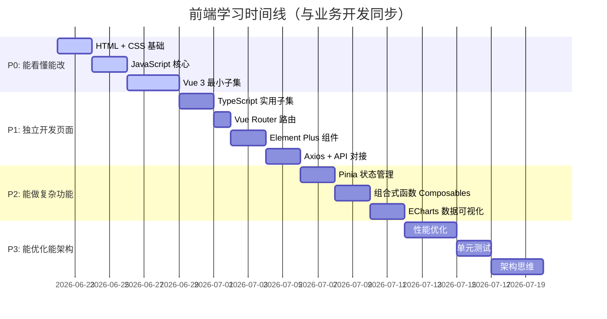

# 🎓 前端从零到精通学习指南

> **定位**：为 Python 背景的团队成员设计的前端学习路线。每个概念都有 **Python 类比**、**底层原理**、**实际代码示例**（使用我们的业务场景）、**练习任务**。
> **学习策略**：不要试图一次学完。按阶段推进，每个阶段都能产出实际业务代码。
> **关联**：[[数据质量门户架构设计]] | [[前端开发规范]] | [[Vue3核心概念]] | [[TypeScript实用指南]]

---

## 📌 学习阶段总览



---

## 🟩 P0 阶段：能看懂能改（第 1 周）

> **目标**：能看懂 .vue 文件的三个部分，能修改文字、样式、简单交互。

### 模块 1：HTML — 页面的骨架（0.5 天）

#### 是什么

HTML（HyperText Markup Language）是用「标签」描述页面结构的语言。浏览器读到 HTML 标签后，会把它渲染成你看到的网页内容。

**Python 类比**：如果说 Python 代码是"告诉计算机做什么"，那 HTML 是"告诉浏览器显示什么"。HTML 不是编程语言，它是**标记语言**——用标签来标记内容的含义。

#### 核心概念

```html
<!-- HTML 文件的基本结构 -->
<!DOCTYPE html>
<html>
<head>
  <title>页面标题（显示在浏览器标签上）</title>
</head>
<body>
  <!-- body 里面是页面上可见的内容 -->

  <!-- 标题标签：h1 最大，h6 最小 -->
  <h1>大模型质检系统</h1>
  <h2>任务列表</h2>

  <!-- 段落 -->
  <p>这是一段文字描述。</p>

  <!-- 链接 -->
  <a href="https://example.com">点击跳转</a>

  <!-- 图片 -->
  

  <!-- 列表 -->
  <ul>              <!-- ul = unordered list（无序列表） -->
    <li>自动化质检</li>
    <li>人工质检</li>
    <li>大模型质检</li>
  </ul>

  <!-- 表格 -->
  <table>
    <thead>
      <tr>                    <!-- tr = table row（表格行） -->
        <th>ID</th>           <!-- th = table header（表头） -->
        <th>任务名</th>
      </tr>
    </thead>
    <tbody>
      <tr>
        <td>1</td>            <!-- td = table data（表格数据） -->
        <td>模型A质检</td>
      </tr>
    </tbody>
  </table>

  <!-- 表单 -->
  <form>
    <label>任务名称：</label>
    <input type="text" placeholder="请输入任务名称" />

    <label>状态：</label>
    <select>
      <option value="pending">等待中</option>
      <option value="running">运行中</option>
    </select>

    <button type="submit">提交</button>
  </form>

  <!-- div：通用容器（就是个"盒子"，用于分组和布局） -->
  <div class="card">
    <h3>卡片标题</h3>
    <p>卡片内容</p>
  </div>

  <!-- span：行内容器（用于包裹一小段文字，加样式用） -->
  <p>任务状态：<span class="status">运行中</span></p>
</body>
</html>
```

> **最重要的理解**：HTML 中每个标签都是一个「盒子」。`<div>` 是最常用的通用盒子。整个页面就是盒子套盒子。

#### 在 Vue 中的应用

在 Vue 的 `.vue` 文件中，`<template>` 部分就是 HTML：

```vue
<template>
  <!-- 这里就是 HTML，但可以使用 Vue 的特殊语法 -->
  <div class="page">
    <h1>{{ title }}</h1>
    <el-table :data="tasks">...</el-table>
  </div>
</template>
```

#### 学习资源
- [MDN HTML 入门](https://developer.mozilla.org/zh-CN/docs/Learn/HTML/Introduction_to_HTML) — Mozilla 官方教程，最权威

---

### 模块 2：CSS — 页面的皮肤（1 天）

#### 是什么

CSS（Cascading Style Sheets）控制 HTML 元素的**外观**：颜色、大小、位置、间距、动画等。

**Python 类比**：HTML 像是 `print()` 输出的纯文本，CSS 就是让这些文本变成排版精美的报告。

#### 核心概念一：选择器（选中要装饰的元素）

```css
/* 1. 标签选择器：选中所有指定标签 */
h1 {
  color: blue;      /* 所有 h1 标签的文字变蓝 */
}

/* 2. 类选择器：选中 class="xxx" 的元素（最常用！） */
.task-card {
  background: white;
  padding: 16px;
}

/* 3. ID 选择器：选中 id="xxx" 的元素（一个页面只用一次） */
#main-content {
  width: 100%;
}

/* 4. 后代选择器：选中某元素内部的子元素 */
.task-card .title {
  font-size: 18px;  /* .task-card 内部的 .title */
}

/* 5. 伪类：特殊状态 */
.button:hover {
  background: blue;  /* 鼠标悬停时变蓝 */
}
```

#### 核心概念二：盒模型（每个元素都是一个盒子）

```
理解盒模型是理解 CSS 布局的基础：

┌──────────────── margin（外边距：元素之间的距离） ────────────────┐
│                                                                │
│  ┌─────────── border（边框） ───────────┐                       │
│  │                                     │                       │
│  │  ┌──── padding（内边距） ────┐        │                       │
│  │  │                          │        │                       │
│  │  │    content（内容区）       │        │                       │
│  │  │    width × height        │        │                       │
│  │  │                          │        │                       │
│  │  └──────────────────────────┘        │                       │
│  │                                     │                       │
│  └─────────────────────────────────────┘                       │
│                                                                │
└────────────────────────────────────────────────────────────────┘
```

```css
.card {
  width: 300px;           /* 内容区宽度 */
  padding: 16px;          /* 内边距：内容到边框的距离 */
  border: 1px solid #ddd; /* 边框 */
  margin: 24px;           /* 外边距：这个卡片和旁边元素的距离 */
  
  /* 加上这一行，width 就是整个盒子的宽度（含 padding 和 border） */
  box-sizing: border-box; /* ★ 项目中全局设置了这个 */
}
```

#### 核心概念三：Flexbox（弹性布局，最常用！）

```css
/* Flexbox 是现代 CSS 布局的核心，90% 的布局都用它 */

/* 场景一：水平排列，两端对齐 */
.page-header {
  display: flex;                    /* 开启弹性布局 */
  justify-content: space-between;   /* 主轴（水平）两端对齐 */
  align-items: center;              /* 交叉轴（垂直）居中 */
}

/* 场景二：等间距排列 */
.button-group {
  display: flex;
  gap: 12px;           /* 子元素之间的间距 */
}

/* 场景三：垂直排列 */
.sidebar {
  display: flex;
  flex-direction: column;   /* 改为垂直方向排列 */
  gap: 8px;
}

/* 场景四：完美居中 */
.loading-container {
  display: flex;
  justify-content: center;  /* 水平居中 */
  align-items: center;      /* 垂直居中 */
  height: 400px;
}
```

**Flexbox 速查表**：

```
justify-content（主轴对齐，默认水平方向）：
  flex-start    ← 靠左
  flex-end      → 靠右
  center        ← → 居中
  space-between ← → 两端对齐，中间等分
  space-around  ← → 每个元素周围等间距

align-items（交叉轴对齐，默认垂直方向）：
  flex-start    ↑ 靠上
  flex-end      ↓ 靠下
  center        ↑↓ 居中
  stretch       ↕ 拉伸填满
```

#### 核心概念四：CSS 变量

```css
/* 在 :root 中定义变量（全局生效） */
:root {
  --color-primary: hsl(215, 85%, 55%);
  --spacing-md: 16px;
  --radius-md: 8px;
}

/* 在任何地方使用 var() 引用 */
.button {
  background: var(--color-primary);
  padding: var(--spacing-md);
  border-radius: var(--radius-md);
}
```

> **Python 类比**：CSS 变量就像在文件顶部定义的常量 `COLOR_PRIMARY = '#409eff'`，到处引用，改一处全改。

#### 在 Vue 中的应用

```vue
<style scoped>
/* scoped 表示这些样式只作用于当前组件 */
.task-card {
  background: var(--color-bg-card);
  border-radius: var(--radius-md);
  padding: var(--spacing-lg);
  box-shadow: var(--shadow-sm);
  transition: box-shadow var(--transition-fast);
}

.task-card:hover {
  box-shadow: var(--shadow-md);  /* 悬停时阴影加深 */
}
</style>
```

#### 学习资源
- [MDN CSS 入门](https://developer.mozilla.org/zh-CN/docs/Learn/CSS) — 系统入门
- [Flexbox 青蛙游戏](https://flexboxfroggy.com/#zh-cn) — 玩游戏学 Flexbox（强烈推荐！15分钟通关）
- [CSS-Tricks Flexbox 指南](https://css-tricks.com/snippets/css/a-guide-to-flexbox/) — 最经典的 Flexbox 参考

---

### 模块 3：JavaScript 核心（1 天）

#### 是什么

JavaScript 是浏览器里的编程语言。Vue、TypeScript 都基于 JavaScript。

**Python 类比**：JavaScript 之于前端，就像 Python 之于后端——它是执行逻辑的核心语言。

#### Python vs JavaScript 对照表

```javascript
// ═══════════════════════════════════════
// 变量声明
// ═══════════════════════════════════════
// Python:  name = "张三"
// JS:
const name = '张三'    // const = 不可重新赋值（优先使用）
let count = 0          // let = 可重新赋值
// var count = 0       // var = 老写法，不要用！

// ═══════════════════════════════════════
// 数据类型
// ═══════════════════════════════════════
// Python:  name: str = "张三"
// JS:
const str = '字符串'               // string
const num = 42                     // number（没有 int/float 区分）
const bool = true                  // boolean
const arr = [1, 2, 3]              // 数组 ≈ Python list
const obj = { name: '张三', age: 25 } // 对象 ≈ Python dict

// ═══════════════════════════════════════
// 字符串
// ═══════════════════════════════════════
// Python:  f"Hello, {name}"
// JS:
const greeting = `Hello, ${name}`  // 模板字符串（反引号 `）

// ═══════════════════════════════════════
// 函数
// ═══════════════════════════════════════
// Python:  def greet(name):
//              return f"Hello, {name}"

// JS 方式一：普通函数
function greet(name) {
  return `Hello, ${name}`
}

// JS 方式二：箭头函数（匿名函数，类似 Python lambda 但更强大）
const greet = (name) => {
  return `Hello, ${name}`
}
// 简写：只有一行 return 时可以省略花括号和 return
const greet = (name) => `Hello, ${name}`

// ═══════════════════════════════════════
// 条件判断
// ═══════════════════════════════════════
// Python:  if status == 'done':
//              print('完成')
//          elif status == 'running':
//              print('运行中')
// JS:
if (status === 'done') {        // 注意：用 === 而非 ==
  console.log('完成')
} else if (status === 'running') {
  console.log('运行中')
}

// ═══════════════════════════════════════
// 循环
// ═══════════════════════════════════════
// Python:  for task in tasks:
//              print(task.name)
// JS:
for (const task of tasks) {
  console.log(task.name)
}

// Python:  [t.name for t in tasks if t.status == 'done']
// JS:（链式调用 filter + map）
tasks.filter(t => t.status === 'done').map(t => t.name)

// ═══════════════════════════════════════
// 数组常用方法（相当于 Python 列表操作）
// ═══════════════════════════════════════
// Python: tasks.append(new_task)
tasks.push(newTask)

// Python: len(tasks)
tasks.length

// Python: [t for t in tasks if t.status == 'done']
tasks.filter(t => t.status === 'done')

// Python: [t.name for t in tasks]
tasks.map(t => t.name)

// Python: any(t.status == 'done' for t in tasks)
tasks.some(t => t.status === 'done')

// Python: all(t.status == 'done' for t in tasks)
tasks.every(t => t.status === 'done')

// Python: next(t for t in tasks if t.id == 123)
tasks.find(t => t.id === 123)

// ═══════════════════════════════════════
// 对象（相当于 Python 字典）
// ═══════════════════════════════════════
const task = { id: 1, name: '质检任务' }

// Python: task['name'] 或 task.name（dataclass）
task.name  // JS 用点号访问

// Python: {**task, status: 'done'}  （解包合并）
const updated = { ...task, status: 'done' }  // JS 用展开运算符

// Python: task.keys()
Object.keys(task)  // ['id', 'name']

// ═══════════════════════════════════════
// 解构赋值（Python 没有直接对应）
// ═══════════════════════════════════════
// 从对象中提取字段
const { id, name } = task   // id = 1, name = '质检任务'

// 从数组中提取元素
const [first, second] = [10, 20]  // first = 10, second = 20

// ═══════════════════════════════════════
// 异步操作
// ═══════════════════════════════════════
// Python:  async def fetch_data():
//              result = await http_client.get(url)
// JS:
async function fetchData() {
  const result = await fetch(url)
  const data = await result.json()
  return data
}

// 调用：
const data = await fetchData()

// ═══════════════════════════════════════
// 异常处理
// ═══════════════════════════════════════
// Python:  try:
//              result = risky_operation()
//          except ValueError as e:
//              print(f"出错了: {e}")
//          finally:
//              cleanup()
// JS:
try {
  const result = riskyOperation()
} catch (error) {
  console.error(`出错了: ${error.message}`)
} finally {
  cleanup()
}
```

#### 最容易踩的坑

```javascript
// ★ 坑1：== vs === 
0 == ''     // true  （== 会自动类型转换，很危险！）
0 === ''    // false （=== 不转换，严格比较）
// 规则：永远用 ===，永远不用 ==

// ★ 坑2：null vs undefined
let a           // undefined（声明了但没赋值）
let b = null    // null（显式设置为"空"）
// 判断方式：
if (a == null)  // 同时匹配 null 和 undefined（这是 == 的唯一合理用法）

// ★ 坑3：this 指向
// Python 的 self 永远指向当前实例，但 JS 的 this 会随调用方式改变
// 解决方案：在 Vue 3 Composition API 中不需要 this，全部用 ref() 代替
```

---

### 模块 4：Vue 3 最小子集（2 天）

#### 核心理念：数据驱动

```
传统方式（jQuery 时代）：
  1. 用 JS 找到页面上的 DOM 元素
  2. 手动修改它的内容
  
  document.getElementById('count').innerText = '42'

Vue 方式：
  1. 声明一个响应式数据
  2. 在模板中绑定它
  3. 只管改数据，页面自动更新

  const count = ref(0)
  count.value = 42  // 页面上自动变成 42
```

#### 概念 1：响应式数据 — ref()

```vue
<template>
  <div>
    <p>计数：{{ count }}</p>
    <button @click="count++">+1</button>
    <button @click="reset">重置</button>
  </div>
</template>

<script setup lang="ts">
import { ref } from 'vue'

// ref() 创建一个"被 Vue 监视的变量"
// 在 script 中访问值需要 .value
// 在 template 中自动解包，不需要 .value
const count = ref(0)

function reset() {
  count.value = 0  // script 中用 .value
}
</script>
```

> **底层原理**：`ref()` 内部使用了 JavaScript 的 `Proxy` 机制。当你修改 `.value` 时，Vue 会通知所有使用了这个 ref 的地方（模板、计算属性等）重新计算和渲染。这就是"响应式"的含义——数据变化会自动"响应"到界面上。

#### 概念 2：模板语法

```vue
<template>
  <!-- 1. 插值：显示变量值 -->
  <p>任务名称：{{ task.name }}</p>
  
  <!-- 2. 属性绑定：v-bind（缩写 :） -->
             <!-- :src = v-bind:src -->
  <button :disabled="loading">提交</button>
  
  <!-- 3. 事件绑定：v-on（缩写 @） -->
  <button @click="handleSubmit">提交</button>   <!-- @click = v-on:click -->
  <input @input="handleInput" />
  
  <!-- 4. 条件渲染 -->
  <div v-if="loading">加载中...</div>
  <div v-else-if="error">出错了</div>
  <div v-else>{{ data }}</div>
  
  <!-- 5. 列表渲染 -->
  <ul>
    <li v-for="task in tasks" :key="task.id">
      {{ task.name }} - {{ task.status }}
    </li>
  </ul>
  
  <!-- 6. 双向绑定（表单元素专用） -->
  <input v-model="searchText" />   <!-- 输入框的值和 searchText 变量双向同步 -->
  
  <!-- 7. 动态 class -->
  <div :class="{ active: isActive, error: hasError }">
    <!-- isActive 为 true 时加上 active 类，hasError 为 true 时加上 error 类 -->
  </div>
</template>
```

#### 概念 3：计算属性 computed

```vue
<script setup lang="ts">
import { ref, computed } from 'vue'

const tasks = ref([
  { id: 1, name: '任务A', status: 'done' },
  { id: 2, name: '任务B', status: 'pending' },
  { id: 3, name: '任务C', status: 'done' },
])

// computed 会缓存结果，只有依赖的数据变了才重新计算
const doneCount = computed(() => 
  tasks.value.filter(t => t.status === 'done').length
)
// doneCount.value === 2

// 和 Python 的 @property 类似：
// class TaskManager:
//     @property
//     def done_count(self):
//         return len([t for t in self.tasks if t.status == 'done'])
</script>

<template>
  <p>已完成：{{ doneCount }} / {{ tasks.length }}</p>
</template>
```

#### 概念 4：父子组件通信（Props + Emits）

```vue
<!-- 父组件 TaskList.vue -->
<template>
  <div>
    <!-- 向子组件传数据：用 props -->
    <TaskCard
      v-for="task in tasks"
      :key="task.id"
      :task="task"
      @delete="handleDelete"
    />
    <!-- :task 传入数据，@delete 监听子组件事件 -->
  </div>
</template>

<script setup lang="ts">
import TaskCard from './TaskCard.vue'

const tasks = ref([...])

function handleDelete(taskId: number) {
  tasks.value = tasks.value.filter(t => t.id !== taskId)
}
</script>
```

```vue
<!-- 子组件 TaskCard.vue -->
<template>
  <div class="card">
    <h3>{{ task.name }}</h3>
    <button @click="emit('delete', task.id)">删除</button>
    <!--                     ↑ 触发事件，通知父组件 -->
  </div>
</template>

<script setup lang="ts">
// Props：从父组件接收的数据（只读！不能修改）
const props = defineProps<{
  task: { id: number; name: string; status: string }
}>()

// Emits：向父组件发送的事件
const emit = defineEmits<{
  'delete': [taskId: number]
}>()
</script>
```

> **类比 Python**：
> - `props` 就像函数参数 `def render_card(task: Task)` —— 输入
> - `emit` 就像回调函数 `def render_card(task, on_delete: Callable)` —— 输出

#### 概念 5：生命周期 onMounted

```vue
<script setup lang="ts">
import { ref, onMounted } from 'vue'

const data = ref(null)

// onMounted：组件"挂载"到页面后执行
// 类似于 Python 类的 __init__，但是在 DOM 准备好之后才执行
onMounted(async () => {
  // 在这里发请求加载数据
  data.value = await fetchData()
})
</script>
```

#### 练习任务 P0

```
任务一：创建一个简单的计数器组件
  - 显示当前数字
  - 有 +1、-1、重置 三个按钮
  - 数字为负数时显示红色

任务二：创建一个任务列表组件
  - 从一个固定数组渲染表格
  - 点击行可以弹出详情
  - 有一个搜索框可以筛选任务名
```

---

## 🟨 P1 阶段：独立开发页面（第 2-3 周）

### 模块 5：TypeScript 实用子集（1 天）

> 详见：[[TypeScript实用指南]]

#### 最小知识集

```typescript
// ═══════════════════════════════════════
// 1. 基本类型标注
// ═══════════════════════════════════════
const name: string = '张三'
const age: number = 25
const active: boolean = true
const tags: string[] = ['质检', 'LLM']

// ═══════════════════════════════════════
// 2. interface —— 定义数据的"形状"
// ═══════════════════════════════════════
// 类似 Python 的 TypedDict 或 dataclass
interface LlmQcTask {
  id: number
  task_name: string
  status: 'pending' | 'running' | 'completed' | 'failed'  // 联合类型
  created_at: string
  assignee?: string    // ? 表示可选字段
}

// ═══════════════════════════════════════
// 3. 函数类型标注
// ═══════════════════════════════════════
function formatDate(date: string): string {
  return new Date(date).toLocaleDateString()
}

// 箭头函数
const add = (a: number, b: number): number => a + b

// ═══════════════════════════════════════
// 4. 泛型 —— 先会用，不急着自己写
// ═══════════════════════════════════════
// ref<类型>() 告诉 Vue 这个 ref 里存什么类型的数据
const tasks = ref<LlmQcTask[]>([])     // 存 LlmQcTask 数组
const current = ref<LlmQcTask | null>(null)  // 存一个 Task 或 null

// ═══════════════════════════════════════
// 5. 类型导入
// ═══════════════════════════════════════
import type { LlmQcTask } from '@/types/llmQc'
// 注意：用 import type 而非 import，表示只导入类型（编译后会被删除）
```

### 模块 6：Vue Router（0.5 天）

#### 是什么

Vue Router 控制 URL 和页面组件的映射关系。用户访问 `/llm-qc` 时，显示大模型质检页面；访问 `/auto-qc` 时，显示自动化质检页面。

**Python 类比**：就像 FastAPI 的路由装饰器 `@app.get("/tasks")`，把 URL 映射到处理函数。

```typescript
// router/index.ts
const routes = [
  {
    path: '/llm-qc',              // URL 路径
    component: LlmQcDashboard,    // 对应的页面组件
  },
]

// 类比 FastAPI：
// @app.get("/llm-qc")
// async def llm_qc_dashboard():
//     return render("LlmQcDashboard")
```

#### 核心用法

```vue
<template>
  <!-- router-link：不刷新页面的跳转链接 -->
  <router-link to="/llm-qc">大模型质检</router-link>
  
  <!-- router-view：当前 URL 对应的页面组件会渲染在这里 -->
  <router-view />
</template>

<script setup lang="ts">
import { useRouter, useRoute } from 'vue-router'

const router = useRouter()  // 用于编程式跳转
const route = useRoute()    // 用于读取当前路由信息

// 编程式跳转
router.push('/llm-qc/tasks/123')

// 读取路由参数（如 /tasks/:id 中的 id）
const taskId = route.params.id

// 读取查询参数（如 /tasks?status=pending 中的 status）
const status = route.query.status
</script>
```

### 模块 7：Element Plus 常用组件（1 天）

#### 表格 el-table（最常用）

```vue
<template>
  <el-table :data="tasks" stripe v-loading="loading">
    <!-- prop 对应数据字段名 -->
    <el-table-column prop="id" label="ID" width="80" />
    <el-table-column prop="task_name" label="任务名称" />
    
    <!-- 自定义列内容 -->
    <el-table-column label="状态" width="120">
      <template #default="{ row }">
        <el-tag :type="row.status === 'done' ? 'success' : 'info'">
          {{ row.status }}
        </el-tag>
      </template>
    </el-table-column>
    
    <!-- 操作列 -->
    <el-table-column label="操作" width="200">
      <template #default="{ row }">
        <el-button size="small" @click="view(row)">查看</el-button>
        <el-button size="small" type="danger" @click="del(row.id)">删除</el-button>
      </template>
    </el-table-column>
  </el-table>
  
  <!-- 分页 -->
  <el-pagination
    v-model:current-page="page"
    :total="total"
    :page-size="20"
    layout="total, prev, pager, next"
    @current-change="loadData"
  />
</template>
```

#### 表单 el-form

```vue
<template>
  <el-form :model="form" :rules="rules" ref="formRef" label-width="100px">
    <el-form-item label="任务名称" prop="name">
      <el-input v-model="form.name" placeholder="请输入" />
    </el-form-item>
    
    <el-form-item label="模型" prop="model">
      <el-select v-model="form.model">
        <el-option label="GPT-4" value="gpt-4" />
        <el-option label="Qwen" value="qwen" />
      </el-select>
    </el-form-item>
    
    <el-form-item label="日期范围">
      <el-date-picker v-model="form.dateRange" type="daterange" />
    </el-form-item>
    
    <el-form-item>
      <el-button type="primary" @click="submitForm">提交</el-button>
      <el-button @click="resetForm">重置</el-button>
    </el-form-item>
  </el-form>
</template>

<script setup lang="ts">
const formRef = ref()
const form = ref({ name: '', model: '', dateRange: [] })

// 表单校验规则
const rules = {
  name: [{ required: true, message: '请输入任务名称', trigger: 'blur' }],
  model: [{ required: true, message: '请选择模型', trigger: 'change' }],
}

async function submitForm() {
  const valid = await formRef.value.validate()  // 触发校验
  if (valid) {
    await createTask(form.value)
    ElMessage.success('创建成功')
  }
}
</script>
```

#### 弹窗 el-dialog

```vue
<template>
  <el-button @click="dialogVisible = true">新建</el-button>
  
  <el-dialog v-model="dialogVisible" title="新建任务" width="600px">
    <!-- 弹窗内容（通常放表单） -->
    <el-form>...</el-form>
    
    <!-- 底部按钮 -->
    <template #footer>
      <el-button @click="dialogVisible = false">取消</el-button>
      <el-button type="primary" @click="submit">确定</el-button>
    </template>
  </el-dialog>
</template>

<script setup lang="ts">
const dialogVisible = ref(false)
</script>
```

### 模块 8：Axios + API 对接（1 天）

> 详见 [[数据质量门户架构设计]] 中的"端到端示例"部分。

#### 核心模式

```typescript
// api/request.ts — 创建和配置 axios 实例
import axios from 'axios'

const request = axios.create({
  baseURL: 'http://localhost:8000',
  timeout: 30000,
})

// 响应拦截器：统一处理
request.interceptors.response.use(
  (response) => {
    const { code, message, data } = response.data
    if (code !== 0) {
      ElMessage.error(message)
      return Promise.reject(new Error(message))
    }
    return data   // ★ 直接返回 data，组件中不用再取 .data
  },
  (error) => {
    ElMessage.error('网络错误')
    return Promise.reject(error)
  }
)
```

```typescript
// api/llmQc.ts — 定义接口
import request from './request'

export function getTaskList(params: { page: number; size: number }) {
  return request.get('/api/v1/llm-qc/tasks', { params })
}
```

```vue
<!-- 页面中使用 -->
<script setup lang="ts">
import { getTaskList } from '@/api/llmQc'

const tasks = ref([])
const loading = ref(false)

async function loadData() {
  loading.value = true
  try {
    const result = await getTaskList({ page: 1, size: 20 })
    tasks.value = result.items
  } finally {
    loading.value = false
  }
}

onMounted(() => loadData())
</script>
```

#### 练习任务 P1

```
任务三：完成大模型质检模块的 Dashboard 页面
  - 从后端 API 加载数据并渲染表格
  - 实现状态筛选和分页
  - 点击查看进入详情页（路由跳转）

任务四：完成一个"新建任务"弹窗
  - 带表单校验的弹窗
  - 提交后调用后端 API
  - 成功后关闭弹窗刷新列表
```

---

## 🟦 P2 阶段：能做复杂功能（第 4 周）

### 模块 9：Pinia 状态管理

**什么时候用 Store？**

```
数据只在一个组件用         → ref()，不需要 Store
数据在父子组件间传递       → props + emit
数据在兄弟/跨层级组件共享   → ★ 用 Store
```

```typescript
// stores/user.ts
import { defineStore } from 'pinia'

export const useUserStore = defineStore('user', () => {
  const name = ref('')
  const role = ref('')
  const isLoggedIn = computed(() => !!name.value)

  async function login(username: string, password: string) {
    const user = await loginApi(username, password)
    name.value = user.name
    role.value = user.role
  }

  function logout() {
    name.value = ''
    role.value = ''
  }

  return { name, role, isLoggedIn, login, logout }
})
```

```vue
<!-- 在任何组件中使用 -->
<script setup>
import { useUserStore } from '@/stores/user'
const userStore = useUserStore()
// userStore.name, userStore.login(), userStore.logout()
</script>
```

### 模块 10：组合式函数 Composables

**是什么**：把可复用的逻辑提取成函数。类似于 Python 中把重复的代码提取成工具函数。

```typescript
// composables/usePagination.ts
// 多个页面都需要分页逻辑，提取出来复用
export function usePagination(fetchFn: Function) {
  const page = ref(1)
  const pageSize = ref(20)
  const total = ref(0)
  const data = ref([])
  const loading = ref(false)

  async function loadData() {
    loading.value = true
    try {
      const result = await fetchFn({ page: page.value, size: pageSize.value })
      data.value = result.items
      total.value = result.total
    } finally {
      loading.value = false
    }
  }

  function changePage(newPage: number) {
    page.value = newPage
    loadData()
  }

  return { page, pageSize, total, data, loading, loadData, changePage }
}
```

```vue
<!-- 任何需要分页的页面 -->
<script setup>
import { usePagination } from '@/composables/usePagination'
import { getTaskList } from '@/api/llmQc'

const { data: tasks, loading, total, page, loadData, changePage } = usePagination(getTaskList)

onMounted(() => loadData())
</script>
```

### 模块 11：ECharts 数据可视化

```vue
<template>
  <div ref="chartRef" style="width: 100%; height: 400px"></div>
</template>

<script setup lang="ts">
import { ref, onMounted } from 'vue'
import * as echarts from 'echarts'

const chartRef = ref<HTMLDivElement>()

onMounted(() => {
  const chart = echarts.init(chartRef.value!)
  
  chart.setOption({
    title: { text: '质检通过率趋势' },
    xAxis: { 
      type: 'category', 
      data: ['1月', '2月', '3月', '4月', '5月'] 
    },
    yAxis: { type: 'value', name: '通过率 (%)' },
    series: [{
      data: [85, 88, 92, 90, 95],
      type: 'line',
      smooth: true,
    }],
  })
  
  // 窗口大小变化时自适应
  window.addEventListener('resize', () => chart.resize())
})
</script>
```

---

## 🟪 P3 阶段：能优化能架构（第 5 周+）

### 模块 12：性能优化
- **路由懒加载**：`component: () => import('./Page.vue')` — 只有访问时才加载
- **v-show vs v-if**：频繁切换用 `v-show`（只切换 display），不频繁用 `v-if`（销毁重建）
- **虚拟滚动**：大数据量列表使用虚拟滚动（只渲染可见行）

### 模块 13：单元测试（Vitest）
- 组件测试：验证渲染输出、用户交互
- 工具函数测试：验证输入输出

### 模块 14：架构思维
- 何时拆分组件、何时提取 composable
- 代码异味识别
- 详见：[[全栈项目设计模式与实践]]

---

## 📚 推荐学习资源（按优先级排列）

| 资源 | 类型 | 适合阶段 | 链接 |
|------|------|---------|------|
| Vue 3 官方教程 | 交互式教程 | P0 | [cn.vuejs.org/tutorial](https://cn.vuejs.org/tutorial/) |
| Flexbox 青蛙 | 游戏 | P0 | [flexboxfroggy.com](https://flexboxfroggy.com/#zh-cn) |
| MDN Web 文档 | 参考文档 | 全阶段 | [developer.mozilla.org/zh-CN](https://developer.mozilla.org/zh-CN/) |
| Element Plus 文档 | API 参考 | P1 | [element-plus.org/zh-CN](https://element-plus.org/zh-CN/) |
| TypeScript 入门教程 | 教程 | P1 | [ts.xcatliu.com](https://ts.xcatliu.com/) |
| ECharts 示例 | 示例库 | P2 | [echarts.apache.org/examples](https://echarts.apache.org/examples/zh/index.html) |
| Vue 3 设计与实现 | 书籍 | P3 | 霍春阳著（理解 Vue 底层原理） |

---

> ✅ 支持：[[数据质量门户架构设计]]
> ✅ 支持：[[前端开发规范]]
> ✅ 支持：[[Vue3核心概念]]
> ✅ 支持：[[TypeScript实用指南]]
