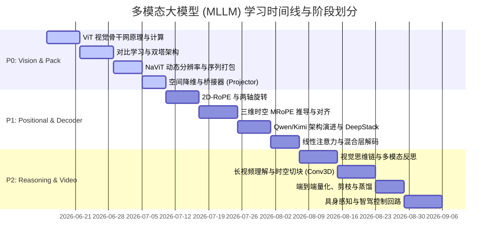

# 👁️ 多模态大模型专项学习计划 (Multimodal LLM Study Plan)

> **导航定位**：本计划归属于 [学习路线总纲](wiki/synthesis/学习路线总纲.md)，聚焦于视觉编码器骨干网、多维时空旋转位置编码、动态分辨率及混合 Decoder 架构。

---

## 📌 学习阶段与模块划分



### 🟩 阶段一：P0 视觉感知与动态打包 (第 1 - 4 星期)
本阶段目标是彻底厘清像素数据是如何转化为 LLM 能够识别的高维特征向量（Tokens），并算清参数量与显存开销。

1. **第 1 模块：ViT 视觉骨干网原理与参数计算**
   - **核心概念**：Patch Projection、Multi-Head Attention (MHA)、Inverted Bottleneck MLP、DC Offset。
   - **精读资料**：[ViT 核心原理与结构](wiki/concepts/vit_核心原理与结构.md), [ViT参数量、显存计算](wiki/concepts/vit参数量_显存计算.md)。
2. **第 2 模块：对比学习与表征双塔架构**
   - **核心概念**：Contrastive Learning、Noise Contrastive Estimation、双塔余弦相似度矩阵。
   - **精读资料**：[CLIP 对比学习视觉编码](wiki/concepts/clip_对比学习视觉编码.md), [SigLIP2 论文](raw/multimodal_details.json)。
3. **第 3 模块：NaViT 动态分辨率与序列打包 (Patch n' Pack)**
   - **核心概念**：原生动态分辨率、无填充 (No-Padding) 打包、二维位置编码。
   - **精读资料**：[NaViT 动态分辨率](wiki/concepts/navit_动态分辨率.md), [NaViT 论文](raw/multimodal_details.json)。
4. **第 4 模块：空间降维与桥接器 (Projector)**
   - **核心概念**：PatchMerger 空间压缩、MLP 映射、2x2 Token 合并。
   - **精读资料**：[PatchMerger 空间降维](wiki/concepts/patchmerger_空间降维.md)。

---

### 🟨 阶段二：P1 位置编码与混合 Decoder 架构 (第 5 - 8 星期)
本阶段进入多模态核心对齐与长上下文外推逻辑。

5. **第 5 模块：2D-RoPE 视觉相对位置编码**
   - **核心概念**：视觉两轴（X轴与Y轴）独立旋转、head_dim 二等分分治。
   - **精读资料**：[2D-RoPE 视觉位置编码](wiki/concepts/2d_rope_视觉位置编码.md), [2D-RoPE 推导与理解](wiki/concepts/2D-RoPE的推导与理解.md)。
6. **第 6 模块：三维时空 MRoPE（Multimodal RoPE）推导**
   - **核心概念**：时间维度、高度维度、宽度维度的三维交错编码，绝对物理时间戳对齐。
   - **精读资料**：[MRoPE 多模态位置编码](wiki/concepts/mrope_多模态位置编码.md), [Qwen3.5 交错式 MRoPE](wiki/concepts/qwen3.5_interleaved_mrope.md)。
7. **第 7 模块：多模态架构演进与 DeepStack**
   - **核心概念**：早期交叉门控 vs 现代混合堆叠（DeepStack 移除）、特殊占位符特殊 ID 映射。
   - **精读资料**：[Qwen3.5 多模态融合机制](wiki/concepts/qwen3.5_多模态融合机制.md), [Qwen2.5-VL 深度剖析](wiki/synthesis/qwen2.5_vl_深度剖析学习指南.md)。
8. **第 8 模块：线性注意力（Linear Attention）与混合解码**
   - **核心概念**：Gated Delta Rule 算法、GatedDeltaNet 架构、全注意力层交错、KV Cache 回收。
   - **精读资料**：[Qwen3.5 混合 Decoder 架构](wiki/concepts/qwen3.5_混合decoder架构.md), [GatedDeltaNet 线性注意力](wiki/concepts/qwen3.5_gated_delta_net.md)。

---

### 🟦 阶段三：P2 视觉推理、长视频与物理对齐 (第 9 - 12 星期)
本阶段深入前沿：探讨 VLM-CoT（大模型思维链在视觉中的延伸）与自动驾驶中的时空切块建模。

9. **第 9 模块：视觉思维链（Visual CoT）与多模态反思**
   - **核心概念**：Query-Expanded Visual Evidence、推理轨迹与思考门控、Visual Primitives。
   - **精读资料**：[Thinking with Visual Primitives](raw/multimodal_details.json), [See More, Think Deeper](raw/openharness_details.json)。
10. **第 10 模块：长视频时空切块与交错注意力**
    - **核心概念**：Conv3D 时空切块器、VisionPatchEmbed、交错窗口注意力（Window Attention）。
    - **精读资料**：[Conv3D 时空切块器](wiki/concepts/conv3d_时空切块器.md), [交错窗口注意力](wiki/concepts/window_attention_交错注意力.md)。
11. **第 11 模块：端到端量化、剪枝与知识蒸馏**
    - **核心概念**：INT8/INT4 动态激活值量化、Sparse Attention、小视觉模型蒸馏。
    - **精读资料**：[Draft-OPD: On-Policy Distillation](raw/multimodal_details.json)。
12. **第 12 模块：具身感知与智驾控制回路**
    - **核心概念**：多摄像头联合标定输入、自车轨迹预测表征、物理执行器反馈。
    - **精读资料**：[Alpamayo-R1 论文](raw/openharness_details.json), [自动驾驶 MLLM Harness 架构设计](wiki/concepts/自动驾驶_mllm_harness_架构设计.md) (待生成)。

---

## 🛠️ 可执行实战任务 (7 大实践场景)

1. **【场景 A】手写并绘制 ViT (Vision Transformer) 输入 Patch 投影前后的 Tensor Shape 变化图**，并用 PyTorch 算子验证。
2. **【场景 B】推导并手动编写 NumPy 版 2D-RoPE 算子**，分别对 X 轴与 Y 轴旋转，打印正弦与余弦的偏角状态。
3. **【场景 C】完成一个简易版的 Patch n' Pack 打包算法**：对 3 张不同大小的输入图像做 Patch 拆分，在无 Padding 的情况下，拼成一个一维长序列，并附带 Attention Mask 指示。
4. **【场景 D】编写 Conv3D 的 PyTorch 代码**，计算对 32 帧、224x224 分辨率视频做 kernel=(2,14,14) 的切块后，输出的 Token 维度及所消耗的 FLOPs。
5. **【场景 E】深入阅读 huggingface transformers 中的 Qwen3.5 源码建模文件**，在 `modeling_qwen3_5.py` 中标出它的 Full Attention 层与 GatedDeltaNet 线性注意力层是如何进行交替的。
6. **【场景 F】利用 PyTorch 搭建一个简单的双塔 CLIP 网络**，以相同维度（例如 128 维）完成一万张图像与标签的余弦相似度计算，计算双向 NCE 损失函数。
7. **【场景 G】基于 Qwen2.5-VL 编写一套多摄像头动态分辨率的预处理管道**，确保各摄像头 Patch 数的加权分配。

---

## 🔍 NotebookLM 深度提问 (Interrogate) 指南

在对 Ingest 进去的 Source 进行提问时，使用如下结构化 Prompt：

```text
角色：多模态基座模型专家（VLM Kernel Engineer）
任务：针对 NotebookLM 中的“多模态大模型”笔记本所有资料，深挖底层时空建模的硬核方案。

请深度分析并解答以下 3 个高频压测问题：
1. Qwen2.5-VL 提出的三维时空旋转位置编码（MRoPE）相比传统 2D-RoPE，其在处理“长视频中时间步（T）与空间位置（H,W）”上的数学相干性上有什么本质升级？为什么它能够对齐绝对物理时间？
2. NaViT 论文在实现可变输入宽高比（Variable Resolution）时，是如何消除 Padding 噪声并最大化 GPU 算力利用率的？其二元三元位置嵌入（2D Position Embeddings）是如何被计算并注入 Attention 回路中的？
3. 在 Qwen3.5 架构中，为什么要设计“GatedDeltaNet 线性注意力层”与“Full Attention 层”进行 1:1 交替？线性注意力层的 Delta Rule 算子是如何将时间复杂度从 $O(N^2)$ 砍到 $O(N)$ 且保持状态更新的？
```

---

> [!TIP]
> 推荐在阅读完每一阶段的资料后，使用 `/grill-me` 召唤 ai-librarian 开展交互式面试，压测理解广度。
