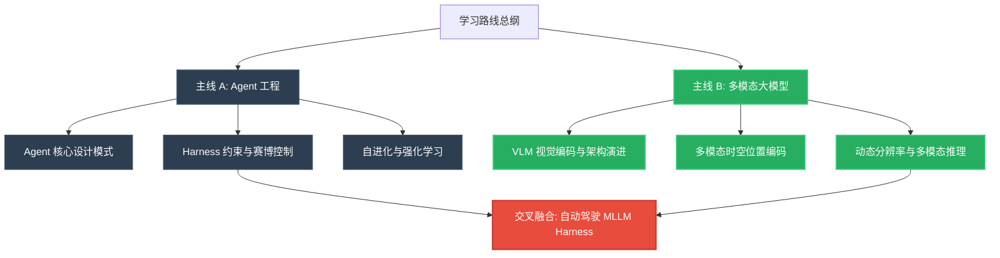

# 🧠 知识库系统化学习路线总纲 (Learning Path Master Guide)

> **导航定位**：本总纲是 Agent 工程与多模态大模型双主线学习的顶层设计图，结合了 [统一学习与知识管理框架](wiki/synthesis/统一学习与知识管理框架.md) 与 [MIT 48小时速成法](wiki/concepts/MIT_48小时速成法.md) 方法论，用于指导后续深度 Interrogate 与 Distill。

---

## 🧭 双主线知识架构俯视图

在 2026 年的 AI 工程实践中，**Agent 工程** 代表了“智能体的行动、交互与进化机制”，而 **多模态大模型 (MLLM)** 代表了“智能体的感知与推理大脑”。两者在 **Harness Engineering (测试与约束基座)** 上产生交汇，共同构成了现代端到端智驾系统和具身智能的底座。

---

## 🛠️ 核心方法论：四步学习闭环在双主线中的应用

本学习路线严格遵守 **“摄入 (Ingest) -> 验证 (Validate) -> 深度提问 (Interrogate) -> 提炼编译 (Distill)”** 的四步循环，具体执行护栏如下：

1. **Ingest（高保真摄入）**
   - 绝不无脑导入，通过 `raw/material_taxonomy.md` 梳理 229 个源的领域分类。
   - 所有论文 PDF 统一存放在 `raw/articles/{title}/` 下，配备原文快照与引用。
2. **Validate（主动压测）**
   - 不只停留在“看懂了”的幻觉，对每个模块设计 3-5 道核心“反直觉/长尾”问题。
   - 在 Code 层面，结合 `codegraph` 工具主动阅读 MLLM（如 Qwen3.5）的源码或 Agent 框架（如 AgentScope）的调用栈。
3. **Interrogate（多维深度探索）**
   - 利用 NotebookLM 的多源 RAG，进行多角度提问（详见各学习计划中的 Prompt）。
   - 将回答与本地 Wiki 相互链结，通过 Leiden 算法聚类形成知识网络。
4. **Distill（复利沉淀）**
   - 编写 Feynman 闪卡，并在卡片中强制关联 `affects_path` 或 `related_code`。
   - 沉淀技术演进时间线，确保技术脉络清晰。

---

## 📅 双主线学习路线图

两条主线按照 **优先级 (P0/P1/P2)** 和 **依赖关系** 划分为 24 个学习模块。建议采取 **交替推进** 或 **模块化突击** 的形式执行：

### 🤖 主线 A: Agent 工程学习路径
学习详细规划参见：[Agent 工程学习计划](wiki/synthesis/agent工程学习计划.md)

1. **P0 基础与 Harness 约束（1-4 模块）**
   - Agent 设计模式 ↔ Harness 约束基础 ↔ 运行时沙箱 ↔ 提示词与指令优化。
2. **P1 记忆与多智能体（5-8 模块）**
   - 长期记忆与检索 ↔ 多智能体协同模式 ↔ 协议与标准化 (MCP) ↔ 评测质量门控。
3. **P2 自进化与强化学习（9-12 模块）**
   - 动作与反思流 ↔ RL Feedback ↔ 自我 Skill 进化 ↔ 自动驾驶智驾实战。

### 👁️ 主线 B: 多模态大模型学习路径
学习详细规划参见：[多模态大模型学习计划](wiki/synthesis/多模态大模型学习计划.md)

1. **P0 视觉感知与编码（1-4 模块）**
   - 视觉骨干网 (ViT) ↔ 对比学习 (CLIP/SigLIP) ↔ 动态分辨率 (NaViT) ↔ 空间降维桥接。
2. **P1 位置编码与架构演进（5-8 模块）**
   - 2D-RoPE ↔ 多维时空 MRoPE ↔ Qwen/Kimi 架构演进 ↔ 线性注意力与混合层。
3. **P2 多模态推理与长视频（9-12 模块）**
   - 视觉推理与 VLM-CoT ↔ 长视频理解与时空切块 ↔ 模型蒸馏与量化 ↔ 具身智能融合。

---

## 🔗 关联分析与交叉落地点

两条主线的结合部是我们的终极实战落地点——**自动驾驶 MLLM Harness 与 具身智能 Agent 团队控制回路**。
- **交叉探索入口**：[Agent 与多模态交叉分析](wiki/synthesis/agent与多模态交叉分析.md)
- **核心沉淀卡片**：[自动驾驶 MLLM Harness 架构设计](wiki/concepts/自动驾驶_mllm_harness_架构设计.md) (待生成)

---

> [!NOTE]
> 本总纲及子计划将随着学习的深入进行动态迭代，所有完成的模块需在 [task.md](file:///home/yyh/.gemini/antigravity-ide/brain/186d6f73-505a-455f-a29b-38c5944469fd/task.md) 及 `log.md` 中进行阶段性登记。
