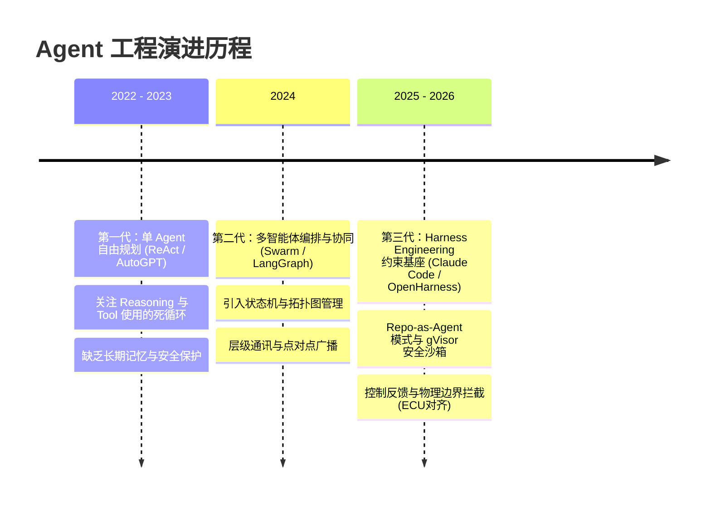
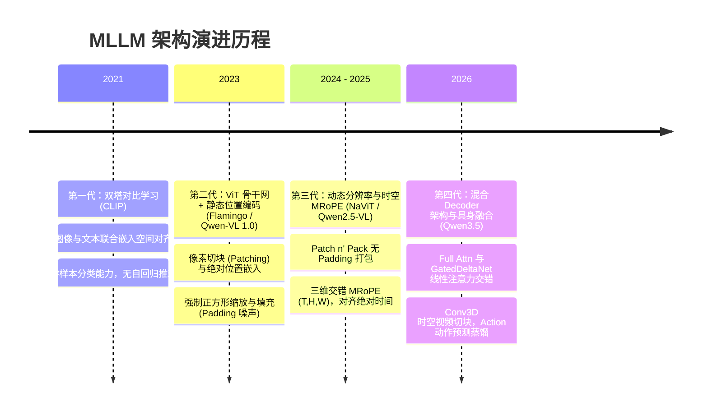

# 📅 Agent 工程与多模态大模型技术演进时间线 (Technology Evolution Timeline)

> **导航定位**：本时间线归属于 [学习路线总纲](wiki/synthesis/学习路线总纲.md)，用于梳理 Agent 工程代际演进与多模态大模型（MLLM）架构突破的演变历程，揭示技术演进的底层逻辑。

---

## 🤖 1. Agent 工程代际演进：从“自由探索”到“约束控制”

在过去的几年中，智能体开发范式完成了从“关注 Prompt 怎么写”到“关注运行安全与反馈约束”的根本性转变。

### 🧬 代际技术特征对比

| 维度 | 第一代：单 Agent 模式 | 第二代：多 Agent 协同 | 第三代：Harness 约束工程 |
|---|---|---|---|
| **核心范式** | ReAct (Reasoning + Action) | 状态机/工作流拓扑 (DAG) | 控制论反馈与安全包络拦截 |
| **状态维护** | 单次 Session 缓存，易溢出 | 外部 KV 存储/持久化线程 | Zettelkasten 与 Graph 动态混合记忆 |
| **安全机制** | 裸奔（直连宿主机），极度高危 | 提示词防御（Prompt Shield） | 三层纵深（AST Hooks + gVisor + HITL） |
| **典型代表** | AutoGPT, Early LangChain | LangGraph, AgentScope, CrewAI | Claude Code, OpenHarness, Symphony |

---

## 👁️ 2. 多模态大模型代际演进：从“静态压缩”到“时空对齐”

多模态大模型（MLLM）在感知维度的突破，使得 AI 智能体能够“看见”并“理解”物理世界的连续变化，从离散文字交互走向端到端具身决策。

### 🧬 代际技术特征对比

| 维度 | 第二代：静态感知 MLLM | 第三代：动态时空 MLLM | 第四代：混合解码具身 MLLM |
|---|---|---|---|
| **分辨率处理** | 缩放至 $224 \times 224$ 或 $448 \times 448$ | NaViT / Tiling 动态无损打包 | 物理标定多摄像头加权自适应 |
| **位置编码** | 1D / 2D 绝对可学习位置嵌入 | 2D-RoPE / 三维时空 MRoPE | Qwen3.5 交错式 4D MRoPE |
| **注意力机制** | 标准 MHA ($O(N^2)$ 复杂度) | Window Attention 交错局部感知 | Full Attn ↔ GatedDeltaNet 交替 |
| **视频建模** | 简单帧采样压缩，丢失时间戳 | 绝对物理时间戳对齐三轴编码 | Conv3D 物理时空立方体特征提取 |

---

## 🔗 3. 双主线交叉融合点：自动驾驶与具身智能 (2026+)

当 Agent 演进到第三代（Harness 约束），MLLM 演进到第四代（混合解码时空对齐），两者在**自动驾驶与具身控制**中发生了碰撞：

1. **感知-动作的超低延迟对齐**：通过 GatedDeltaNet 线性注意力层，使得自动驾驶模型能够处理无限长视频流，而不产生 KV Cache 溢出与 $O(N^2)$ 的延迟攀升。
2. **物理控制门控拦截**：Action Harness Layer 接管 MLLM 预测出的 Actions，利用动力学安全边界防翻车、防碰撞，并将干预状态日志重新作为“传感器输入”反馈给 MLLM 决策层，形成真正的**闭环赛博控制论系统**。
