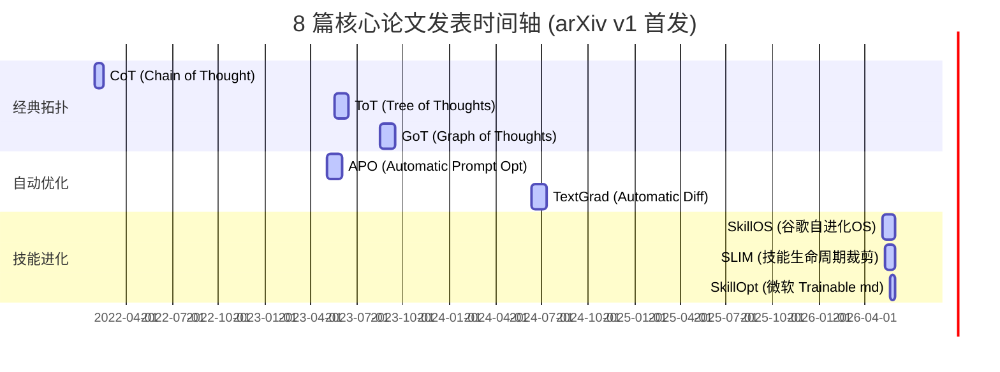

# 🧠 系统提示词设计优化与动态演进：深水区精读 (Prompt Optimization & Dynamic Skill Evolution)

> **导航定位**：本报告归属于 [学习路线总纲](wiki/synthesis/学习路线总纲.md) 与 [Agent 工程学习计划](wiki/synthesis/agent工程学习计划.md) 的“系统提示词设计优化与动态演进”板块，是对 8 篇核心学术文献的深水区精读与演变脉络梳理。

---

## 📅 1. 8 篇核心论文全景时间轴与拓扑演进

提示词（Instructions/Skills）在智能体系统中的形态经历了三个划时代的代际演进：从**手工静态设计**，到**算法化数据驱动自动重写**，再到**操作系统级的动态自进化与裁剪**。



---

## 🔍 2. 三大流派横向比较：2026 春季自进化前沿

在 2026 年春季，以**微软 SkillOpt**、**谷歌 SkillOS** 和 **SLIM** 为代表的自进化框架达到了工业级落地水准。它们在“如何在不微调模型权重的条件下，低成本让 Agent 进化其技能库”这一核心命题上给出了不同视角的解法。

| 维度对比 | 流派一：微软 SkillOpt (2026.05.22) | 流派二：谷歌 SkillOS (2026.05.07) | 流派三：SLIM / Dynamic-Skill (2026.05.12) |
|---|---|---|---|
| **核心隐喻** | **Trainable Parameter (可训练参数)**<br>将单个 `skill.md` 视作一个可以进行 Bounded Edits 调整的参数。 | **Operating System (操作系统)**<br>Curator 动态调度 Skill Curation 与 SkillRepo 的添加与注销。 | **Algebraic Lifecycle (代数生命周期)**<br>使用十个抽象代数算子（Prune, Distill 等）控制技能的生命周期。 |
| **状态载体** | 局部 `skill.md` 文件（包含系统级指令与工具规范）。 | 动态的 `SkillRepo`（由多个 Markdown 技能卡构成的内存/磁盘库）。 | 动态演进的活动 Skill Set。 |
| **优化驱动** | **Rollout 跑分评估**：在验证集上对比优化前后得分，通过 Validation Gate 门控防退化。 | **Curator-Executor RL 配方**：基于任务成败的轨迹进行强化学习更新决策。 | **Leave-one-skill-out 验证**：剔除单个技能进行差分验证，动态裁剪低价值技能。 |
| **运行开销** | 优化阶段需要多次 API 调用；推理运行期 **零额外开销**。 | 包含 Curator 模型路由开销；运行时需按需检索和注入。 | 包含动态裁剪验证开销，但显着降低了推理期 Context 消耗。 |
| **核心算子** | Bounded Edit (局限增删改)。 | ADD, UPDATE, DELETE。 | ADD, PRUNE, DISTILL, COMPOSE, MERGE... |

---

## ⚡ 3. 八篇文献深水区 Q&A 精读归档

### 📚 [1] [CoT: Chain-of-Thought (2022.01.28)](file:///home/yyh/project/ai-knowledge-base/raw/articles/prompt_optimization/CoT_2022_2201.11903.pdf)
> **论文背景**：打破 LLM “一步到位”的概率预测限制，使模型在自回归解码中获得物理算力的“时间换空间”缓冲。

* **Q1：CoT 促使大模型推理能力提升的数学/计算本质是什么？**
  * **A1**：大模型（Transformer）在生成每一个 Token 时，其计算量是固定的（与网络深度、宽度和注意力层数成正比）。如果要求模型直接给出复杂数学题的最终答案，模型必须在单次前向传播中压缩并推导出所有的中间变量，这极易溢出其计算容量。CoT 通过在 Prompt 中诱导模型输出“推理链（Rationale）”，使得最终的“Answer Token”在计算时能够通过 Self-Attention 机制“看到”并“聚集”之前所有已经显式解码出来的中间推理步骤（Thoughts），实际上是将**隐式的深度推导转化为了沿 Token 序列方向的显式自回归链式计算**，实现了计算路径的动态延长。
* **Q2：Few-shot CoT 与 Zero-shot CoT ("Let's think step by step") 在激活大模型推理时有什么区别？**
  * **A2**：Few-shot CoT 依靠人工编写的 Reasoning Exemplars，向大模型示范了针对特定任务的特定推理模式（Schema Alignment），大模型在上下文学习（In-Context Learning）中模仿这种拓扑进行格式对齐。而 Zero-shot CoT（由 Kojima et al. 提出）通过在 Prompt 尾部添加 "Let's think step by step" 触发词，直接改变了大模型自回归生成的条件概率分布，诱导模型从“直接回答模式”切换到“Rationale 解释模式”，它依赖于大模型在预训练数据中习得的解释性语言模式的潜在召回。
* **Q3：CoT 存在哪些难以逾越的系统边界和痛点？**
  * **A3**：1. **单向不可逆性（No Backtracking）**：CoT 是一条单线自回归链条，一旦中途某一步推理出错（如计算失误或幻觉），错误会发生雪崩式级联，后续步骤无法回溯纠错。2. **无法并行分叉**：CoT 无法在多个不同的可能策略中进行宽度/深度探索，缺乏系统级的搜索规划。

---

### 📚 [2] [ToT: Tree of Thoughts (2023.05.17)](file:///home/yyh/project/ai-knowledge-base/raw/articles/prompt_optimization/ToT_2023_2305.10601.pdf)
> **论文背景**：将 LLM 从“直觉式的一步一步生成（System 1）”提升到“具备全局规划与回溯纠错能力的系统化检索（System 2）”。

```
   [Root Task]
     /      \
  [Step 1]  [Step 2]   <-- Thoughts Generation (LLM)
    |          |
  [Eval:0.8] [Eval:0.1] <-- Evaluator (LLM Vote/Value)
    |          X (Prune)
  [Step 1.1]
```

* **Q1：ToT 是如何定义“思维节点（Thought Node）”与“搜索策略”的？**
  * **A1**：ToT 将复杂任务解构为一个状态空间树。每个节点是一个**思维步骤（Thought Segment）**（例如数独游戏里填入一个格子的数字，或创意写作中的一个大纲段落）。ToT 定义了三个核心模块：
    1. **Thought Generator**：基于当前节点状态，生成 $k$ 个候选的下一步思维。
    2. **State Evaluator**：利用 LLM 充当 Evaluation Engine，对当前思维节点进行打分（Value Estimate，如 $[0, 1]$ 分值）或者分类投票（Vote，判定是 Sure/Maybe/Impossible）。
    3. **Search Algorithm**：由外部 Python 代码驱动，调度 **BFS**（广度优先搜索，适用于步骤数少且每步需要全局最优的选择）或 **DFS**（深度优先搜索，适用于探索深度深且有明确终止状态，失败后可回溯的场景）。
* **Q2：ToT 中的状态评估器（State Evaluator）相比传统的 RL 奖励模型（Reward Model）有何不同？**
  * **A2**：RL 奖励模型通常需要对完整的答案轨迹进行监督学习训练（是一个参数化的拟合网络）。而 ToT 的 State Evaluator 是**非参数化、零样本提示词驱动的**。它通过专门的 Evaluator Prompt，命令 LLM 扮演严厉的裁判，从全局逻辑或约束规则出发，对当前的局部推理中间步骤执行可行性校验（Feasibility Check）。它不需要训练，直接依赖 LLM 本身涌现的评估能力。
* **Q3：在实际工业落地中，ToT 为什么经常遇到延迟和成本瓶颈？**
  * **A3**：ToT 极度依赖并发搜索。在树的每一层，为了评估 $k$ 个候选节点，需要多次调用大模型进行生成和估值。这导致 API 耗时（Latency）呈指数级上升，且输入/输出 Token 消耗极大，不适合高实时性的在线系统。

---

### 📚 [3] [GoT: Graph of Thoughts (2023.08.17)](file:///home/yyh/project/ai-knowledge-base/raw/articles/prompt_optimization/GoT_2023_2308.09687.pdf)
> **论文背景**：打破树状拓扑的局限，让思维节点可以任意合并、循环迭代、并在网状结构中交叉协同。

* **Q1：GoT 中的“思维变换算子（Thought Transformations）”具体包含哪些？**
  * **A1**：GoT 显式定义了三种非线性的思维拓扑变换算子：
    1. **Aggregation (聚合/合并)**：将多个并行的思维节点（例如多个子问题的答案草稿）聚合成一个统一的结论节点。
    2. **Refinement (打磨/自循环)**：将一个思维节点通过反馈回路（Feedback Loop）重新输入给自己，生成一个更新、质量更高的节点，代表自我纠错与迭代。
    3. **Generation (生成)**：由旧节点衍生出新的子思维节点。
* **Q2：GoT 的执行器是如何在外部维护思维的有向无环图（DAG）的？**
  * **A2**：GoT 在外部由一个 Python 控制层维护一个**思维图（Graph of Thoughts, GoT）**数据结构。外部框架管理节点间的依赖关系（In-degree & Out-degree），当判定某个分支评估分数低下时，会调度 Pruning 算子将其裁撤；当判定两点信息互补时，会自动组装一个 Multi-Source Prompt 喂给 LLM，触发合并（Merge）操作。LLM 仅充当无状态的“节点生成与评估计算单元”，状态和拓扑管理完全由外部代码托管。
* **Q3：在“列表排序（Sorting）”任务中，GoT 是如何展现对 ToT 的降维打击的？**
  * **A3**：对于包含 32 个数字的列表排序，ToT 只能按树状生成候选数字对并逐层筛选。而 GoT 可以模拟**归并排序（Merge Sort）**的思想：首先将大列表拆分为多个子图节点，让 LLM 并行排序，然后利用 **Aggregation 算子**将排序好的子列表合并，最后通过 Refinement 纠正合并中的顺序偏差。这使得 GoT 的排序质量相比 ToT 提升了 62%，同时总 Token 开销降低了 31% 以上。

---

### 📚 [4] [APO: Automatic Prompt Optimization (2023.05.04)](file:///home/yyh/project/ai-knowledge-base/raw/articles/prompt_optimization/APO_2023_2305.03495.pdf)
> **论文背景**：将人工“瞎试 Prompt”的行为算法化，首次引入文本“负梯度”来指导 Prompt 的演化。

* **Q1：APO 是如何利用“自然语言梯度”更新 Prompt 的？**
  * **A1**：APO（其算法称为 **ProTeGi**）借鉴了数值梯度下降的优化范式，具体步骤如下：
    1. **错例发掘**：在小批次训练集（Mini-batch）上测试当前 Prompt $p$，找出预测错误的样本组 $(x_i, y_{pred}, y_{true})$。
    2. **计算梯度（文本反向反馈）**：将错例、当前 Prompt、真实标签和错误预测一同喂给一个 Critique LLM，促使其生成一段自然语言诊断意见。这段诊断意见描述了“当前 Prompt 存在什么漏洞导致了这些错例”，这便是 **“文本梯度”（Textual Gradient）**。
    3. **梯度下降（Prompt Editing）**：将当前 Prompt $p$ 和上述文本梯度输入给 Rewrite LLM，指示其“朝向反向梯度语义”（即纠正这个诊断中指出的漏洞）来生成 $k$ 个新的 Prompt 变体。
* **Q2：APO 中的 Beam Search 与 Bandit Selection 机制是如何保证收敛的？**
  * **A2**：在每一步优化迭代中，APO 会生成多个候选 Prompt 变体。为了控制 API 评估成本并防止过拟合：
    - **Beam Search**：在每一步只保留前 $B$ 个效果最好的 Prompt（称为 Beam Width），其余的在下一步优化中被丢弃。
    - **Bandit Selection (UCB)**：为了在更少的训练样本上准确预估哪个 Prompt 最优，APO 将候选 Prompt 选择建模为多臂老虎机（Multi-armed Bandit）问题，使用上置信界（UCB）公式动态决定在哪个候选 Prompt 上运行测试样本，从而用极少的计算量定位出最稳定的 Prompt。

---

### 📚 [5] [TextGrad: Automatic Differentiation via Text (2024.06.11)](file:///home/yyh/project/ai-knowledge-base/raw/articles/prompt_optimization/TextGrad_2024_2406.07496.pdf)
> **论文背景**：将整个复杂的 LLM-Agent 工作流抽象为类似神经网络的 PyTorch 计算图，让“文本梯度”能够在多个咬合组件间自由传导。

```
[System Inputs] --> (System Component A: LLM Code Generator) 
                              |
                     [Variable: Generated Code]
                              |
                    (System Component B: Code Evaluator)
                              |
                      [Variable: Loss / Errors]
                              |
     LLM Textual Backpropagation (Propagates Feedback B --> Variable --> A)
```

* **Q1：TextGrad 的计算图（Computation Graph）与 PyTorch 相比有何本质异同？**
  * **A1**：
    - **相同点**：两者都将系统表示为由变量（Variables）和算子（Functions/LLM calls）构成的有向无环图。变量存储前向传播的状态，当计算出 Loss 后，执行 `.backward()` 函数，沿着前向路径的反向传播偏导/反馈。
    - **不同点**：PyTorch 处理的是实数张量（Continuous Tensors），其梯度是精确的偏导数数值，通过链式法则（Chain Rule）进行矩阵乘法传播。而 TextGrad 处理的是**离散的自然语言文本变量（Variables as Text）**。它的“算子”是 LLM API 或者是外部工具，其“梯度”是**详细的文本修改意见（Critics）**。它不进行矩阵乘法，而是利用 LLM 自回归的理解能力，在 backprop 阶段将下游的 Critic 逆向组装进 Prompt，让上游组件理解下游的修改诉求。
* **Q2：请用 Python 伪代码展示 TextGrad 实现自动微分优化 Prompt 的基本流拓扑。**
  * **A2**：
    ```python
    import textgrad as tg

    # 1. 定义可优化变量 (类似 PyTorch 中的 requires_grad=True)
    system_prompt = tg.Variable(
        "You are a coding assistant. Write a python function for the task.", 
        requires_grad=True, 
        role_description="System Prompt"
    )

    # 2. 定义优化器 (使用 TextGrad 提供的 TextualGradientDescent)
    optimizer = tg.TGD(parameters=[system_prompt], lr=1.0)

    # 3. 前向传播
    task_input = tg.Variable("Sort a list of dicts by a nested key 'age'.", requires_grad=False)
    # 算子：LLM 调用
    model = tg.BlackBoxLLM(model_id="gpt-4o")
    generated_code = model(system_prompt, task_input)

    # 4. 计算 Loss (使用专用的 CodeLoss 算子检测编译或运行错误)
    loss_fn = tg.CodeLoss()
    loss = loss_fn(generated_code)

    # 5. 反向传播 (自动生成文本梯度并回传给 system_prompt)
    loss.backward()

    # 6. 梯度更新 (调用 LLM 根据回传的 grad 修改 system_prompt)
    optimizer.step()
    ```
* **Q3：在 TextGrad 中，如何防止文本梯度在反向传播多层后出现“梯度爆炸”或“梯度消失”？**
  * **A3**：TextGrad 同样面临多层反馈累积导致的性能坍塌。当计算图太深时，下游的修改反馈在传递到最上游时会混入过多杂音，导致上游组件无所适从（类似于**梯度噪声爆炸**）；或者反馈语焉不详，导致上游没有做出实质改变（类似于**梯度消失**）。TextGrad 采用 **Meta-Prompting（元提示引导）** 约束每一次 backprop 时 LLM 的梯度生成，强制梯度只能提供“局部、具体的改进建议”；同时在优化器更新（optimizer.step）时引入 **梯度剪裁（Grad Clipping）** 机制，限制单次 Prompt 修改的代码行数或词数，确保参数空间平滑演进。

---

### 📚 [6] [SkillOpt: Self-Evolving Agent Skills (2026.05.22)](file:///home/yyh/project/ai-knowledge-base/raw/articles/prompt_optimization/SkillOpt_2026_2605.03816.pdf)
> **论文背景**：微软研究院成果。解决运行期优化 Prompt 带来的恐怖延迟和费用，实现“推理期零开销（Zero Runtime Overhead）”的离线技能蒸馏优化。

* **Q1：SkillOpt 是如何将技能演进建模为“深度学习风格”的离线训练流程的？**
  * **A1**：SkillOpt 将优化过程完全剥离于在线推理期。它引入了完整的深度学习训练配方：
    - **Epochs & Mini-batches**：准备一个脱机的训练任务数据集，分成若干 Batches 进行训练。
    - **Trainable Weights as md**：训练的参数是技能描述 Markdown 模块（例如：`skill.md`）。
    - **Bounded Edit Operators**：优化器在分析了一个 Epoch 中 Agent 执行任务的错误 Trace 后，只能在 `skill.md` 中进行“原位受限编辑”（增、删、改其中某一行或某一条规则），而不是无限制地重写，确保优化方向可控。
    - **Validation Gate**：每轮编辑完成后，必须通过验证集验证，如果得分下降，自动回滚。
* **Q2：SkillOpt 的“零运行时开销”特性的技术边界是什么？**
  * **A2**：由于优化完全在离线训练阶段（Training Stage）完成，一旦 `skill.md` 被优化并固定下来，在线部署时，Agent 只需要直接加载这一个最优化好的 `skill.md` 静态文件即可。在推理阶段，没有引入任何多臂老虎机路由模型，也没有额外的文本梯度反向传播 LLM 调用，其耗时和 Token 开销与普通的 Static Prompt 完全一致，极大地降低了端到端推理时延。

---

### 📚 [7] [SkillOS: Learning Skill Curation for Self-Evolving Agents (2026.05.07)](file:///home/yyh/project/ai-knowledge-base/raw/articles/prompt_optimization/SkillOS_2026_2605.06614.pdf)
> **论文背景**：谷歌团队提出的自进化操作系统，通过 Curator 模型在运行期接管 Agent 技能的增删改查。

```
[Agent Executor] (Frozen) <-- Runs Tasks & Outputs Logs
       |
  (Feedback)
       v
[Skill Curator] (Trainable) --> Manages [SkillRepo (Markdown files)]
```

* **Q1：SkillOS 中的“Executor-Curator”双层架构是如何协同工作的？**
  * **A1**：SkillOS 引入了双层强化学习架构：
    1. **Executor（执行器）**：负责加载特定技能，在物理环境（如控制机械臂或终端命令行）中执行任务，并输出详尽的动作轨迹与反馈日志。Executor 的模型参数完全冻结。
    2. **Curator（馆长/技能管理员）**：专门管理一个结构化的 Markdown 技能仓库（`SkillRepo`）。Curator 是一个可训练的模型。它监听 Executor 的轨迹，发现 Executor 因为“没有某项特定技能”而失败，或者某项技能过时时，在后台调度 Curation 机制，对 `SkillRepo` 触发 `ADD`, `UPDATE`, `DELETE` 操作。
* **Q2：Curator 模型的强化学习配方中，奖励函数是如何度量一个技能的长远贡献的？**
  * **A2**：如果仅以单次任务的成功作为奖励，Curator 会倾向于疯狂为 Executor 添加针对当前任务的临时特化 Prompt，导致技能库迅速退化为不可复用的垃圾堆。SkillOS 设计了 **基于可复用性的折扣长期奖励（Discounted Long-term Reuse Reward）**：当 Curator 创建一个技能后，仅在后续的 $N$ 次不同类型的混合测试中该技能被 Executor 成功调用并显著提高成功率时，才给予正向 Reward。反之，若该技能长期处于闲置状态，或被调用但导致任务失败，Curator 会收到负 Reward，触发其对该技能执行 Prune（剪裁）或 Demote（降级）。

---

### 📚 [8] [SLIM / Dynamic-Skill: Lifecycle Management (2026.05.12)](file:///home/yyh/project/ai-knowledge-base/raw/articles/prompt_optimization/SLIM_2026_2605.05318.pdf)
> **论文背景**：打破“技能只加不减”的膨胀魔咒，将技能的生命周期严格进行代数化管理与动态裁剪。

* **Q1：为什么技能的“无节制累积”会导致 Agent 系统性能退化？SLIM 如何解决这一问题？**
  * **A1**：当一个 Agent 拥有成百上千个技能时，面临两大痛点：1. **Context 爆炸**：若将全部技能塞入上下文，会极大地挤占模型的有效注意力窗口，增加推理开销。2. **技能干涉与混淆（Interference）**：大模型在多步检索中，极易将两个命名或描述相似的技能混淆，误调用错误的工具。
    SLIM 引入了 **Leave-one-skill-out (LOCO) 校验**：它像交叉验证一样，在验证集上运行时，故意从 Skill Set 中剔除某一个技能 $S_i$。如果剔除后 Agent 的整体成功率没有发生显著劣化，说明 $S_i$ 是冗余或被其他技能完全覆盖的，系统会立即触发 **PRUNE (裁剪)** 算子，从活动内存中彻底注销该技能，保证 Skill Set 的高内聚和极简性。
* **Q2：SLIM/Dynamic-Skill 所定义的“技能生命周期十个代数算子”指的是什么？**
  * **A2**：SLIM 将技能进化过程形式化为代数空间，定义了如下十个核心原子算子：
    1. `ADD` (新增技能)
    2. `PRUNE` (剔除冗余)
    3. `DISTILL` (合并简化，将 3 个长技能合并为 1 个精简技能)
    4. `COMPOSE` (组合技能，基于两个旧技能组合成新复杂技能)
    5. `MERGE` (合并重复)
    6. `SPLIT` (将过于庞杂的技能解耦分拆)
    7. `VERIFY` (对技能的正确性进行沙箱测试)
    8. `RETIRE` (休眠无用技能)
    9. `REACTIVATE` (召回并激活休眠技能)
    10. `VERSION` (追溯演化版本)
