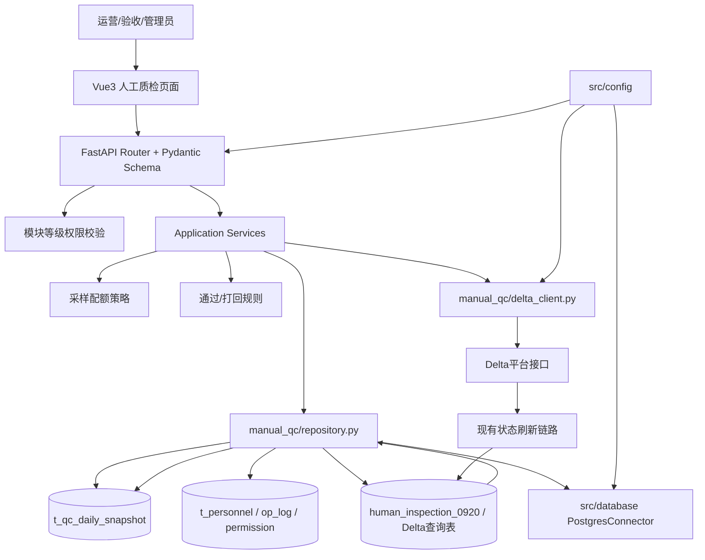

# 质检一站式平台人工质检模块整体架构

> 本卡是当前人工质检平台设计的唯一总入口。Review 时先读本卡，再按“组件导航”和“业务链路”进入分卡；`implementation_plan.md` 与 `task.md` 分别承载实施契约和动态进度。

上位架构：[[质检前后端一体化理想架构设计]]。现状来源：[[人工质检-Hub]]。评审演进：[[质检一站式平台Phase3前架构评审]]。当前进度：[[质检平台-实施路线与当前进度]]。

## 1. 建设目标与范围

当前工程阶段不是重写人工质检十五步闭环，而是把最依赖手工脚本、最适合门户化的两块能力先纳入一站式平台：

1. **验收模块**：验收采样分配、统计快照、通过/打回判断与执行。
2. **人力模块**：人员、供应商、单项目归属、标注员分组、人员画像和模块权限。

当前不改变 Delta 平台作为任务执行系统的事实，也不替代已有 30 分钟状态刷新、6 小时中间表刷新、GT 回写、DMP 打回记录和周报链路。

产品前端的长期范围比当前工程阶段更完整：以“一数据集一批次”为交付任务，统一呈现需求对齐、数据准备、规则/试标、配置审批、任务生产、标注分配、标注监控、验收和返修。详见 [[人工质检-交付任务与行动项机制]] 与 [[质检平台-人工质检交付中心前端设计]]。该产品北极星不表示相关后端能力已经实现。

## 2. 客观约束

| 约束 | 对设计的影响 |
|---|---|
| 任务创建、验收分配、通过和打回均依赖外部 Delta 接口 | 本地平台负责计算、编排和展示；执行结果必须回查任务状态 |
| `human_inspection_0920` 已保存 task 级状态时间线 | 不新建通用操作台账；复用现有中间表确认实际成功量 |
| 人工流程允许局部失败和延迟刷新 | 页面区分预期量、实际量、处理中和失败；不假设一次接口调用即全量成功 |
| 人员同一时刻只属于一个项目 | `t_personnel.project_name` 使用单值，不建多项目关系 |
| 当前规则仅 2～5 种且需代码审查 | 规则用代码注册表，不做数据库规则解释器 |
| 团队规模和表数量有限 | 保留共享 `repository.py`，内部按表/数据源拆小类，不套完整 DDD 模板 |
| Phase 3 尚未实质实现 | 设计卡描述目标契约；不存在的类和接口明确标记为待实现 |

## 3. 总体架构



依赖方向遵循：外层 HTTP 调用业务 Service；Service 组合规则、数据库查询和 Delta 调用；规则不直接访问 HTTP、数据库或配置。

## 4. 组件导航

| 组件 | 职责 | 详细设计 |
|---|---|---|
| 交付任务机制 | 数据集批次、交付轨道、定制行动项和重点集合 | [[人工质检-交付任务与行动项机制]] |
| 交付中心前端 | 表格/时间轴、需求对齐、任务详情和三轨交付图 | [[质检平台-人工质检交付中心前端设计]] |
| 验收中心前端 | 验收总览、分配、监控、分析、结论和返修 | [[质检平台-人工质检验收中心前端设计]] |
| API 与前端契约 | 请求校验、响应、权限、preview/execute 交互 | [[质检平台-API契约与前端交互设计]] |
| 前端页面总览 | 交付、验收、人力的页面导航和状态管理 | [[质检平台-人工质检前端页面与状态设计]] |
| 后端分层 | Router、Service、Repository、DeltaClient 边界 | [[质检平台-后端分层与组件边界设计]] |
| 数据结构 | 就近定义、复用后上移、Pydantic 与内部模型隔离 | [[质检平台-领域模型层设计]] |
| Repository | 共享数据访问、SQL、连接与事务边界 | [[质检平台-Repository与数据库访问设计]] |
| Delta 与回查 | 外部调用、任务状态确认、实际量刷新 | [[质检平台-Delta调用与状态回查设计]] |
| 综合快照 | 最小统计粒度、计数、索引和约束 | [[质检平台-综合快照表设计]] |
| 采样 | 快照算配额、任务级表选 task_ids、三类策略 | [[质检平台-验收采样配额与任务选择设计]] |
| 通过/打回 | 前置条件、阈值规则、确认和状态刷新 | [[质检平台-通过打回规则与执行设计]] |
| 人力管理 | 人员、供应商、项目、分组、画像、操作日志 | [[人工质检-人力管理体系设计]] |
| 权限与 SSO | 模块权限等级、后端鉴权、mock→SSO 演进 | [[质检平台SSO鉴权接入方案]] |
| 术语与粒度 | scene_name、clip/task、组、标注员的关系 | [[质检平台-scene_name概念]] |
| 实施状态 | Phase、依赖、完成证据和下一步 | [[质检平台-实施路线与当前进度]] |

[[质检平台-采样与规则引擎设计]] 保留为采样与规则子域导航，不再承担全部细节。

## 5. 三条核心业务链

### 5.1 验收分配

```text
用户选择日期/scene/组/人员/采样策略
  → 后端从快照读取最小单元计数
  → Sampler 计算每个单元的 Good/Bad 配额
  → Repository 按配额查询 waiting_review task_ids
  → preview 返回 task_ids 与汇总，前端展示
  → 有 OPERATE 权限的用户确认
  → execute 原样提交 preview 的 task_ids
  → 后端重查任务状态并跳过已变化任务
  → DeltaClient 调用 batch_assign / batch_review_pass
  → 状态刷新链路回查真实结果
  → acceptance_allocated 更新为实际成功量
```

详见 [[质检平台-验收采样配额与任务选择设计]] 与 [[质检平台-Delta调用与状态回查设计]]。

### 5.2 统计刷新

```text
任务级中间表/Delta 查询表
  → StatService 按日×scene×当日组×标注员聚合
  → UPSERT t_qc_daily_snapshot
  → API 按日期/scene/组/人员查询
  → 前端汇总、趋势图和人员画像
```

快照只保存个人最小统计行，组级和项目级由查询聚合，避免存储个人行与汇总行造成重复计数。详见 [[质检平台-综合快照表设计]]。

### 5.3 通过/打回

```text
用户选择待判断范围
  → Repository 查询快照计数
  → Rule 检查验收完成度和 Good/Bad 通过率
  → preview 返回 PASS / REJECT / PENDING 及原因
  → 有 EXECUTE 权限的用户确认
  → Repository 根据范围取得当前 task_ids 并重查状态
  → DeltaClient 执行通过或回滚
  → 现有中间表/状态刷新确认最终任务状态
  → 快照刷新执行结果和实际计数
```

详见 [[质检平台-通过打回规则与执行设计]]。

## 6. 数据事实源

| 信息 | 权威来源 | 本地用途 |
|---|---|---|
| 具体 task/clip 及平台状态 | Delta 查询表、`human_inspection_0920` | 任务选择、状态重查、实际结果确认 |
| 聚合统计与趋势 | `t_qc_daily_snapshot` | 配额计算、统计页、规则判断、人力画像 |
| 人员当前属性 | `t_personnel` | 项目、组、供应商、角色、单价 |
| 人员变更历史 | `t_personnel_op_log` | 审计谁在何时修改了什么 |
| 门户权限 | `t_portal_permission` | 后端接口授权和前端按钮显示 |
| 策略名称与实现 | Python 注册表 | 前端策略列表、Service 查找和单元测试 |

“快照能算多少”和“任务表能指出具体谁”是互补关系，不是二选一。

## 7. 设计原则

1. **现状兼容优先**：复用 Delta、中间表和刷新 DAG，不重新发明全链路事务。
2. **最小充分抽象**：不用 `ports/adapters/domain` 套件；确有两个组件复用后才提取共享结构。
3. **高内聚**：采样只算配额，规则只做判断，Repository 只访问数据，DeltaClient 只调用平台，Service 负责串联。
4. **低耦合**：API 不写 SQL，规则不依赖 FastAPI，Repository 不包含业务是否允许执行的判断。
5. **前后端契约清楚**：Pydantic/OpenAPI 是 HTTP 事实源；内部 dataclass 不直接暴露给前端。
6. **安全不只靠界面**：前端隐藏按钮改善体验，后端权限校验才是安全边界。
7. **结果以状态回查为准**：接口请求量不等于成功量；实际量来自任务状态。
8. **可 Review**：关键阈值、状态、表粒度、输入输出和待确认项必须在分卡中可追溯。
9. **交付任务是前端主对象**：页面从数据集交付出发，再下钻任务、人员和验收明细；不以数据库表或脚本入口组织导航。
10. **标准流程允许定制行动项**：交付任务可挂责任人、截止时间、风险与闭环结论；前端主动暴露临期、逾期和阻塞事项。

## 8. 当前完成度与开放问题

已完成需求讨论、两轮架构收敛、两份 DDL 及 PostgreSQL 16.14 实跑验证。Phase 3 代码尚未开始。

进入实现前仍需从真实环境确认：

- Delta 四类接口的 URL、认证、请求/响应字段、单批上限和错误码；
- 查询 waiting_review 与最终完成/打回状态的准确字段和值；
- `human_inspection_0920` 在新平台环境中的连接配置与刷新延迟是否继续沿用；
- 通过/打回的最小执行范围最终按 scene、组还是二者组合。

这些缺口标记为 `[待人类补充]`，不在设计卡中伪造。

## 9. 推荐 Review 顺序

1. 本卡：确认范围、组件关系和三条主链。
2. [[人工质检-交付任务与行动项机制]]：确认交付主对象、并行/循环流程和行动项。
3. [[质检平台-人工质检交付中心前端设计]]、[[质检平台-人工质检验收中心前端设计]]：确认页面层级与高频交互。
4. [[质检平台-scene_name概念]] 与 [[质检平台-综合快照表设计]]：确认粒度。
5. [[质检平台-验收采样配额与任务选择设计]]：确认分配口径。
6. [[质检平台-通过打回规则与执行设计]]：确认业务规则。
7. [[人工质检-人力管理体系设计]] 与 [[质检平台SSO鉴权接入方案]]：确认人员和权限。
8. [[质检平台-后端分层与组件边界设计]]、[[质检平台-Repository与数据库访问设计]]、[[质检平台-API契约与前端交互设计]]：确认工程落点。
9. [[质检平台-实施路线与当前进度]]：确认下一步和验收门槛。
