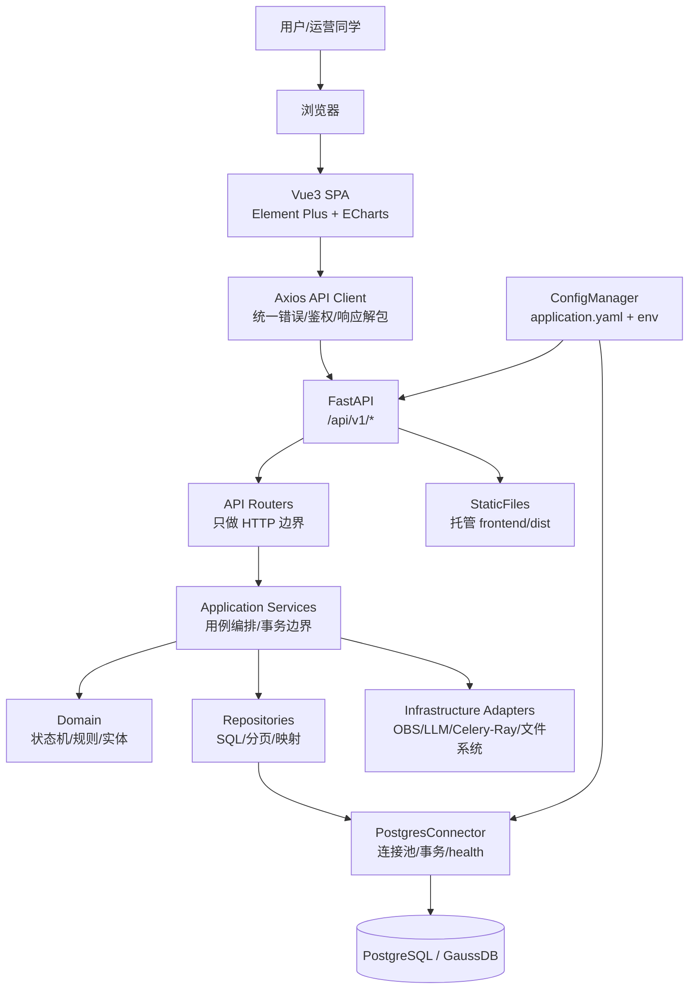
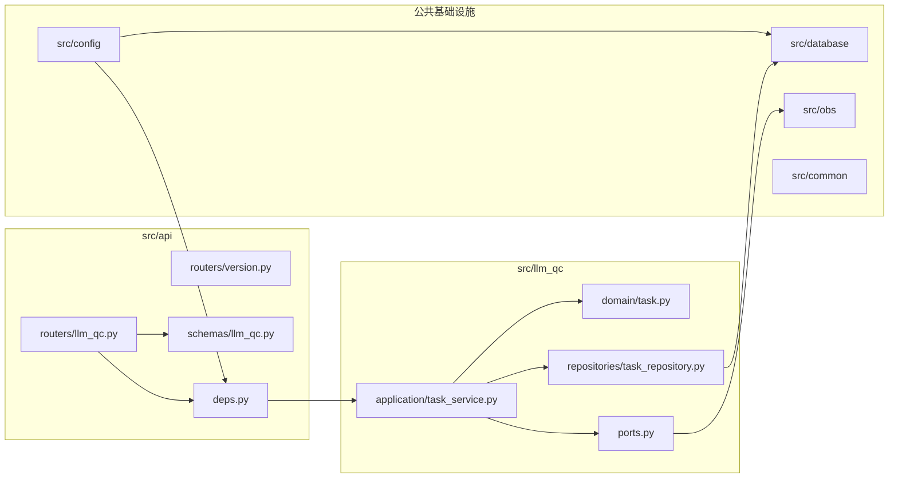
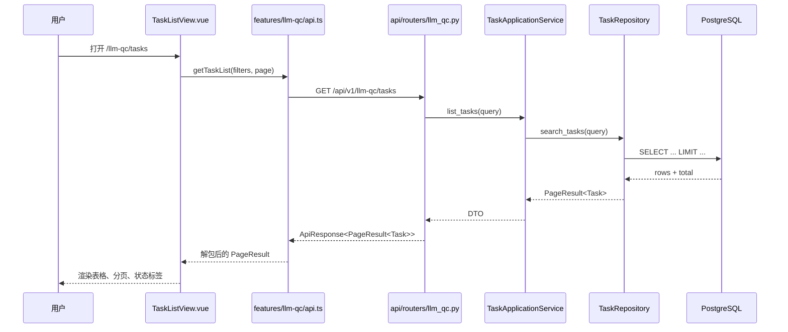
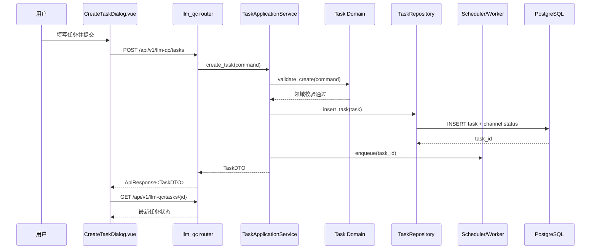
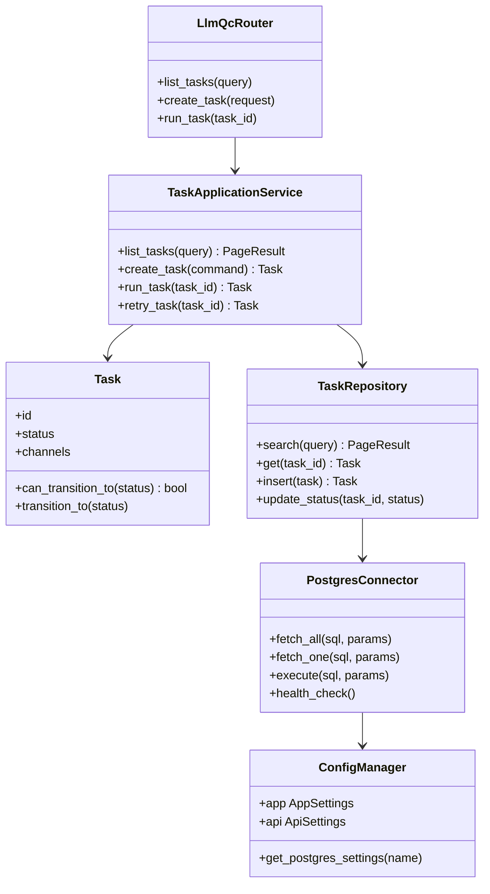

# 质检前后端一体化理想架构设计

本卡是质检一站式平台的工程蓝图。目标不是把前后端混在一起，而是在一个代码仓内形成“统一交付、边界清楚、公共能力复用、模块可独立演进”的一体化架构。

一句话：FastAPI 做统一后端门面，Vue3 做统一运营工作台，PostgreSQL 做结构化事实源，业务模块按 feature slice 纵向切分，公共能力横向复用。

## 1. 技术栈总览

| 层级 | 选择 | 职责 | 当前状态 |
|---|---|---|---|
| 前端框架 | Vue3 + TypeScript + Vite | SPA、页面交互、表格表单、模块路由 | 已建目录边界，未初始化完整工程 |
| UI/图表 | Element Plus + ECharts | 中后台组件、趋势图、监控图 | 待初始化 |
| 前端状态 | Pinia | 跨页面共享任务、版本、数据集、评测上下文 | 需要跨页联动时引入 |
| HTTP 客户端 | Axios | 统一请求、错误处理、鉴权 header | 待初始化 |
| 后端框架 | FastAPI + Pydantic | HTTP 路由、Schema、Swagger、依赖注入 | 已有 app/deps/health |
| 应用服务 | Python service classes | 编排用例、事务边界、状态迁转 | 待建设 |
| 领域模型 | dataclass / Pydantic domain model | 任务、版本、数据集、评测、通道状态规则 | 待建设 |
| 数据访问 | Repository + PostgreSQL connector | SQL、分页、事务、锁、数据映射 | 已有 PostgreSQL 公共模块骨架 |
| 配置 | `config/application.yaml` + env | 多环境配置、密钥占位、连接参数 | 已有配置中心 |
| 后续增强 | Alembic / OpenAPI TS 生成 / Playwright | 迁移、契约同步、端到端验证 | 待引入 |

## 2. 总体架构图



关键边界：

- 前端只能调用 `/api/v1/*`，不能知道数据库存在。
- Router 只能解析参数、注入依赖、组装响应，不能写业务规则。
- Application Service 是用例入口，负责调用 Domain、Repository、外部 Adapter。
- Domain 不依赖 FastAPI、数据库、前端；只表达业务规则。
- Repository 只处理数据持久化，不判断业务上能不能这么做。
- Infrastructure Adapter 封装 OBS、LLM、Celery-Ray、文件系统等外部系统，避免业务层散落 SDK 调用。

## 3. 后端理想分层



| 层 | 目录 | 应该做 | 不应该做 |
|---|---|---|---|
| API Router | `src/api/routers/` | URL、Query、Body、Depends、Response | SQL、状态机、复杂业务分支 |
| API Schema | `src/api/schemas/` | 请求/响应 Pydantic 模型 | 领域规则、数据库字段泄漏 |
| Application Service | `src/<feature>/application/` | 用例编排、事务、调用 repository/adapter | HTTP 细节、前端展示逻辑 |
| Domain | `src/<feature>/domain/` | 实体、值对象、状态迁转、业务不变量 | 数据库连接、FastAPI Depends |
| Repository | `src/<feature>/repositories/` | SQL、分页、行到对象映射 | “是否允许重试”等业务判断 |
| Infrastructure | `src/database/`、`src/obs/`、`src/config/` | 外部系统适配、连接池、配置 | 业务用例流程 |

## 4. 前端理想分层

长期建议从当前扁平落点演进成 feature slice：

```text
src/frontend/src/
├── app/
│   ├── main.ts
│   ├── App.vue
│   ├── router.ts
│   └── providers.ts
├── shared/
│   ├── api/http.ts
│   ├── components/
│   ├── composables/
│   ├── styles/
│   ├── types/
│   └── utils/
├── features/
│   ├── llm-qc/
│   │   ├── api.ts
│   │   ├── types.ts
│   │   ├── routes.ts
│   │   ├── stores.ts
│   │   ├── views/
│   │   └── components/
│   ├── version/
│   ├── evaluation/
│   └── dataset/
└── widgets/
    ├── task-status/
    └── version-selector/
```

| 层 | 职责 | 复用边界 |
|---|---|---|
| `app/` | 应用启动、路由聚合、全局 provider | 全站唯一 |
| `shared/api/http.ts` | axios 实例、响应解包、错误处理 | 所有 feature 复用 |
| `shared/components/` | 通用表格、弹窗、状态标签、空状态 | 至少 2-3 个 feature 复用后上提 |
| `features/<module>/api.ts` | 当前模块 API 函数 | 只服务本模块 |
| `features/<module>/types.ts` | 当前模块 TS 类型 | 从 OpenAPI 生成或手写同步 |
| `features/<module>/views/` | 页面容器组件，负责加载数据 | 不被其他模块直接复用 |
| `features/<module>/components/` | 模块内部展示组件 | 模块内复用 |
| `widgets/` | 跨模块业务组件，如版本选择器 | 多模块共享，但仍是业务语义 |

前端约束：

- 页面组件是容器组件，负责取数、筛选、分页、弹窗状态。
- 展示组件只收 props、发 emits，不直接调 API。
- API 函数一律放在 feature 的 `api.ts`，组件不得直接使用 axios。
- 路由配置是菜单唯一事实源，菜单从 route meta 渲染。
- Pinia 只保存跨页面状态；页面局部状态继续用 `ref/reactive`。

## 5. 模块化设计

理想模块按业务 feature 纵向切分。

```text
后端 feature: llm_qc

src/api/
├── routers/llm_qc.py
└── schemas/llm_qc.py

src/llm_qc/
├── application/task_service.py
├── domain/task.py
├── repositories/task_repository.py
├── ports.py
└── adapters/
```

```text
前端 feature: llm-qc

src/frontend/src/features/llm-qc/
├── routes.ts
├── api.ts
├── types.ts
├── stores.ts
├── views/TaskListView.vue
└── components/TaskTable.vue
```

新增模块步骤：

1. 后端新增 `src/<feature>/` 的 application/domain/repository。
2. 后端新增 `src/api/routers/<feature>.py` 和 `src/api/schemas/<feature>.py`。
3. 在 app router registry 注册该模块路由。
4. 前端新增 `features/<feature>/routes.ts/api.ts/types.ts/views/`。
5. 在前端 route registry 注册该模块路由。
6. 若出现跨模块复用，提到 `shared/` 或 `widgets/`。

这就是开闭原则：新增模块主要靠新增文件和注册入口，不修改已有模块内部实现。

## 6. 端到端请求时序图

### 6.1 查询任务列表



### 6.2 创建并触发任务



## 7. 后端类图



## 8. API 设计与扩展

统一前缀：

```text
/api/v1/{feature}/{resource}
```

LLM 质检任务建议接口：

| 方法 | URL | 用途 | 扩展方向 |
|---|---|---|---|
| `GET` | `/api/v1/llm-qc/tasks` | 任务列表、筛选、分页 | 增加 cursor、sort、channel_status |
| `POST` | `/api/v1/llm-qc/tasks` | 创建任务 | 支持批量创建、dry_run |
| `GET` | `/api/v1/llm-qc/tasks/{task_id}` | 任务详情 | 聚合通道状态、耗时、错误 |
| `POST` | `/api/v1/llm-qc/tasks/{task_id}/run` | 启动任务 | 接 Scheduler/Worker |
| `POST` | `/api/v1/llm-qc/tasks/{task_id}/retry` | 重试失败任务 | 加重试策略 |
| `POST` | `/api/v1/llm-qc/tasks/{task_id}/cancel` | 取消任务 | 接中断/状态机 |
| `GET` | `/api/v1/llm-qc/tasks/{task_id}/events` | 任务事件流 | 后续支持 SSE/WebSocket |
| `GET` | `/api/v1/llm-qc/tasks/{task_id}/artifacts` | 产物列表 | OBS 文件预签名 URL |

版本配置接口：

| 方法 | URL | 用途 |
|---|---|---|
| `GET` | `/api/v1/versions` | 查询版本配置 |
| `POST` | `/api/v1/versions` | 新增版本配置 |
| `GET` | `/api/v1/versions/{version_id}` | 版本详情 |
| `PUT` | `/api/v1/versions/{version_id}` | 更新版本 |
| `POST` | `/api/v1/versions/{version_id}/activate` | 激活版本 |

扩展规则：

- 新增资源优先新增 URL，不复用含糊的 `action` 字段。
- 有副作用的动作使用 `POST /{resource}/{id}/{verb}`。
- 列表查询必须有分页；高频写入表优先 cursor 分页。
- 响应统一为 `ApiResponse<T>`，分页统一为 `PageResult<T>`。
- Pydantic Schema 是后端契约源；中期应从 OpenAPI 生成 TypeScript 类型。

## 9. 公共能力复用矩阵

| 公共能力 | 目录 | 复用方 | 复用方式 |
|---|---|---|---|
| 配置中心 | `src/config` | API、DB、OBS、LLM、Worker | `get_global_config()` 或依赖注入 |
| 数据库连接池 | `src/database` | 所有 repository、health check | `DatabaseManager.postgres()` |
| API 依赖注入 | `src/api/deps.py` | 所有 routers | `Depends(get_xxx)` |
| API 响应 Schema | `src/api/schemas/common.py` | 所有 routers | `ApiResponse[T]`、`PageResult[T]` |
| HTTP 客户端 | `src/frontend/src/shared/api/http.ts` | 所有前端 feature | axios instance |
| 通用 UI | `src/frontend/src/shared/components` | 所有前端 feature | props/emits |
| 业务组件 | `src/frontend/src/widgets` | 多个 feature | 例如 `VersionSelector` |
| 知识库 | `wiki/` | PM、Coder、QA、架构设计 | query_graph 检索 |

复用判断：

- 只被一个 feature 使用：留在 feature 内。
- 被两个 feature 使用：可以放 `widgets/`，但保留业务语义。
- 被三个以上 feature 使用且无业务语义：放 `shared/`。
- 数据库、配置、日志、鉴权、错误处理天然是公共能力。

## 10. 设计模式与架构原则

| 原则 | 落地方式 |
|---|---|
| 开闭原则 | 新 feature 通过新增 `src/<feature>`、router、schema、frontend feature 实现；公共 registry 只做注册 |
| 单一职责 | Router/API Schema/Application/Domain/Repository 分层，各层只负责一类变化 |
| 依赖倒置 | Application 依赖 port/interface，OBS/LLM/DB 等外部系统由 adapter 实现 |
| 高内聚 | 任务状态、版本配置、评测、数据集各自形成 feature slice |
| 低耦合 | 前端不碰数据库；Router 不碰 SQL；Domain 不碰框架；Repository 不碰 UI |
| 组合优于继承 | 通用行为用 helper/composable/service 组合，不建深继承树 |
| YAGNI | 先单仓单体模块化，暂不做微服务/微前端；有明确规模压力再升级 |
| 可观测性 | 每个长任务暴露状态、事件、耗时、错误、重试次数 |
| 契约优先 | Pydantic/OpenAPI/TS 类型保持同步，减少前后端漂移 |

## 11. 理想代码层级

```text
ai-knowledge-base/
├── config/
│   └── application.yaml
├── src/
│   ├── api/
│   │   ├── app.py
│   │   ├── deps.py
│   │   ├── routers/
│   │   │   ├── health.py
│   │   │   ├── llm_qc.py
│   │   │   ├── versions.py
│   │   │   ├── evaluations.py
│   │   │   └── datasets.py
│   │   └── schemas/
│   │       ├── common.py
│   │       ├── llm_qc.py
│   │       ├── versions.py
│   │       ├── evaluations.py
│   │       └── datasets.py
│   ├── config/
│   ├── database/
│   ├── obs/
│   ├── llm_qc/
│   │   ├── application/
│   │   ├── domain/
│   │   ├── repositories/
│   │   ├── adapters/
│   │   └── ports.py
│   ├── data_check/
│   ├── evaluation/
│   ├── dataset/
│   └── frontend/
│       ├── package.json
│       ├── vite.config.ts
│       └── src/
│           ├── app/
│           ├── shared/
│           ├── features/
│           └── widgets/
├── tests/
│   ├── unit/
│   ├── integration/
│   └── e2e/
└── wiki/
```

## 12. 当前差距评估

| 能力 | 理想状态 | 当前状态 | 差距 |
|---|---|---|---|
| `src/` 骨架 | 公共模块 + 业务模块 + 前端工程完整 | 已有 config/database/api/frontend 边界 | P0 已启动 |
| 配置中心 | 支持多环境、密钥注入、类型化读取 | 已有 `ConfigManager` 和 env 展开 | 缺完整配置 schema 校验 |
| PostgreSQL | Repository 复用连接池，事务清晰 | 已有 `PostgresConnector` 懒连接池 | 缺业务 repository、迁移工具 |
| FastAPI | router/schema/deps/app service 完整 | 已有 app/deps/health | 缺 v1 router、业务 schema、服务层 |
| 前端工程 | Vue3 + TS + Vite + Element Plus + feature slice | 只有目录边界 | 需要初始化工程和首个页面 |
| API 契约 | OpenAPI -> TS 类型生成 | 只有 Pydantic common schema | 缺生成链路 |
| 业务模块 | LLM QC、Version、Eval、Dataset 独立 feature | 只有空目录或知识卡 | 需要逐模块实现 |
| 端到端验证 | Playwright/API smoke 覆盖关键路径 | 只有 Python 单测和 app 构造验证 | 缺真实 E2E |
| 可观测性 | 长任务状态、事件、耗时、错误可查 | 设计中已有目标 | 缺事件表/API/UI |
| 知识绑定 | 代码卡绑定真实源码 hash | 新增三张代码卡已绑定 | 旧外部项目卡仍有 staleness |

## 13. 演进路线

### P0：把后端最小闭环跑通

目标：PostgreSQL -> Repository -> Application Service -> FastAPI -> JSON。

任务：

1. 为 `llm_qc` 建立 `application/domain/repositories`。
2. 建立 `src/api/routers/llm_qc.py` 和 `src/api/schemas/llm_qc.py`。
3. 先实现 `GET /api/v1/llm-qc/tasks` 和 `GET /api/v1/llm-qc/tasks/{id}`。
4. 加 integration test，使用测试库或 mock connector。
5. 更新代码卡与 `code_hash`。

### P1：把前端最小闭环跑通

目标：Vue 页面能展示 PostgreSQL 任务列表。

任务：

1. 初始化 `src/frontend`：Vue3、TypeScript、Vite、Element Plus、Axios。
2. 建立 `shared/api/http.ts` 和 `features/llm-qc/api.ts/types.ts/views/TaskListView.vue`。
3. 前端通过 Vite proxy 调后端 `/api/v1/llm-qc/tasks`。
4. 建立页面 smoke/e2e 验证。

### P2：形成模块扩展标准

目标：新增 evaluation/dataset/version 模块时有固定模板。

任务：

1. 抽出 router registry 和 frontend route registry。
2. 增加版本配置 feature。
3. 增加 evaluation/dataset 骨架。
4. 编写“新增业务模块 checklist”规范卡。

### P3：工程质量升级

目标：降低长期腐坏概率。

任务：

1. 引入 Alembic 或等价迁移机制。
2. 引入 OpenAPI -> TypeScript 类型生成。
3. 引入 Playwright 端到端验证。
4. 为长任务建立事件表、状态历史和可观测 API。

## 14. 决策结论

理想架构不是微服务，也不是前后端两个完全割裂的项目。对当前质检项目组，最佳形态是：

- 单仓库：知识、后端、前端、测试、部署脚本在一个地方。
- 模块化单体：运行时可以是一个 FastAPI 服务，但代码上按 feature 明确切分。
- 前后端一体交付：开发态前端 Vite + 后端 FastAPI；生产态 FastAPI 或 Nginx 托管前端静态产物并转发 `/api`。
- 公共能力下沉：配置、数据库、HTTP、响应、日志、鉴权、错误处理是平台能力，不属于任何业务模块。
- 业务能力纵切：任务、版本、评测、数据集各自拥有前端 feature、后端 service/domain/repository。
- 知识持续绑定：每个模块有代码卡，关键设计有 ADR，踩坑有 pitfall，避免代码和知识再次脱节。

## 关联卡片

- [[HUB-质检前后端一体化学习与开发指南]]
- [[ECharts从入门到掌握]]
- [[Router_API_View与Python业务编排指南]]
- [[前端可视化与组件复用工程指南]]
- [[质检页签端到端开发流程指南]]
- [[质检一站式平台长期架构]]
- [[数据质量门户架构设计]]
- [[全栈项目设计模式与实践]]
- [[前后端分离架构模式]]
- [[前端开发规范]]
- [[配置管理公共模块]]
- [[PostgreSQL数据库公共模块]]
- [[FastAPI应用入口与依赖注入层]]
